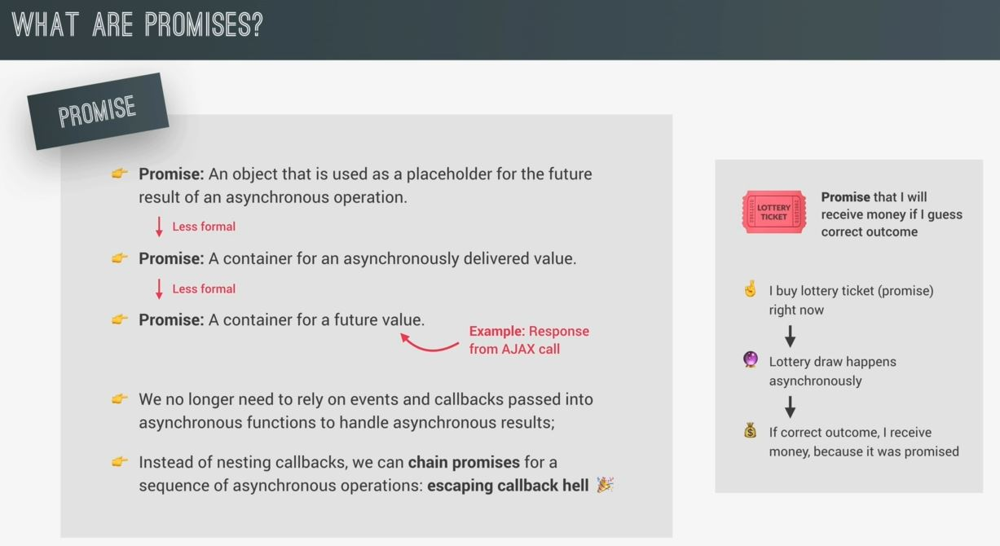
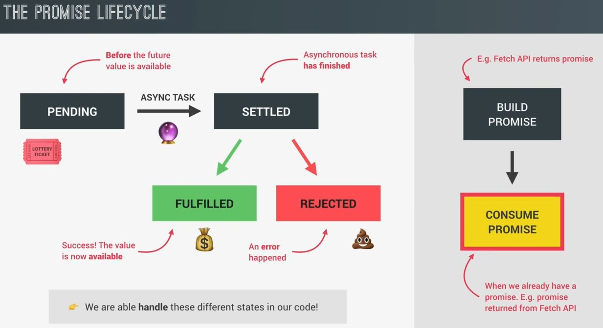

# Promises and the Fetch API

- we'll use fetch() api instead of old XML http request function

## Steps - using fetch() api to do modern AJAX calls

- `STEP 1` : using fetch() api function
    ```js
    // fetch() api function takes 2 arguments
        // 1st argument - URL (required)
        // 2nd argument - object (optional) - define it when you actually need 💡💡💡
    const request = fetch("https://restcountries.com/v3.1/name/portugal")
    console.log(request) // output : we'll get get Promise {<pending>}
    ```

## what is a promise & what can we do with it ✅ 

- `Definitions - Promise` : 
    - the formal definition is that it's an object that is used basically as a placeholder for the future result <br>
        of an async operation
    - in other words , it's a container/placeholder for an asynchronously delivered value
    - in other words , it's a container/placeholder for a future value 
- Eg : & the perfect example of a future value is the response coming from an AJAX call 
    - so when we start the AJAX call , there is no value yet but we know that there'll be some value in the future 
    - so we can use a promise to handle this future value 💡💡💡
- Eg : lottery ticket analogy to understand promise
    - a promise is just like a lottery ticket , so when you buy a lottery ticket <br>
        means you buy the promise that you'll receive some amount of money in the future <br>
        if you guess the correct outcome
    - so now , you buy the ticket with the prospect of winning money in the future <br>
        & the lottery draw which determines if you get the money or not happens asynchronously <br>
        so right now you don't have to drop everything & keep waiting until the lottery draw happens
    - now , in case you did get the correct outcome then you'll receive my money <br>
        because i have my lottery ticket which is the promise that you bought
- so `there're 2 big advantage of using promise ✅`
    - `first` : by using promises , 
        - we no longer need to reply on events & callback functions to handle asynchronous results
        - events & callback functions can sometimes cause unpredictable results which is not in order
    - `second` : instead of doing nesting callback functions or event listeners 
        - we can chain promises for a sequence of asynchronous operations 


## the promise lifecycle ✅

- now , promises work to handle asynchronous operations which means they're time sensitive <br>
    means they change over time . so promises can be in different states . so here comes the cycle of a promise

- `STEP 1 : pending state` : so at that time , we got the promise in pending state 
    - so promise will be in pending state before the future value resulting from async task is available 
    - so during this time , the async task is still doing it's work in the background <br>
- `STEP 2 : settled` : then when the task finally finishes
    - then the promise is settled & there're two different types of settled promises i.e <br>
        fulfilled promises & rejected promises 
    - `fulfilled promises` : means is a promise that has successfully resulted in a value just as we expect it 
        - Eg : when we use the promise to fetch data from an API <br>
            & then when we get the data according to what we need then that promise is fulfilled promise
    - `rejected promise` : means that there has been an error during the async task
        - Eg : fetching data from an API , an error would be like for eg : when the user is offline <br>
            & can't connect to the API server like in lottery ticket the lottery draw is the async task <br>
            which define the result & then once the result is available , the ticket would be settled
        - then if we guessed the correct outcome , the lottery ticket will be fulfilled & we get our money <br>
            However , if we guessed wrong , then the ticket gets rejected & our all money gets wasted

- `Note` : Now , these different states are very important to understand because when we use promises in our code <br>
    - then we need to handle these both states in order to do something as a result <br>
        of either a successful promise or a rejected one
- `Imp Note 🔥` : a promise is only settled once & from there , the state will remain unchanged forever <br>
    - so a promise was either fulfilled or rejected but it's impossible to change that state 💡💡💡
  
- now , those 2 different states of a promise are relevant & useful when we use a promise to get a result <br>
    which is called , to `consume a promise` 💡💡💡
    - so we consume a promise when we already have a promise. For example : the promise that was returned <br>
        from the fetch() api function . But in order for a promise to exist in the first place , it must first be built <br>
        means it must be created before consuming it 
    - so fetch() api function which builds the promise & returns it for us to consume <br>
        so when we're using fetch() api function then we don't have to build the promise manually in order to consume it 💡💡💡
    - now , most of the time we'll actually just consume promises 💡💡💡 <br>
        but sometimes , we need to build a promise manually 


