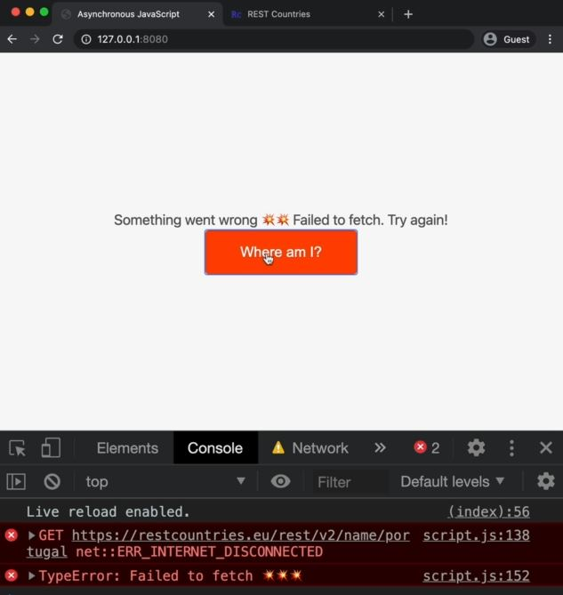
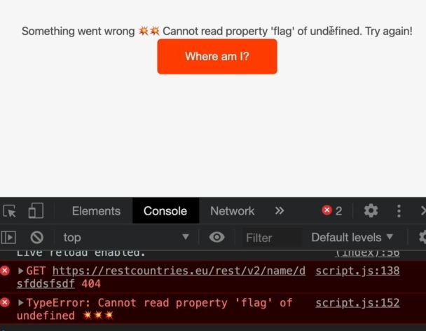

# Handling Rejected Promises

- so till yet , we never handled the error . So important thing in web dev to handle the errors also <br>
    so we'll see how to handle errors in promises

- a promise in which an error happens is a rejected promise . so we'll see how to handle promise rejections <br>
    Now the only way in which the fetch() api promise function rejects is when the user loses his internet connection 💡💡💡

## Steps - handling rejected promises

- To simulate internet connection , go to `Network` tab & change the online into offline <br>
    However , when we reload the page then everything will disappear & that's not what we want , we want to simulate <br>
    that the page was first still loaded but then as the user does the request without internet connection <br>
    then we want to see the error happening . so Set that back as `online` 
    - Now we want to call getCountryData('portugal') only when the user clicks on a button <br>
        which makes easier to simulate losing the internet connection 💡💡💡

- index.html file
    ```html
    <head>
      <meta name="viewport" content="width=device-width, initial-scale=1.0" />
      <link rel="stylesheet" href="style.css" />
      <script defer src="script.js"></script>
    </head>
    <body>
      <main class="container">
        <div class="countries">
          <!--
          <article class="country">
            
            <div class="country__data">
              <h3 class="country__name">COUNTRY</h3>
              <h4 class="country__region">REGION</h4>
              <p class="country__row"><span>👫</span>POP people</p>
              <p class="country__row"><span>🗣️</span>LANG</p>
              <p class="country__row"><span>💰</span>CUR</p>
            </div>
          </article>
          -->
        </div>
        <button class="btn-country">Where am I?</button>
        <div class="images"></div>
      </main>
    </body>
    ```

- style.css for the button
    ```css
    .btn-country {
      border: none;
      font-size: 2rem;
      padding: 2rem 5rem;
      border-radius: 0.7rem;
      color: white;
      background-color: orangered;
      cursor: pointer;
    }
    ```

- `STEP 1` : creating an click event listener on that button
    ```js
    const btn = document.querySelector('.btn-country');
    const countriesContainer = document.querySelector('.countries');

    const getCountryData = function(country) {
        // country 1
        fetch(`https://restcountries.com/v3.1/name/${country}`).then(response => {
            return response.json() 
        }).then(data => {
            renderCountry(data[0])
            const neighbour = data[0].borders[0]

            if (!neighour) return

            // country 2
            return fetch(`https://restcountries.com/v3.1/name/${neighbour}`)
        }).then(response => {
            return response.json()
        }).then(data => {
            renderCountry(data, 'neighbour')
        })
    }

    btn.addEventListener('click', function() => {
        getCountryData('portugal')
    })
    ```
    - output : when we click on that button , then we'll get the data i.e country & it's neighbour
        - but if we set the Network as offline & go to console tab & then when we do request by clicking on the button <br>
            then we'll get an error like this <br>
            
        - so at this point , the promise which is returned from the fetch() function was actually rejected 💡💡💡 <br>
            now let's handle that rejection

- `there're 2 ways of handling rejections 🔥` : 
    - `first way` : pass a second callback function into the first then() method like this
        ```js
        // put code before this from STEP 1
        const getCountryData = function(country) {
            // country 1
            fetch(`https://restcountries.com/v3.1/name/${country}`).then(response => response.json()).then(data => {
                // here inside the first then() method , we pass the callback function as second argument 
                    // to handle the rejected promise , & that callback function takes one argument i.e error 💡💡💡

                renderCountry(data[0])
                const neighbour = data[0].borders[0]

                if (!neighour) return

                // country 2
                return fetch(`https://restcountries.com/v3.1/name/${neighbour}`)
            }).then(response => {
                return response.json()
            }).then(data => {
                renderCountry(data, 'neighbour')
            })
        }

        btn.addEventListener('click', function() => {
            getCountryData('portugal')
        })
        ```
        - output : go to Network tab , change from offline into online & then reload the page
            - now that button will come & now change the Network from online into offline <br>
                now we lose the connection & when we do the request & now actually we handled the error <br>
                by displaying that alert() window
            - now inside the console tab , we're getting only one error i.e internet error <br> 
                & that uncaught error was coming because we didn't catch the error at that time <br>
                which is returned by fetch() api function 💡💡💡
            - Now , we'll not get no more errors because the chaining promise stops at `err => alert(err)` on this line <br>
                but what if promise is fulfilled on second then() method but promise is rejected on 3rd then() method <br>
                because inside that 3rd then() method we're returning a new promise via fetch() function <br>
                then we again have to catch the rejected promise as an error which is annoying <br>
            - so we have a better way to handle all the rejected promises as globally for any then() method <br>
                i.e catch() method 💡💡💡
    - `second way` : using catch() method ✅
        - `catch()` method 
            - it's used always at the end of last then() method of chaining promise , <br>
                not in the middle of chain of promises 💡💡💡
            - it'll catch any errors that might occur in any place in those whole promise chain <br>
                & no matter where that is because all errors will propagate down the chain until they're caught 💡💡💡 <br>
                & only we'll get that uncaught error if we didn't caught the error 
        ```js
        // put code before this from STEP 1
        const getCountryData = function(country) {
            // country 1
            fetch(`https://restcountries.com/v3.1/name/${country}`).then(response => response.json()).then(data => {
                renderCountry(data[0])
                const neighbour = data[0].borders[0]

                if (!neighour) return

                // country 2
                return fetch(`https://restcountries.com/v3.1/name/${neighbour}`)
            }).then(response => {
                return response.json()
            }).then(data => {
                renderCountry(data, 'neighbour')
            }).catch(err => console.error(`${error} 💥💥💥`))
            // but usually , simply logging the error to the console is not enough in a real application
                // with a real user interface 
                // instead of just logging something to the console , 
                    // let's also display an error message for the user to see 💡💡💡 
        }

        btn.addEventListener('click', function() => {
            getCountryData('portugal')
        })
        ```

- `STEP 2` : rendering the error on the UI instead of printing on the console tab
    ```js
    const btn = document.querySelector('.btn-country');
    const countriesContainer = document.querySelector('.countries')

    const renderCountry = function(data, className = '') {
        const html = `        
            <article class="country ${className}">
                
                <div class="country__data">
                  <h3 class="country__name">${data.name}</h3>
                  <h4 class="country__region">${data.region}</h4>
                  <p class="country__row"><span>👫</span>${(+data.population / 1000000).toFixed(1)} people</p>
                  <p class="country__row"><span>🗣️</span>${data.languages[0].name}</p>
                  <p class="country__row"><span>💰</span>${data.languages[0].currencies}</p>
                </div>
            </article>
            ` ;
        
        countriesContainer.insertAdjacentHTML('beforend', html)
        countriesContainer.style.opacity = 1        
    }

    const renderError = function(msg) {
        countriesContainer.insertAdjacentText('beforeend', msg)
        // insertAdjacentText() method used to only insert the text , not the html code 💡💡💡
        countriesContainer.style.opacity = 1
    }

    const getCountryData = function(country) {
        // country 1
        fetch(`https://restcountries.com/v3.1/name/${country}`).then(response => response.json()).then(data => {
            renderCountry(data[0])
            const neighbour = data[0].borders[0]

            if (!neighour) return

            // country 2
            return fetch(`https://restcountries.com/v3.1/name/${neighbour}`)
        }).then(response => {
            return response.json()
        }).then(data => {
            renderCountry(data, 'neighbour')
        }).catch(err => {
            console.error(`${err} 💥💥💥`)
            renderError(`Something went wrong 💥💥 ${err.message}`)

            // this err -> parameter is a real JS object
                // so we can create errors in JS with a constructor just like a map or a set
                // & in JS any error which was created like this contains the message -> property  
                // that's why we used err.message to print only the message of that error 
                    // instead of printing the whole object itself 💡💡💡 
        })
    }

    btn.addEventListener('click', function() => {
        getCountryData('portugal')
    })
    ```
    - output : now put the network tab from offline to online & then reload the page 
        - now that button comes back & then change the network as offline 
        - & then click on the button then we'll get this error like this
        
        - we got the custom error inside the console tab

- `finally() method of promise ✅` :
    - `finally()` method 
        - it's define always after the catch() method of the promise 
        - it'll be executed/called no matter whether the promise is fulfilled or rejected <br>
            means it'll be executed always for only one time 
        - means then() method will be called only when the promise is fulfilled <br> 
            & catch() method will be called only when the promise is rejected 💡💡💡
    ```js
    // put code from STEP 2

    const getCountryData = function(country) {
        // country 1
        fetch(`https://restcountries.com/v3.1/name/${country}`).then(response => response.json()).then(data => {
            renderCountry(data[0])
            const neighbour = data[0].borders[0]

            if (!neighour) return

            // country 2
            return fetch(`https://restcountries.com/v3.1/name/${neighbour}`)
        }).then(response => {
            return response.json()
        }).then(data => {
            renderCountry(data, 'neighbour')
        }).catch(err => {
            console.error(`${err} 💥💥💥`)
            renderError(`Something went wrong 💥💥 ${err.message}`)
        }).finally(() => {

        })
        // finally() method not always be useful but sometimes it's useful
            // so we use it for when that thing which always need to happen , 
                // doesn't matter what the result of the promise is 
            // Eg : good example is to hide a loading spinner you open a web app when you load some data
                // so these web apps shows spinner when an async operation starts 
                // & then hide it once the operation completes
                // & that happens no matter if the operation was successfully or not 
            // so for this kind of work , we can use finally() method 💡💡💡
    }

    btn.addEventListener('click', function() => {
        getCountryData('portugal')
    })
    ```
    - so in our code , this line `countriesContainer.style.opacity = 1` always happens no matter what <br>
        means if we render the country in the case of success of if we render the error in case of an error <br>
        so we need that line of code always 💡💡💡
    - `STEP 1` : deactivating that line of code which we need always 
        - & putting that line of code inside the finally() method 
        ```js
        // put code before it , from STEP 1

        const renderCountry = function(data, className = '') {
            const html = `        
                <article class="country ${className}">
                    
                    <div class="country__data">
                      <h3 class="country__name">${data.name}</h3>
                      <h4 class="country__region">${data.region}</h4>
                      <p class="country__row"><span>👫</span>${(+data.population / 1000000).toFixed(1)} people</p>
                      <p class="country__row"><span>🗣️</span>${data.languages[0].name}</p>
                      <p class="country__row"><span>💰</span>${data.languages[0].currencies}</p>
                    </div>
                </article>
                ` ;
            
            countriesContainer.insertAdjacentHTML('beforend', html)
            // countriesContainer.style.opacity = 1        
        }

        const renderError = function(msg) {
            countriesContainer.insertAdjacentText('beforeend', msg)
            // countriesContainer.style.opacity = 1
        }

        const getCountryData = function(country) {
            // country 1
            fetch(`https://restcountries.com/v3.1/name/${country}`).then(response => response.json()).then(data => {
                renderCountry(data[0])
                const neighbour = data[0].borders[0]

                if (!neighour) return

                // country 2
                return fetch(`https://restcountries.com/v3.1/name/${neighbour}`)
            }).then(response => {
                return response.json()
            }).then(data => {
                renderCountry(data, 'neighbour')
            }).catch(err => {
                console.error(`${err} 💥💥💥`)
                renderError(`Something went wrong 💥💥 ${err.message}`) 
            }).finally(() => {
                countriesContainer.style.opacity = 1
            })
            // here finally() method putted on the catch() method because 
                // catch() method itself also returns a promise 
                // that's why finally() method only works on the promise 💡💡💡
        }

        btn.addEventListener('click', function() => {
            getCountryData('portugal')
        })
        ```
        - output : now we don't need to toggle Network tab again & again manually , so just put online
            - & click on the button then we'll get the data
    - `STEP 2` : for checking error , let's see search of that country which doesn't exists 
        ```js
        // put code before it , from STEP 1

        const renderCountry = function(data, className = '') {
            const html = `        
                <article class="country ${className}">
                    
                    <div class="country__data">
                      <h3 class="country__name">${data.name}</h3>
                      <h4 class="country__region">${data.region}</h4>
                      <p class="country__row"><span>👫</span>${(+data.population / 1000000).toFixed(1)} people</p>
                      <p class="country__row"><span>🗣️</span>${data.languages[0].name}</p>
                      <p class="country__row"><span>💰</span>${data.languages[0].currencies}</p>
                    </div>
                </article>
                ` ;
            
            countriesContainer.insertAdjacentHTML('beforend', html)
        }

        const renderError = function(msg) {
            countriesContainer.insertAdjacentText('beforeend', msg)
        }

        const getCountryData = function(country) {
            // country 1
            fetch(`https://restcountries.com/v3.1/name/${country}`).then(response => response.json()).then(data => {
                renderCountry(data[0])
                const neighbour = data[0].borders[0]

                if (!neighour) return

                // country 2
                return fetch(`https://restcountries.com/v3.1/name/${neighbour}`)
            }).then(response => {
                return response.json()
            }).then(data => {
                renderCountry(data, 'neighbour')
            }).catch(err => {
                console.error(`${err} 💥💥💥`)
                renderError(`Something went wrong 💥💥 ${err.message}`) 
            }).finally(() => {
                countriesContainer.style.opacity = 1
            })
        }

        btn.addEventListener('click', function() => {
            getCountryData('portugal')
        })

        getCountryData("dksjfhdijksuf")
        ```
        - output : getCountryData("dksjfhdijksuf") , we'll get an error like this 
            
        - we can inspect that stack trace for error to know 
        - but the error which we got is weird instead of our custom error <br>
            so the flag error which we got based on 404 status code . But as we know that fetch() promise only rejects <br>
            when there is no internet connection but 404 error (which is not the real error but kind of like an error) <br>
            but still promise of fetch() function still get fulfilled even we got 404 💡💡💡 <br>
        - so there's no rejection & our catch() handler can't pick up on this 404 error <br>
            catch() method does pick up on that `flag error` but this is not we want to handle <br> 
            so in this case we need to tell our user that no country was found with that name 💡💡💡
