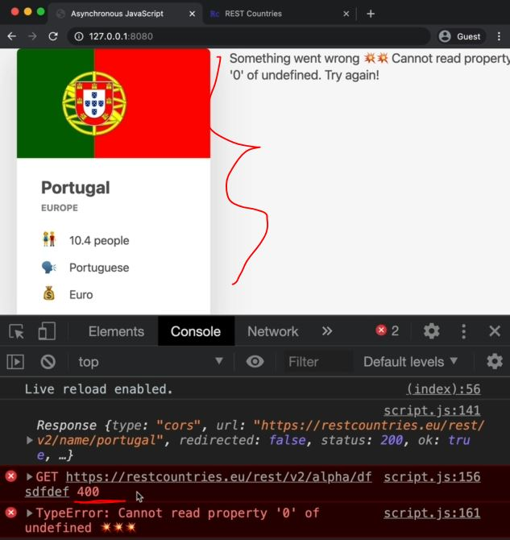
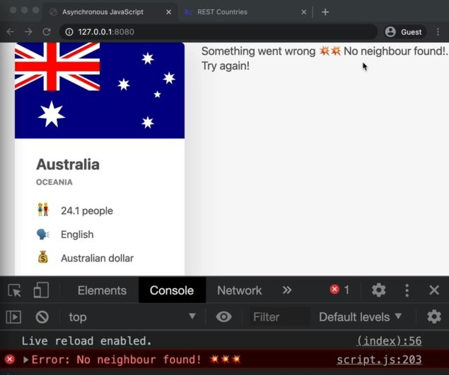

# Throwing Errors Manually

- `404 error in the 11th lecture - 16 module` : 
    - in this lecture , we're gonna fix the request 404 error that we saw happening in the previous lecture <br>
        so the problem is that during the fetch , there was a 404 error which is because our API <br>
        couldn't find any country with that name when we as user passed that random name 
    - But still there was a big problem with that request i.e the fetch() function still didn't reject in that case <br> 
        but many people think that promise should actually be rejected right away but it doesn't 
    - so we will have to do reject/throw errors manually in that 404 error 💡💡💡

## Steps - throwing errors manually

- `STEP 1` : refactoring the code for checking
    ```js
    const btn = document.querySelector('.btn-country');
    const countriesContainer = document.querySelector('.countries')

    const renderCountry = function(data, className = '') {
        const html = `        
            <article class="country ${className}">
                
                <div class="country__data">
                  <h3 class="country__name">${data.name}</h3>
                  <h4 class="country__region">${data.region}</h4>
                  <p class="country__row"><span>👫</span>${(+data.population / 1000000).toFixed(1)} people</p>
                  <p class="country__row"><span>🗣️</span>${data.languages[0].name}</p>
                  <p class="country__row"><span>💰</span>${data.languages[0].currencies}</p>
                </div>
            </article>
            ` ;
        
        countriesContainer.insertAdjacentHTML('beforend', html)
    }

    const renderError = function(msg) {
        countriesContainer.insertAdjacentText('beforeend', msg)
    }

    const getCountryData = function(country) {
        // country 1
        fetch(`https://restcountries.com/v3.1/name/${country}`).then(response => {
            console.log(response)
            return response.json()
        }).then(data => {
            renderCountry(data[0])
            const neighbour = data[0].borders[0]

            if (!neighour) return

            // country 2
            return fetch(`https://restcountries.com/v3.1/name/${neighbour}`)
        }).then(response => {
            return response.json()
        }).then(data => {
            renderCountry(data, 'neighbour')
        }).catch(err => {
            console.error(`${err} 💥💥💥`)
            renderError(`Something went wrong 💥💥 ${err.message}`) 
        }).finally(() => {
            countriesContainer.style.opacity = 1
        })
    }

    btn.addEventListener('click', function() => {
        getCountryData('portugal')
    })

    getCountryData("dksjfhdijksuf")
    ```
    - output : console.log(response)
        - inside the Response object , `ok` property is set to false because the `status` property is 404
        - now when the request goes well when we click on that button <br>
            then again if we check the Response object then inside of it , <br>
            `ok` property is set to true & `status` property is 200 (200 means OK)
        - so we can use `ok` property as a response to reject the promise ourselves <br>
            manually if we get 404 error status code 💡💡💡

- `STEP 2` : throwing error manually
    ```js
    const btn = document.querySelector('.btn-country');
    const countriesContainer = document.querySelector('.countries')

    const renderCountry = function(data, className = '') {
        const html = `        
            <article class="country ${className}">
                
                <div class="country__data">
                  <h3 class="country__name">${data.name}</h3>
                  <h4 class="country__region">${data.region}</h4>
                  <p class="country__row"><span>👫</span>${(+data.population / 1000000).toFixed(1)} people</p>
                  <p class="country__row"><span>🗣️</span>${data.languages[0].name}</p>
                  <p class="country__row"><span>💰</span>${data.languages[0].currencies}</p>
                </div>
            </article>
            ` ;
        
        countriesContainer.insertAdjacentHTML('beforend', html)
    }

    const renderError = function(msg) {
        countriesContainer.insertAdjacentText('beforeend', msg)
    }

    const getCountryData = function(country) {
        // country 1
        fetch(`https://restcountries.com/v3.1/name/${country}`).then(response => {
            console.log(response)

            if (!response.ok) 
                throw new Error(`Country not found (${response.status})`)
                    // so this is will be our custom error message instead of showing flag message on UI
                        // which can't be understand by the user
                
                // Imp Note 🔥 : 
                // new Error() -> is a constructor function to create a new error
                // throw -> keyword 
                    // it used to throw/reject the error when we get the 404 status code error 
                    // it'll immediately terminate the current function just like return -> keyword does
                        // means in this then() method any error occur then further then() method will not be executed
                        // & control of the code will directly goes inside the catch() method handler 💡💡💡
                // Now , we do throw error manually inside the then() method 💡💡💡
                // Now , the effect & throwing an error in any of these then() methods
                    // is that the promise will immediately reject
                    // so basically , the promise returned by this then() method handler will reject a promise 
                    // & then that rejection will propagate all the way down to the catch() method handler 💡💡💡

            return response.json()
        }).then(data => {
            renderCountry(data[0])
            const neighbour = data[0].borders[0]

            if (!neighour) return

            // country 2
            return fetch(`https://restcountries.com/v3.1/name/${neighbour}`)
        }).then(response => {
            return response.json()
        }).then(data => {
            renderCountry(data, 'neighbour')
        }).catch(err => {
            console.error(`${err} 💥💥💥`)
            renderError(`Something went wrong 💥💥 ${err.message}`) 
        }).finally(() => {
            countriesContainer.style.opacity = 1
        })
    }

    btn.addEventListener('click', function() => {
        getCountryData('portugal')
    })

    getCountryData("dksjfhdijksuf")
        // output : we'll get our custom error i.e Country not found (404)
    ```
    - but you'll think why should we even bother handle all these errors ?
        - `1` : handling these errors is the only way in which we can actually display an error message like this <br>
            on the screen for the user understanding 
        - `2` : it's a really bad practice to leave these rejected promises like hanging around without handling them
            - so always use catch() method & if necessary then you can also use finally() method
    - now we handle the errors for the first fetch() api function but what if in second fetch() api function error comes

- `STEP 3` : deliberately accessing wrong neighbour country
    ```js
    const btn = document.querySelector('.btn-country');
    const countriesContainer = document.querySelector('.countries')

    const renderCountry = function(data, className = '') {
        const html = `        
            <article class="country ${className}">
                
                <div class="country__data">
                  <h3 class="country__name">${data.name}</h3>
                  <h4 class="country__region">${data.region}</h4>
                  <p class="country__row"><span>👫</span>${(+data.population / 1000000).toFixed(1)} people</p>
                  <p class="country__row"><span>🗣️</span>${data.languages[0].name}</p>
                  <p class="country__row"><span>💰</span>${data.languages[0].currencies}</p>
                </div>
            </article>
            ` ;
        
        countriesContainer.insertAdjacentHTML('beforend', html)
    }

    const renderError = function(msg) {
        countriesContainer.insertAdjacentText('beforeend', msg)
    }

    const getCountryData = function(country) {
        // country 1
        fetch(`https://restcountries.com/v3.1/name/${country}`).then(response => {
            console.log(response)

            if (!response.ok) 
                throw new Error(`Country not found (${response.status})`)


            return response.json()
        }).then(data => {
            renderCountry(data[0])
            // const neighbour = data[0].borders[0]
            const neighbour = 'asdasd'
                // now rejection of the promise will happen in this next fetch() function
                    // & control will go directly inside catch() method  

            if (!neighour) return

            // country 2
            return fetch(`https://restcountries.com/v3.1/name/${neighbour}`)
        }).then(response => {
            return response.json()
        }).then(data => {
            renderCountry(data, 'neighbour')
        }).catch(err => {
            console.error(`${err} 💥💥💥`)
            renderError(`Something went wrong 💥💥 ${err.message}`) 
        }).finally(() => {
            countriesContainer.style.opacity = 1
        })
    }

    btn.addEventListener('click', function() => {
        getCountryData('portugal')
    })
    ```
    - output : we'll get only the portugal country data but not it's neighbour country's data like this
        
        - we'll get the 400 error which means something else
    - `STEP 3.1` : so we need to put that same code to throw the error manually
        ```js
        const btn = document.querySelector('.btn-country');
        const countriesContainer = document.querySelector('.countries')

        const renderCountry = function(data, className = '') {
            const html = `        
                <article class="country ${className}">
                    
                    <div class="country__data">
                      <h3 class="country__name">${data.name}</h3>
                      <h4 class="country__region">${data.region}</h4>
                      <p class="country__row"><span>👫</span>${(+data.population / 1000000).toFixed(1)} people</p>
                      <p class="country__row"><span>🗣️</span>${data.languages[0].name}</p>
                      <p class="country__row"><span>💰</span>${data.languages[0].currencies}</p>
                    </div>
                </article>
                ` ;
            
            countriesContainer.insertAdjacentHTML('beforend', html)
        }

        const renderError = function(msg) {
            countriesContainer.insertAdjacentText('beforeend', msg)
        }

        const getCountryData = function(country) {
            // country 1
            fetch(`https://restcountries.com/v3.1/name/${country}`).then(response => {
                console.log(response)

                if (!response.ok) 
                    throw new Error(`Country not found (${response.status})`)

                return response.json()
            }).then(data => {
                renderCountry(data[0])
                const neighbour = 'asdasd'

                if (!neighour) return

                // country 2
                return fetch(`https://restcountries.com/v3.1/name/${neighbour}`)
            }).then(response => {
                if (!response.ok) 
                    throw new Error(`Country not found (${response.status})`)
                    // output : we'll get our custom error on that 400 error

                return response.json()
            }).then(data => {
                renderCountry(data, 'neighbour')
            }).catch(err => {
                console.error(`${err} 💥💥💥`)
                renderError(`Something went wrong 💥💥 ${err.message}`) 
            }).finally(() => {
                countriesContainer.style.opacity = 1
            })
        }

        btn.addEventListener('click', function() => {
            getCountryData('portugal')
        })
        ```
        - but here we can see that we have the same code repeated which we don't want & even 
            ```js
            .then(response => {
                if (!response.ok) 
                    throw new Error(`Country not found (${response.status})`)

                return response.json()
            })
            ```
            - this code also repeated
        - so we can create ourselves a helper function & that helper function will wrap up the fetch() <br>
            for error handling & also the conversion to JSON instead of doing same thing all the time 💡💡💡

- `STEP 4` : creating a helper function to wrap up the same code
    - i.e fetch() api function & conversion to JSON
    ```js
    // put code from STEP 3.1 before this  

    const renderError = function(msg) {
        countriesContainer.insertAdjacentText('beforeend', msg)
    }

    const getJSON = function(url, errorMsg = 'Something went wrong') { 
        // we don't want to hard code our error message that's why
            // that's why we passed the parameter for the error message

        return fetch(url).then(response => {
            if (!response.ok) 
                throw new Error(`${errorMsg} (${response.status})`)

            return response.json()
        })
        // here we return all of these , now this getJson() function will return a promise
    }

    const getCountryData = function(country) {
        // country 1
        fetch(`https://restcountries.com/v3.1/name/${country}`).then(response => {
            console.log(response)

            if (!response.ok) 
                throw new Error(`Country not found (${response.status})`)

            return response.json()
        }).then(data => {
            renderCountry(data[0])
            const neighbour = 'asdasd'

            if (!neighour) return

            // country 2
            return fetch(`https://restcountries.com/v3.1/name/${neighbour}`)
        }).then(response => {
            if (!response.ok) 
                throw new Error(`Country not found (${response.status})`)

            return response.json()
        }).then(data => {
            renderCountry(data, 'neighbour')
        }).catch(err => {
            console.error(`${err} 💥💥💥`)
            renderError(`Something went wrong 💥💥 ${err.message}`) 
        }).finally(() => {
            countriesContainer.style.opacity = 1
        })
    }

    btn.addEventListener('click', function() => {
        getCountryData('portugal')
    })
    ```
    - `STEP 4.1` : refactoring all the code
        ```js
        // put code from STEP 3.1 before this  

        const renderError = function(msg) {
            countriesContainer.insertAdjacentText('beforeend', msg)
        }

        const getJSON = function(url, errorMsg = 'Something went wrong') { 
            return fetch(url).then(response => {
                if (!response.ok) 
                    throw new Error(`${errorMsg} (${response.status})`)

                return response.json()
            })
        }

        const getCountryData = function(country) {
            // country 1
            getJSON(`https://restcountries.com/v3.1/name/${country}`, 'Country not found').then(data => {
                renderCountry(data[0])
                const neighbour = data[0].borders[0]
                console.log(neighbour) // output : undefined

                if (!neighour) return

                // country 2
                return getJSON(`https://restcountries.com/v3.1/name/${neighbour}`, 'Country not found')
            }).then(data => {
                renderCountry(data, 'neighbour')
            }).catch(err => {
                console.error(`${err} 💥💥💥`)
                renderError(`Something went wrong 💥💥 ${err.message}. Try again!`) 
            }).finally(() => {
                countriesContainer.style.opacity = 1
            })
        }

        btn.addEventListener('click', function() => {
            getCountryData('portugal')
        })

        getCountryData('australia') 
            // so australia is a island that's why it doesn't have neighbour country
            // so we'll get the australia country & then we'll get our custom error
        ```
    - `STEP 4.2` : we need to throw the error manually if the neighbour country doesn't exist of the country
        ```js
        // put code from STEP 3.1 before this  

        const renderError = function(msg) {
            countriesContainer.insertAdjacentText('beforeend', msg)
        }

        const getJSON = function(url, errorMsg = 'Something went wrong') { 
            return fetch(url).then(response => {
                if (!response.ok) 
                    throw new Error(`${errorMsg} (${response.status})`)

                return response.json()
            })
        }

        const getCountryData = function(country) {
            // country 1
            getJSON(`https://restcountries.com/v3.1/name/${country}`, 'Country not found').then(data => {
                renderCountry(data[0])
                const neighbour = data[0].borders[0]
                console.log(neighbour) // output : undefined

                if (!neighour) throw new Error('No neighbour found!')

                // country 2
                return getJSON(`https://restcountries.com/v3.1/name/${neighbour}`, 'Country not found')
            }).then(data => {
                renderCountry(data, 'neighbour')
            }).catch(err => {
                console.error(`${err} 💥💥💥`)
                renderError(`Something went wrong 💥💥 ${err.message}. Try again!`) 
            }).finally(() => {
                countriesContainer.style.opacity = 1
            })
        }

        btn.addEventListener('click', function() => {
            getCountryData('portugal')
        })

        getCountryData('australia') 
        ```
        - output : we'll get our custom error message like this
            
            - so that's the real error message that actually user can understand & important for UI

- `Note ✅` : throwing an error by using `throw` keyword like this `throw new Error()`  
    - because throwing an error inside of callback function of then() method <br>
        will immediately reject the promise which is returning by that then() method itself <br>
        & no further then() methods will be executed 💡💡💡
    - & then that rejected promise will travel down the chain until it's eventually caught somewhere <br>
        i.e catch() method 💡💡💡 
    - so when you working with real applications in the real world , really make sure <br>
        to keep this technique in mind because it's really important 💡💡💡
