# Asynchronous Behind the Scenes : The Event Loop

- we learned so many but the final thing is missing is how all of it really works behind the scenes of JS

## The Event loop

- JS runtime : review
    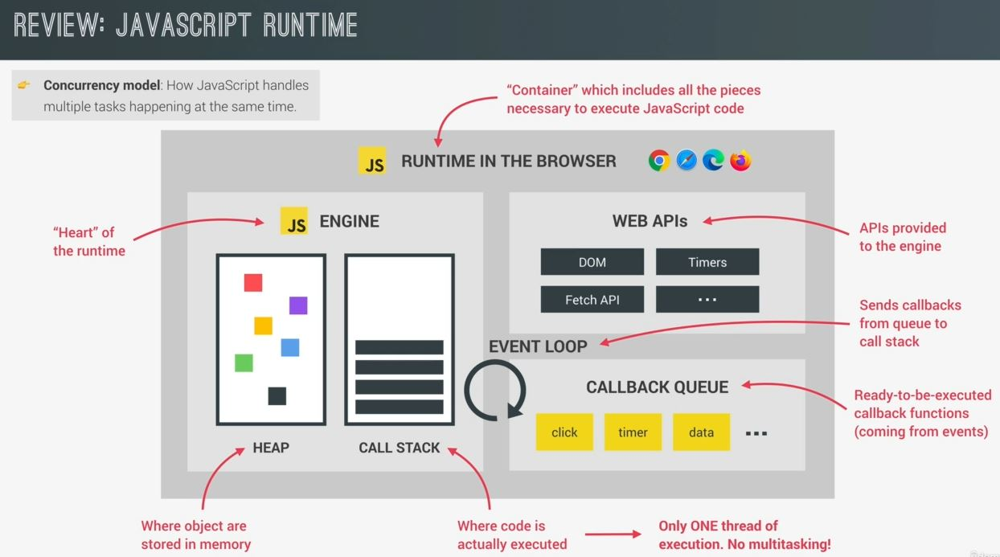
    - `About JS runtime environment ✅` : 
        - A JS runtime is a container which includes all the different pieces that're necessary to execute JS code
        - Now , the heart of every JS runtime is the engine , 
            - so this is where code is actually executed & where objects are stored in memory 
            - so these two things happen in the call stack & in the heap
        - `Note` : JS has only one thread of execution which means it can do only one thing at a time
            - in JS , there's absolutely no multitasking happening 
            - Now , other languages like Java , can execute multiple piece of code at the same time but not in JS 
        - Web APIs environment
            - these are some APIs provided to the engine but which are actually not part of the JS language itself 
            - for eg : DOM timers , the fetch API , the geolocation API , etc
        - callback queue
            - callback queue : is a data structure that holds all the ready to be executed callback functions that're attached <br>
                to some event that has occurred
            - finally , whenever the call stack is empty , the event loop takes callbacks from the callback queue <br>
                & puts them into call stack , so that they can be executed
        - so the event loop is the essential piece that makes asynchronous behavior possible in JS 
            - so it's the reason why we can have a non-blocking concurrency model in JS 💡💡💡 
            - a `concurrency model` is simply how a language handles multiple things happening at the same time

## how does this non-blocking concurrency work & why event loop is important

- `Non-Blocking concurrency` : 
    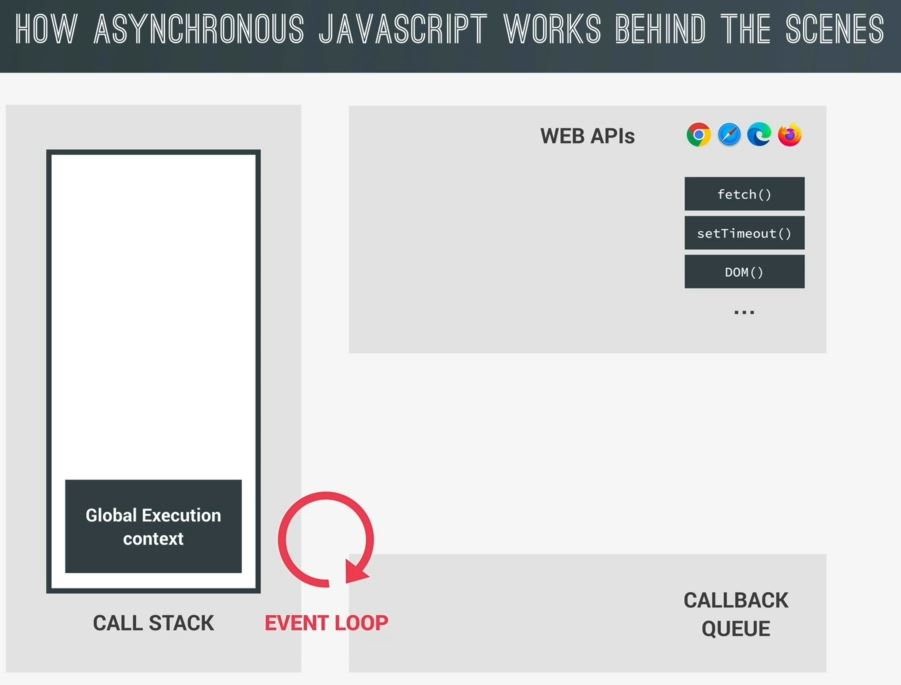
    - essential parts of the runtime i.e the call stack , the event loop , the web apis & callback queue
    - `big Ques in mind` : we know that , a JS engine is built around the idea of a single thread , but if <br>
        there was only one thread of execution in the engine then how can async code be executed in a non-blocking way
    - Eg : asynchronous code example
        ```js
        el = document.querySelector('img')
        el.src = 'dog.jpg'
        el.addEventListener('load' , () => {
            el.classList.add('fadeIn')
        })

        fetch('https://someurl.com/api').then(res => console.log(res))
        ```
        - JS will going to execute first line of code i.e so selecting img element will be pushed in the call stack <br>
            & inside the call stack , on the top of the global execution context , that execution context <br>
            of querySelector() will be created & when first line code done then it'll be pop out from the call stack
        - & now JS will move to next line , now set the source image <br>
            so that image will start to load that image asynchronously in the background <br>
            & we'll understand what that mysterious background actually is 
        - so , as you already know that everything related to the DOM is not really part of JS but of the web APIs <br>
            so it's in a web APIs environment where the asynchronous tasks related to the DOM will run <br>
            & same thing is true for timers , AJAX calls & all other async tasks 💡💡💡
        - so these async tasks will all run in the web API environment of the browser <br>
            now , think if the image would be loading in a synchronous way then it would be doing in the call stack <br>
            means blocking the execution inside the call stack for the rest of the code but we know this is terrible <br>
            that's why loading images in JS is asynchronous . So it doesn't happen in the call stack <br>
            so , not in the main thread of execution i.e call stack but really in the web APIs environment 💡💡💡
        - now , after the image has finished loading , then we need to listen to the load event <br>
            so `el.addEventListener('load', () => {})` it's execution context will be created inside the call stack <br>
            here we attach an `load` event to the img & we pass the callback <br>
            so in practice , the callback i.e `() => {el.classList.add('fadeIn')}` will be register in the web APIs environment <br>
            exactly where the image is loading like this 💡💡💡
            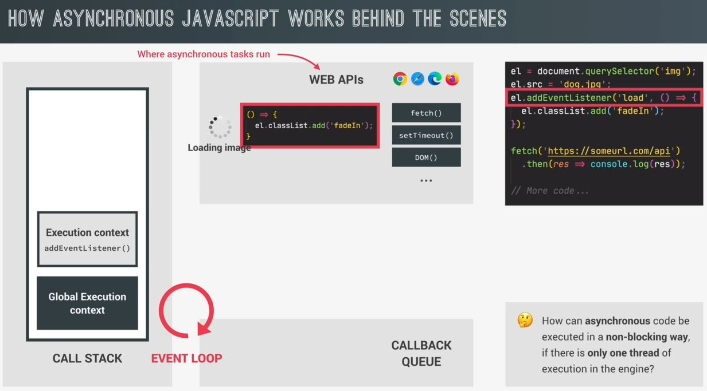
            - & callback will stay inside the web APIs environment until the `load` event is emitted/pop out/over <br>
                so we're handling async behavior with a callback 
            - so execution context of `addEventListener('load')` event will pop out from the call stack
        - now JS will go to next line & so in next line we're making an AJAX call using the fetch() api <br>
            so the execution context of fetch() api function will be created inside the call stack <br> 
            & asynchronous fetch operation will happen in the web APIs environment like this
            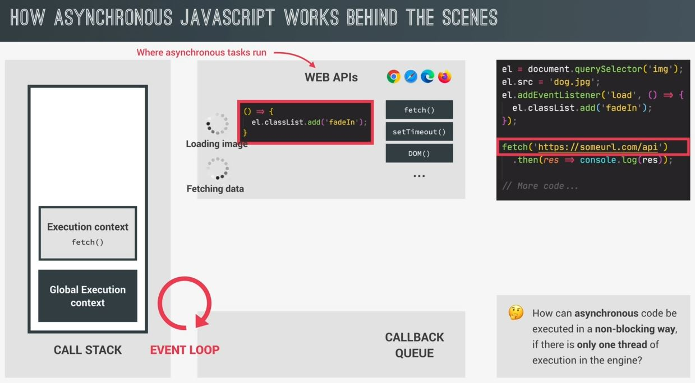
            & why asynchronous fetch operation is happening in the web APIs environment because otherwise <br>
            we would be blocking the call stack & create a huge lag in our application 💡💡💡 <br>
            now when the fetch() api function is done with it's work then execution context of fetch() function <br>
            will be pop out from the call stack
        - now the `then()` method will get the execution context inside the call stack & we use the then() method <br>
            on the promise (which is returned by the fetch() function) & the callback function of then() method <br> 
            will be register a callback in the web API environment like this <br>
            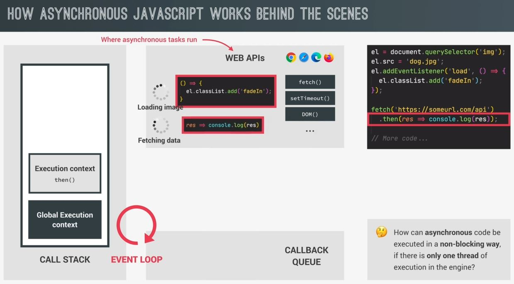
            - so the callback function of then() method is stored inside the web apis environment <br>
                so that we can react to the future resolved value of the promise
            - so that callback function of then() method is associated with a promise <br>
                i.e fetching the data from the API which is important for later work
        - now we executed all the top level of code & there's nothing left to execute <br>
            so execution context of then() method will be pop up from the call stack like this
            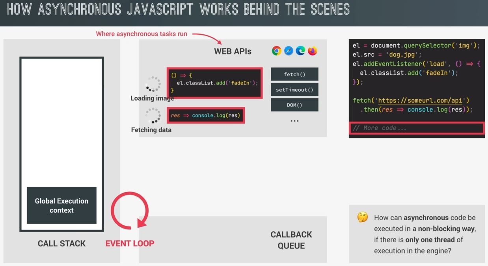
        - Now inside the Web APIs environment
            - we have the image loading in the background & some data begin fetched from an API
            - now , let's say the image has finished loading & the `load` event is emitted/ pop out on that image <br>
                now the callback of `load` event is put into the callback queue like this
                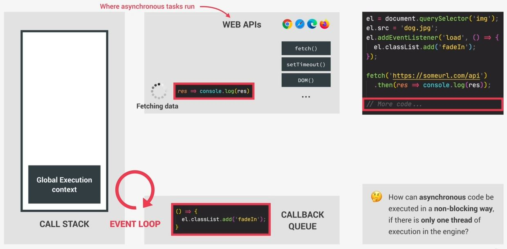
                - & the callback queue is an ordered list of all the callback function that're in line to be executed 💡💡💡<br>
                    means the callback queue is like a todo list of all the tasks but with tasks which are inside the call stack <br>
                    will eventually have to complete
                - now currently , there is no other callbacks in the callback queue yet but there could be of course . <br>
                    so if there were already other callbacks waiting in line then that previous callback would <br>
                    go to the end of the queue & new callback comes first just like call stack , means previous go <br>
                    to bottom & new comes at the top 
                - so that previous callback which are in inside the callback queue will sit patiently for it's turn to run <br>
                    so imagine , that you set a timer for 5 seconds . So after 5 seconds over , that timer callback will go <br>
                    on the callback queue & let's say there were already other callbacks waiting <br>
                    now let's also say that it took 1 second to run all of those callbacks
                - then in that case , your timers callback would only run after 6 seconds & not after 5 <br>
                    so out of these 6 seconds , 5seconds that passed for the timer plus the 1 second that it took <br>
                    to run all the other callbacks that were already waiting in line in front of your timer <br>
                    means the timers duration that you define is not a guarantee . The only guarantee is that <br>
                    the timers callback will not run before 5seconds but might it will run after 5 seconds <br>
                    have passed so it's all depends on the state of the callback queue <br>
                    & also another queue (which we'll see later on) 💡💡💡
                - the important thing is that the callback queue also contains callbacks coming from DOM events <br>
                    like clicks or key press or whatever & we also know that DOM events are not really asynchronous behavior <br>
                    but they still use the callback queue to run their attached callbacks 💡💡💡

- `the event loop` :
    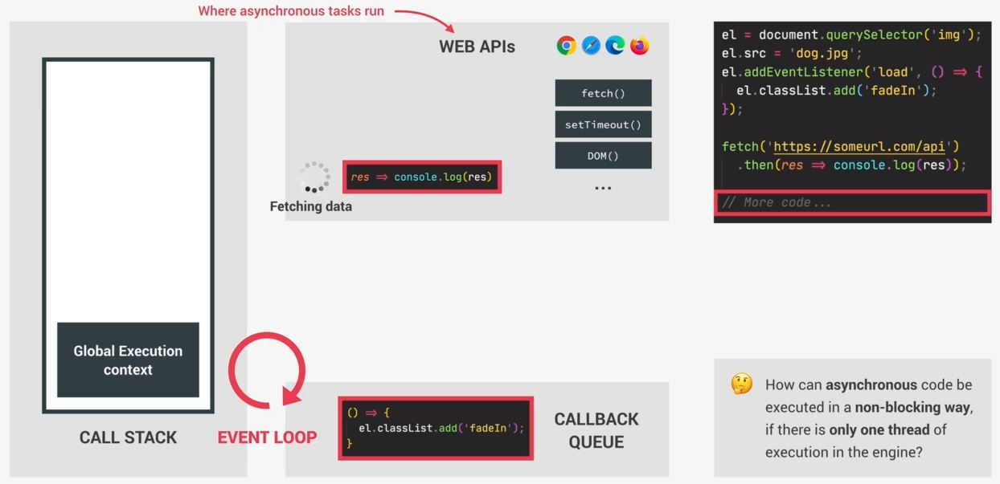
    - it looks into the call stack & determines whether it's empty or not . Except for the global context 
    - then if the call stack is empty which means currently inside of call stack , <br>
        there is no code being executed then it'll take the first callback from the callback queue 💡💡💡 <br>
        & put it on the call stack & the execution context of that first callback will be created & <br> 
        on top of it it's add() execution context also created to execute like this
        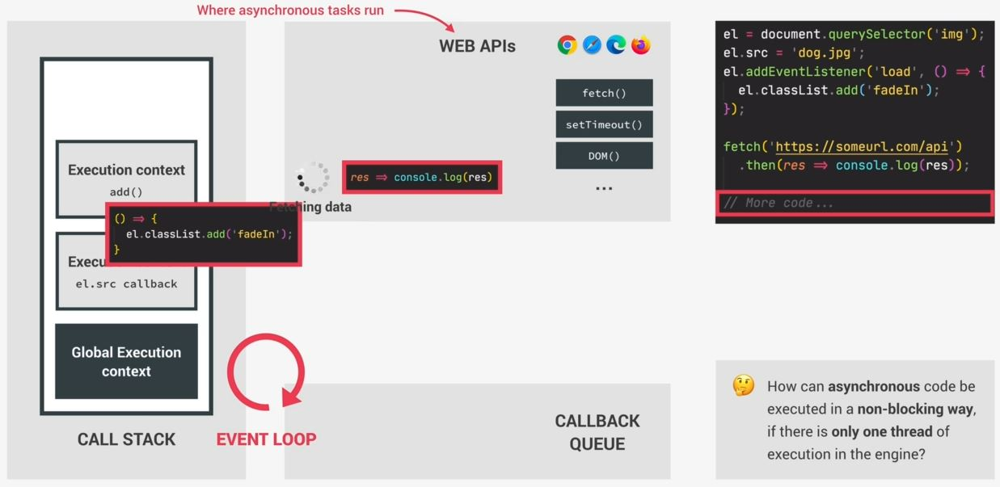
        - & this is called an event loop
        - so each time the event loop takes a callback from the callback queue & whenever call stack empty <br>
            then event loop putted on the call stack to execute that callback
        - so event loop is important for doing coordination b/w the call stack & to callbacks in the callback queue
        - so , the event loop is responsible to decides exactly when each callback is executed <br> 
            or we can say it does the orchestration of the entire JS runtime 💡💡💡
        - `Note ✅` : JS language itself has actually no sense of time 
            - that's because everything which is async doesn't happen in the engine
            - so it's the runtime who manages all the async behavior & it's the event loop who decides <br> 
                which code will be executed next 💡💡💡
            - but the JS engine itself simply executes whatever code it has given 💡💡💡
    - now when that first callback works is done then it'll be pop out from the call stack <br>
        & call stack gets empty

- `Recap - of all the above stuff`
    - so , the image started loading async way in the `Web APIs environment` , not in the `call stack`
    - then we used addEventListener() to attach a callback function to the image `load` event <br>
        & this callback is kind-of async code , so it's code we'll be executed in the future <br> 
        because we only want to execute it once the image has loaded & in the meantime , the rest of the code kept running 
    - Now , addEventListener() didn't put it's own callback directly in the callback queue 
        - it simply registered the callback & then kept waiting in web APIs environment until the `load` event was fired/executed 
        - & the movement `load` event is executed then that callback (of event listener) comes <br>
            from web APIs environment into the callback queue 💡💡💡
        - then while in the callback queue , the callback kept waiting for the `event loop` to pick it up <br>
            & put it on the call stack & this happened as soon as the callback was first in line & the call stack is empty
    - so , all this happened that the image didn't have to load in the call stack but in the background in a non-blocking way <br>
        so 3 things i.e the web APIs environment , the callback queue & the event loop -> all together make it possible <br>
        that async code can be executed in a non-blocking way even with only one thread of execution in the engine 💡💡💡

- but we're not done yet because we still have the fetch() function getting data from the AJAX call in the background <br>
    & this is happening with a promise . Now with promises things work in a slightly different way 💡💡💡
    - now let's say that the data has now finally arrived & the fetch() work is done
    - Now callbacks is related to promises which we registered with the then() method 
    - Now you'll think that callback which is a promise go into the callback queue which is wrong <br> 
        because that callback which is coming from a promise will not moved into the callback queue <br>
        means it'll stay in web apis environment
        - So , callbacks of promises have a special queue for themselves i.e `microtasks queue` 💡💡💡 <br>
        so that callback of promise will go inside the microtasks queue , not in callback queue like this
        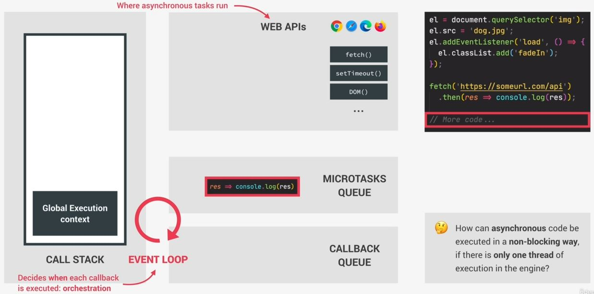
    - Now , what is special about the microtasks queue is that it has more priority over the callback queue 💡💡💡 <br> 
        so at the end of an event loop , after a callback has been taken from the callback queue , the event loop will check <br>
        if there are any callbacks in the microtasks queue & if there are then event loop will run all of them <br>
        before running any more callbacks from the regular callback queue 💡💡💡
    - we say these callbacks as promises microtasks & that's why the name is microtasks queue <br>
        & there're actually other microtasks but that's not relevant here
    - so currently , we have a microtask inside the microtasks queue & right now call stack is also empty <br>
        that's why the event loop will now take that callback & put it in the call stack inside the call stack like this <br>
        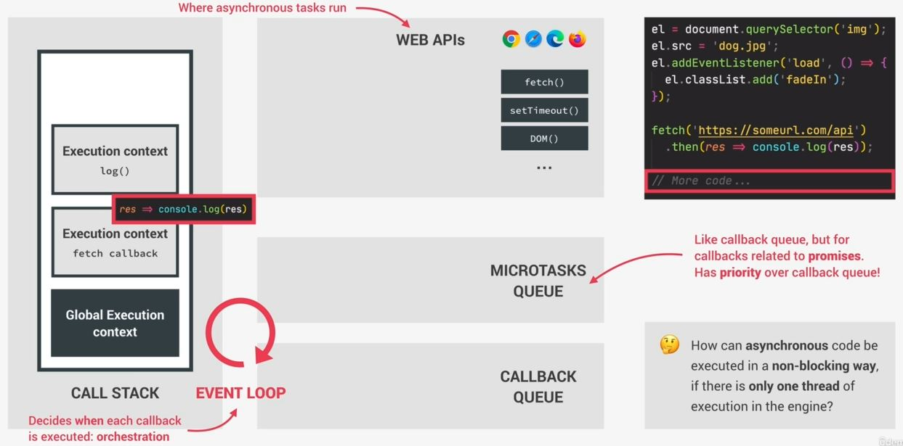
        - & it doesn't matter if the callback queue is empty or not 💡💡💡 
        - because microtasks queue always have priority over the callback queue
        - `might be interview question` : microtasks queue can starve/eat the callback queue because if we keep <br>
            adding more & more microtasks then all callbacks which are in the callback queue can never be execute
            - now , this is not a problem but might be possible
    - & finally , that callback of promise will be executed & call stack gets empty
