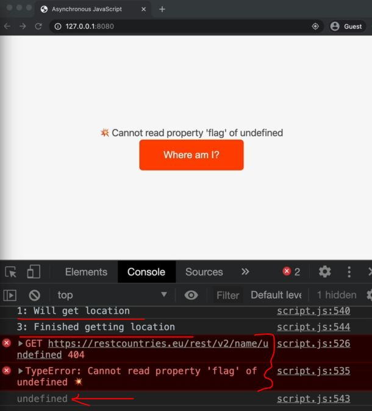
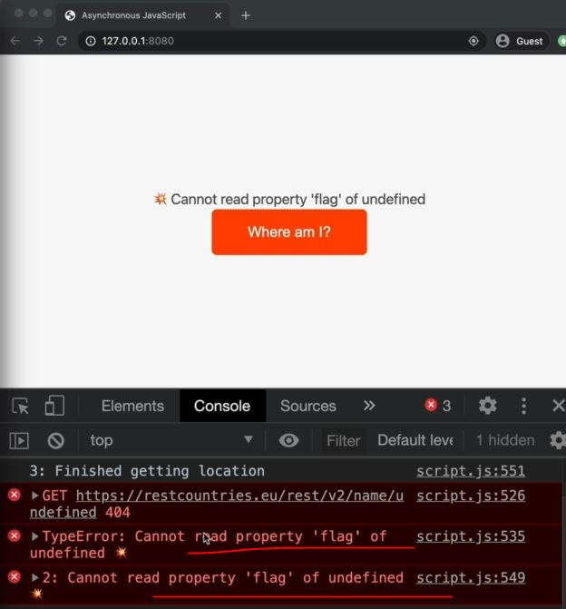

# Returning Values from async functions

## Example - of returning values from async function

- Eg : of normal flow of execution of code
    ```js
    const whereAmI = async function() {
        try {
            // Geolocation
            const pos = await getPosition()
            const { latitude: lat, longitude: lng } = pos.coords;

            // Reverse geocoding
            const resGeo = await fetch(`https://geocode.xyz/${lat},${lng}?geoit=json`);
            if (!resGeo.ok) throw new Error('Problem getting location data')
            const dataGeo = await resGeo.json()

            // country data
            const res = await fetch(`https://rescountries.eu/rest/v2/name/${dataGeo.country}`)
            if (!res.ok) throw new Error('Problem getting country')
            const data = await res.json() 
            renderCountry(data[0])
        }catch(err) {
            console.error(`${err} 💥`);
            renderError(`💥 ${err.message}`);
        }
    }
    console.log('1: will get location')
    whereAmI()
    console.log('2: Finished getting location')
    ```
    - output : 1: will get location
        - now behind the scene async function i.e whereAmI() will do work in the background inside web APIs environment
        - then 2: Finished getting location
        - then we'll get the output of returning promise 

- Eg : returning values from async function
    ```js
    const whereAmI = async function() {
        try {
            // Geolocation
            const pos = await getPosition()
            const { latitude: lat, longitude: lng } = pos.coords;

            // Reverse geocoding
            const resGeo = await fetch(`https://geocode.xyz/${lat},${lng}?geoit=json`);
            if (!resGeo.ok) throw new Error('Problem getting location data')
            const dataGeo = await resGeo.json()

            // country data
            const res = await fetch(`https://rescountries.eu/rest/v2/name/${dataGeo.country}`)
            if (!res.ok) throw new Error('Problem getting country')
            const data = await res.json() 
            renderCountry(data[0])

            return `You are in ${dataGeo.City} , ${dataGeo.country}`

        }catch(err) {
            console.error(`${err} 💥`);
            renderError(`💥 ${err.message}`);
        }
    }
    console.log('1: will get location')
    const city = whereAmI()
    console.log(city)
    console.log('2: Finished getting location')
    // output : now think what will be output
        // 1: will get location
        // Promise {<pending>}
        // 3: Finished getting location
    ```
    - so where 2nd output , we got pending promise <br>
        because we know that the async function will always return a promise 💡💡💡
    - `Imp Note 🔥` : here we didn't get that string which we're returning 
        - because at this line of code i.e `const city = whereAmI()` <br>
            JS has simply no way of knowing yet that we want that string which we're returning <br>
            because the function is still running but whereAmI() is also not blocking the code 
        - that's why JS don't know what will be returned from that whereAmI() function <br>
            that's why finally that whereAmI() function (which is async function) return a promise 
        - now the value that we return from an async function i.e that string <br>
            will become the fulfilled value of the promise which is returned by the function 💡💡💡
        -  so here the output we got i.e `Promise {<pending>}` then promise is the fulfilled value of that promise <br>
            is going to be that string 💡💡💡
    
- so whenever we're returning a value from the async function <br>
    then we can get that value through then() method on that async function <br>
    & how we can use then() method because we know that async() function always return a promise 💡💡💡

- `STEP 1` : consuming that fulfilled value which is returning from the async function 
    ```js
    const whereAmI = async function() {
        try {
            // Geolocation
            const pos = await getPosition()
            const { latitude: lat, longitude: lng } = pos.coords;

            // Reverse geocoding
            const resGeo = await fetch(`https://geocode.xyz/${lat},${lng}?geoit=json`);
            if (!resGeo.ok) throw new Error('Problem getting location data')
            const dataGeo = await resGeo.json()

            // country data
            const res = await fetch(`https://rescountries.eu/rest/v2/name/${dataGeo.country}`)
            if (!res.ok) throw new Error('Problem getting country')
            const data = await res.json() 
            renderCountry(data[0])

            return `You are in ${dataGeo.City} , ${dataGeo.country}`

        }catch(err) {
            console.error(`${err} 💥`);
            renderError(`💥 ${err.message}`);
        }
    }
    console.log('1: will get location')
    whereAmI().then(city => console.log(city))
    console.log('2: Finished getting location')
    // output : 1: will get location
        // 2: Finished getting location
        // & after some time we'll get this -> You are in OLHAO, Portugal
    ```
    - now inside the try block , what if any error occurred before that returning string <br>
        then we never come to that returning string because the code immediately jump inside the catch block 💡💡💡

- `STEP 2` : creating the errors deliberately
    ```js
    const whereAmI = async function() {
        try {
            // Geolocation
            const pos = await getPosition()
            const { latitude: lat, longitude: lng } = pos.coords;

            // Reverse geocoding
            const resGeo = await fetch(`https://geocode.xyz/${lat},${lng}?geoit=json`);
            if (!resGeo.ok) throw new Error('Problem getting location data')
            const dataGeo = await resGeo.json()

            // country data
            const res = await fetch(`https://rescountries.eu/rest/v2/name/${dataGeo.countryqqqqq}`)
            if (!res.ok) throw new Error('Problem getting country')
            const data = await res.json() 
            renderCountry(data[0])

            return `You are in ${dataGeo.City} , ${dataGeo.country}`

        }catch(err) {
            console.error(`${err} 💥`);
            renderError(`💥 ${err.message}`);
        }
    }
    console.log('1: will get location')
    whereAmI().then(city => console.log(city))
    console.log('2: Finished getting location')
    ```
    - output : we'll get the errors like this
        
        - here we can see we got `undefined` which means nothing was returned from the function <br>
            that's why we got the undefined
        - so the interesting thing is the console.log() still worked of this code `whereAmI().then(city => console.log(city))` <br>
            means console.log(city) (which is inside the then() method) is still running <br>
            which means callback function argument of then() method is still working <br> 
            & which means then() method was called & which means returned promise <br>
            from `whereAmI()` was actually fulfilled but not rejected 💡💡💡
        - & even though there was an error in the async function , but still <br>
            the promise which is returned from that function is fulfilled , not rejected 💡💡💡
    - `STEP 2.1` : using the catch() method 
        ```js
        const whereAmI = async function() {
            try {
                // Geolocation
                const pos = await getPosition()
                const { latitude: lat, longitude: lng } = pos.coords;

                // Reverse geocoding
                const resGeo = await fetch(`https://geocode.xyz/${lat},${lng}?geoit=json`);
                if (!resGeo.ok) throw new Error('Problem getting location data')
                const dataGeo = await resGeo.json()

                // country data
                const res = await fetch(`https://rescountries.eu/rest/v2/name/${dataGeo.countryqqqqq}`)
                if (!res.ok) throw new Error('Problem getting country')
                const data = await res.json() 
                renderCountry(data[0])

                return `You are in ${dataGeo.City} , ${dataGeo.country}`

            }catch(err) {
                console.error(`${err} 💥`);
                renderError(`💥 ${err.message}`);
            }
        }

        console.log('1: will get location')

        whereAmI().then(city => {
            console.log(`2: ${city}`)
        }).catch(err => {
            console.error(`2: ${err.message}`)
        })

        console.log('3: Finished getting location')
        ```
        - output : we'll still get the error
            - but still that callback function argument of then() method is executed that's why we got `2: undefined` 
            - & catch() block is not executed , even though there was an error inside the async function i.e whereAmI() <br>
                the promise which is returned is still fulfilled
            - now to fix this problem i.e we want to catch the error inside catch() method <br>
                then we would have to re-throw that error inside the catch block which is inside the async function 💡💡💡 <br>
                re-throwing the error means throw the error again so that we can propagate that error further <br> 
                which means we need to manually reject a promise which is returned form the async function 💡💡💡

    - `STEP 2.2` : rejecting the returned promise inside the catch block inside that async function
        ```js
        const whereAmI = async function() {
            try {
                // Geolocation
                const pos = await getPosition()
                const { latitude: lat, longitude: lng } = pos.coords;

                // Reverse geocoding
                const resGeo = await fetch(`https://geocode.xyz/${lat},${lng}?geoit=json`);
                if (!resGeo.ok) throw new Error('Problem getting location data')
                const dataGeo = await resGeo.json()

                // country data
                const res = await fetch(`https://rescountries.eu/rest/v2/name/${dataGeo.countryqqqqq}`)
                if (!res.ok) throw new Error('Problem getting country')
                const data = await res.json() 
                renderCountry(data[0])

                return `You are in ${dataGeo.City} , ${dataGeo.country}`

            }catch(err) {
                console.error(`${err} 💥`);
                renderError(`💥 ${err.message}`);

                // rejecting returned promise manually from async function 
                throw err
            }
        }

        console.log('1: will get location')

        whereAmI().then(city => {
            console.log(`2: ${city}`)
        }).catch(err => {
            console.error(`2: ${err.message}`)
        })

        console.log('3: Finished getting location')
        ```
        - output : we'll get same same like this 
            
            - but `3: Finished getting location'` message gets printed before the error <br>
                so we can use finally() method to print the messages in the sequence
    - `STEP 2.3` : using finally() method to print the messages in the sequence
        ```js
        const whereAmI = async function() {
            try {
                // Geolocation
                const pos = await getPosition()
                const { latitude: lat, longitude: lng } = pos.coords;

                // Reverse geocoding
                const resGeo = await fetch(`https://geocode.xyz/${lat},${lng}?geoit=json`);
                if (!resGeo.ok) throw new Error('Problem getting location data')
                const dataGeo = await resGeo.json()

                // country data
                const res = await fetch(`https://rescountries.eu/rest/v2/name/${dataGeo.countryqqqqq}`)
                if (!res.ok) throw new Error('Problem getting country')
                const data = await res.json() 
                renderCountry(data[0])

                return `You are in ${dataGeo.City} , ${dataGeo.country}`

            }catch(err) {
                console.error(`${err} 💥`);
                renderError(`💥 ${err.message}`);

                // rejecting returned promise manually from async function 
                throw err
            }
        }

        console.log('1: will get location')

        whereAmI().then(city => {
            console.log(`2: ${city}`)
        }).catch(err => {
            console.error(`2: ${err.message}`)
        }).finally(() => {
            console.log('3: Finished getting location')
        })
        // output : we'll get 
            // 1: will get location
            // 2: You are in OLHAO, Portugal
            // 3: Finished getting location
        ```
        - but still there's a problem i.e we're again using then() & catch() method to consume the returned promise <br>
            so we're mixing async await & tradition promise together , so don't mix them . so always use async await
        - so now convert this consuming promise traditional way into async wait <br> 
            & that would be great if we use `await` keyword without making async function but that doesn't work <br>
            because `await` keyword can only be used inside an async function <br>
            but we don't want to create a new async function . so instead of that , we can use IIFE 💡💡💡
        - here the last real use case of IIFE function comes 💡💡💡

- `STEP 3` : converting that traditional way of consuming promise into async await way of consuming promise
    - without creating a new async function 
    ```js
    // put code before this from STEP 2.3

    console.log('1: will get location')

    // whereAmI().then(city => {
    //     console.log(`2: ${city}`)
    // }).catch(err => {
    //     console.error(`2: ${err.message}`)
    // }).finally(() => {
    //     console.log('3: Finished getting location')
    // })

    // using IIFE function style 
    (async function() {
        try {
            const city = await whereAmI()
            console.log(`2: ${city}`)
        }catch(err) {
            console.error(`2: ${err.message}`)
        }
        // here we put this line code outside the try catch block 
            // because this line will always going to be executed , no matter what
        console.log('3: Finished getting location')
    })()
    ```
    - output : 1: will get location & then after sometime we'll get 
        - 2: You are in OLHAo , Portugal
        - 3: Finished getting location'

- `said by jonas` : 
    - so we convert everything in async await & now we know how to return data from an async function <br>
        & how to properly receive & handle that returned data
    - & in real life , this is something that happens all the time , so it's pretty common <br>
        that we have async functions calling other async functions 💡💡💡 & returning values b/w them
