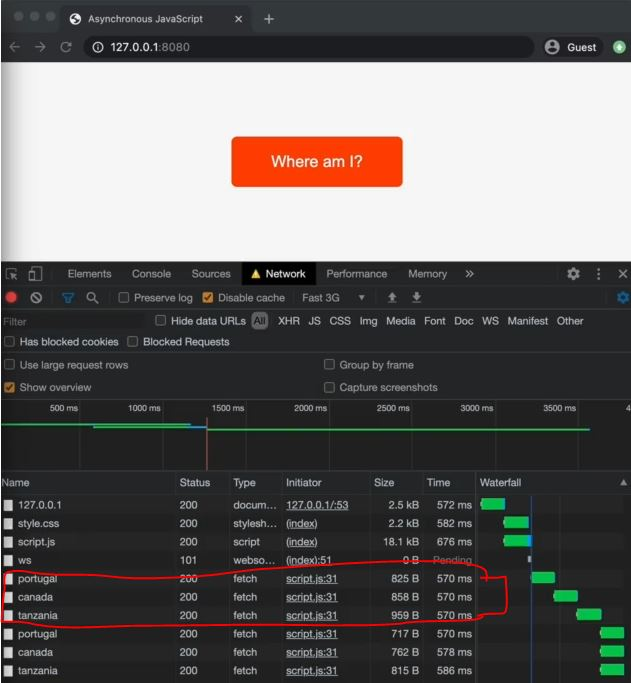
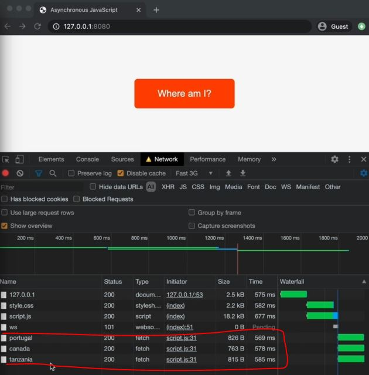

# Running Promises in Parallel

- now imagine , we wanted to get some data about 3 countries at the same time <br>
    but in which order that the data arrives doesn't matter at all

## Example - Running multiple promises in parallel

- Eg : of running multiple promises step by step without any dependency on each other 
    ```js
    const getJSON = function(url, errorMsg = 'Something went wrong') { 
        return fetch(url).then(response => {
            if (!response.ok) 
                throw new Error(`${errorMsg} (${response.status})`)

            return response.json()
        })
    }

    const get3Countries = async function(c1, c2, c3) {
        try {
            const [data1] = await getJSON(`https://restcountries.eu/rest/v2/name/${c1}`)
            const [data2] = await getJSON(`https://restcountries.eu/rest/v2/name/${c2}`)
            const [data3] = await getJSON(`https://restcountries.eu/rest/v2/name/${c3}`)

            // now we want to return an array
            console.log([data1.capital, data2.capital, data3.capital])

        }catch(err) {
            console.error(err)
        }
    }

    get3Countries('portugal', 'canada' , 'tanzania')
    ```
    - output : ["Lisbon", "Ottawa", "Dodoma"] 
        - so we got the 3 capital cities of those 3 countries
    - but here we called the AJAX calls one after another even though the result <br>
        of the second one doesn't depend on the first one & same with third one result is not depend on any other ones 
    - `Imp Note 🔥` : 
        - & even we can see the AJAX call of those 3 countries inside the Network tab , that AJAX calls of each countries <br>
            goes in sequence but can run them in parallel means all at the same time & due to this , 
        - we can save valuable loading time means load all those 3 at the same time 💡💡💡 <br>
            & & due to this , we can save half a second which is a lot of time when loading a website 💡💡💡
        - so for this we use `Promise.all()` method 💡💡💡

- Eg : of running multiple promises in parallel means running them at the same time by using `Promise.all()` 
    ```js
    const getJSON = function(url, errorMsg = 'Something went wrong') { 
        return fetch(url).then(response => {
            if (!response.ok) 
                throw new Error(`${errorMsg} (${response.status})`)

            return response.json()
        })
    }

    const get3Countries = async function(c1, c2, c3) {
        try {
            const [data1] = await getJSON(`https://restcountries.eu/rest/v2/name/${c1}`)
            const [data2] = await getJSON(`https://restcountries.eu/rest/v2/name/${c2}`)
            const [data3] = await getJSON(`https://restcountries.eu/rest/v2/name/${c3}`)

            // here all() method is a static method inside Promise constructor class
                // it's like an helper function
            Promise.all()

            // now we want to return an array
            console.log([data1.capital, data2.capital, data3.capital])

        }catch(err) {
            console.error(err)
        }
    }

    get3Countries('portugal', 'canada' , 'tanzania')
    ```
    - `Promise.all()` method : takes an array of promises as an argument & return a new promise as a output
        - which will then run all the promises in the array at the same time 💡💡💡
        - but if any one of the promise gets rejected then the whole promises <br>
            which are inside the Promise.all() will get rejected , don't matter that other promises are fulfilled 💡💡💡
    - `STEP 1` : passing all those 3 promises inside an array (which is a argument of Promise.all() method)
        ```js
        const getJSON = function(url, errorMsg = 'Something went wrong') { 
            return fetch(url).then(response => {
                if (!response.ok) 
                    throw new Error(`${errorMsg} (${response.status})`)

                return response.json()
            })
        }

        const get3Countries = async function(c1, c2, c3) {
            try {
                Promise.all([
                    getJSON(`https://restcountries.eu/rest/v2/name/${c1}`) , 
                    getJSON(`https://restcountries.eu/rest/v2/name/${c2}`) , 
                    getJSON(`https://restcountries.eu/rest/v2/name/${c3}`)  
                ])

                // now we want to return an array
                console.log([data1.capital, data2.capital, data3.capital])

            }catch(err) {
                console.error(err)
            }
        }

        get3Countries('portugal', 'canada' , 'tanzania')
        ```
        - output : inside the network tab , select fast 3gb then reload the page
            - then we can see that all those promises running at the same time like this
            
    - `STEP 2` : now handling that promise through `await` keyword
        ```js
        const getJSON = function(url, errorMsg = 'Something went wrong') { 
            return fetch(url).then(response => {
                if (!response.ok) 
                    throw new Error(`${errorMsg} (${response.status})`)

                return response.json()
            })
        }

        const get3Countries = async function(c1, c2, c3) {
            try {
                const data = await Promise.all([
                    getJSON(`https://restcountries.eu/rest/v2/name/${c1}`) , 
                    getJSON(`https://restcountries.eu/rest/v2/name/${c2}`) , 
                    getJSON(`https://restcountries.eu/rest/v2/name/${c3}`)  
                ])

                // now we want to return an array
                console.log(data)

            }catch(err) {
                console.error(err)
            }
        }

        get3Countries('portugal', 'canada' , 'tanzania')
        ```
        - output : all those 3 promises will be loaded at the same time like this
            
            - so all those running in parallel , no longer in sequence now 💡💡💡
            - & inside of the console tab , we'll get the array like this [Array(1), Array(2), Array(3)]

- `STEP 3` : now looping over that data to get the data
    ```js
    const getJSON = function(url, errorMsg = 'Something went wrong') { 
        return fetch(url).then(response => {
            if (!response.ok) 
                throw new Error(`${errorMsg} (${response.status})`)

            return response.json()
        })
    }

    const get3Countries = async function(c1, c2, c3) {
        try {
            const data = await Promise.all([
                getJSON(`https://restcountries.eu/rest/v2/name/${c1}`) , 
                getJSON(`https://restcountries.eu/rest/v2/name/${c2}`) , 
                getJSON(`https://restcountries.eu/rest/v2/name/${c3}`)  
            ])

            // now we want to return an array of all capital cites
            console.log(data.map(d => d[0].capital))
            
        }catch(err) {
            console.error(err)
        }
    }

    get3Countries('portugal', 'canada' , 'tanzania')
    ```
    - output : ["Lisbon", "Ottawa", "Dodoma"]
    - `Imp Note - about Promise.all() 🔥` : 
        - if one of the promises rejects inside the Promise.all() method then the whole Promise.all() will rejects 
        - means Promise.all() short circuits when one promise rejects 💡💡💡
        - So whenever you have a situation that you need to do multiple asynchronous operations at the same time <br>
            & operations that don't depend on one another then you should always run <br>
            them in parallel by using Promise.all() 💡💡🔥

- `said by jonas ✅` : 
    - Promise.all() method is a combinator method because it allows us to combine multiple promises
