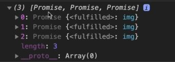

# Coding Challenge #3

- problem statement :
    - PART 1
        - Write an async function 'loadNPause' that recreates Coding Challenge #2, this time using async/await 
            - (only the part where the promise is consumed). Compare the two versions, think about the big differences, and see which one you like more.
            - Don't forget to test the error handler, and to set the network speed to 'Fast 3G' in the dev tools Network tab.
    - PART 2
        - `1` : Create an async function 'loadAll' that receives an array of image paths 'imgArr';
        - `2` : Use .map to loop over the array, to load all the images with the 'createImage' function (call the resulting array 'imgs')
        - `3` : Check out the 'imgs' array in the console! Is it like you expected?
        - `4` : Use a promise combinator function to actually get the images from the array 😉
        - `5` : Add the 'parallel' class to all the images (it has some CSS styles).
    TEST DATA: ['img/img-1.jpg', 'img/img-2.jpg', 'img/img-3.jpg']. To test, turn off the 'loadNPause' function.

## solution

- testing code of coding challenge #2: 
    ```js
    const wait = function(seconds) {
        return new Promise(function(resolve) {
            setTimeout(resolve, seconds * 1000) 
        })
    }

    const imgContainer = document.querySelector('.images')

    const createImage = function(imgPath) {
        return new Promise(function(resolve, reject) {
            const img = document.createElement('img')
            img.src = imgPath

            img.addEventListener('load', function() {
                imgContainer.append(img)
                resolve(img)
            })

            img.addEventListener('error', function() {
                imgContainer.append(img)
                resolve(img)
            })
        })
    }

    let currentImg ;

    createImage('img/img-1.jpg').then(img => {
        currentImg = img
        console.log('Image 1 loaded')
        return wait(2)
    }).then(() => {
        currentImg.style.display = 'none'
        return createImage('img/img-2.jpg') 
    }).then(img => {
        currentImg = img
        console.log('Image 2 loaded')
        return wait(2)
    }).then(() => {
        currentImg.style.display = 'none'
        
    }).catch(err => console.error(err))
    ```

- `PART 1 - STEP 1` : converting that consuming promise code part & then chaining into async await 
    ```js
    // let currentImg ;

    // createImage('img/img-1.jpg').then(img => {
    //     currentImg = img
    //     console.log('Image 1 loaded')
    //     return wait(2)
    // }).then(() => {
    //     currentImg.style.display = 'none'
    //     return createImage('img/img-2.jpg') 
    // }).then(img => {
    //     currentImg = img
    //     console.log('Image 2 loaded')
    //     return wait(2)
    // }).then(() => {
    //     currentImg.style.display = 'none'
    // }).catch(err => console.error(err))

    const loadNPause = async function() {
        try {
            // load Image 1
            let img = await createImage('img/img-1.jpg')
            console.log("Image 1 loaded")

            await wait(2) // since wait() promise doesn't have any resolved value 
                // that's why we don't need to save into a variable
            img.style.display = 'none' // here we used same variable i.e img
                // but in the chaining promise code while consuming 
                    // we used that global variable i.e currentImg

            img = await createImage('img/img-2.jpg') 
            console.log("Image 2 loaded")
            await wait(2) 
            img.style.display = 'none'

        } catch(err) {
            console.error(err)
        }
    }

    loadNPause()
    ```
    - output : first set the network as fast 3G & then refresh the page
        - & inside the network tab , we can see all the requests

- `PART 2 - STEP 1` : creating async loadAll() function
    ```js
    const loadAll = async function(imgArr) {
        try{
            const imgs = imgArr.map(img => {
                createImage(img) // we have to await this function because this function will return a promise 
                    // if we don't await it then nothing will happen 💡💡💡
                    // but to do this , first we need to make this callback function as async function 💡💡💡
                        // then only we can use await -> keyword otherwise can't use await -> keyword
            })
            console.log(imgs)

        } catch(err) {
            console.error(err)
        }
    }

    loadAll(['img/img-1.jpg', 'img/img-2.jpg'])
    ```
    - `STEP 2` : awaiting the createImage() function
        ```js
        const loadAll = async function(imgArr) {
            try{
                const imgs = imgArr.map(async img => {
                    await createImage(img) 
                })
                console.log(imgs)

            } catch(err) {
                console.error(err)
            }
        }

        loadAll(['img/img-1.jpg', 'img/img-2.jpg', 'img/img-3.jpg'])
        ```
        - output : we'll get an array which contain 3 promises which are fulfilled like this
            
            - so we have an array of 3 promises but not the images themselves 💡💡💡
            - & this is a big source of confusion for most async await beginners
            - because we know that async function always return a promise & not the real value that we want 💡💡💡 
            - but behind the scenes , those 3 images already loaded
    - `STEP 3` : how we can get those images themselves ✅
        - so we could take each promises out of the array & then manually await it but this wouldn't make much sense <br>
            because we would have additional work & then that work would not be happening in parallel 💡💡💡
        - but we want to run all those 3 promises in parallel at the same time , so we can use Promise.all([]) 💡💡💡
        ```js
        const loadAll = async function(imgArr) {
            try{
                const imgs = imgArr.map(async img => {
                    await createImage(img) 
                })
                console.log(imgs)

                const imgsEl = await Promise.all(imgs) // here we putted the await -> keyword because 
                    // Promise.all([]) will return the output as an array in asynchronous way 💡💡💡
                console.log(imgsEl)

            } catch(err) {
                console.error(err)
            }
        }

        loadAll(['img/img-1.jpg', 'img/img-2.jpg', 'img/img-3.jpg'])
        ```
        - output : now reload the page & it'll take some time to load
            - then then image will get loaded & we'll get the output as [img, img, img]
            - but these image are hidden because we didn't added the parallel class
    - `STEP 4` : adding parallel class
        ```js
        const loadAll = async function(imgArr) {
            try{
                const imgs = imgArr.map(async img => {
                    await createImage(img) 
                })
                console.log(imgs) // output : [Promise, Promise, Promise]

                const imgsEl = await Promise.all(imgs) 
                console.log(imgsEl) // output : [img, img, img]

                // we don't want to return a new array as a output that's why we used forEach() method
                    // because forEach() method doesn't return anything 💡💡💡
                imgsEl.forEach(img => img.classList.add('parallel'))

            } catch(err) {
                console.error(err)
            }
        }

        loadAll(['img/img-1.jpg', 'img/img-2.jpg', 'img/img-3.jpg'])
        ```
        - output : inside the network tab , we can see that all images is loading parallel at the same time
