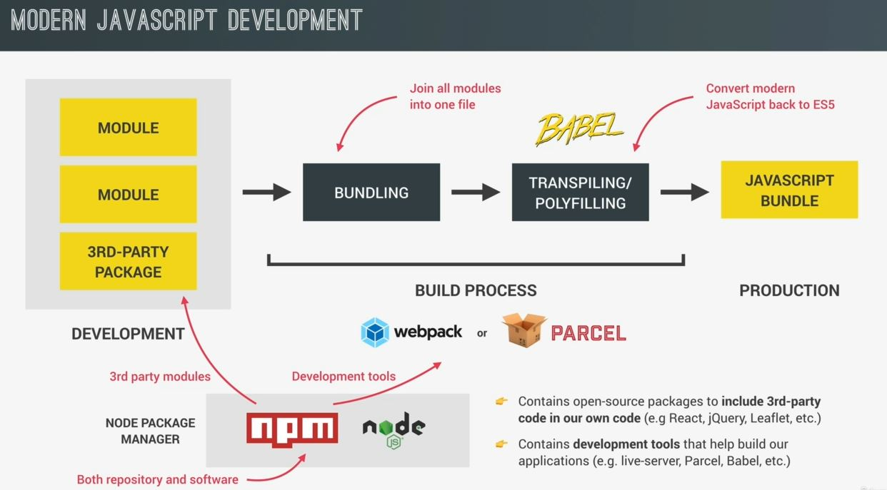

# An Overview of Modern JS Development

- when we built applications , we don't just write all of our code into one big script

## Process Modern JS Development

- `STEP 1` : we divide our code in modules & use 3rd party libraries
    - earlier we used to write all of our code in one big script or maybe multiple scripts  
    - but now , we divide our projects into multiple modules & these modules can share data b/w them  
        & make our code more organized & maintainable
        - `Best thing about modules` : we can also include 3rd party modules into our code 💡💡💡
        - & there're thousands of open source modules which is called packages which is shared by Developers on the NPM repo 
    - NPM is both i.e repo in which packages live & a program that we use to install & manages those packages/libraries

- `STEP 2` : now our project needs to go through a build process
    - where one big final JS bundle is built  
        & that final JS bundle is the final file which we'll deploy to our web server for production
    - so that's the JS file which will be sent to browsers in production   
        & production simply means that the application is being used by real users in the real world 💡💡💡
    - Now , a build process can be really complex but we'll keep it simple in two steps
        - `STEP 1` : bundle all our modules together into one big file
            - this is a pretty complex process which can eliminate unused code & compress the code
            - & this is important for 2 reasons 
                - `1` : old browsers don't support modules at all
                - `2` : it's also better for performance to send less files in the browser  
                    & beneficial to build step compresses our code 
        - `STEP 2` : we do transpiling & polyfilling 
            - which is used to convert all modern JS syntax & features back to old ES5 syntax
            - so that even older browsers can understand the code without breaking 
            - & this is usually done by using a tool i.e Babel
    - `STEP 2.1` : now after these two Steps of our build process
        - we end up with that final JS bundle ready to be deployed on a server for production
        - now we don't perform these steps ourselves 💡💡💡  
            instead of that , we use a special tool to implement that build process for us  
            & most common build tools are webpack & parcel
        - & these are called JS bundlers which means they take our raw code & transform it into a JS bundle
        - Webpack is the more popular but it's hard & confusing to set it up because there's a lot of stuff  
            which we need to configure manually to work properly
        - but parcel is a zero configuration bundler means we don't need to write any setup of code
        - we can download these tools from NPM & these also include live-server
        

