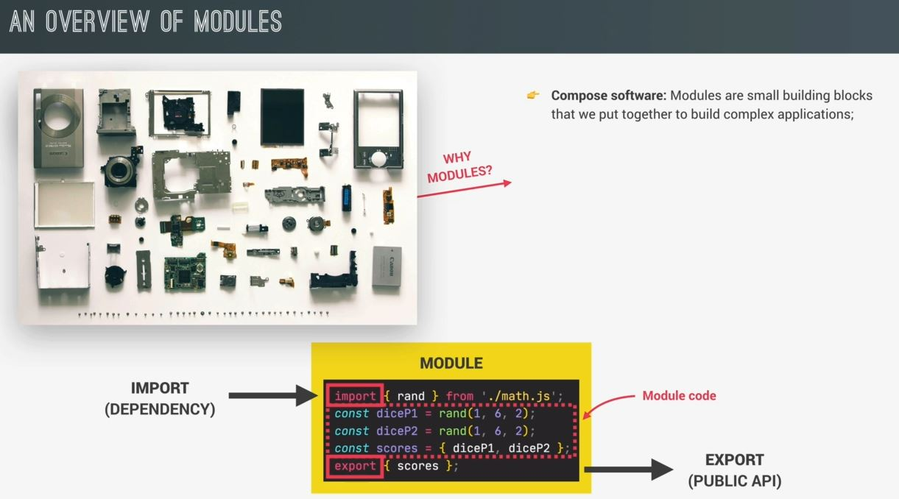
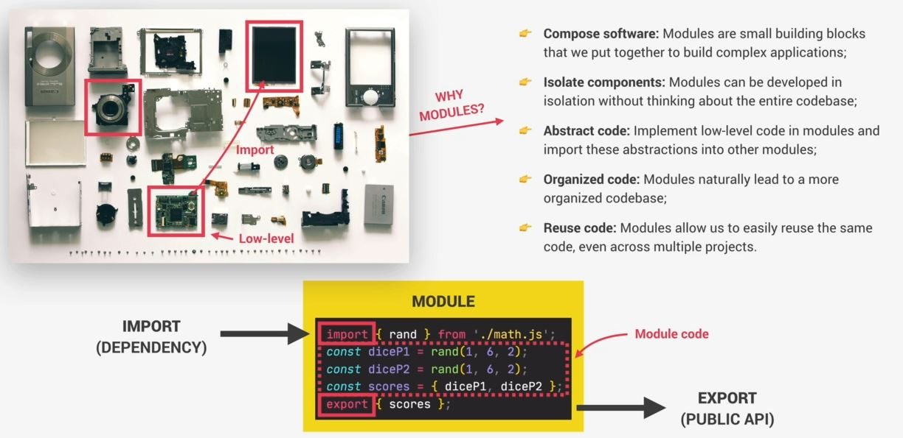
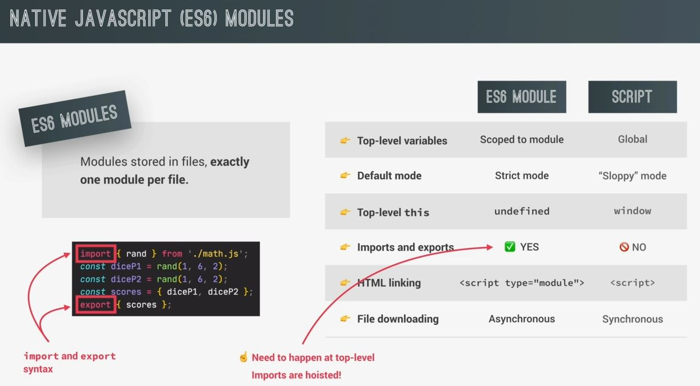
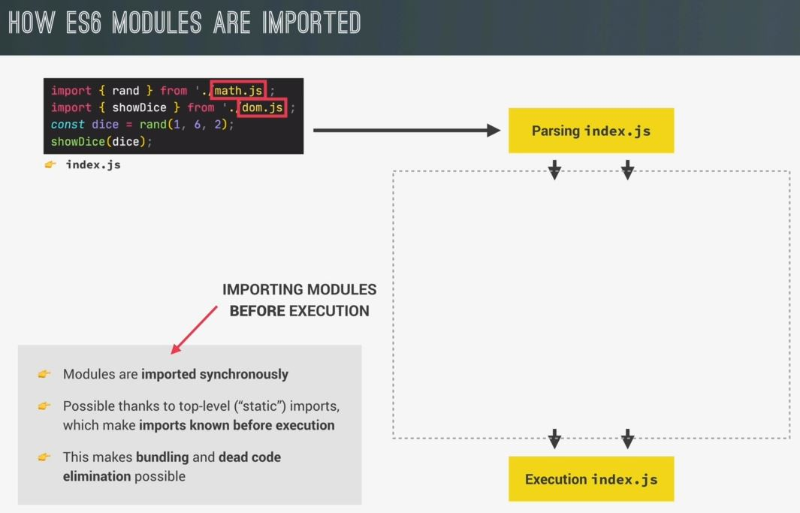
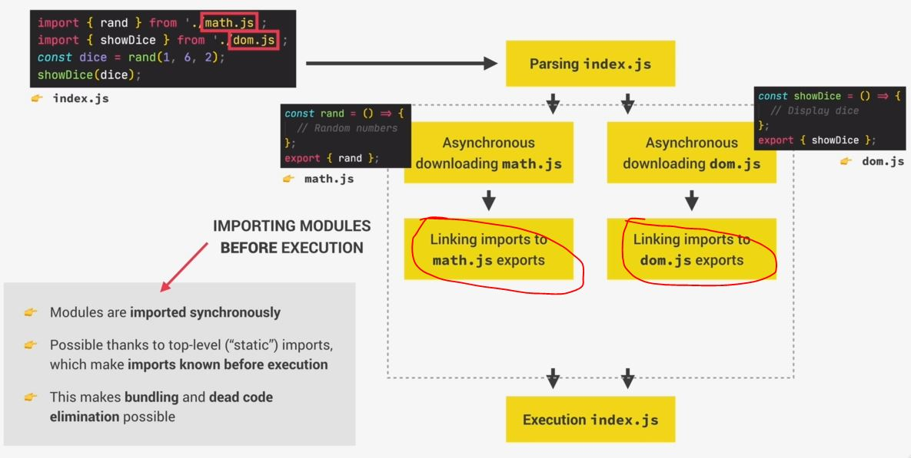
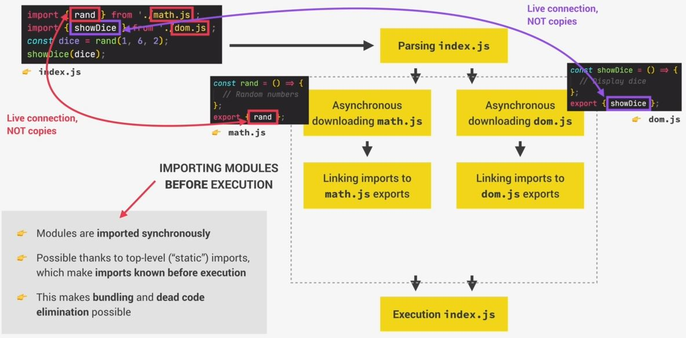
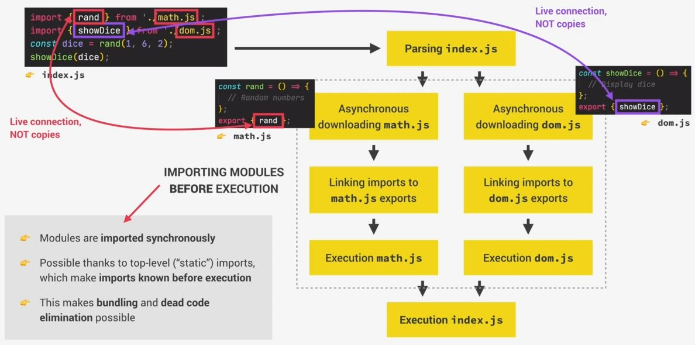

# An Overview of Modules in JavaScript

- Modules are a super important part of software development

## Overview of Modules

- it's a reusable piece of code which encapsulates implementation of details of a certain part of our project 💡💡💡 <br>
    Now it's not like a function or a class . so the difference is that it's usually a standalone file <br>
    but that doesn't mean that it always be a standalone file , but usually module is a separate file 💡💡
- so a module always contains some code , but some module can also have `import` & `export` <br>
    & whatever export from a module is called the public API . So it's just like classes <br>
    where we can also expose a public API for other codes to consume
- in modules , we also import values from "other modules" & these "other modules" from <br>
    which we import are called `dependencies` of the importing module because the code which is not working <br>
    in that "other modules" which we import in the file then can't work in that file too 💡💡💡
- & modules concept also applied in all programming language 
- & modules are a pattern . of course , we can write code without modules & actually we've been doing already <br>
    because whatever applications we build yet are very simple one . However , when a code base grows <br> 
    bigger & bigger , then modules will help out like 
    - easy to compose software means modules are like small building blocks <br>
        & we can put those modules together in a file to build complex applications
    - Eg : we can take a example of a camera like this
        
        - & this is exactly how we can compose software using modules 
        - another big advantage of this camera module i.e each of them can be developed in complete isolation <br>
            means one engineer working on the lens & another one on the screen & so on..
        - so each engineer can work on their own modules without even understanding what other engineers are doing <br>
            & also without understanding how the entire final camera works itself
        - so isolation components is huge advantage of using modules. isolation components means each module can be <br>
            developed in isolation without the developer having to think about the entire code base 💡💡💡
    - modules helps us to abstract our code means we can use module to implement low level code <br>
        then other modules which don't really care about these low level details & can import these abstractions & use them <br>
        means like screen of a camera doesn't care about the low level implementation details of the controller module <br>
        so it can simply import the controller but without knowing how it works & use it a control other parts of the camera <br>
        so this is abstraction
    - it helps to organized the code
    - it allows to reuse the same code in a project & even across multiple projects <br>
        means if we want to reuse that same code then we just have to import that module in that file 
    

## Native JS (ES6) modules

- earlier we have the module system but we need to implement manually or use external libraries <br>
    but now JS has a native built-in module system 
- so ES6 modules are modules that are actually stored in files & each file is one module <br>
    now you'll think script are also files but they're module
    - `difference b/w ES6 module VS script` : 
        - `Top-Level variables` : 
            - in ES6 modules , all top level variables are scooped to the module <br>
                means variables are private to the module by default 
            - but in script , all top level variables are always global which can leads a problem <br>
                like global namespace pollution means where multiple scripts try to declare variables <br>
                with the same name & then these variables collide . 
            - That's why private variables are the solution of this problem that's why ES6 modules implemented
        - `Default mode` : 
            - ES6 modules are always executed in strict mode 
            - but script are executed in sloppy mode by-default 
            - so with modules , there is no need to manually declare strict mode
        - `Top-level this` : 
            - in ES6 module , `this` keyword is always undefined at the top level
            - but in scripts , it points at the `window` global object
        - `imports & exports` : 
            - in ES6 module , we can import & export values b/w them by using import & export syntax <br>
                & this only happen at the top-level means outside any function or block of code <br> 
                so in practical , importing values is always the first thing that happens in a module <br>
                & all imports are hoisted 💡💡💡
            - but in scripts , it's not possible 
        - `HTML linking` :
            - to link a module to an HTML file , we need to use the script tag with `type="module"` <br>
                but to link the script file in the html file , 
        - `file downloading` : 
            - in ES6 modules , the downloading the module file themselves <br>
                this always automatically happens in an async way <br> 
                & this is true for a module loaded from HTML as well as for modules <br>
                that're loaded by importing one module into another using the import syntax
            - but in regular scripts are downloaded by-default in a blocking synchronous way <br>
                unless we define async or `defer` attribute manually on that script inside the html file



## How ES6 modules are imported behind the scene

- testing code of index.js file :
    ```js
    import { rand } from './math.js' ;
    import { showDice } from './dom.js' ;
    const dice = rand(1, 6, 2)
    showDice(dice)
    ```
    - so here we're importing a value i.e rand from the math.js module & showDice value from the dumb.js module
   
- `STEP 1` : parsing process
    - Now , as always , when a piece of code is executed the first step is to parse that code 
        - so parsing of index.js file will happen
        - but parsing means just read the code but without executing it 💡💡💡 <br>
            & this is the time in which imports are hoisted & in fact , the whole process of importing modules <br>
            happens before the code in the main module is actually executed
    - so the index.js module , imports the math & dom modules in a synchronous way <br>
        means that only after all imported modules have been downloaded & executed <br>
        the main index.js module will finally be executed as well & this is only possible <br>
        because of top level imports & exports
    - that's because if we only export & import values outside of any code which needs to be executed <br>
        then the engine can know all the imports & exports during the parsing phase <br>
        so while the code is still being read before being executed
    - now , if we were allowed to import a module inside of a function <br>
        then that function would first have to be executed before the import code happened <br>
        so in this situation , modules couldn't be imported in a synchronous way <br>
        so the importing module would have to be executed first 
    - `Ques` : you'll ask why modules are loaded in a synchronous way ? isn't synchronous bad ? 
        - because this is the easiest way in which we can do things like bundling , dead code elimination , etc
        - dead code elimination : means deleting code which is not even necessary <br>
        - & this is very important in large projects with hundreds of modules <br>
            & that includes third party modules from which we usually only want a small piece & not the entire module
        - so by knowing all dependencies b/w modules before execution , bundlers like webpack & parcel can join <br>
            multiple modules together & eliminate that code
        - so this is the reason why we can only import & export outside of any code that needs to be executed 
    

- `STEP 2` : after the parsing process , has figured our which modules it needs to import
    - then these modules are actually downloaded from the server & downloading actually happens <br>
        in a asynchronous way & it's only the importing operation itself that happens synchronously
    - then after a module arrives , it's also parsed & the modules exports are linked to the imports in index.js like this
        
    - Eg : the math module exports a function called rand & this export is then connected 
        - to the rand import in the index.js module & this connection is actually a life connection
        - so exported values are not copied to imports <br>
            instead , the import is basically just a reference to the export at value like a pointer
        - so when the value is changes in the exporting module , then the same value <br>
            also changes in the importing module 💡💡💡
        - & this is quite important to understand because it's unique to ES6 modules <br> 
            other module systems don't work like this but JS modules do 💡💡💡
    

- `STEP 3` : now the code which is inside the imported modules is executed
    - & this process of importing modules is finally finished
    - now it's time for the importing module to be finally executed as well i.e index.js like this
    
