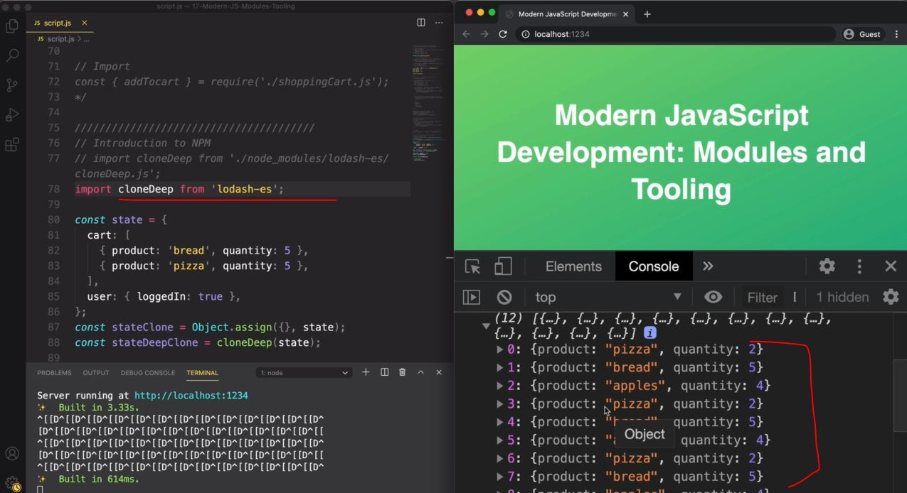
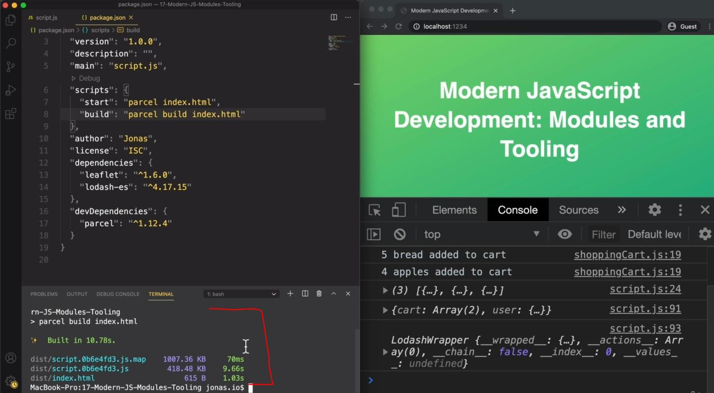

# Bundling With Parcel and NPM Scripts

- here we'll use parcel

## Steps - to use Parcel & about it

- `STEP 1` : install parcel
    ```powershell
    npm i parcel --save-dev
    ```
    - we need to install parcel as different dependencies
    - `devDependencies` is like a tool that we need to build our application <br>
        inside the package.json file we can see that two things 💡💡💡
        - `1` : dependencies
            - so inside of this whatever module/packages/libraries we installed are the regular dependencies
        - `2` : devDependencies
            - inside of it , we installed parcel

- `STEP 2` : running parcel
    - if we write this command i.e `parcel index.html` & we'll get an error <br>
        because this command doesn't work with locally installed packages & we installed parcel locally <br>
        means only inside this project . so we can install parcel as global installations
    - so to run Parcel locally for this project then we have two options 💡💡💡
        - `1` : NPX
            - it's a another build tool inside the NPM
        - `2` : or we can use NPM scripts 
    - run this command 
        ```powershell
        npx parcel index.html
        ```
        - here option that we passed for the parcel i.e index.html & index.html is a entry point 💡💡💡 <br>
            because inside index.html , we link the script.js file that we want to bundle up <br> 
            so inside of script.js file we import 3 modules .
        - so we're using parcel to build these 3 modules which we imported inside script.js file 
    - output : after running that command we'll get the new development server on that new localhost URL 
        - `difference b/w live server vs localhost of parcel` : 
            - when we run the website through live server then we'll get `127.0.0.1:8080` URL <br>
            - & when we do with parcel then we'll get `localhost:1234`
            - so this `127.0.0.1:8080` URL is the raw IP address & `localhost:1234` is a nicer name
    - if you want to stop the localhost then press `CTRL + C`

- `STEP 3` : if you're getting error while running the parcel via npx command 
    - then run the parcel via sudo command
        ```powershell
        sudo npm i parcel
        ```
    - & still this doesn't fix the error then run the parcel based on version 
        ```powershell
        npm i parcel@1.12.4
        ```
        - but before this if you installed any version before this version then might be due to this , things can break ✔️✔️✔️
    - but still this doesn't fix after installing based on version , then uninstall parcel first
        ```powershell
        npm uninstall parcel
        ```
        - then above commands 

- `Note 1` : if we get this error `ReferenceError : parcelRequire is not defined`
    - then go inside the index.html file & remove the `type="module"` from script file <br>
        because when we bundle via parcel then it'll simple creates a script <br>
        & we're actually no longer using a module but we're back to using a regular script <br>
        & this is important because modules don't work in older browsers
    - so inside index.html file , remove the type="module" from script then save the file<br>
        then now parcel we'll rebuild the application & run it properly

- `Note 2` : `now let's say what parcel did` : 
    - it create the `dist` folder which means for distribution because this folder we'll send for production <br> 
        means whatever code is inside the `dist` folder , we'll send to our final users 💡💡💡
    - & go inside the `dist` folder & inside the script file which contain main stuff <br>
        then we can see that unused code isn't removed yet which we'll do in build step <br>
        right now we're developing , so during developing step , compressing stuff is not going to be implement 💡💡💡

- `Note 3` : when we refresh the file , then we can see inside the terminal & on the browser that things will get refresh
    - However , in parcel , we can activate something even better through `hot module replacement` like this
    - inside script.js file
        ```js
        if (module.hot) module.hot.accept()
        // & this code will only parcel will understand
        // but this code will not be added inside our final bundle
            // because the browser is not going to understand
        ```
    - `hot module replacement` : 
        - means is that whenever we change one of the modules or save the file then it'll trigger a rebuild <br>
            like on terminal happened when we re-save the code
        - but then that new modified bundle will automatically like magic , get injected into the browser <br> 
            without triggering a whole page reload 💡💡💡
        - so whenever we change inside the file then that change will not reload the part of the page <br> 
            which is good for maintaining state on our page whenever we're testing out something <br>
            because like in bankist application , whenever we reloaded the page , we needed to log in again <br>
            into the application which is annoying
        - but with parcel & hot module replacement that problem we'll not face & amazing for testing the applications <br>
            because the page will not reload 💡💡💡

- `Note 4` : when we import the cloneDeep.js file inside the script.js file then we define the complete path ✅
    - that's why in all module bundlers , there's no need for specifying the entire path to any module 💡💡💡
    - so inside script.s js , we can do this 
        ```js
        import cloneDeep from 'lodash-es' // here we just define the lodash-es library
        // then parcel will automatically find the path of this module i.e lodash-es 
            // & then parcel will simply import like this as we define without manually defining path
            // & this also work with all kind of assets like html , css , sass files , 
                // images & with other modules etc 💡💡💡
                // & even with commonJS modules also
        ```

- `Note 5` : as we save the file then parcel maintain the state of code like this 
    
    - here we can see that our object keeps growing , so parcel maintain the code based on page reloads

- `Note 6` : so we saw the first way to install parcel i.e npx command ✅
    - but in practice & most of the time , we use npm command <br>
        so npm command is another way to run a locally installed packages in the command line
    - & even `npm` command also allow us to automate repetitive tasks <br>
        that's why we don't have to write npx command to run parcel everything to use it 💡💡💡
    - `STEP 1` : so inside the package.json file , 
        - remove the `test` property from scripts object
        ```json
        "scripts" : {
            "start": "parcel index.html" 
            // here start -> is a build script means by-default we gave start -> name 
                // & inside json file , property name should be in double quotes 💡💡💡
                // otherwise error come , that's why we define it inside double quotes "start"  
        }
        ```
    - `STEP 2` : inside terminal
        ```powershell
        npm run start
        ```
        - here `start` is a name of the NPM script & our server will get start 💡💡💡

- `Note 7` : when our development done ✅
    - then it's time to build the final bundle which is compressed & has dead code elimination 💡💡💡
    - so we need another parcel command
    - `STEP 1` : inside package.json file
        ```js
        "scripts" : {
            "start": "parcel index.html" ,
            "build": "parcel build index.html"
        }
        ```
    - `STEP 2` : now to run the build command then inside terminal
        ```powershell
        npm run build
        ```
    - output : parcel will take time to build & then we'll get this output 
        
        - now inside the `dist` folder , we can see the index.html , that script75da298.js, etc <br>
            things are compressed means minified & now these code we ship for the deployment & for the users 💡💡💡

- `STEP 4` : we cam install packages globally
    ```powershell
    npm i parcel -g
    ```
    - `difference b/w installing packages globally & locally` : 
        - like installing packages like parcel or live server globally <br> 
            then we can use these tools directly in the command line no matter in which director/folder we're in <br>
            without the intermediate step of an NPM script 
        - however , most of these tools actually advice developers to always install the tools locally <br>
            so that those packages can always stay on the latest version 💡💡💡
    - so don't install parcel globally but live server we can install globally
