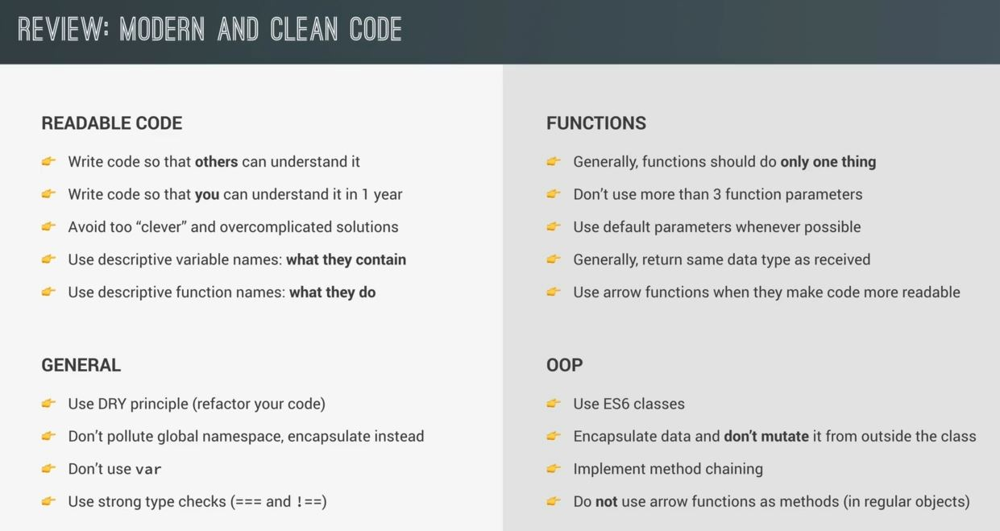
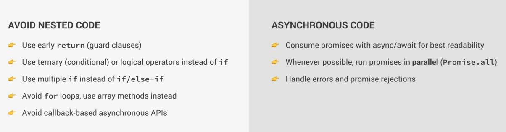

# Review - Writing Clean and Modern JavaScript

- we'll see the overview of writing clean code & modern JS & some function programming principles  
    & in next lecture we'll see topics to practice by fixing a bad coding example which doesn't follow these best practices

## Review - Modern & clean code , Best Practices 

- summary points : 
    - `Readable Code` : 
        - `1` : write code so that others as well as you can understand in the future
        - `2` : avoid too 'clever' & overcomplicated code solutions which might make you feel really smart as a developer  
            but which also might make your code very confusing & unreadable
            - so in many situations write simple & the most straightforward solutions
        - `3` : `very imp for readable code 🔥` : give functions & variables a very descriptive names
            - for variables : you should name them according to what they contain
            - for function : you should name them according to what they do 💡💡💡
            - due to this we'll make it really clear & obvious for everyone what each variable is & what each function does
    - `General Code Rules` : 
        - `1` : you should not pollute the global namespace & instead of that , always try to  
            encapsulate you data into functions or classes or modules
        - `2` : don't use `var` keyword , always use `const` if you don't want to change the variable in future   
            & use `let` variable if you want to change in the future 💡💡💡
        - `3` : always use strong type checks (=== and !==) instead of using (== and !=) which don't perform type checks
    - `functions Code Rules` : 
        - `1` : `most imp 🔥` : main rule while writing functions
            - that each function should usually only do one thing
            - but Now many times , of course , we will want to break that rule but in general it's good to keep this rule in mind 
            - so always write like small functions or helper functions which only do one thing but do it really well 💡💡💡
        - `2` : don't use more than 3 function parameters because if we see the first point  
            then if a function only does one thing then probably it doesn't need so many parameters 
        - `3` : use arrow functions when they make code more readable
            - means use middle path i.e use the more regular functions in many situations 
            - but if arrow functions make the code more readable then totally use the arrow functions
            - `use case of it` : use it as a the callback function of array methods 💡💡💡
    - `OOP Rules` : 
        - `1` : encapsulate data & don't mutate it from outside the class 
            - means while make a class then make sure that you encapsulate any data  
                which shouldn't be accessible from the outside . so that you don't mutate that data from outside the class 
            - now probably you will still need to at least manipulate some data that's in the class  
                but for this , you should implement a public API/interface inside the class  
                means a couple of methods that can manipulate that data exactly as you want that to happen  
                but that data shouldn't be directly manipulated or accessible from outside the class 
            - otherwise we're polluting the data privacy
        - `2` : Now as you implement your methods in your classes
            - then make sure that you implement chaining in all the methods where it'll actually makes sense
            - because this can make your methods way easier to use , not only for you  
                but maybe also for other developers on your team 💡💡💡
        - `3` `most Imp 🔥` : when we're working inside classes or object
            - don't use arrow functions to define methods 
            - because if we do that then you'll not get access to the `this` keyword of that object 
            - so always use normal functions for creating as methods inside the class or object  
                even if you're not using the `this` keyword 💡💡💡
    - `Nested Code Rules` : 
        - `1` : use early return (guard clauses)
            - means we should avoid nested code in anyway (means at all costs)
            - & one great way of avoiding nested code i.e use `guard clauses` 
            - guard clauses : means simply do early return in case some condition is not met 
        - `2` : use ternary (conditional) or logical operators instead of using if statement
            - because the ternary operator doesn't not create a new block of code but if statement does
        - `3` : now if you really need an if statement
            - then instead of using if else statement or multiple if else if statement
            - most of the time use multiple if statements which will make cod a lot more readable 💡💡💡
        - `4` : you should completely avoid any kind of loops
            - means any for loop like for loop & for of loop should be avoided if you want to avoid nested code 
            - & instead of that , you can use methods like a map , filter & reduce 💡💡💡
        - `5` : should avoid callback based async APIs
    - `async code rules` : 
        - `1` : always consume promises using async await for readability 
            - don't use then() & catch() methods
            - because these methods actually require callback functions  
                which will then introduce even more nested code 💡💡💡
        - `2` : whenever you can then you should run promises in parallel by using `Promise.all([])` combinator function 
            - means if you have two promises which can run at the same time without any problem  
                & these are not depend on each other 💡💡💡
            - then please run them in parallel to make the apps little bit faster for users
        - `3` : always handle errors & promise rejections 💡💡💡
