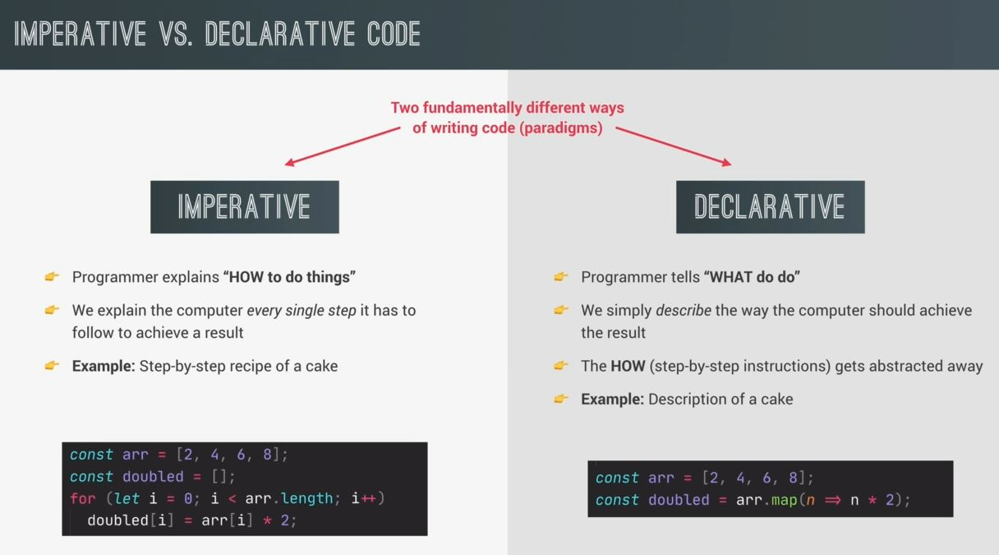
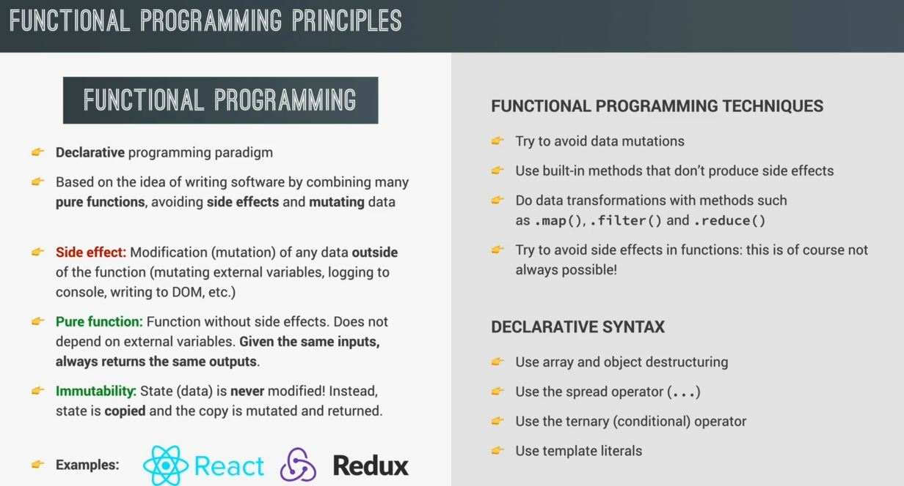

# Declarative & Functional JavaScript Principles

- here we'll see a major trend which shifted from declarative & functional JS principles

## Imperative Vs Declarative code 

- there's are two fundamentally different ways of writing code (paradigms)
    - `1` : Imperative
    - `2` : Declarative

- `Imperative` : 
    - Now whenever we write Imperative code then we need to explain the computer <br>
        how to do things in every single step it has to follow to achieve a result
    - Eg : let's say we want to create a cake then we need to tell the person ste[ by step recipe of a cake
    - Eg : code example : doubling the value
        ```js
        const arr = [2, 4, 6, 8]
        const doubled = []
        for (let i = 0; i < arr.length; i++) {
            doubled[i] = arr[i] * 2
        }
        ```
        - so here we explained the computer step by step to double the value
    - this is called imperative programming

- `Declarative` : 
    - here we tell the computer i.e only what to do , not how -> to achieve the result 
    - so here step by step instructions are abstracted
    - Eg : to make a cake , just simply describe the cake to the person 
        - & the person can come up step by step recipe own their own
    - Eg : code of doubling the value
        ```js
        const arr = [2, 4, 6, 8]
        const doubled = arr.map(n => n * 2)
        ```


- so now declarative way is a popular paradigms & due to it , functional programming introduced <br>
    so functional programming is the sub-paradigms of declarative way 💡💡💡

## functional programming principles



- summary - functional programming principles
    - functional programming is a declarative paradigm which is based on the idea of writing software <br>
        by combining many pure functions , avoiding side effects & mutating data
    - `side effect` : these functions means modification/mutation of any data which is outside of the function
        - Eg : mutating any external thing like variables or logging to the console or chaining into the DOM , etc 
            - which are outside the function is causing the side effects 
            - means any thing which is outside of the scope of the function 💡💡💡
    - `Pure function` : function without side effects
        - & these functions are not depend on any external stuff like external variables
        - which means if we give the same inputs then it'll always returns the same outputs 💡💡💡
    - `Immutability` : 
        - so functional programming is also about not mutating the data
        - means state (means data) is never modified
        - Eg : let's say we have an object to keep track of all the data 
            - so that object is a state
        - so instead of mutating that state , we just copy that state & we mutate that copied state & return <br> 
            but original `state` never changed 💡💡💡 
        - & a big advantage of Immutability : 
            - helps to keep track of all the data & how they flows through in our entire application
            - & due to that , less bug will be there & better code & more readable 💡💡💡
    - these are some major principles of functional programing but there's are lot 
    - & many popular libraries like React , Redux are actually build around all these principles <br>
        Eg : in React , state is also completely Immutability
    - `Note` : we don't need to follow & implement only one paradigm. So we use both imperative & declarative code

- suggestions - function programming techniques
    - `try to avoid data mutations` : 
        - means if possible then avoid the data mutations & of course , it's not always be possible 
        - & it's not necessary to implement 100% because this is just a suggestions
    - `use built-in methods that don't produce side effects` :
        - means use built-in methods which don't produce side effects
        - this is really important for data transformations 💡💡💡
    - built-in methods like map() , filter() , reduce()
    - `Try to avoid side effects in functions` : 
        - but this is not always be possible because in our application we need to show changes
  
- `Declarative syntax` : 
    - to write the declarative code then use modern features of JS
    - because those features will make our code more declarative syntax
