# Project Overview and Planning 1

- let's take a overview of the project
    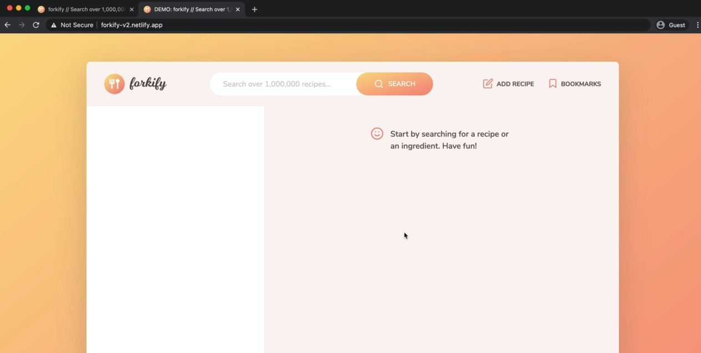

## Project overview

- this application is all about searching for recipes & display them in our UI
    - for demonstration go to this URL : https://forkify-v2.netlify.app
- `STEP 1` : when we search for like the pizza , then we'll get all the pizza on left sidebar
    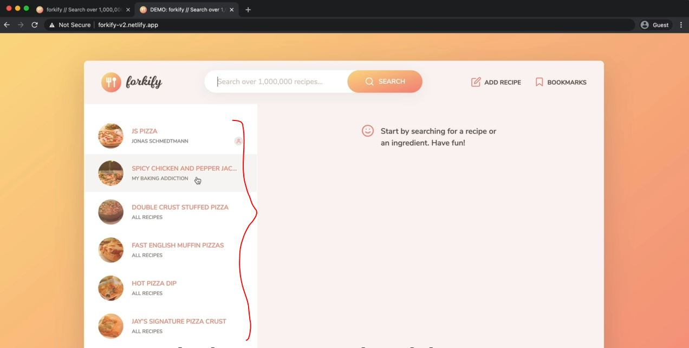
    - & if we have more than 10 results then we'll divided up on multiple pages via pagination like this 
    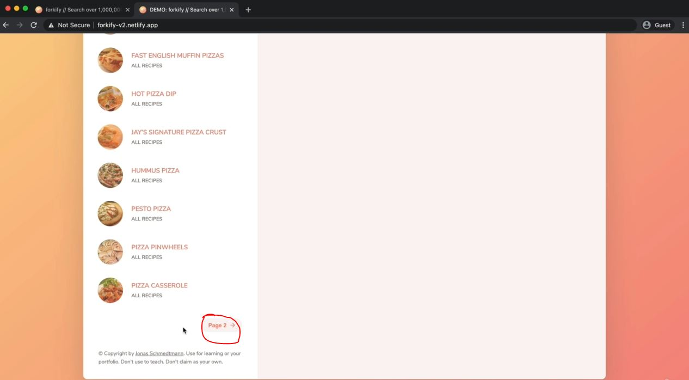
- `STEP 2` : when we click one of the pizza or food then it'll be displayed on right sidebar like this
    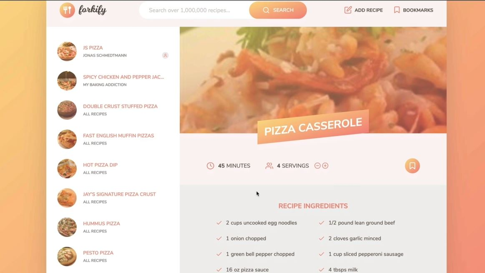
    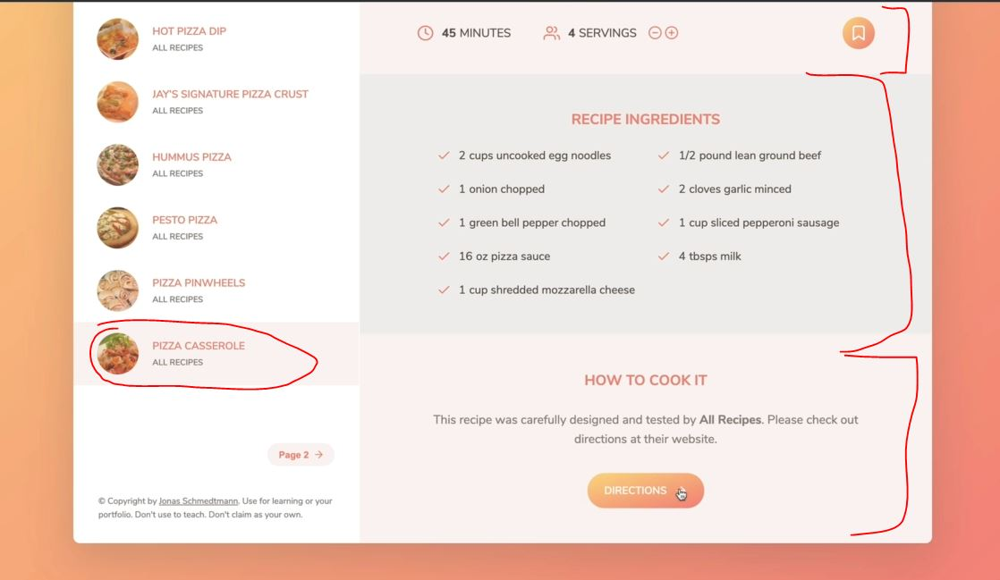
    - & that pizza also keep highlighted which we clicked on
    - there we have cooking time & servings , all the ingredients & direction for how to cook it   
        means from where that recipe comes from 
    - `STEP 2.1` : with `servings` we can increase or decrease the number of servings like this
        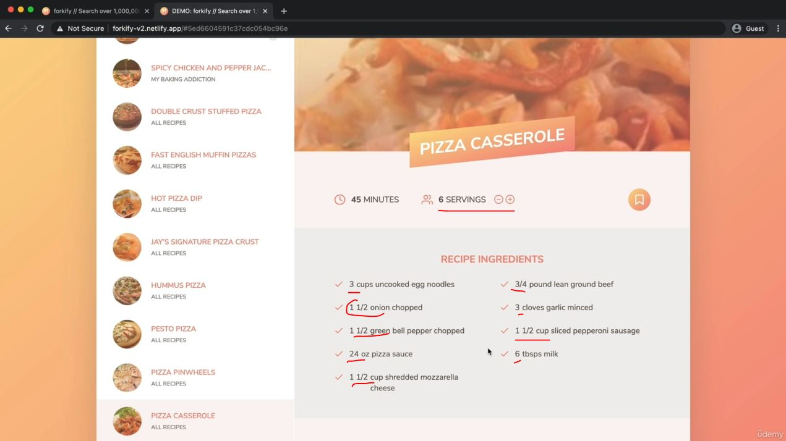
        - & here inside the ingredients page section , also gets updated according to number of servings
    - `STEP 2.2` : now we can bookmark the recipe , so when we click on the bookmark button 
        - then it'll converted like this 
        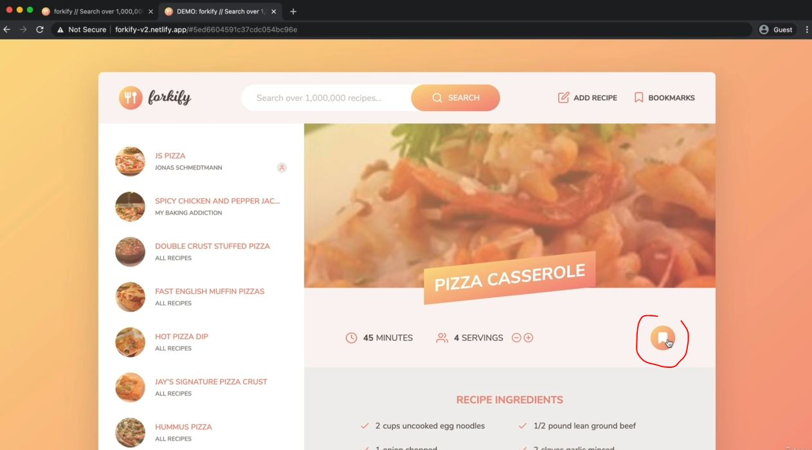
        - then when we hover on the bookmarks section then only those recipes will be shown which are bookmarked
        - & when we click on that bookmarked recipe then , it'll be shown on right sidebar
        - & we can un-bookmark it , then it'll also removed from the bookmarks section also
        - & when bookmarks section gets empty , then we'll get the message inside of it 
- `STEP 3` : we can add recipe also
    - when we click on `add recipe` button then we'll get this form modal like this  
        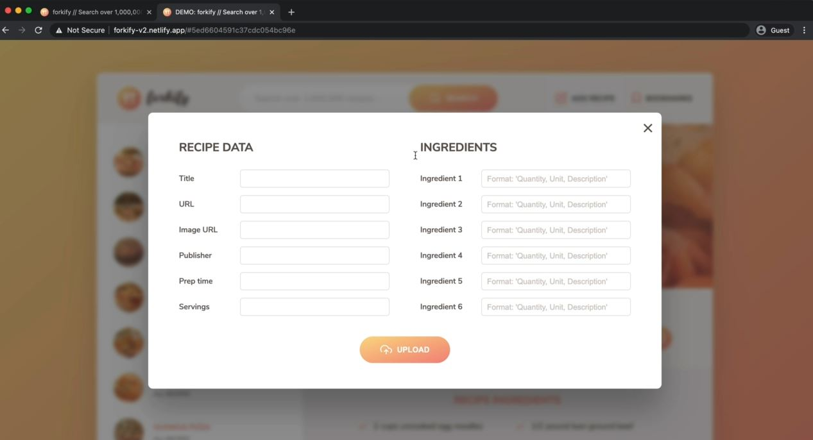
    - after filling the form of adding recipe then it'll be only visible to yourself like this 
        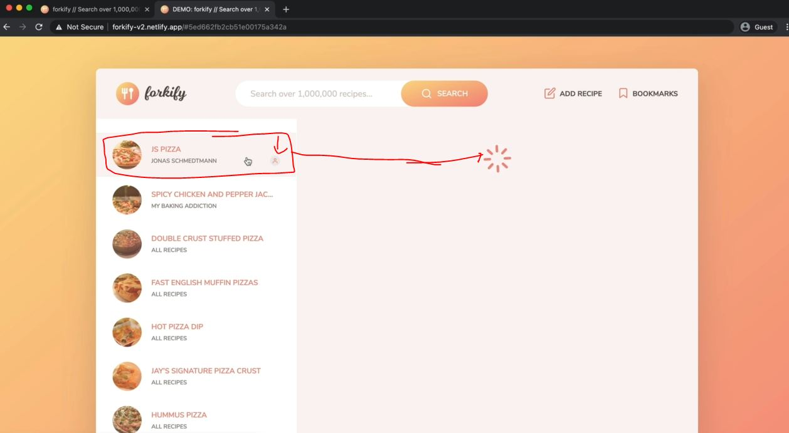
    - so when we click our own recipe then loading spinner will come for a few seconds  
        & after some time it'll be shown on right sidebar like this 
        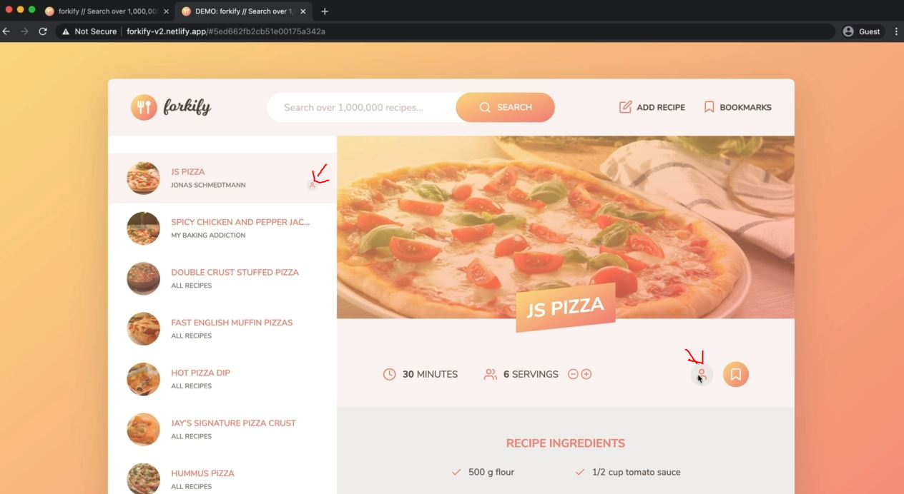
    - so we can see the person icon on the left sidebar & right sidebar also which means it was created by the user itself
    - now the recipe which we created by the user itself that will also appear when do search  
        because the version has like a fixed developer API key so each recipe is associated to a certain developer key

## project Planning

- & we'll talk about user stories , features , flow chart , but we'll see architecture later on 

- `overview of the project planning` : 
    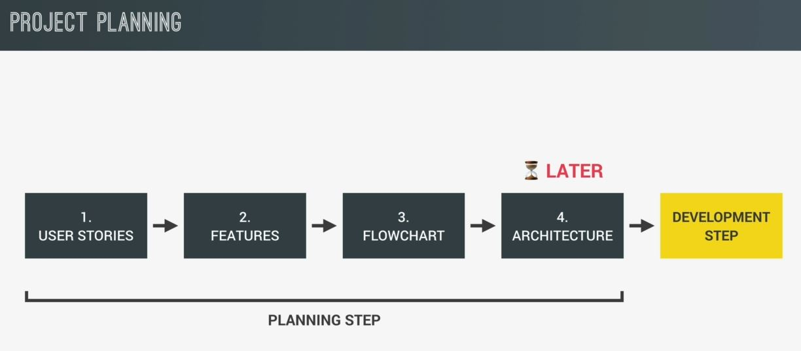

- `STEP 1 - user stories` : 
    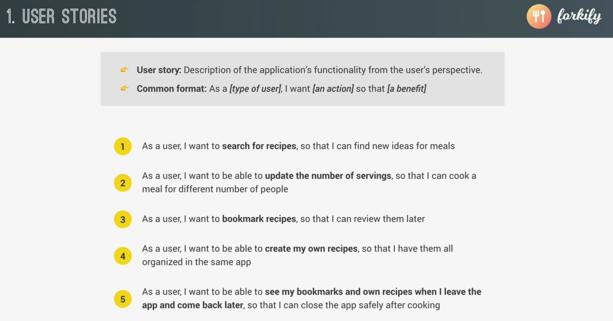
    - user stories is a starting point & we as a developer need to think about what user gonna do with that application
    - now we'll use these user stories for next step i.e features

- `STEP 2 - features` : 
    - so each of the user stories need bunch of steps in order to make it work
    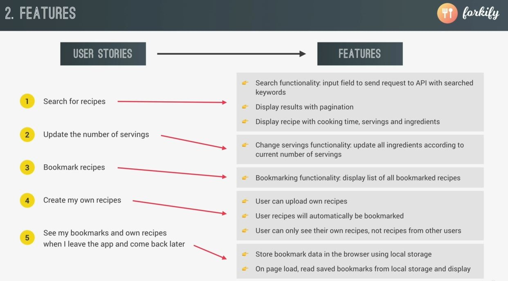
    - here inside `create my own recipes` , user can only see their own recipes , can't see recipes for other users  
        so we can implement this feature in a complex way like creating user's account  
        but we'll keep it simple by just associate uploaded recipes to an API key
    - now take this unstructured features & put it into a structured flow chart   
        which will tell how the application is going to work

- `STEP 3 - flow chart (PART 1)` :
    - we'll build the flow chart on just these 3 features right now  
        & again we'll focus on an events because it's a starting point of our flow chart like this
        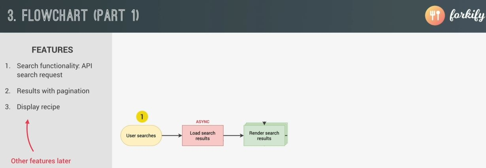
    - so first event listener should be the user searching for a recipe which is feature 1 
    - so when a user searches for a certain recipe then we need to asynchronously load the search results from our API
    - then once the results are in , then just render them in our application  
        however , we'll not render all the search results right away because that would be overwhelming  
        that's why also render some pagination buttons in order to hide part of the search results on different pages like this
        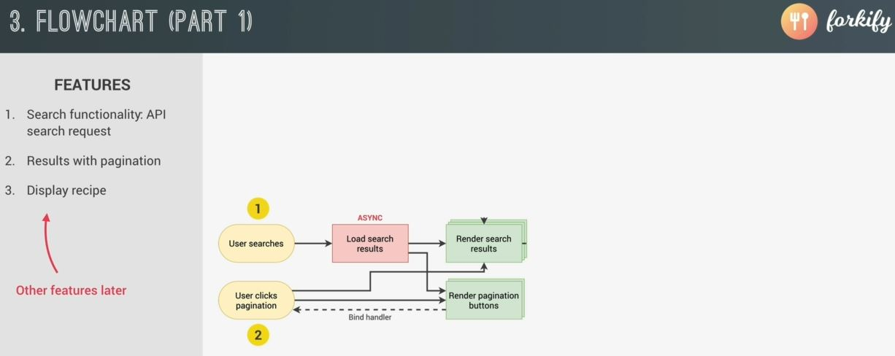
    - & then as a user clicks one of the pagination buttons then render the further stuff related to that search results  
        & also render the new pagination buttons 
        - Eg : when we're on page two then there'll be a button to go back to page one & a button to go to page 3  
            but when we're on page 3 then show the button to go back will point to page 2 & the button to go forward  
            which will point to page 4
        - so we need to re-render these buttons for every time that user clicks on one of them 
    - now we also need a logic to display the recipe 
        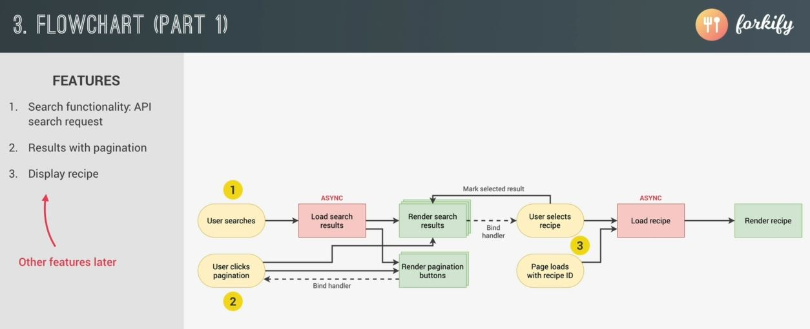
        - so when the user selects a recipe then we need to asynchronously load all the recipe data from the API  
            & then once the data arrived , we'll render the recipe on the UI  
            & we'll do same whenever the page loads with a recipe ID in the URL  
            means whenever we click on a recipe then the URL will change with the recipe ID 
        - Eg : if we take that URL & copy & paste it inside another browser then the recipe corresponding to that ID  
            should also load immediately
        - that's why in the flowchart , we have the load recipe on both events  
            so when the user selects a recipe from the UI or also when the page loads with a recipe ID  
            then the ID will be already in the URL
        
- this is Part 1 - flow chart 
    - these are all core features 
    - so the most important features of the application i.e searching for recipes & rendering search results   
        & also rendering the individual recipe that was selected

- we'll start implementing the project, only with the recipe displaying i.e feature number 3 on this flow chart part 1  
    now this will start implementing some functionality 

- `Mindset TIP` : don't worry about architecture right now , just start with this flow chart Part - 1 
    - don't wait for perfection & don't chase the perfection , just focus on process & perfection will come automatically
