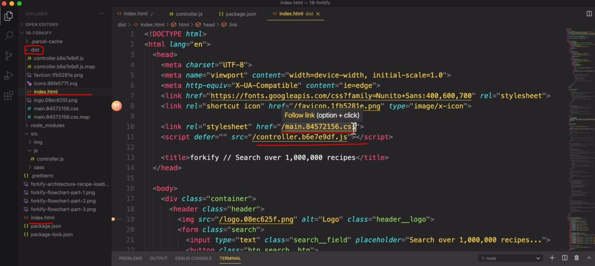
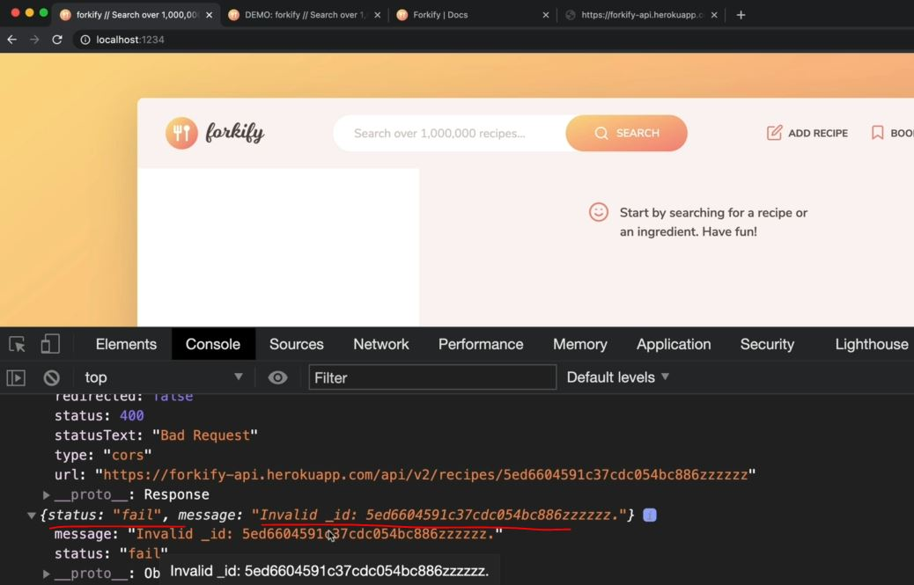

# Loading a Recipe from API

- we'll setup our project & start to load some recipe data from the forkify API
    - sass - css preprocessor makes code a lot easier for large scale application <br> 
        but browsers don't understand sass syntax , so it must be converted into css & parcel will do for us 

## Steps - run the project via parcel

- `STEP 1` : initialize the project iva `npm init` command
    - this will create a package.json file <br>
        give project name as forkify , version as 1 <br>
        description as recipe application , author as jonas
    - `STEP 1.1` : inside package.json
        - after creating the package.json , so then come inside of it <br>
            a change the "main" as "index.html" -> this is kinda entry point but it's not important
        - inside `"scripts"` object , we'll setup npm scripts 💡💡💡 <br>
            ```json
            "scripts": {
                "start": "parcel index.html", 
                    // nom sometimes , in projects , we don't even have an html 
                    // so in that situation , entry point can also be a JS file 💡💡💡

                "build": "parcel build index.html"
            }
            ```

- `STEP 2` : installing latest version of parcel i.e `npm i parcel@2`
    - which `2` means version 2
    - but to install latest version then install it as `npm i parcel@next -D` <br>
        here `-D` means install it as devDependencies 💡💡💡
    - if we get error while installing then specify the version like `npm i parcel@2 -D`

- `STEP 3` : then start the parcel
    - so run this command `npm run start` but `start` npm script is a special one in npm <br>
        that's why we don't need `run` word . so we can execute like this `npm start` without `run` word 💡💡💡
    - now if we get the error then install the sass , so sass module will be installed by the parcel , <br>
        so we just need to restart the parcel , so stop the parcel iva `CTRL + C`
    - then run `npm install` & then all the modules whether it's inside dependencies or devDependencies <br>
        including sass will be installed 💡💡💡
    - if you get the error while installing sass then install it with specifying the version
    - then do `npm start` then `dist` (means distribution) folder will be created <br>
        which contain actual code including real css file , complied files , etc for production 💡💡💡
    - inside actual index.html file , we linked the main.scss file & controller.js file <br>
        but inside the parcel , there's something else index.html & <br> 
        due to this parcel will able to now that it needs to compile main.scss file & controller.js file to css <br>
        & replace those links with the actual final css file like this 
        
    - & same thing will happen for all the images 💡💡💡

- `Note ✅` : right now `dist` folder is not important 
    - because in development stage we work on our actual file 
    - so parcel takes our actual or a raw source code  & complies them into that package/folder/module i.e `dist` 💡💡💡 <br>
        which is ready to ship to browsers 

## Steps - loading a recipe from API

- `STEP 1` : inside our controller.js file 
    - just write `console.log("TEST")` to check our parcel is working
    - now let's make our first API call <br>
        now for this project , we have our own custom API because we don't want to dependent on any 3rd party services <br>
        & api is on this URL : `https://forkify-api.herokuapp.com/v2`
    - so go to this API & read the docs <br>
        & we can just do 100 API request per hour in order not to overload our serves & at the bottom of the docs , <br>
        we'll see the URL i.e `https://forkify-api.herokuapp.com/api/v2/recipes/5ed6604591c37cdc054bc886`

- `STEP 2` : inside our controller.js file , doing API request
    ```js
    // due to this async function we're not blocking our main thread of execution 
        // because this async function will run in the background 💡💡💡
    const showRecipe = async function() {
        try {
            // res -> variable name we gave instead of anything else 
                // because fore response , res -> variable name is a standard name 💡💡💡 
            const res = await fetch('https://forkify-api.herokuapp.com/api/v2/recipes/5ed6604591c37cdc054bc886')

            // converting the response into json 
                // we used json() on the res variable because res -> variable contain an object
                // which will again return another promise
                // & promise is actually run asynchronously that's why , again we used await -> keyword
            const data = res.json()

            console.log(res , data)
                    
        }catch(err) {
            alert(err)
        }
    }

    showRecipe()
    ```
    - output : we'll get response object & the data object with status as success
    - if we go wrong response like this 
        ```js
        // due to this async function we're not blocking our main thread of execution 
            // because this async function will run in the background 💡💡💡
        const showRecipe = async function() {
            try {
                // res -> variable name we gave instead of anything else 
                    // because fore response , res -> variable name is a standard name 💡💡💡 
                const res = await fetch('https://forkify-api.herokuapp.com/api/v2/recipes/5ed6604591c37cdc054bc886zzz')

                // converting the response into json 
                    // we used json() on the res variable because res -> variable contain an object
                    // which will again return another promise
                    // & promise is actually run asynchronously that's why , again we used await -> keyword
                const data = res.json()

                console.log(res , data)
                        
            }catch(err) {
                alert(err)
            }
        }

        showRecipe()
        ```
        - output : we'll get 400 (bad request) & we'll get response object
            - inside of the response object , `ok` property will be false
            - & `ok` property is important because we'll able to know that some error occurred in fetch <br>
                so we'll able to create our own errors 💡💡💡
            - & we'll get this response like this
                
            - so API itself also return the nice error message which is great if you're backend dev & creating an API <br>
                which will be great for front-end developers for clear understanding 💡💡💡

- `STEP 3` : catching errors 
    ```js
    const showRecipe = async function() {
        try {
            const res = await fetch('https://forkify-api.herokuapp.com/api/v2/recipes/5ed6604591c37cdc054bc886zzz')

            const data = res.json()

            if (!res.ok) {
                throw new Error(`${data.message} (${res.status})`) 
                    // using message property which is coming from the data means from the response of the server
                    // but ok -> property is a property of response object 💡💡💡
            }

            console.log(res , data)
                    
        }catch(err) {
            alert(err)
        }
    }

    showRecipe()
    ```
    - output : we'll get alert() 

- `STEP 4` : formatting the data a little bit nicer
    - means we want to create a new object based on that data object which we're getting i.e `{status: "success", data: {...}}` 
    - so when we open this object then inside the recipe object , we can see `cooking_time` , etc <br> 
        properties which are with underscore & so variables which are with underscore are unusual in JS <br> 
        so most of the time , we need to reformat that variable by using the underscore 💡💡💡
    ```js
    const showRecipe = async function() {
        try {
            const res = await fetch('https://forkify-api.herokuapp.com/api/v2/recipes/5ed6604591c37cdc054bc886zzz')

            const data = res.json()

            if (!res.ok) throw new Error(`${data.message} (${res.status})`) 

            let { recipe } = data.data 
                // using object destructuring 
            
            recipe = {
                id:  recipe.id , 
                title: recipe.title, 
                publisher: recipe.publisher,
                sourceUrl: recipe.source_url , // this property with underscore we reformated as sourceUrl
                image: recipe.image_url, 
                servings: recipe.servings, 
                cookingTime: recipe.cooking_time , // this property with underscore we reformated as sourceUrl 💡💡💡
                ingredients: recipe.ingredients
            }

            console.log(recipe) // output : we'll get the recipe object with formatted properties
                // & this recipe object will work for other recipes also
        }catch(err) {
            alert(err)
        }
    }

    showRecipe()
    ```
    - now got the docs & get some other ID 
    - so inside the docs , this path i.e `https://forkify-api.herokuapp.com/api/v2/recipes` will give all the recipes <br>
        & this is the URL `https://forkify-api.herokuapp.com/api/v2/recipes?search=pizza&key=<insert your key>` <br>
        which can be used to pass parameters
    - when open this parameter URL then see the address bar we'll get this url <br>
        `https://forkify-api.herokuapp.com/api/v2/recipes?search=pizza` 
        - here this is query search `?search=pizza` & this is common format of sending variables over your URLs 
        - so `search` is like a variable & `pizza` is the value 💡💡💡
    - now take any id , 

- `STEP 5` : taking an id from `https://forkify-api.herokuapp.com/api/v2/recipes?search=pizza`
    ```js
    const showRecipe = async function() {
        try {
            const res = await fetch('https://forkify-api.herokuapp.com/api/v2/recipes/5ed6604591c37cdc054bcc40')
            // const res = await fetch('https://forkify-api.herokuapp.com/api/v2/recipes/5ed6604591c37cdc054bc886zzz')

            const data = res.json()

            if (!res.ok) throw new Error(`${data.message} (${res.status})`) 

            let { recipe } = data.data 
                // using object destructuring 
            
            recipe = {
                id:  recipe.id , 
                title: recipe.title, 
                publisher: recipe.publisher,
                sourceUrl: recipe.source_url ,l
                image: recipe.image_url, 
                servings: recipe.servings, 
                cookingTime: recipe.cooking_time ,
                ingredients: recipe.ingredients
            }

            console.log(recipe) // output : now we'll get the different recipe

        }catch(err) {
            alert(err)
        }
    }

    showRecipe()
    ```
