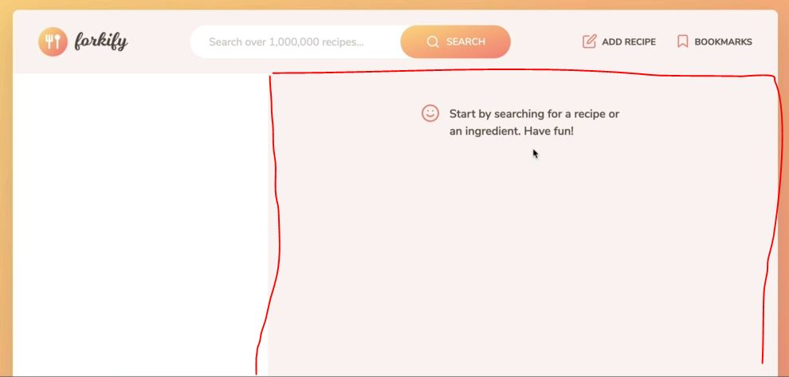
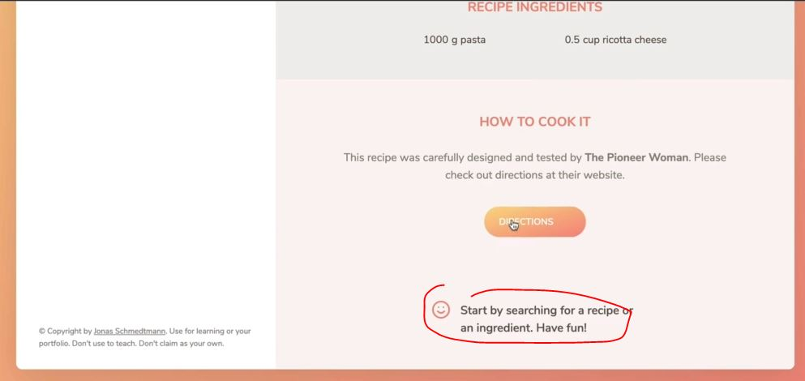
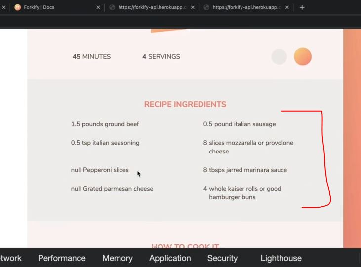
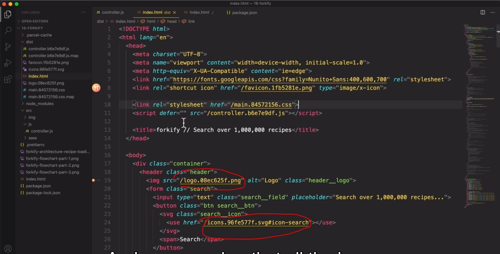
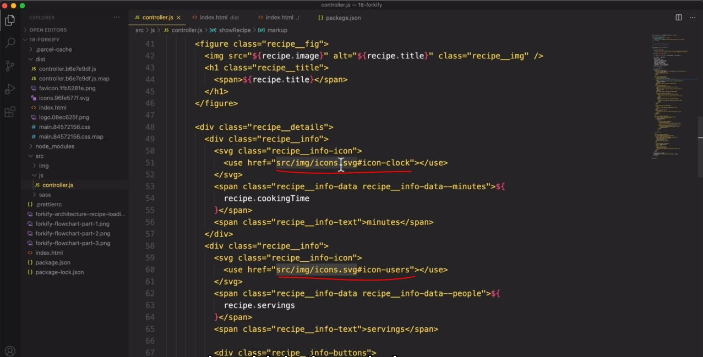

# Rendering the Recipe

- now after loading/getting the data from our API then now let's render that data in our app

## Steps - rendering the recipe

- inside index.html file , we have `recipe` class which is a gray section of our app i.e 
    

- `STEP 1` : inside index.html file , copy this html code 
    ```html
    <figure class="recipe__fig">
        
        <h1 class="recipe__title">
          <span>Pasta with tomato cream sauce</span>
        </h1>
    </figure>

    <div class="recipe__details">
        <div class="recipe__info">
            <svg class="recipe__info-icon"><use href="src/img/icons.svg#icon-clock"></use></svg>
            <span class="recipe__info-data recipe__info-data--minutes">45</span>
            <span class="recipe__info-text">minutes</span>
        </div>
        <div class="recipe__info">
            <svg class="recipe__info-icon"><use href="src/img/icons.svg#icon"></use></svg>
            <span class="recipe__info-data recipe__info-data--people">4</span>
            <span class="recipe__info-text">servings</span>

            <div class="recipe__info-buttons">
                <button class="btn--tiny btn--increase-servings">
                  <svg><use href="src/img/icons.svg#icon-minus-circle"></use></svg>
                </button>
                <button class="btn--tiny btn--increase-servings">
                  <svg><use href="src/img/icons.svg#icon-plus-circle"></use></svg>
                </button>
            </div>
        </div>

        <div class="recipe__user-generated">
            <svg><use href="src/img/icons.svg#icon-user"></use></svg>
        </div>
        <button class="btn--round">
            <svg class=""><use href="src/img/icons.svg#icon-bookmark-fill"></use></svg>
        </button>
    </div>

    <div class="recipe__ingredients">
        <h2 class="heading--2">Recipe ingredients</h2>
        <ul class="recipe__ingredient-list">
            <li class="recipe__ingredient">
                <svg class="recipe__icon"><use href="src/img/icons.svg#icon-check"></use></svg>
                <div class="recipe__quantity">1000</div>
                <div class="recipe__description"><span class="recipe__unit">g</span>pasta</div>
            </li>

            <li class="recipe__ingredient">
                <svg class="recipe__icon"><use href="src/img/icons.svg#icon-check"></use></svg>
                <div class="recipe__quantity">0.5</div>
                <div class="recipe__description"><span class="recipe__unit">cup</span>ricotta cheese</div>
            </li>
        </ul>
    </div>

    <div class="recipe__directions">
        <h2 class="heading--2">How to cook it</h2>
        <p class="recipe__directions-text">
            This recipe was carefully designed and tested by
            <span class="recipe__publisher">The Pioneer Woman</span>. Please check out
            directions at their website.
        </p>
        <a class="btn--small recipe__btn"
          href="http://thepioneerwoman.com/cooking/pasta-with-tomato-cream-sauce/"
          target="_blank">
        <span>Directions</span>
        <svg class="search__icon"><use href="src/img/icons.svg#icon-arrow-right"></use></svg>
      </a>
    </div>
    ```

- `STEP 2` : inside controller.js file 
    ```js
    const recipeContainer = document.querySelector('.recipe')

    const timeout = function (s) => {
        return new Promise(function (_, reject) {
            setTimeout(function() {
                reject(new Error(`Request took too long! Timeout after ${s} second`))
            }, s * 1000)
        })
    }

    const showRecipe = async function() {
        try {
            // 1 - Loading recipe
            const res = await fetch('https://forkify-api.herokuapp.com/api/v2/recipes/5ed6604591c37cdc054bcc40')
            // const res = await fetch('https://forkify-api.herokuapp.com/api/v2/recipes/5ed6604591c37cdc054bc886zzz')

            const data = res.json()

            if (!res.ok) throw new Error(`${data.message} (${res.status})`) 

            let { recipe } = data.data 
                // using object destructuring 
            
            recipe = {
                id:  recipe.id , 
                title: recipe.title, 
                publisher: recipe.publisher,
                sourceUrl: recipe.source_url ,l
                image: recipe.image_url, 
                servings: recipe.servings, 
                cookingTime: recipe.cooking_time ,
                ingredients: recipe.ingredients
            }

            console.log(recipe) // output : now we'll get the different recipe

            // currently you'll think that we're putting things inside this single function & making big
                // but once we start thinking about the architecture

            // 2 - Rendering recipe
            const markup = `
                <figure class="recipe__fig">
                    
                    <h1 class="recipe__title">
                      <span>Pasta with tomato cream sauce</span>
                    </h1>
                </figure>

                <div class="recipe__details">
                    <div class="recipe__info">
                        <svg class="recipe__info-icon"><use href="src/img/icons.svg#icon-clock"></use></svg>
                        <span class="recipe__info-data recipe__info-data--minutes">45</span>
                        <span class="recipe__info-text">minutes</span>
                    </div>
                    <div class="recipe__info">
                        <svg class="recipe__info-icon"><use href="src/img/icons.svg#icon"></use></svg>
                        <span class="recipe__info-data recipe__info-data--people">4</span>
                        <span class="recipe__info-text">servings</span>

                        <div class="recipe__info-buttons">
                            <button class="btn--tiny btn--increase-servings">
                              <svg><use href="src/img/icons.svg#icon-minus-circle"></use></svg>
                            </button>
                            <button class="btn--tiny btn--increase-servings">
                              <svg><use href="src/img/icons.svg#icon-plus-circle"></use></svg>
                            </button>
                        </div>
                    </div>

                    <div class="recipe__user-generated">
                        <svg><use href="src/img/icons.svg#icon-user"></use></svg>
                    </div>
                    <button class="btn--round">
                        <svg class=""><use href="src/img/icons.svg#icon-bookmark-fill"></use></svg>
                    </button>
                </div>

                <div class="recipe__ingredients">
                    <h2 class="heading--2">Recipe ingredients</h2>
                    <ul class="recipe__ingredient-list">
                        <li class="recipe__ingredient">
                            <svg class="recipe__icon"><use href="src/img/icons.svg#icon-check"></use></svg>
                            <div class="recipe__quantity">1000</div>
                            <div class="recipe__description"><span class="recipe__unit">g</span>pasta</div>
                        </li>

                        <li class="recipe__ingredient">
                            <svg class="recipe__icon"><use href="src/img/icons.svg#icon-check"></use></svg>
                            <div class="recipe__quantity">0.5</div>
                            <div class="recipe__description"><span class="recipe__unit">cup</span>ricotta cheese</div>
                        </li>
                    </ul>
                </div>

                <div class="recipe__directions">
                    <h2 class="heading--2">How to cook it</h2>
                    <p class="recipe__directions-text">
                        This recipe was carefully designed and tested by
                        <span class="recipe__publisher">The Pioneer Woman</span>. Please check out
                        directions at their website.
                    </p>
                    <a class="btn--small recipe__btn"
                      href="http://thepioneerwoman.com/cooking/pasta-with-tomato-cream-sauce/"
                      target="_blank">
                    <span>Directions</span>
                    <svg class="search__icon"><use href="src/img/icons.svg#icon-arrow-right"></use></svg>
                  </a>
                </div>
            `

        }catch(err) {
            alert(err)
        }
    }

    showRecipe()
    ```

- `STEP 3` : inside controller.js file , now replace things inside the html code , based on what we need
    ```js
    // put code before this , from STEP 2

    const showRecipe = async function() {
        try {
            // 1 - Loading recipe
            const res = await fetch('https://forkify-api.herokuapp.com/api/v2/recipes/5ed6604591c37cdc054bcc40')

            const data = res.json()

            if (!res.ok) throw new Error(`${data.message} (${res.status})`) 

            let { recipe } = data.data 
            
            recipe = {
                id:  recipe.id , 
                title: recipe.title, 
                publisher: recipe.publisher,
                sourceUrl: recipe.source_url ,l
                image: recipe.image_url, 
                servings: recipe.servings, 
                cookingTime: recipe.cooking_time ,
                ingredients: recipe.ingredients
            }

            console.log(recipe) 

            // 2 - Rendering recipe
            const markup = `
                <figure class="recipe__fig">
                    
                    <h1 class="recipe__title">
                      <span>${recipe.title}</span>
                    </h1>
                </figure>

                <div class="recipe__details">
                    <div class="recipe__info">
                        <svg class="recipe__info-icon"><use href="src/img/icons.svg#icon-clock"></use></svg>
                        <span class="recipe__info-data recipe__info-data--minutes">${recipe.cookingTime}</span>
                        <span class="recipe__info-text">minutes</span>
                    </div>
                    <div class="recipe__info">
                        <svg class="recipe__info-icon"><use href="src/img/icons.svg#icon"></use></svg>
                        <span class="recipe__info-data recipe__info-data--people">${recipe.servings}</span>
                        <span class="recipe__info-text">servings</span>

                        <div class="recipe__info-buttons">
                            <button class="btn--tiny btn--increase-servings">
                              <svg><use href="src/img/icons.svg#icon-minus-circle"></use></svg>
                            </button>
                            <button class="btn--tiny btn--increase-servings">
                              <svg><use href="src/img/icons.svg#icon-plus-circle"></use></svg>
                            </button>
                        </div>
                    </div>

                    <div class="recipe__user-generated">
                        <svg><use href="src/img/icons.svg#icon-user"></use></svg>
                    </div>
                    <button class="btn--round">
                        <svg class=""><use href="src/img/icons.svg#icon-bookmark-fill"></use></svg>
                    </button>
                </div>

                <div class="recipe__ingredients">
                    <h2 class="heading--2">Recipe ingredients</h2>
                    <ul class="recipe__ingredient-list">
                        <li class="recipe__ingredient">
                            <svg class="recipe__icon"><use href="src/img/icons.svg#icon-check"></use></svg>
                            <div class="recipe__quantity">1000</div>
                            <div class="recipe__description"><span class="recipe__unit">g</span>pasta</div>
                        </li>

                        <li class="recipe__ingredient">
                            <svg class="recipe__icon"><use href="src/img/icons.svg#icon-check"></use></svg>
                            <div class="recipe__quantity">0.5</div>
                            <div class="recipe__description"><span class="recipe__unit">cup</span>ricotta cheese</div>
                        </li>
                    </ul>
                </div>

                <div class="recipe__directions">
                    <h2 class="heading--2">How to cook it</h2>
                    <p class="recipe__directions-text">
                        This recipe was carefully designed and tested by
                        <span class="recipe__publisher">${recipe.publisher}</span>. Please check out
                        directions at their website.
                    </p>
                    <a class="btn--small recipe__btn"
                      href="${recipe.sourceUrl}"
                      target="_blank">
                    <span>Directions</span>
                    <svg class="search__icon"><use href="src/img/icons.svg#icon-arrow-right"></use></svg>
                  </a>
                </div>
            `

        }catch(err) {
            alert(err)
        }
    }

    showRecipe()
    ```
    - `STEP 3.1` : inside controller.js file , add this html code inside the parent element i.e recipe
        ```js
        // put code before this , from STEP 2

        const showRecipe = async function() {
            try {
                // 1 - Loading recipe
                const res = await fetch('https://forkify-api.herokuapp.com/api/v2/recipes/5ed6604591c37cdc054bcc40')

                const data = res.json()

                if (!res.ok) throw new Error(`${data.message} (${res.status})`) 

                let { recipe } = data.data 
                
                recipe = {
                    id:  recipe.id , 
                    title: recipe.title, 
                    publisher: recipe.publisher,
                    sourceUrl: recipe.source_url ,l
                    image: recipe.image_url, 
                    servings: recipe.servings, 
                    cookingTime: recipe.cooking_time ,
                    ingredients: recipe.ingredients
                }

                console.log(recipe) 

                // 2 - Rendering recipe
                const markup = `
                    <figure class="recipe__fig">
                        
                        <h1 class="recipe__title">
                          <span>${recipe.title}</span>
                        </h1>
                    </figure>

                    <div class="recipe__details">
                        <div class="recipe__info">
                            <svg class="recipe__info-icon"><use href="src/img/icons.svg#icon-clock"></use></svg>
                            <span class="recipe__info-data recipe__info-data--minutes">${recipe.cookingTime}</span>
                            <span class="recipe__info-text">minutes</span>
                        </div>
                        <div class="recipe__info">
                            <svg class="recipe__info-icon"><use href="src/img/icons.svg#icon"></use></svg>
                            <span class="recipe__info-data recipe__info-data--people">${recipe.servings}</span>
                            <span class="recipe__info-text">servings</span>

                            <div class="recipe__info-buttons">
                                <button class="btn--tiny btn--increase-servings">
                                  <svg><use href="src/img/icons.svg#icon-minus-circle"></use></svg>
                                </button>
                                <button class="btn--tiny btn--increase-servings">
                                  <svg><use href="src/img/icons.svg#icon-plus-circle"></use></svg>
                                </button>
                            </div>
                        </div>

                        <div class="recipe__user-generated">
                            <svg><use href="src/img/icons.svg#icon-user"></use></svg>
                        </div>
                        <button class="btn--round">
                            <svg class=""><use href="src/img/icons.svg#icon-bookmark-fill"></use></svg>
                        </button>
                    </div>

                    <div class="recipe__ingredients">
                        <h2 class="heading--2">Recipe ingredients</h2>
                        <ul class="recipe__ingredient-list">
                            <li class="recipe__ingredient">
                                <svg class="recipe__icon"><use href="src/img/icons.svg#icon-check"></use></svg>
                                <div class="recipe__quantity">1000</div>
                                <div class="recipe__description"><span class="recipe__unit">g</span>pasta</div>
                            </li>

                            <li class="recipe__ingredient">
                                <svg class="recipe__icon"><use href="src/img/icons.svg#icon-check"></use></svg>
                                <div class="recipe__quantity">0.5</div>
                                <div class="recipe__description"><span class="recipe__unit">cup</span>ricotta cheese</div>
                            </li>
                        </ul>
                    </div>

                    <div class="recipe__directions">
                        <h2 class="heading--2">How to cook it</h2>
                        <p class="recipe__directions-text">
                            This recipe was carefully designed and tested by
                            <span class="recipe__publisher">${recipe.publisher}</span>. Please check out
                            directions at their website.
                        </p>
                        <a class="btn--small recipe__btn"
                          href="${recipe.sourceUrl}"
                          target="_blank">
                        <span>Directions</span>
                        <svg class="search__icon"><use href="src/img/icons.svg#icon-arrow-right"></use></svg>
                      </a>
                    </div>
                `

                recipeContainer.insertAdjacentHTML('afterbegin', markup)

            }catch(err) {
                alert(err)
            }
        }

        showRecipe()
        ```
        - output : we'll get the output
            
            - but we're still getting this message like this
            - & we're missing the icons & recipe ingredients are old one
        - so we have 3 problems 
            - 1 : messaging is coming
            - 2 : recipe ingredients coming
            - 3 : no icons coming
        - so this is the way we need to tackle the problem & specify the problems 💡💡💡

- `STEP 4` : inside controller.js file , 
    - `1` : removing the message which is coming 
        ```js
        // put code before this , from STEP 2

        const showRecipe = async function() {
            try {
                // 1 - Loading recipe
                const res = await fetch('https://forkify-api.herokuapp.com/api/v2/recipes/5ed6604591c37cdc054bcc40')

                const data = res.json()

                if (!res.ok) throw new Error(`${data.message} (${res.status})`) 

                let { recipe } = data.data 
                
                recipe = {
                    id:  recipe.id , 
                    title: recipe.title, 
                    publisher: recipe.publisher,
                    sourceUrl: recipe.source_url ,l
                    image: recipe.image_url, 
                    servings: recipe.servings, 
                    cookingTime: recipe.cooking_time ,
                    ingredients: recipe.ingredients
                }

                console.log(recipe) 

                // 2 - Rendering recipe
                const markup = `// put the code from STEP 3.1`

                recipeContainer.innerHTML = ""
                    // before inserting any new html markup code , 
                        // we need to get rid which is already there 
                        // means we're making the empty container i.e recipe div element 💡💡💡 
                    // due to this that message will get removed

                recipeContainer.insertAdjacentHTML('afterbegin', markup)

            }catch(err) {
                alert(err)
            }
        }

        showRecipe()
        ```
    - `2` : now let's working in recipe ingredients
        - so we need to loop over the ingredients array 
        - & for each of them then we should create this kind of html markup 
            ```html
            <li class="recipe__ingredient">
                <svg class="recipe__icon"><use href="src/img/icons.svg#icon-check"></use></svg>
                <div class="recipe__quantity">1000</div>
                <div class="recipe__description"><span class="recipe__unit">g</span>pasta</div>
            </li>
            ```
        - so editing the html code 
            ```js
            // put code before this , from STEP 2

            const showRecipe = async function() {
                try {
                    // 1 - Loading recipe
                    const res = await fetch('https://forkify-api.herokuapp.com/api/v2/recipes/5ed6604591c37cdc054bcc40')
                    const data = res.json()
                    console.log(data)
                    if (!res.ok) throw new Error(`${data.message} (${res.status})`) 
                    let { recipe } = data.data 
                    
                    recipe = {
                        id:  recipe.id , 
                        title: recipe.title, 
                        publisher: recipe.publisher,
                        sourceUrl: recipe.source_url ,l
                        image: recipe.image_url, 
                        servings: recipe.servings, 
                        cookingTime: recipe.cooking_time ,
                        ingredients: recipe.ingredients
                    }

                    console.log(recipe) 

                    // 2 - Rendering recipe
                    const markup = `
                        <figure class="recipe__fig">
                            
                            <h1 class="recipe__title">
                              <span>${recipe.title}</span>
                            </h1>
                        </figure>

                        <div class="recipe__details">
                            <div class="recipe__info">
                                <svg class="recipe__info-icon"><use href="src/img/icons.svg#icon-clock"></use></svg>
                                <span class="recipe__info-data recipe__info-data--minutes">${recipe.cookingTime}</span>
                                <span class="recipe__info-text">minutes</span>
                            </div>
                            <div class="recipe__info">
                                <svg class="recipe__info-icon"><use href="src/img/icons.svg#icon"></use></svg>
                                <span class="recipe__info-data recipe__info-data--people">${recipe.servings}</span>
                                <span class="recipe__info-text">servings</span>

                                <div class="recipe__info-buttons">
                                    <button class="btn--tiny btn--increase-servings">
                                      <svg><use href="src/img/icons.svg#icon-minus-circle"></use></svg>
                                    </button>
                                    <button class="btn--tiny btn--increase-servings">
                                      <svg><use href="src/img/icons.svg#icon-plus-circle"></use></svg>
                                    </button>
                                </div>
                            </div>

                            <div class="recipe__user-generated">
                                <svg><use href="src/img/icons.svg#icon-user"></use></svg>
                            </div>
                            <button class="btn--round">
                                <svg class=""><use href="src/img/icons.svg#icon-bookmark-fill"></use></svg>
                            </button>
                        </div>

                        <div class="recipe__ingredients">
                            <h2 class="heading--2">Recipe ingredients</h2>
                            <ul class="recipe__ingredient-list">
                                ${recipe.ingredients.map(ing => {
                                    return `
                                        <li class="recipe__ingredient">
                                            <svg class="recipe__icon"><use href="src/img/icons.svg#icon-check"></use></svg>
                                            <div class="recipe__quantity">1000</div>
                                            <div class="recipe__description"><span class="recipe__unit">g</span>pasta</div>
                                        </li>
                                    `
                                })}
                            </ul>
                        </div>

                        <div class="recipe__directions">
                            <h2 class="heading--2">How to cook it</h2>
                            <p class="recipe__directions-text">
                                This recipe was carefully designed and tested by
                                <span class="recipe__publisher">${recipe.publisher}</span>. Please check out
                                directions at their website.
                            </p>
                            <a class="btn--small recipe__btn" href="${recipe.sourceUrl}"target="_blank">
                            <span>Directions</span>
                            <svg class="search__icon"><use href="src/img/icons.svg#icon-arrow-right"></use></svg>
                          </a>
                        </div>
                    `

                recipeContainer.innerHTML = ""
                recipeContainer.insertAdjacentHTML('afterbegin', markup)

                } catch(err) {
                    alert(err)
                }
            }

            showRecipe()
            ```
            - output : console.log(data)
                - if we see the data then inside the data , `ingredients` is a property which contain object value
                - so this is just we're checking that are we passing values in a correct way or not that's it 
                - best practices : while working with API , see the structure of the data <br>
                    before passing any value inside your code 
        - now we know that ingredients contain value in object , now let's pass values inside ingredients markup code
            ```js
            // put code before this , from STEP 2

            const showRecipe = async function() {
                try {
                    // 1 - Loading recipe
                    const res = await fetch('https://forkify-api.herokuapp.com/api/v2/recipes/5ed6604591c37cdc054bcc40')
                    const data = res.json()
                    console.log(data)
                    if (!res.ok) throw new Error(`${data.message} (${res.status})`) 
                    let { recipe } = data.data 
                    
                    recipe = {
                        id:  recipe.id , 
                        title: recipe.title, 
                        publisher: recipe.publisher,
                        sourceUrl: recipe.source_url ,l
                        image: recipe.image_url, 
                        servings: recipe.servings, 
                        cookingTime: recipe.cooking_time ,
                        ingredients: recipe.ingredients
                    }

                    console.log(recipe) 

                    // 2 - Rendering recipe
                    const markup = `
                        <figure class="recipe__fig">
                            
                            <h1 class="recipe__title">
                              <span>${recipe.title}</span>
                            </h1>
                        </figure>

                        <div class="recipe__details">
                            <div class="recipe__info">
                                <svg class="recipe__info-icon"><use href="src/img/icons.svg#icon-clock"></use></svg>
                                <span class="recipe__info-data recipe__info-data--minutes">${recipe.cookingTime}</span>
                                <span class="recipe__info-text">minutes</span>
                            </div>
                            <div class="recipe__info">
                                <svg class="recipe__info-icon"><use href="src/img/icons.svg#icon"></use></svg>
                                <span class="recipe__info-data recipe__info-data--people">${recipe.servings}</span>
                                <span class="recipe__info-text">servings</span>

                                <div class="recipe__info-buttons">
                                    <button class="btn--tiny btn--increase-servings">
                                      <svg><use href="src/img/icons.svg#icon-minus-circle"></use></svg>
                                    </button>
                                    <button class="btn--tiny btn--increase-servings">
                                      <svg><use href="src/img/icons.svg#icon-plus-circle"></use></svg>
                                    </button>
                                </div>
                            </div>

                            <div class="recipe__user-generated">
                                <svg><use href="src/img/icons.svg#icon-user"></use></svg>
                            </div>
                            <button class="btn--round">
                                <svg class=""><use href="src/img/icons.svg#icon-bookmark-fill"></use></svg>
                            </button>
                        </div>

                        <div class="recipe__ingredients">
                            <h2 class="heading--2">Recipe ingredients</h2>
                            <ul class="recipe__ingredient-list">
                                ${recipe.ingredients.map(ing => {
                                    return `
                                        <li class="recipe__ingredient">
                                            <svg class="recipe__icon"><use href="src/img/icons.svg#icon-check"></use></svg>
                                            <div class="recipe__quantity">${ing.quantity}</div>
                                            <div class="recipe__description">
                                                <span class="recipe__unit">${ing.unit}</span>
                                                ${ing.description}
                                            </div>
                                        </li>
                                    `
                                }).join('')}
                            </ul>
                        </div>

                        <div class="recipe__directions">
                            <h2 class="heading--2">How to cook it</h2>
                            <p class="recipe__directions-text">
                                This recipe was carefully designed and tested by
                                <span class="recipe__publisher">${recipe.publisher}</span>. Please check out
                                directions at their website.
                            </p>
                            <a class="btn--small recipe__btn" href="${recipe.sourceUrl}"target="_blank">
                            <span>Directions</span>
                            <svg class="search__icon"><use href="src/img/icons.svg#icon-arrow-right"></use></svg>
                          </a>
                        </div>
                    `
                    // now we need to transform that array of strings into one big string
                        // that's why we used join() array method 💡💡💡

                recipeContainer.innerHTML = ""
                recipeContainer.insertAdjacentHTML('afterbegin', markup)

                } catch(err) {
                    alert(err)
                }
            }

            showRecipe()
            ```
            - output : console.log(data)
                - we'll the recipe ingredients of that recipe like this 
                
                - so if we fetch another id then according that id , we'll get the data inside recipe div element
    - `3` : inside controller.js file , now bring the icons of that recipe
        - `Note ✅` currently the html page which we displayed on the browser <br>
            is the index.html file of `dist` folder like this, not from the `src` folder
            - so inside of the index.html file of `dist` folder , we can see source of images are <br>
                coming from inside the `dist` folder itself like this
            
        - but if we see inside controller.js file of `src` folder , then we can see source path of images <br>
            are coming from img folder of `src` folder . so that's why , JS not able to find path <br>
            because inside `dist` folder , there's no src folder like this 
            
            - so we're using the data of `dist` folder <br>
        - so now we need a way to tell JS that the icons file is no longer on that path i.e `src/img` <br>
            but instead , it is inside the `dist` folder . so we can do that with parcel by just importing the icons file 💡💡💡
        - inside controller.js file of `src` folder 
            ```js
            // Best practices ✅ : always keep all the imports at the top of the file before any code
            // & with parcel , we can also import any file/assets like images too , instead of just importing JS file 
            // import icons from '../img/icons.svg' 
                // this is the way we do in Parcel 1
            import icons from 'url:../img/icons.svg' 
                // this is the way we do in Parcel 2 , so before the path we define -> url: ✔️✔️✔️

            const recipeContainer = document.querySelector('.recipe')

            const timeout = function (s) => {
                return new Promise(function (_, reject) {
                    setTimeout(function() {
                        reject(new Error(`Request took too long! Timeout after ${s} second`))
                    }, s * 1000)
                })
            }

            const showRecipe = async function() {
                try {
                    // 1 - Loading recipe
                    const res = await fetch('https://forkify-api.herokuapp.com/api/v2/recipes/5ed6604591c37cdc054bcc40')
                    const data = res.json()
                    console.log(data)
                    if (!res.ok) throw new Error(`${data.message} (${res.status})`) 
                    let { recipe } = data.data 
                    
                    recipe = {
                        id:  recipe.id , 
                        title: recipe.title, 
                        publisher: recipe.publisher,
                        sourceUrl: recipe.source_url ,l
                        image: recipe.image_url, 
                        servings: recipe.servings, 
                        cookingTime: recipe.cooking_time ,
                        ingredients: recipe.ingredients
                    }

                    console.log(recipe) 

                    // 2 - Rendering recipe
                    const markup = `
                        <figure class="recipe__fig">
                            
                            <h1 class="recipe__title">
                              <span>${recipe.title}</span>
                            </h1>
                        </figure>

                        <div class="recipe__details">
                            <div class="recipe__info">
                                <svg class="recipe__info-icon"><use href="${icons}#icon-clock"></use></svg>
                                <span class="recipe__info-data recipe__info-data--minutes">${recipe.cookingTime}</span>
                                <span class="recipe__info-text">minutes</span>
                            </div>
                            <div class="recipe__info">
                                <svg class="recipe__info-icon"><use href="${icons}#icon"></use></svg>
                                <span class="recipe__info-data recipe__info-data--people">${recipe.servings}</span>
                                <span class="recipe__info-text">servings</span>

                                <div class="recipe__info-buttons">
                                    <button class="btn--tiny btn--increase-servings">
                                      <svg><use href="${icons}#icon-minus-circle"></use></svg>
                                    </button>
                                    <button class="btn--tiny btn--increase-servings">
                                      <svg><use href="${icons}#icon-plus-circle"></use></svg>
                                    </button>
                                </div>
                            </div>

                            <div class="recipe__user-generated">
                                <svg><use href="${icons}#icon-user"></use></svg>
                            </div>
                            <button class="btn--round">
                                <svg class=""><use href="${icons}#icon-bookmark-fill"></use></svg>
                            </button>
                        </div>

                        <div class="recipe__ingredients">
                            <h2 class="heading--2">Recipe ingredients</h2>
                            <ul class="recipe__ingredient-list">
                                ${recipe.ingredients.map(ing => {
                                    return `
                                        <li class="recipe__ingredient">
                                            <svg class="recipe__icon"><use href="${icons}#icon-check"></use></svg>
                                            <div class="recipe__quantity">${ing.quantity}</div>
                                            <div class="recipe__description">
                                                <span class="recipe__unit">${ing.unit}</span>
                                                ${ing.description}
                                            </div>
                                        </li>
                                    `
                                }).join('')}
                            </ul>
                        </div>

                        <div class="recipe__directions">
                            <h2 class="heading--2">How to cook it</h2>
                            <p class="recipe__directions-text">
                                This recipe was carefully designed and tested by
                                <span class="recipe__publisher">${recipe.publisher}</span>. Please check out
                                directions at their website.
                            </p>
                            <a class="btn--small recipe__btn" href="${recipe.sourceUrl}"target="_blank">
                            <span>Directions</span>
                            <svg class="search__icon"><use href="${icons}#icon-arrow-right"></use></svg>
                          </a>
                        </div>
                    `

                recipeContainer.innerHTML = ""
                recipeContainer.insertAdjacentHTML('afterbegin', markup)

                } catch(err) {
                    alert(err)
                }
            }

            showRecipe()
            ```
            - output : we'll get our icons with that recipe
    - now one thing is missing that when we reload the page then we'll get <br>
        the loading spinner for a second & then page will come 
    - & this is the very common pattern in all kinds of applications 💡💡💡
  
- `STEP 5` : bring the loading spinner before loading the recipe
    - copy this html loading spinner code from index.html
        ```html
        <div class="spinner">
          <svg><use href="src/img/icons.svg#icon-loader"></use></svg>
        </div>
        ```
    - inside controller.js file 
        ```js
        import icons from 'url:../img/icons.svg' 

        const recipeContainer = document.querySelector('.recipe')

        const timeout = function (s) => {
            return new Promise(function (_, reject) {
                setTimeout(function() {
                    reject(new Error(`Request took too long! Timeout after ${s} second`))
                }, s * 1000)
            })
        }

        const renderSpinner = function(parentEl) { 
            const markup = `
                <div class="spinner">
                    <svg><use href="${icons}#icon-loader"></use></svg>
                </div>
            `

            parentEl.innerHTML = ""
            parentEl.insertAdjacentHTML('afterbegin', markup)
        }
        // inside css file , we animated this loading spinner

        const showRecipe = async function() {
            try {
                // 1 - Loading recipe
                renderSpinner(recipeContainer)
                const res = await fetch('https://forkify-api.herokuapp.com/api/v2/recipes/5ed6604591c37cdc054bcc40')
                const data = res.json()
                console.log(data)
                if (!res.ok) throw new Error(`${data.message} (${res.status})`) 
                let { recipe } = data.data 
                
                recipe = {
                    id:  recipe.id , 
                    title: recipe.title, 
                    publisher: recipe.publisher,
                    sourceUrl: recipe.source_url ,l
                    image: recipe.image_url, 
                    servings: recipe.servings, 
                    cookingTime: recipe.cooking_time ,
                    ingredients: recipe.ingredients
                }

                console.log(recipe) 

                // 2 - Rendering recipe
                const markup = `
                    <figure class="recipe__fig">
                        
                        <h1 class="recipe__title">
                          <span>${recipe.title}</span>
                        </h1>
                    </figure>

                    <div class="recipe__details">
                        <div class="recipe__info">
                            <svg class="recipe__info-icon"><use href="${icons}#icon-clock"></use></svg>
                            <span class="recipe__info-data recipe__info-data--minutes">${recipe.cookingTime}</span>
                            <span class="recipe__info-text">minutes</span>
                        </div>
                        <div class="recipe__info">
                            <svg class="recipe__info-icon"><use href="${icons}#icon"></use></svg>
                            <span class="recipe__info-data recipe__info-data--people">${recipe.servings}</span>
                            <span class="recipe__info-text">servings</span>

                            <div class="recipe__info-buttons">
                                <button class="btn--tiny btn--increase-servings">
                                  <svg><use href="${icons}#icon-minus-circle"></use></svg>
                                </button>
                                <button class="btn--tiny btn--increase-servings">
                                  <svg><use href="${icons}#icon-plus-circle"></use></svg>
                                </button>
                            </div>
                        </div>

                        <div class="recipe__user-generated">
                            <svg><use href="${icons}#icon-user"></use></svg>
                        </div>
                        <button class="btn--round">
                            <svg class=""><use href="${icons}#icon-bookmark-fill"></use></svg>
                        </button>
                    </div>

                    <div class="recipe__ingredients">
                        <h2 class="heading--2">Recipe ingredients</h2>
                        <ul class="recipe__ingredient-list">
                            ${recipe.ingredients.map(ing => {
                                return `
                                    <li class="recipe__ingredient">
                                        <svg class="recipe__icon"><use href="${icons}#icon-check"></use></svg>
                                        <div class="recipe__quantity">${ing.quantity}</div>
                                        <div class="recipe__description">
                                            <span class="recipe__unit">${ing.unit}</span>
                                            ${ing.description}
                                        </div>
                                    </li>
                                `
                            }).join('')}
                        </ul>
                    </div>

                    <div class="recipe__directions">
                        <h2 class="heading--2">How to cook it</h2>
                        <p class="recipe__directions-text">
                            This recipe was carefully designed and tested by
                            <span class="recipe__publisher">${recipe.publisher}</span>. Please check out
                            directions at their website.
                        </p>
                        <a class="btn--small recipe__btn" href="${recipe.sourceUrl}"target="_blank">
                        <span>Directions</span>
                        <svg class="search__icon"><use href="${icons}#icon-arrow-right"></use></svg>
                      </a>
                    </div>
                `

            recipeContainer.innerHTML = ""
            recipeContainer.insertAdjacentHTML('afterbegin', markup)

            } catch(err) {
                alert(err)
            }
        }

        showRecipe()
        ```
        - output : select the network as fast 3G & then reload the page
            - then we'll get the loading spinner for few seconds based on internet speed
            - & then page gets loaded

- `STEP 6` : now let's add polyfills for es6 features to our code base
    - so we need to install some special packages & we can install these packages at the same time like this
        ```powershell
        npm i core-js regenerator-runtime
        ```
        - but these two packages gets downloaded then we need to import
    - inside controller.js file 
        ```js
        import icons from 'url:../img/icons.svg' 

        import 'core-js/stable' |
            // this will polyfilling everything else 💡💡💡 
            // but instead of polyfilling everything , we can polyfill specific things
            // but right now let's do everything 
        import 'regenerator-runtime/runtime' 
            // this will polyfill async await code which is ES6 feature 💡💡💡
            // we're importing this way because JS code is really smart while package imports

        const recipeContainer = document.querySelector('.recipe')

        const timeout = function (s) => {
            return new Promise(function (_, reject) {
                setTimeout(function() {
                    reject(new Error(`Request took too long! Timeout after ${s} second`))
                }, s * 1000)
            })
        }

        const renderSpinner = function(parentEl) { 
            const markup = `
                <div class="spinner">
                    <svg><use href="${icons}#icon-loader"></use></svg>
                </div>
            `

            parentEl.innerHTML = ""
            parentEl.insertAdjacentHTML('afterbegin', markup)
        }
        // inside css file , we animated this loading spinner

        const showRecipe = async function() {
            try {
                // 1 - Loading recipe
                renderSpinner(recipeContainer)
                const res = await fetch('https://forkify-api.herokuapp.com/api/v2/recipes/5ed6604591c37cdc054bcc40')
                const data = res.json()
                console.log(data)
                if (!res.ok) throw new Error(`${data.message} (${res.status})`) 
                let { recipe } = data.data 
                
                recipe = {
                    id:  recipe.id , 
                    title: recipe.title, 
                    publisher: recipe.publisher,
                    sourceUrl: recipe.source_url ,l
                    image: recipe.image_url, 
                    servings: recipe.servings, 
                    cookingTime: recipe.cooking_time ,
                    ingredients: recipe.ingredients
                }

                console.log(recipe) 

                // 2 - Rendering recipe
                const markup = `
                    <figure class="recipe__fig">
                        
                        <h1 class="recipe__title">
                          <span>${recipe.title}</span>
                        </h1>
                    </figure>

                    <div class="recipe__details">
                        <div class="recipe__info">
                            <svg class="recipe__info-icon"><use href="${icons}#icon-clock"></use></svg>
                            <span class="recipe__info-data recipe__info-data--minutes">${recipe.cookingTime}</span>
                            <span class="recipe__info-text">minutes</span>
                        </div>
                        <div class="recipe__info">
                            <svg class="recipe__info-icon"><use href="${icons}#icon"></use></svg>
                            <span class="recipe__info-data recipe__info-data--people">${recipe.servings}</span>
                            <span class="recipe__info-text">servings</span>

                            <div class="recipe__info-buttons">
                                <button class="btn--tiny btn--increase-servings">
                                  <svg><use href="${icons}#icon-minus-circle"></use></svg>
                                </button>
                                <button class="btn--tiny btn--increase-servings">
                                  <svg><use href="${icons}#icon-plus-circle"></use></svg>
                                </button>
                            </div>
                        </div>

                        <div class="recipe__user-generated">
                            <svg><use href="${icons}#icon-user"></use></svg>
                        </div>
                        <button class="btn--round">
                            <svg class=""><use href="${icons}#icon-bookmark-fill"></use></svg>
                        </button>
                    </div>

                    <div class="recipe__ingredients">
                        <h2 class="heading--2">Recipe ingredients</h2>
                        <ul class="recipe__ingredient-list">
                            ${recipe.ingredients.map(ing => {
                                return `
                                    <li class="recipe__ingredient">
                                        <svg class="recipe__icon"><use href="${icons}#icon-check"></use></svg>
                                        <div class="recipe__quantity">${ing.quantity}</div>
                                        <div class="recipe__description">
                                            <span class="recipe__unit">${ing.unit}</span>
                                            ${ing.description}
                                        </div>
                                    </li>
                                `
                            }).join('')}
                        </ul>
                    </div>

                    <div class="recipe__directions">
                        <h2 class="heading--2">How to cook it</h2>
                        <p class="recipe__directions-text">
                            This recipe was carefully designed and tested by
                            <span class="recipe__publisher">${recipe.publisher}</span>. Please check out
                            directions at their website.
                        </p>
                        <a class="btn--small recipe__btn" href="${recipe.sourceUrl}"target="_blank">
                        <span>Directions</span>
                        <svg class="search__icon"><use href="${icons}#icon-arrow-right"></use></svg>
                      </a>
                    </div>
                `

            recipeContainer.innerHTML = ""
            recipeContainer.insertAdjacentHTML('afterbegin', markup)

            } catch(err) {
                alert(err)
            }
        }

        showRecipe()
        ```
