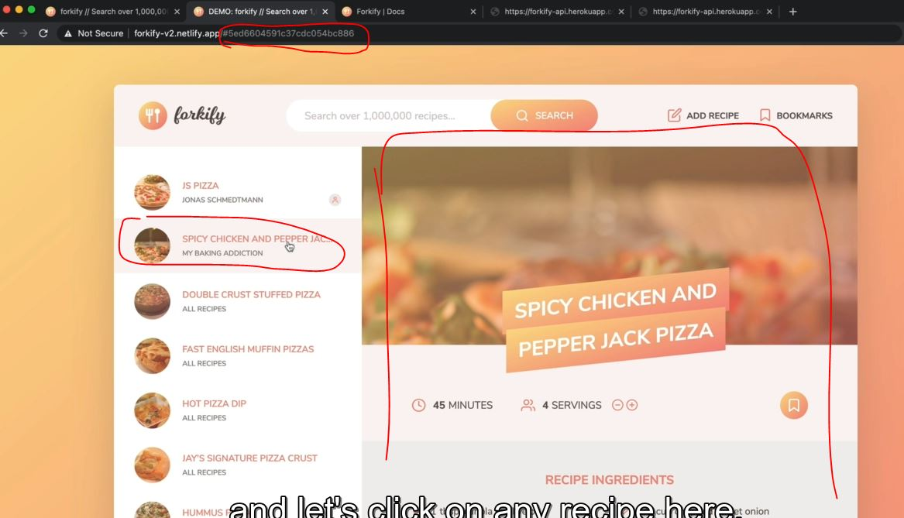

# Listening For load and hashchange event

- inside the flow chart , we want to hook up those two event listeners i.e 
    
    - so that the recipe is actually loaded on one of those two events
    - so when the user selects a recipe from the results list <br>
        or when the page loads with a certain recipe id 

## Working Examples for understanding the hash id ✅

- Eg : of demo version - understanding the hash id 
    - when we search for pizza then on the left side , we'll get the list like this <br>
        
        & when we click on any of the them then that pizza will be loaded on the right side like this 
        
        - here we can see the URL , so everything comes after the hash sign i.e called hash 💡💡💡 <br>
            so after the has sign , that's the id of a recipe & when we combine both hash sign & the id of a recipe i.e a hash
        - so whenever that hash changes then a new recipe is going to be loaded 💡💡💡 <br>
            means we if we click on a other pizza recipe then that on the URL , that previous hash will get changed <br>
            into then new hash
        - & this changing hash is an event that we can listen means take the hash & then load the recipe with that id 💡💡💡

- `Practical Eg` : of chaining hash 
    - Eg 1 : inside index.html file 
        ```html
        <div class="search-results">
            <ul class="results">
                <a href="#5ed6604591c37cdc054bc90b">Recipe 1<a>
            </ul>
        <div>
        ```
        - output : when we click on the recipe link like this 
            
            - the movement we click on the link then that hash will be added on the URL

    - Eg 2 : creating two link for two different hash
        - inside index.html file 
            ```html
            <div class="search-results">
                <ul class="results">
                    <a href="#5ed6604591c37cdc054bc90b">Recipe 1<a>
                    <a href="#5ed6604591c37cdc054bcc40">Recipe 1<a>
                    <!-- so these are two ids of two different recipes-->
                </ul>
            <div>
            ```
        - inside controller.js file 
            ```js
            import icons from 'url:../img/icons.svg' 

            import 'core-js/stable' 
            import 'regenerator-runtime/runtime' 

            const recipeContainer = document.querySelector('.recipe')

            const timeout = function (s) => {
                return new Promise(function (_, reject) {
                    setTimeout(function() {
                        reject(new Error(`Request took too long! Timeout after ${s} second`))
                    }, s * 1000)
                })
            }

            const renderSpinner = function(parentEl) { 
                const markup = `
                    <div class="spinner">
                        <svg><use href="${icons}#icon-loader"></use></svg>
                    </div>
                `

                parentEl.innerHTML = ""
                parentEl.insertAdjacentHTML('afterbegin', markup)
            }
            // inside css file , we animated this loading spinner

            const showRecipe = async function() {
                try {
                    // 1 - Loading recipe
                    renderSpinner(recipeContainer)
                    const res = await fetch('https://forkify-api.herokuapp.com/api/v2/recipes/5ed6604591c37cdc054bcc40')
                    const data = res.json()
                    console.log(data)
                    if (!res.ok) throw new Error(`${data.message} (${res.status})`) 
                    let { recipe } = data.data 
                    
                    recipe = {
                        id:  recipe.id , 
                        title: recipe.title, 
                        publisher: recipe.publisher,
                        sourceUrl: recipe.source_url ,l
                        image: recipe.image_url, 
                        servings: recipe.servings, 
                        cookingTime: recipe.cooking_time ,
                        ingredients: recipe.ingredients
                    }

                    console.log(recipe) 

                    // 2 - Rendering recipe
                    const markup = `
                        <figure class="recipe__fig">
                            
                            <h1 class="recipe__title">
                              <span>${recipe.title}</span>
                            </h1>
                        </figure>

                        <div class="recipe__details">
                            <div class="recipe__info">
                                <svg class="recipe__info-icon"><use href="${icons}#icon-clock"></use></svg>
                                <span class="recipe__info-data recipe__info-data--minutes">${recipe.cookingTime}</span>
                                <span class="recipe__info-text">minutes</span>
                            </div>
                            <div class="recipe__info">
                                <svg class="recipe__info-icon"><use href="${icons}#icon"></use></svg>
                                <span class="recipe__info-data recipe__info-data--people">${recipe.servings}</span>
                                <span class="recipe__info-text">servings</span>

                                <div class="recipe__info-buttons">
                                    <button class="btn--tiny btn--increase-servings">
                                      <svg><use href="${icons}#icon-minus-circle"></use></svg>
                                    </button>
                                    <button class="btn--tiny btn--increase-servings">
                                      <svg><use href="${icons}#icon-plus-circle"></use></svg>
                                    </button>
                                </div>
                            </div>

                            <div class="recipe__user-generated">
                                <svg><use href="${icons}#icon-user"></use></svg>
                            </div>
                            <button class="btn--round">
                                <svg class=""><use href="${icons}#icon-bookmark-fill"></use></svg>
                            </button>
                        </div>

                        <div class="recipe__ingredients">
                            <h2 class="heading--2">Recipe ingredients</h2>
                            <ul class="recipe__ingredient-list">
                                ${recipe.ingredients.map(ing => {
                                    return `
                                        <li class="recipe__ingredient">
                                            <svg class="recipe__icon"><use href="${icons}#icon-check"></use></svg>
                                            <div class="recipe__quantity">${ing.quantity}</div>
                                            <div class="recipe__description">
                                                <span class="recipe__unit">${ing.unit}</span>
                                                ${ing.description}
                                            </div>
                                        </li>
                                    `
                                }).join('')}
                            </ul>
                        </div>

                        <div class="recipe__directions">
                            <h2 class="heading--2">How to cook it</h2>
                            <p class="recipe__directions-text">
                                This recipe was carefully designed and tested by
                                <span class="recipe__publisher">${recipe.publisher}</span>. Please check out
                                directions at their website.
                            </p>
                            <a class="btn--small recipe__btn" href="${recipe.sourceUrl}"target="_blank">
                            <span>Directions</span>
                            <svg class="search__icon"><use href="${icons}#icon-arrow-right"></use></svg>
                          </a>
                        </div>
                    `

                recipeContainer.innerHTML = ""
                recipeContainer.insertAdjacentHTML('afterbegin', markup)

                } catch(err) {
                    alert(err)
                }
            }

            // showRecipe()
            window.addEventListener('hashchange', showRecipe)
                // we only want to run the showRecipe() function when has hashchange on the URL 
            ```
            - now the next step is that we need to get the recipe id from the hash <br>
                means right now if we click either Recipe 1 or recipe 2 link then some recipe we'll get shown <br>
                let's say we clicked on `Recipe 1` link then we didn't anything <br>
                but if we click on `Recipe 2` link then we'll get the recipe of that id 
            - but if we click on again `Recipe 1` link then again we'll get the same recipe <br>
                because we're hard coding that id , so we want to show the recipe based on their own id <br>
                so we need to dynamically get the id from the hash 💡💡💡
        - inside controller.js file , getting the hash from the URL
            ```js
            import icons from 'url:../img/icons.svg' 

            import 'core-js/stable' 
            import 'regenerator-runtime/runtime' 

            const recipeContainer = document.querySelector('.recipe')

            const timeout = function (s) => {
                return new Promise(function (_, reject) {
                    setTimeout(function() {
                        reject(new Error(`Request took too long! Timeout after ${s} second`))
                    }, s * 1000)
                })
            }

            const renderSpinner = function(parentEl) { 
                const markup = `
                    <div class="spinner">
                        <svg><use href="${icons}#icon-loader"></use></svg>
                    </div>
                `

                parentEl.innerHTML = ""
                parentEl.insertAdjacentHTML('afterbegin', markup)
            }
            // inside css file , we animated this loading spinner

            const showRecipe = async function() {
                try {
                    const id = window.location.hash // getting the hash id from the URL 💡💡💡
                    console.log(id) 

                    // 1 - Loading recipe
                    renderSpinner(recipeContainer)
                    const res = await fetch('https://forkify-api.herokuapp.com/api/v2/recipes/5ed6604591c37cdc054bcc40')
                    const data = res.json()
                    console.log(data)
                    if (!res.ok) throw new Error(`${data.message} (${res.status})`) 
                    let { recipe } = data.data 
                    
                    recipe = {
                        id:  recipe.id , 
                        title: recipe.title, 
                        publisher: recipe.publisher,
                        sourceUrl: recipe.source_url ,l
                        image: recipe.image_url, 
                        servings: recipe.servings, 
                        cookingTime: recipe.cooking_time ,
                        ingredients: recipe.ingredients
                    }

                    console.log(recipe) 

                    // 2 - Rendering recipe
                    const markup = `// put code of it`

                recipeContainer.innerHTML = ""
                recipeContainer.insertAdjacentHTML('afterbegin', markup)

                } catch(err) {
                    alert(err)
                }
            }

            // showRecipe()
            window.addEventListener('hashchange', showRecipe)
            ```
            - output : console.log(id) 
                - when we click on the `Recipe 2` then we'll get the hash id from the URL with that hash sign 
                - now we'll remove the hash sign by using slice() method

## Steps - using hashchange event listener

- `STEP 1` : getting the hash id from the URL dynamically & then putting that id dynamically
    - instead of using hard coded 
    ```js
    import icons from 'url:../img/icons.svg' 

    import 'core-js/stable' 
    import 'regenerator-runtime/runtime' 

    const recipeContainer = document.querySelector('.recipe')

    const timeout = function (s) => {
        return new Promise(function (_, reject) {
            setTimeout(function() {
                reject(new Error(`Request took too long! Timeout after ${s} second`))
            }, s * 1000)
        })
    }

    const renderSpinner = function(parentEl) { 
        const markup = `
            <div class="spinner">
                <svg><use href="${icons}#icon-loader"></use></svg>
            </div>
        `

        parentEl.innerHTML = ""
        parentEl.insertAdjacentHTML('afterbegin', markup)
    }

    const showRecipe = async function() {
        try {
            const id = window.location.hash.slice(1)
            console.log(id)

            // 1 - Loading recipe
            renderSpinner(recipeContainer)
            const res = await fetch(`https://forkify-api.herokuapp.com/api/v2/recipes/${id}`)
            const data = res.json()
            console.log(data)
            if (!res.ok) throw new Error(`${data.message} (${res.status})`) 
            let { recipe } = data.data 
            
            recipe = {
                id:  recipe.id , 
                title: recipe.title, 
                publisher: recipe.publisher,
                sourceUrl: recipe.source_url ,l
                image: recipe.image_url, 
                servings: recipe.servings, 
                cookingTime: recipe.cooking_time ,
                ingredients: recipe.ingredients
            }

            console.log(recipe) 

            // 2 - Rendering recipe
            const markup = `// put code of it`

        recipeContainer.innerHTML = ""
        recipeContainer.insertAdjacentHTML('afterbegin', markup)

        } catch(err) {
            alert(err)
        }
    }

    // showRecipe()
    window.addEventListener('hashchange', showRecipe)
    ```
    - output : when we click on `Recipe 1` link then we'll get the recipe of that id
        - & when we click on `Recipe 2` link then we'll get the recipe of id of recipe 2 <br>
            & again if we click on `Recipe 1` then we'll get id of the recipe 1 
        - so things are changing 
    - but what if we take that URL with the recipe hash id & paste in new tab of the browser <br>
        then we'll not get any recipe like this 
        
        - because right now , the hash didn't really change , we just simply open the page
        - so to get the recipe of that hash id automatically then we need `load` event 💡💡💡

- `STEP 2` : using load event listener
    ```js
    // put code before this , from STEP 1
    window.addEventListener('hashchange', showRecipe)
    window.addEventListener('load', showRecipe)
    ```
    - but here we have some duplicate code , so let's see how we can handle these two events at the same time <br>
        so we can run 10 events on the same event handler function , instead of defining the same vent handler function <br>
        for 10 times 💡💡💡

- `STEP 3` : handling those two events at the same time inside the same event handler 
    ```js
    // put code before this , from STEP 1

    ['hashchange', 'load'].forEach((e) => { // here e for event
        window.addEventListener(e , showRecipe)
    }) 
    // window.addEventListener('hashchange', showRecipe)
    // window.addEventListener('load', showRecipe)
    ```
    - output : copy the URL with hash id & paste in the new tab 
        - then we'll get the recipe of that hash id
        - but let's say we didn't have any hash id mean remove the hash id & put the URL like this `localhost:8080` <br>
            & hit enter then we'll get the alert() & the loading spinner will keeps loading <br>
            so the problem is that right now we don't have any id 💡💡💡 <br>
            means we're getting empty string from `window.location.hash.slice(1)` that's why the alert() window gets triggered 
        - so for this issue let's use the guard clause 💡💡💡
    
- `STEP 4` : using guard clause concept when we don't have any hash id on the URL
    ```js
    // put code before this from STEP 1

    const showRecipe = async function() {
        try {
            const id = window.location.hash.slice(1)
            console.log(id)

            if (!id) return // using guard clause
                // when we don't have any hash id & window.location.hash has empty string 

            // 1 - Loading recipe
            renderSpinner(recipeContainer)
            const res = await fetch(`https://forkify-api.herokuapp.com/api/v2/recipes/${id}`)
            const data = res.json()
            console.log(data)
            if (!res.ok) throw new Error(`${data.message} (${res.status})`) 
            let { recipe } = data.data 
            
            recipe = {
                id:  recipe.id , 
                title: recipe.title, 
                publisher: recipe.publisher,
                sourceUrl: recipe.source_url ,
                image: recipe.image_url, 
                servings: recipe.servings, 
                cookingTime: recipe.cooking_time ,
                ingredients: recipe.ingredients
            }

            console.log(recipe) 

            // 2 - Rendering recipe
            const markup = `// put code of it from Eg : 2`

        recipeContainer.innerHTML = ""
        recipeContainer.insertAdjacentHTML('afterbegin', markup)

        } catch(err) {
            alert(err)
        }
    }

    
    ['hashchange', 'load'].forEach((e) => { 
        window.addEventListener(e , showRecipe)
    }) 
    ```
    - output : now if we don't have any hash id on the URL then we'll not get any error 
        - & when we click on either Recipe 1 or Recipe 2 link then we'll get the recipe according to their hash id <br> 
            so we're able to switch b/w different recipe 
        - so this important part of our project ✔️

- now here the code is not implemented in clean way so in next lecture , we'll talk about architecture of this project
