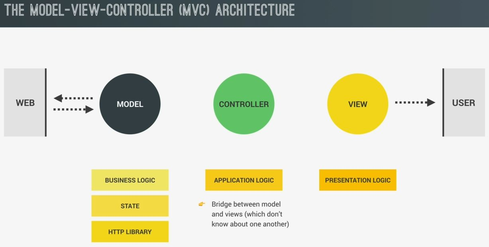

# The MVC Architecture

- till yet , whatever we did without no structure
- so here , we'll see about the project architecture but in general more about software architecture  
    & we also did in Mapty project little bit but now we'll go in deeper

## reason why we need architecture

- Reasons : why we need architecture 
    - `1` : the architecture will give structure to our project & then we can write the code 
        - so just like a house , software also needs a structure
        - `structure` : means how we organize 
        - & we divide the code into different modules , classes & functions
        - so all these hold our code together & give it structure
    - `2` : maintainability
        - so when we build a project , we always have to think about the future
        - `Note 🔥` : & keep in mind that the project is never really done
            - & we always need to change things in the future
            - that's why we need to maintain the project
        - & we can only maintain the project if the project is nicely structured  
            & we might even want to add new features to the project i.e expandability 💡💡💡
    - `3` : expandability
        - `expandability` : means the ability to easily add new features in the future
        - & this only possible if the project is nicely structure & a good overall architecture

- `the perfect architecture` : means the architecture which allows for all these above three aspects
    - now in order to achieve that perfect architecture ,  
        then we create our own architecture for that project from scratch  
    - However , that only works with a really small project  
        but when the project grows more complex then things gets harder  
        to achieve a good architecture completely on our own
    - so we can opt/use architecture pattern to create best architecture for the project like  
        `MVC (Model view controller)` , `MVP (Model View Presenter)` & `flux` , etc 
    - now in modern WebDev , many developers use a framework like reactjs , etc  
        to take care of the architecture for them automatically  
        & due to this , developers don't need to think a lot about architecture on their own  
        so using this kind-of framework would be great for large scale applications
    - but we should know vanillajs before switching to any framework  
        so here we'll manually implement the architecture & this will make easier to learn React 👍

## Components of any architecture ✅

- there are some components that any architecture must have 💡💡💡 
    - `1` : Business Logic
    - `2` : state
    - `3` : HTTP library
    - `4` : Application Logic (router)
    - `5` : Presentation logic (UI layer)

- Business Logic
    - like if your business is related to marketing then business logic will be sending messages , storing & transactions
- State
    - it's most important 
    - it means stores all the data about the application i.e running in the browser  
        so the data about the front-end applications 
    - so the state should store any data that you might fetch from an API or data that the user inputs  
        or what page the user is currently viewing & this data is called `single source`  
        which should be kept in sync with the user interface 💡💡💡
    - so means if some data changes in the state then the user interface should reflect or  
        if something changes in the UI then the state should also change , vice versa  
        & keeping everything in sync is one of the most difficult tasks while building web apps  
        that's why many state management libraries like Redux or Mobx ,etc  
        but in this project , we'll use a simple object to store our entire state 💡💡💡
- HTTP library
    - it's a simple responsible for making & receiving AJAX requests 
    - & really world apps need some interaction with the web
- Application Logic (Router)
    - Now about the presentation logic , this is the code i.e only concerned  
        about the implementation of the application itself
    - so it's more the technical aspects of the application which are not directly related  
        to the underlying business problem
    - Eg : so the application logic includes handling of UI events & navigation on the page 
        - that's the reason why this component is most of the time called a `router` 💡💡💡
        - router means so mapping actions to the users navigation
- presentation logic (UI layer)
    - it's all about the visible part of the application
    - so we can say that the presentation logic is responsible for displaying the application state on the UI  
        in order to keep everything in sync 💡💡💡

- now any good architecture has a way of separating all these components  
    instead of mixing everything together in one big file , so that's why let's see architecture pattern  
    which we're going to use in this project i.e MVC 💡💡💡

## The Model View Controller (MVC) architecture

- this architecture pattern contains 3 big parts i.e `model` , `view` & `controller`

- `view` : is for the presentation logic
    - so it's the part of the application interacting with the user 💡💡💡
- `model` : is all about the applications data 
    - that's why it usually contains the state & also the business logic that manipulates the state 💡💡💡
    - so these two i.e `view` & `model` should be kept closely together
    - Now the model is also what contains the HTTP library  
        which might get some data from the web like from API or from backend  
        so this is also about data that's why it's also come in `model`
- `controller` : is contains the application logic
    - so it sits b/w the `model` & the `view`  
        means it creates a bridge b/w the model & a view which doesn't know anything about each other  
        means the `model` & the `view` will exist completely independent from one another  
        & nothing knowing that the other one exists
    - & one of the big goal of the MVC pattern is to actually separate business logic from application logic  
        which makes developing the application so much easier
    - so `controller` which connect the model & the view each other 

- now let's take a look at a typical flow of actions & of data as soon as some event happens on the UI like a click 
    - `STEP 1` : User click & click event fire
    - `STEP 2` : then event handler goes to controller to handle that event 
        - because handling the event is doing something in the application  
            which is a part of the application logic 
    - `STEP 3` : now this handling might involve like updating the UI & also ask the model for some data 
        - so we can say that the controller dispatches tasks to model & to the view
        - means it controls & orchestrates that entire actions means the whole application itself
    - `STEP 4` : now asking from the `model` for some data , might be involve doing an AJAX request to the web 
        - so that's exactly what the model does
    - `STEP 5` : then when the data arrives , the controller takes the data & sends it to the `view`
    - `STEP 6` : now finally , the `view` will render that data to the UI 
        - & finish the whole cycle like this   
        
        - now in this diagram , we used 2 types of arrows  
            - dotted arrow : means show the data flows b/w the different parts 
            - solid arrow : means represent actual function call & module imports
    - inside the diagram , we can see that it's only the controller who imports & calls functions from the `model` & the `view`  
        but never the other way around because we know already that the `model` & the `view` are completely standalone  
        & completely isolated 💡💡💡 . so they don't import each other & they don't even import the controller  
        & in fact , they don't even know that the controller exists 💡💡💡
    - & these two will just sit there & waiting to get some instructions from the controller 💡💡💡

- now there're different ways of implementing the MVC pattern where some are more complex than others  
    but this above one is better one for Jonas 💡💡💡

- now let's see this MVC architecture applied to the part of the forkify application that we already implemented till yet

## MVC in forkify (recipe display only) with flow chart

- so this is the flow-chart of loading & rendering a recipe that we done till yet  
    now below the diagram , that's the MVC diagram to analyze the flow chart

- so in this flow-chart , handling these events is associated to the controller then loading the recipe happens in the model  
    so the `controller` basically calls some function which is inside the `model`  
    & then the `model` asynchronously gets the recipe data from the API  
- & once the data has arrived , the controller asks for that data & receives it  
    sends it to the `view` & then the `view` ultimately render the recipe on the screen 💡💡💡 like this 
     
    - but this is still quite abstract , because flow-chart  only show based on what we'll implement ,  
        not how we'll do that 💡💡💡

- so let's go deeper in architecture

## MVC in forkify (recipe display only) with architecture

- this architecture , is only about loading & rendering a recipe
- let's see how both the `model` & `controller` are implemented in a module form  
    while the recipe view is actually a class & we'll see the reason when we write the code

- `Explanation of flow of MVC in forkify (recipe display only) with architecture` : 
    - let's see the flow of architecture when the user clicks & click event fire  
        so when the user clicks on the search result then there's a control recipes function in the `controller`  
        & the `controller` which handle that event
    - so the `controller` will instruct the recipe view to render a loading spinner  
        while the user interface waits for the data to arrive in the meantime , the controller also  
        called the load recipes function in the model to fetch the recipe data from the forkify API
    - now the model also contains a big state object which we export from the model  
        & that state will contain all kind-of data like the current recipe , search results , bookmarks , etc
    - so as the data arrives then the data will be stored in this state object  
        & the controller then reaches into the state object , grabs the recipe data & finally calls  
        the render method on the recipe view with that data in order to finally render the recipe to the UI 
    

- now let's implement this architecture in our code base
