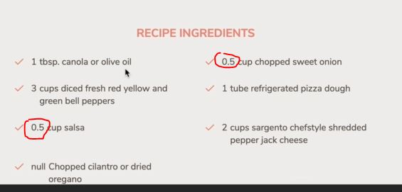
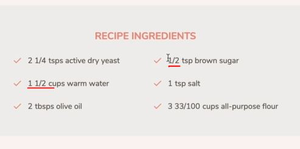

# Refactoring for MVC

- `most most important lecture 🔥`  

- things need to do : go inside the `src/js` folder 
    - `1` : create a `model.js`
        - so this file will contain module in which we write our entire model 
    - `2` : create a `views` folder
        - we're creating folder for view because we'll be having multiple views
        - each view is for one feature
        - so we're working on displaying recipe 
        - inside of `views` folder , create recipeView.js

- in `model.js` file , we'll write our entire model means all the model means for recipe , for search , for bookmarks , etc <br>
    but for the `views` folder , we'll have one module for each of the different views 💡💡💡
    - Reason : because of the `views` are simply much bigger , so we don't want a file , which like 500 lines of code 💡💡💡
    - we can split up our `model` & the `controller` & probably many people do but we don't want mess

- in the flow chart of forkify architecture recipe loading
    - we'll start with the `model` , 
    - so `model` will going to be a big state object which will contain those bunch of stuff which is defined in the flow chart <br>
        & then we'll have loadingRecipe() & then loadingRecipe() will be called `controlRecipes()` <br> 
        so `controlRecipes()` sits b/w loading recipe & then rendering it using the `view` 💡💡💡

## Steps - Refactoring code via MVC architecture

- `STEP 1` : inside model.js 
    ```js
    // we'll export bunch of stuff , so that we can use them in the controller.js file 
        // so flow of the things will go from model.js -> controller.js -> recipeView.js file 💡💡💡

    export const state = {
        recipe: {}
    }

    export const loadRecipe = async function() { 
        // this function is responsible for actual fetching the recipe data from our forkify API 💡💡💡 

        recipe: {}
    }
    ```
    - `STEP 1.1` : inside the controller.js file 
        - loading spinner code 
            ```js
            renderSpinner(recipeContainer)
            // we're not taking renderSpinner() , because it has nothing to do with the business logic 
                // it's just related to presentation logic , so `renderSpinner(recipeContainer)` will go inside the `view`
            ```
        - & getting id from the URL 
            ```js
            const id = window.location.hash.slice(1)
            // this is also not a business logic , so this is more about the application logic itself 💡💡💡
            // it's about making the application work
            ```
        - actual fetching the data from forkify API
            ```js
            const res = await fetch(`https://forkify-api.herokuapp.com/api/v2/recipes/${id}`)
            const data = res.json()
            console.log(data)
            if (!res.ok) throw new Error(`${data.message} (${res.status})`) 
            let { recipe } = data.data 
            
            recipe = {
                id:  recipe.id , 
                title: recipe.title, 
                publisher: recipe.publisher,
                sourceUrl: recipe.source_url ,
                image: recipe.image_url, 
                servings: recipe.servings, 
                cookingTime: recipe.cooking_time ,
                ingredients: recipe.ingredients
            }

            console.log(recipe) 
            // these lines of code are the actual business logic
            ```
            - cut this code from controller.js file & paste inside loadRecipe function of model.js file 💡💡💡
    - `STEP 1.2` : pasting the fetching data code inside loadRecipe function of model.js file
        - & refactoring the code
        ```js
        export const state = {
            recipe: {}
        }

        export const loadRecipe = async function(id) { // we'll get the id from the controller.js file 
            const res = await fetch(`https://forkify-api.herokuapp.com/api/v2/recipes/${id}`)
            const data = res.json()
            console.log(data)
            if (!res.ok) throw new Error(`${data.message} (${res.status})`) 
            let { recipe } = data.data 
            
            // this should be state.recipe , not recipe object
            state.recipe = {
                id:  recipe.id , 
                title: recipe.title, 
                publisher: recipe.publisher,
                sourceUrl: recipe.source_url ,
                image: recipe.image_url, 
                servings: recipe.servings, 
                cookingTime: recipe.cooking_time ,
                ingredients: recipe.ingredients
            }

            console.log(state.recipe) 
        }
        // so loadRecipe() async function is not going to return anything 
            // it'll just change our state object 💡💡💡

        // & that state -> object is a big state object which will contain the recipe 
            // & into which the controller.js file will then grab & take the recipe out 
            // & this will work because there's is a live connection b/w the exports & the imports
        // so the state -> object is going to get updated by loadRecipe
            // & then that state -> object itself is also updated in the controller.js file which imports the state 💡💡💡 
        ```
        - & inside the controller.js file , we want to import everything from the model.js file 
            - so in ES6 module , we have two types of module : `named exports` & `default exports`
            - so inside the model.js file , those are named exports because we explicitly gave them a name 💡💡💡
    - `STEP 1.3` : inside controller.js file , importing everything from model.js file 
        ```js
        import * as model from './model.js' // importing everything from model.js file 

        import icons from 'url:../img/icons.svg' 

        import 'core-js/stable' 
        import 'regenerator-runtime/runtime' 

        const recipeContainer = document.querySelector('.recipe')

        const timeout = function (s) => {
            return new Promise(function (_, reject) {
                setTimeout(function() {
                    reject(new Error(`Request took too long! Timeout after ${s} second`))
                }, s * 1000)
            })
        }

        const renderSpinner = function(parentEl) { 
            const markup = `
                <div class="spinner">
                    <svg><use href="${icons}#icon-loader"></use></svg>
                </div>
            `

            parentEl.innerHTML = ""
            parentEl.insertAdjacentHTML('afterbegin', markup)
        }

        const showRecipe = async function() {
            try {
                const id = window.location.hash.slice(1)
                console.log(id)

                if (!id) return 
                renderSpinner(recipeContainer)

                // 1 - Loading recipe
                await model.loadRecipe(id) // & inside model.js file , we define loadRecipe as async function
                    // so it'll return a promise , so that's why we await model.loadRecipe()
                    // Imp Note 🔥 : this is exactly the situation of one async function calling another async function
                        // so async function will always return a promise 
                            // & then we need to handle whenever we call that async function 
                        // At least , if we want to get some result out of it 
                            // or if we kind of want to stop the execution in the function 
                            // i.e calling the other async function 💡💡💡 
                        // then use await -> keyword to stop/avoid of returning the promise from that async function 💡💡💡
                    // here loadRecipe() async function doesn't return anything
                        // that's why , we're not storing any result inside any new variable
                        // we just use the await -> keyword to stop 
                            // from the returning promise of that async loadRecipe() function 💡💡💡 
                    // here we'll get access of state.recipe

                // 2 - Rendering recipe
                const markup = `// put code of it from Eg : 2 -> from 6th lecture - 18 module`

            recipeContainer.innerHTML = ""
            recipeContainer.insertAdjacentHTML('afterbegin', markup)

            } catch(err) {
                alert(err)
            }
        }

        ['hashchange', 'load'].forEach((e) => { 
            window.addEventListener(e , showRecipe)
        }) 
        ```
    - `STEP 1.4` : inside the model.js file , we need to put fetching stuff inside the try catch block
        ```js
        export const state = {
            recipe: {}
        }

        export const loadRecipe = async function(id) {  
            try {
                const res = await fetch(`https://forkify-api.herokuapp.com/api/v2/recipes/${id}`)
                const data = res.json()
                console.log(data)
                if (!res.ok) throw new Error(`${data.message} (${res.status})`) 
                let { recipe } = data.data 
                
                // this should be state.recipe , not recipe object
                state.recipe = { 
                    id:  recipe.id , 
                    title: recipe.title, 
                    publisher: recipe.publisher,
                    sourceUrl: recipe.source_url ,
                    image: recipe.image_url, 
                    servings: recipe.servings, 
                    cookingTime: recipe.cooking_time ,
                    ingredients: recipe.ingredients
                }

                console.log(state.recipe) 
            } catch(err) {
                alert(err)
            }
        }
        ```
        - here inside loadRecipe async function , we're manipulating the `state.recipe` object variable <br>
            which is outside the loadRecipe async function
        - so the loadRecipe async function is not a pure function & it has a side effect <br>
            of manipulating that `state` object variable which is outside of it 💡💡💡 
        - & there would be different ways of avoiding that but that's just a lot of work & not worth it in this case  

    - `STEP 1.5` : inside controller.js file 
        ```js
        import * as model from './model.js' // importing everything from model.js file 

        import icons from 'url:../img/icons.svg' 

        import 'core-js/stable' 
        import 'regenerator-runtime/runtime' 

        const recipeContainer = document.querySelector('.recipe')

        const timeout = function (s) => {
            // put code of this function from STEP 1.3
        }

        const renderSpinner = function(parentEl) { 
            // put code of this function from STEP 1.3
        }

        const showRecipe = async function() {
            try {
                const id = window.location.hash.slice(1)
                console.log(id)

                if (!id) return 
                renderSpinner(recipeContainer)

                // 1 - Loading recipe
                await model.loadRecipe(id) 

                const { recipe } = model.state
                    // now we can access state -> object

                // 2 - Rendering recipe
                const markup = `
                    <figure class="recipe__fig">
                        
                        <h1 class="recipe__title">
                          <span>${recipe.title}</span>
                        </h1>
                    </figure>

                    <div class="recipe__details">
                        <div class="recipe__info">
                            <svg class="recipe__info-icon"><use href="${icons}#icon-clock"></use></svg>
                            <span class="recipe__info-data recipe__info-data--minutes">${recipe.cookingTime}</span>
                            <span class="recipe__info-text">minutes</span>
                        </div>
                        <div class="recipe__info">
                            <svg class="recipe__info-icon"><use href="${icons}#icon"></use></svg>
                            <span class="recipe__info-data recipe__info-data--people">${recipe.servings}</span>
                            <span class="recipe__info-text">servings</span>

                            <div class="recipe__info-buttons">
                                <button class="btn--tiny btn--increase-servings">
                                  <svg><use href="${icons}#icon-minus-circle"></use></svg>
                                </button>
                                <button class="btn--tiny btn--increase-servings">
                                  <svg><use href="${icons}#icon-plus-circle"></use></svg>
                                </button>
                            </div>
                        </div>

                        <div class="recipe__user-generated">
                            <svg><use href="${icons}#icon-user"></use></svg>
                        </div>
                        <button class="btn--round">
                            <svg class=""><use href="${icons}#icon-bookmark-fill"></use></svg>
                        </button>
                    </div>

                    <div class="recipe__ingredients">
                        <h2 class="heading--2">Recipe ingredients</h2>
                        <ul class="recipe__ingredient-list">
                            ${recipe.ingredients.map(ing => {
                                return `
                                    <li class="recipe__ingredient">
                                        <svg class="recipe__icon"><use href="${icons}#icon-check"></use></svg>
                                        <div class="recipe__quantity">${ing.quantity}</div>
                                        <div class="recipe__description">
                                            <span class="recipe__unit">${ing.unit}</span>
                                            ${ing.description}
                                        </div>
                                    </li>
                                `
                            }).join('')}
                        </ul>
                    </div>

                    <div class="recipe__directions">
                        <h2 class="heading--2">How to cook it</h2>
                        <p class="recipe__directions-text">
                            This recipe was carefully designed and tested by
                            <span class="recipe__publisher">${recipe.publisher}</span>. Please check out
                            directions at their website.
                        </p>
                        <a class="btn--small recipe__btn" href="${recipe.sourceUrl}"target="_blank">
                        <span>Directions</span>
                        <svg class="search__icon"><use href="${icons}#icon-arrow-right"></use></svg>
                      </a>
                    </div>
                `

            recipeContainer.innerHTML = ""
            recipeContainer.insertAdjacentHTML('afterbegin', markup)

            } catch(err) {
                alert(err)
            }
        }

        ['hashchange', 'load'].forEach((e) => { 
            window.addEventListener(e , showRecipe)
        }) 
        ```
        - output : we'll get the output on our screen
            - so keep checking things when you're doing refactoring in your code base

- `STEP 2` : inside recipeView.js file , let's set the view
    ```js
    // here view is a recipe view which is going to be a class 
        // & later on , we'll create a parent class called view 
            // which will contain a couple of methods & all child views should inherit
        // so we're using classes to make implementation easier

    class RecipeView extends View {
        // private properties
        #parentElement = document.querySelector('.recipe') 
            // we'll set this private element to the recipeContainer (which is inside the controller.js file) 
            // because this will make really easy to render the spinner & to render success or error messages
    }
    ```
    - `STEP 2.1` : now exporting this RecipeView class
        - then in the controller.js file , we would have to import that class <br>
            & create a new object out of that class
        - means create a new RecipeView object . However , in that situation , it might be possible <br>
            to create more than one view but we never want that & it'll add unnecessary work for the controller.js file <br>
            so keep controller.js file as simple as possible
        - Now in order to avoid all that , we will create the object inside the recipeView.js file & then export that object & <br>
            due to this , no one from the outside can access `RecipeView` class except that object which we're exporting 💡💡💡
        - inside recipeView.js file 
            ```js
            class RecipeView extends View {
                // private properties
                #parentElement = document.querySelector('.recipe') 
            }

            export default new RecipeView() // here we didn't pass any data 
                // that's why we don't need constructor() function inside RecipeView class 💡💡💡
            ```
        - inside controller.js file , importing RecipeView class
            ```js
            import * as model from './model.js' 
            import recipeView from './views/recipeView.js'
                // now you'll think how we can pass any data into the recipeView object
                // because if we're not creating the new object ourselves then we can't pass any data
                    // in like for the constructor function
                // because we're creating that object in the RecipeView module
                    // but we did this for the purpose , so that we can create a very nice method called render 💡💡💡

            import icons from 'url:../img/icons.svg' 

            import 'core-js/stable' 
            import 'regenerator-runtime/runtime' 

            const recipeContainer = document.querySelector('.recipe')

            const timeout = function (s) => {
                // put code of this function from STEP 1.3
            }

            const renderSpinner = function(parentEl) { 
                // put code of this function from STEP 1.3
            }

            const showRecipe = async function() {
                try {
                    const id = window.location.hash.slice(1)
                    console.log(id)

                    if (!id) return 
                    renderSpinner(recipeContainer)

                    // 1 - Loading recipe
                    await model.loadRecipe(id) 

                    const { recipe } = model.state
                        // now we can access state -> object

                    // 2 - Rendering recipe
                    recipeView.render(model.state.recipe)
                        // here we can pass the data inside render() method which we'll create
                        // render -> is a very common name for methods like in React , it's also called render 💡💡💡
                            // & this is descriptive name of what is going to happens
                        // but we can do this way also -> const recipeView = new recipeView(model.state.recipe)
                            // but this is lot cleaner -> recipeView.render(model.state.recipe) 💡💡💡


                    const markup = `// put code from STEP 1.5`

                recipeContainer.innerHTML = ""
                recipeContainer.insertAdjacentHTML('afterbegin', markup)

                } catch(err) {
                    alert(err)
                }
            }

            ['hashchange', 'load'].forEach((e) => { 
                window.addEventListener(e , showRecipe)
            }) 
            ```
    - `STEP 2.2` : inside recipeView.js file , accepting `recipeView.render(model.state.recipe)` this data
        - & then store it inside that object
        ```js
        class RecipeView extends View {
            // private properties
            #parentElement = document.querySelector('.recipe') 
            #data

            // public method which is a part of public API
            render(data) {
                // this will receives data & then set this.#data
                this.#data = data
            }
            // here #parentElement & #data & render() method will be created inside all the views 
                // & this is good thing to keep things consistence through out the application
        }

        export default new RecipeView()
        ```
    - `STEP 2.3` : inside controller.js file , cut that markup code & appending inside the DOM 
        ```js
        const markup = `
            <figure class="recipe__fig">
                
                <h1 class="recipe__title">
                  <span>${recipe.title}</span>
                </h1>
            </figure>

            <div class="recipe__details">
                <div class="recipe__info">
                    <svg class="recipe__info-icon"><use href="${icons}#icon-clock"></use></svg>
                    <span class="recipe__info-data recipe__info-data--minutes">${recipe.cookingTime}</span>
                    <span class="recipe__info-text">minutes</span>
                </div>
                <div class="recipe__info">
                    <svg class="recipe__info-icon"><use href="${icons}#icon"></use></svg>
                    <span class="recipe__info-data recipe__info-data--people">${recipe.servings}</span>
                    <span class="recipe__info-text">servings</span>

                    <div class="recipe__info-buttons">
                        <button class="btn--tiny btn--increase-servings">
                          <svg><use href="${icons}#icon-minus-circle"></use></svg>
                        </button>
                        <button class="btn--tiny btn--increase-servings">
                          <svg><use href="${icons}#icon-plus-circle"></use></svg>
                        </button>
                    </div>
                </div>

                <div class="recipe__user-generated">
                    <svg><use href="${icons}#icon-user"></use></svg>
                </div>
                <button class="btn--round">
                    <svg class=""><use href="${icons}#icon-bookmark-fill"></use></svg>
                </button>
            </div>

            <div class="recipe__ingredients">
                <h2 class="heading--2">Recipe ingredients</h2>
                <ul class="recipe__ingredient-list">
                    ${recipe.ingredients.map(ing => {
                        return `
                            <li class="recipe__ingredient">
                                <svg class="recipe__icon"><use href="${icons}#icon-check"></use></svg>
                                <div class="recipe__quantity">${ing.quantity}</div>
                                <div class="recipe__description">
                                    <span class="recipe__unit">${ing.unit}</span>
                                    ${ing.description}
                                </div>
                            </li>
                        `
                    }).join('')}
                </ul>
            </div>

            <div class="recipe__directions">
                <h2 class="heading--2">How to cook it</h2>
                <p class="recipe__directions-text">
                    This recipe was carefully designed and tested by
                    <span class="recipe__publisher">${recipe.publisher}</span>. Please check out
                    directions at their website.
                </p>
                <a class="btn--small recipe__btn" href="${recipe.sourceUrl}"target="_blank">
                <span>Directions</span>
                <svg class="search__icon"><use href="${icons}#icon-arrow-right"></use></svg>
              </a>
            </div>
        `

        recipeContainer.innerHTML = ""
        recipeContainer.insertAdjacentHTML('afterbegin', markup)
        ```
        - & put this inside the recipeView.js file like this
            ```js
            class RecipeView {
                #parentElement = document.querySelector('.recipe')
                #data

                render(data) {
                    this.#data = data
                }
            }

            export default new RecipeView()
            ```
            - now we'll not put the markup code & rendering it inside render() method <br>
                because again , render() will later be common to all the views means to all the classes
            - However , each view , of course , render different HTML <br>
                so we'll create a method that generates that HTML , so that render() method can then render that HTML 💡💡💡
    - `STEP 2.4` : inside recipeView.js file
        ```js
        class RecipeView {
            // private properties
            #parentElement = document.querySelector('.recipe')
            #data

            render(data) {
                this.#data = data
            }

            // private method
            #generateMarkup() {
                return `
                    <figure class="recipe__fig">
                        
                        <h1 class="recipe__title">
                          <span>${recipe.title}</span>
                        </h1>
                    </figure>

                    <div class="recipe__details">
                        <div class="recipe__info">
                            <svg class="recipe__info-icon"><use href="${icons}#icon-clock"></use></svg>
                            <span class="recipe__info-data recipe__info-data--minutes">${recipe.cookingTime}</span>
                            <span class="recipe__info-text">minutes</span>
                        </div>
                        <div class="recipe__info">
                            <svg class="recipe__info-icon"><use href="${icons}#icon"></use></svg>
                            <span class="recipe__info-data recipe__info-data--people">${recipe.servings}</span>
                            <span class="recipe__info-text">servings</span>

                            <div class="recipe__info-buttons">
                                <button class="btn--tiny btn--increase-servings">
                                  <svg><use href="${icons}#icon-minus-circle"></use></svg>
                                </button>
                                <button class="btn--tiny btn--increase-servings">
                                  <svg><use href="${icons}#icon-plus-circle"></use></svg>
                                </button>
                            </div>
                        </div>

                        <div class="recipe__user-generated">
                            <svg><use href="${icons}#icon-user"></use></svg>
                        </div>
                        <button class="btn--round">
                            <svg class=""><use href="${icons}#icon-bookmark-fill"></use></svg>
                        </button>
                    </div>

                    <div class="recipe__ingredients">
                        <h2 class="heading--2">Recipe ingredients</h2>
                        <ul class="recipe__ingredient-list">
                            ${recipe.ingredients.map(ing => {
                                return `
                                    <li class="recipe__ingredient">
                                        <svg class="recipe__icon"><use href="${icons}#icon-check"></use></svg>
                                        <div class="recipe__quantity">${ing.quantity}</div>
                                        <div class="recipe__description">
                                            <span class="recipe__unit">${ing.unit}</span>
                                            ${ing.description}
                                        </div>
                                    </li>
                                `
                            }).join('')}
                        </ul>
                    </div>

                    <div class="recipe__directions">
                        <h2 class="heading--2">How to cook it</h2>
                        <p class="recipe__directions-text">
                            This recipe was carefully designed and tested by
                            <span class="recipe__publisher">${recipe.publisher}</span>. Please check out
                            directions at their website.
                        </p>
                        <a class="btn--small recipe__btn" href="${recipe.sourceUrl}"target="_blank">
                        <span>Directions</span>
                        <svg class="search__icon"><use href="${icons}#icon-arrow-right"></use></svg>
                      </a>
                    </div>
                ` ;

                recipeContainer.innerHTML = ""
                recipeContainer.insertAdjacentHTML('afterbegin', markup)
            }
        }
        ```
        - now inside `#generateMarkup` , we immediately return that html code instead of storing inside a variable <br>
            & then returning that variable
        - now `#generateMarkup` can't do anything because we need to define what that `recipe` means & it's not define <br>
            so data is actually inside `this.#data`
        - so if we go inside controller.js file , these lines of code 
            ```js
            import * as model from './model.js' 
            import recipeView from './views/recipeView.js'

            import icons from 'url:../img/icons.svg' 

            import 'core-js/stable' 
            import 'regenerator-runtime/runtime' 

            const recipeContainer = document.querySelector('.recipe')

            const timeout = function (s) => {
                // put code of this function from STEP 1.3
            }

            const renderSpinner = function(parentEl) { 
                // put code of this function from STEP 1.3
            }

            const showRecipe = async function() {
                try {
                    const id = window.location.hash.slice(1)
                    console.log(id)

                    if (!id) return 
                    renderSpinner(recipeContainer)

                    // 1 - Loading recipe
                    await model.loadRecipe(id) 
                    // const { recipe } = model.state // we don't need this line code 

                    // 2 - Rendering recipe
                    recipeView.render(model.state.recipe)

                    // const markup = `// put code from STEP 1.5` // we don't need this line code 

                recipeContainer.innerHTML = ""
                recipeContainer.insertAdjacentHTML('afterbegin', markup)

                } catch(err) {
                    alert(err)
                }
            }

            ['hashchange', 'load'].forEach((e) => { 
                window.addEventListener(e , showRecipe)
            }) 
            ```
            - `understanding flow of code that we just wrote` :  
                - inside controller.js file 
                    - so on this line `await model.loadRecipe(id)` here we loaded the recipe <br>
                        & then we store/took that loaded recipe by accessing `model.state.recipe` object
                    - so we received the data on this line `await model.loadRecipe(id)` & then we putted <br>
                        inside the render() method i.e `recipeView.render(model.state.recipe)`
                - then inside recipeView.js file 
                    - that render() method takes that data & stores it inside `this.#data` 
                    - so we can use that data via `#data` private properties anywhere
                - if we see the flowchart of loading recipe , we're doing the same thing 
                    - so `controlRecipes()` (of controller.js file) will call the loadRecipe() (of model.js file) 
                    - then the recipe data goes into the state & then `recipe` object will be passes <br>
                        through the controller.js file & then ultimately goes inside `render()` method (of recipeView.js file) 
                    - then render() method (of recipeView.js file) will call `generateMarkup()`  

- `STEP 3` : inside recipeView.js file , refactoring the code to pass the data
    ```js
    class RecipeView {
        // private properties
        #parentElement = document.querySelector('.recipe')
        #data

        render(data) {
            this.#data = data

            const markup = this.#generateMarkup
            this.#clear
            this.#parentElement.insertAdjacentHTML('afterbegin', markup)
        }

        #clear() {
            // this private is created to abstract some code 

            this.#parentElement.innerHTML = '' 
                // here we made the #parentElement private variable reusable variable 💡💡💡 
        }

        // private method
        #generateMarkup() {
            return `
                <figure class="recipe__fig">
                    
                    <h1 class="recipe__title">
                      <span>${this.#data.title}</span>
                    </h1>
                </figure>

                <div class="recipe__details">
                    <div class="recipe__info">
                        <svg class="recipe__info-icon"><use href="${icons}#icon-clock"></use></svg>
                        <span class="recipe__info-data recipe__info-data--minutes">${this.#data.cookingTime}</span>
                        <span class="recipe__info-text">minutes</span>
                    </div>
                    <div class="recipe__info">
                        <svg class="recipe__info-icon"><use href="${icons}#icon"></use></svg>
                        <span class="recipe__info-data recipe__info-data--people">${this.#data.servings}</span>
                        <span class="recipe__info-text">servings</span>

                        <div class="recipe__info-buttons">
                            <button class="btn--tiny btn--increase-servings">
                              <svg><use href="${icons}#icon-minus-circle"></use></svg>
                            </button>
                            <button class="btn--tiny btn--increase-servings">
                              <svg><use href="${icons}#icon-plus-circle"></use></svg>
                            </button>
                        </div>
                    </div>

                    <div class="recipe__user-generated">
                        <svg><use href="${icons}#icon-user"></use></svg>
                    </div>
                    <button class="btn--round">
                        <svg class=""><use href="${icons}#icon-bookmark-fill"></use></svg>
                    </button>
                </div>

                <div class="recipe__ingredients">
                    <h2 class="heading--2">Recipe ingredients</h2>
                    <ul class="recipe__ingredient-list">
                        ${this.#data.ingredients.map(ing => {
                            return `
                                <li class="recipe__ingredient">
                                    <svg class="recipe__icon"><use href="${icons}#icon-check"></use></svg>
                                    <div class="recipe__quantity">${ing.quantity}</div>
                                    <div class="recipe__description">
                                        <span class="recipe__unit">${ing.unit}</span>
                                        ${ing.description}
                                    </div>
                                </li>
                            `
                        }).join('')}
                    </ul>
                </div>

                <div class="recipe__directions">
                    <h2 class="heading--2">How to cook it</h2>
                    <p class="recipe__directions-text">
                        This recipe was carefully designed and tested by
                        <span class="recipe__publisher">${this.#data.publisher}</span>. Please check out
                        directions at their website.
                    </p>
                    <a class="btn--small recipe__btn" href="${this.#data.sourceUrl}"target="_blank">
                    <span>Directions</span>
                    <svg class="search__icon"><use href="${icons}#icon-arrow-right"></use></svg>
                  </a>
                </div>
            ` ;

            // recipeContainer.innerHTML = ""
            // recipeContainer.insertAdjacentHTML('afterbegin', markup)
                // these lines of code will not be defined inside #generateMarkup() function
                    // because this function only return an HTML string
                // but both these lines will go inside render() method 💡💡💡
        }
    }
    ```
    - `STEP 3.1` : inside controller.js file , change the name of showRecipe into controlRecipe
        ```js
        import * as model from './model.js' 
        import recipeView from './views/recipeView.js'

        import icons from 'url:../img/icons.svg' 

        import 'core-js/stable' 
        import 'regenerator-runtime/runtime' 

        const recipeContainer = document.querySelector('.recipe')

        const timeout = function (s) => {
            // put code of this function from STEP 1.3
        }

        const renderSpinner = function(parentEl) { 
            const markup = `
                <div class="spinner">
                    <svg><use href="${icons}#icon-loader"></use></svg>
                </div>
            `

            parentEl.innerHTML = ""
            parentEl.insertAdjacentHTML('afterbegin', markup)
        }

        const controlRecipe = async function() {
            try {
                const id = window.location.hash.slice(1)
                console.log(id)

                if (!id) return 
                renderSpinner(recipeContainer)

                // 1 - Loading recipe
                await model.loadRecipe(id) 
                // const { recipe } = model.state // we don't need this line code 

                // 2 - Rendering recipe
                recipeView.render(model.state.recipe)

            } catch(err) {
                alert(err)
            }
        }

        ['hashchange', 'load'].forEach((e) => window.addEventListener(e , controlRecipe)) 
        ```
        - now we just need to export the renderSpinner inside the recipeView.js file 
        - so cut this code of renderSpinner() function from controller.js file <br>
            because it has nothing to do with controller.js file 
            ```js
            const renderSpinner = function(parentEl) { 
                const markup = `
                    <div class="spinner">
                        <svg><use href="${icons}#icon-loader"></use></svg>
                    </div>
                `

                parentEl.innerHTML = ""
                parentEl.insertAdjacentHTML('afterbegin', markup)
            }
            ```
    - `STEP 3.2` : & pasting the code of renderSpinner() function inside recipeView.js file 
        ```js
        class RecipeView {
            // private properties
            #parentElement = document.querySelector('.recipe')
            #data

            render(data) {
                this.#data = data

                const markup = this.#generateMarkup
                this.#clear
                this.#parentElement.insertAdjacentHTML('afterbegin', markup)
            }

            #clear() {
                this.#parentElement.innerHTML = '' 
            }

            // we made this public so that when controller can call this method
                // as it starts fetching the data 💡💡💡
            renderSpinner = function() { 
                const markup = `
                    <div class="spinner">
                        <svg><use href="${icons}#icon-loader"></use></svg>
                    </div>
                `

                this.#parentElement.innerHTML = ""
                this.#parentElement.insertAdjacentHTML('afterbegin', markup)
            }

            // private method
            #generateMarkup() {
                return `
                    <figure class="recipe__fig">
                        
                        <h1 class="recipe__title">
                          <span>${this.#data.title}</span>
                        </h1>
                    </figure>

                    <div class="recipe__details">
                        <div class="recipe__info">
                            <svg class="recipe__info-icon"><use href="${icons}#icon-clock"></use></svg>
                            <span class="recipe__info-data recipe__info-data--minutes">${this.#data.cookingTime}</span>
                            <span class="recipe__info-text">minutes</span>
                        </div>
                        <div class="recipe__info">
                            <svg class="recipe__info-icon"><use href="${icons}#icon"></use></svg>
                            <span class="recipe__info-data recipe__info-data--people">${this.#data.servings}</span>
                            <span class="recipe__info-text">servings</span>

                            <div class="recipe__info-buttons">
                                <button class="btn--tiny btn--increase-servings">
                                  <svg><use href="${icons}#icon-minus-circle"></use></svg>
                                </button>
                                <button class="btn--tiny btn--increase-servings">
                                  <svg><use href="${icons}#icon-plus-circle"></use></svg>
                                </button>
                            </div>
                        </div>

                        <div class="recipe__user-generated">
                            <svg><use href="${icons}#icon-user"></use></svg>
                        </div>
                        <button class="btn--round">
                            <svg class=""><use href="${icons}#icon-bookmark-fill"></use></svg>
                        </button>
                    </div>

                    <div class="recipe__ingredients">
                        <h2 class="heading--2">Recipe ingredients</h2>
                        <ul class="recipe__ingredient-list">
                            ${this.#data.ingredients.map(ing => {
                                return `
                                    <li class="recipe__ingredient">
                                        <svg class="recipe__icon"><use href="${icons}#icon-check"></use></svg>
                                        <div class="recipe__quantity">${ing.quantity}</div>
                                        <div class="recipe__description">
                                            <span class="recipe__unit">${ing.unit}</span>
                                            ${ing.description}
                                        </div>
                                    </li>
                                `
                            }).join('')}
                        </ul>
                    </div>

                    <div class="recipe__directions">
                        <h2 class="heading--2">How to cook it</h2>
                        <p class="recipe__directions-text">
                            This recipe was carefully designed and tested by
                            <span class="recipe__publisher">${this.#data.publisher}</span>. Please check out
                            directions at their website.
                        </p>
                        <a class="btn--small recipe__btn" href="${this.#data.sourceUrl}"target="_blank">
                        <span>Directions</span>
                        <svg class="search__icon"><use href="${icons}#icon-arrow-right"></use></svg>
                      </a>
                    </div>
                ` ;
            }
        }
        ```
    - `STEP 3.3` : inside controller.js file , cut imported icons of loading spinner
        ```js
        import * as model from './model.js' 
        import recipeView from './views/recipeView.js'

        import 'core-js/stable' 
        import 'regenerator-runtime/runtime' 

        const recipeContainer = document.querySelector('.recipe')

        const timeout = function (s) => {
            // put code of this function from STEP 1.3
        }

        const controlRecipe = async function() {
            try {
                const id = window.location.hash.slice(1)
                console.log(id)

                if (!id) return 
                renderSpinner(recipeContainer)

                // 1 - Loading recipe
                await model.loadRecipe(id) 
                // const { recipe } = model.state // we don't need this line code 

                // 2 - Rendering recipe
                recipeView.render(model.state.recipe)

            } catch(err) {
                alert(err)
            }
        }

        ['hashchange', 'load'].forEach((e) => window.addEventListener(e , controlRecipe)) 
        ```
        - inside recipeView.js , pasting import icons
            ```js
            import icons from 'url:../../img/icons.svg' 

            class RecipeView {
                #parentElement = document.querySelector('.recipe')
                #data

                render(data) {
                    this.#data = data

                    const markup = this.#generateMarkup
                    this.#clear
                    this.#parentElement.insertAdjacentHTML('afterbegin', markup)
                }

                #clear() {
                    this.#parentElement.innerHTML = '' 
                }

                renderSpinner = function() { 
                    const markup = `
                        <div class="spinner">
                            <svg><use href="${icons}#icon-loader"></use></svg>
                        </div>
                    `

                    this.#parentElement.innerHTML = ""
                    this.#parentElement.insertAdjacentHTML('afterbegin', markup)
                }

                // private method
                #generateMarkup() {
                    return `
                        <figure class="recipe__fig">
                            
                            <h1 class="recipe__title">
                              <span>${this.#data.title}</span>
                            </h1>
                        </figure>

                        <div class="recipe__details">
                            <div class="recipe__info">
                                <svg class="recipe__info-icon"><use href="${icons}#icon-clock"></use></svg>
                                <span class="recipe__info-data recipe__info-data--minutes">${this.#data.cookingTime}</span>
                                <span class="recipe__info-text">minutes</span>
                            </div>
                            <div class="recipe__info">
                                <svg class="recipe__info-icon"><use href="${icons}#icon"></use></svg>
                                <span class="recipe__info-data recipe__info-data--people">${this.#data.servings}</span>
                                <span class="recipe__info-text">servings</span>

                                <div class="recipe__info-buttons">
                                    <button class="btn--tiny btn--increase-servings">
                                      <svg><use href="${icons}#icon-minus-circle"></use></svg>
                                    </button>
                                    <button class="btn--tiny btn--increase-servings">
                                      <svg><use href="${icons}#icon-plus-circle"></use></svg>
                                    </button>
                                </div>
                            </div>

                            <div class="recipe__user-generated">
                                <svg><use href="${icons}#icon-user"></use></svg>
                            </div>
                            <button class="btn--round">
                                <svg class=""><use href="${icons}#icon-bookmark-fill"></use></svg>
                            </button>
                        </div>

                        <div class="recipe__ingredients">
                            <h2 class="heading--2">Recipe ingredients</h2>
                            <ul class="recipe__ingredient-list">
                                ${this.#data.ingredients.map(ing => {
                                    return `
                                        <li class="recipe__ingredient">
                                            <svg class="recipe__icon"><use href="${icons}#icon-check"></use></svg>
                                            <div class="recipe__quantity">${ing.quantity}</div>
                                            <div class="recipe__description">
                                                <span class="recipe__unit">${ing.unit}</span>
                                                ${ing.description}
                                            </div>
                                        </li>
                                    `
                                }).join('')}
                            </ul>
                        </div>

                        <div class="recipe__directions">
                            <h2 class="heading--2">How to cook it</h2>
                            <p class="recipe__directions-text">
                                This recipe was carefully designed and tested by
                                <span class="recipe__publisher">${this.#data.publisher}</span>. Please check out
                                directions at their website.
                            </p>
                            <a class="btn--small recipe__btn" href="${this.#data.sourceUrl}"target="_blank">
                            <span>Directions</span>
                            <svg class="search__icon"><use href="${icons}#icon-arrow-right"></use></svg>
                          </a>
                        </div>
                    ` ;
                }
            }
            ```
    - `STEP 3.4` : now inside controller.js file , call the `recipeView.renderSpinner()` 
        ```js
        import * as model from './model.js' 
        import recipeView from './views/recipeView.js'

        import 'core-js/stable' 
        import 'regenerator-runtime/runtime' 

        const recipeContainer = document.querySelector('.recipe')

        const timeout = function (s) => {
            // put code of this function from STEP 1.3
        }

        const controlRecipe = async function() {
            try {
                const id = window.location.hash.slice(1)
                console.log(id)

                if (!id) return 
                recipeView.renderSpinner()

                // 1 - Loading recipe
                await model.loadRecipe(id) 

                // 2 - Rendering recipe
                recipeView.render(model.state.recipe)

            } catch(err) {
                alert(err)
            }
        }

        ['hashchange', 'load'].forEach((e) => window.addEventListener(e , controlRecipe)) 
        ```

- `STEP 4` : inside recipeView.js file , calling methods
    ```js
    import icons from 'url:../../img/icons.svg' 

    class RecipeView {
        #parentElement = document.querySelector('.recipe')
        #data

        render(data) {
            this.#data = data
            const markup = this.#generateMarkup()
            this.#clear()
            this.#parentElement.insertAdjacentHTML('afterbegin', markup)
        }

        #clear() {
            this.#parentElement.innerHTML = '' 
        }

        renderSpinner = function() { 
            const markup = `
                <div class="spinner">
                    <svg><use href="${icons}#icon-loader"></use></svg>
                </div>
            `

            this.#parentElement.innerHTML = ""
            this.#parentElement.insertAdjacentHTML('afterbegin', markup)
        }

        #generateMarkup() {
            return `
                <figure class="recipe__fig">
                    
                    <h1 class="recipe__title">
                      <span>${this.#data.title}</span>
                    </h1>
                </figure>

                <div class="recipe__details">
                    <div class="recipe__info">
                        <svg class="recipe__info-icon"><use href="${icons}#icon-clock"></use></svg>
                        <span class="recipe__info-data recipe__info-data--minutes">${this.#data.cookingTime}</span>
                        <span class="recipe__info-text">minutes</span>
                    </div>
                    <div class="recipe__info">
                        <svg class="recipe__info-icon"><use href="${icons}#icon"></use></svg>
                        <span class="recipe__info-data recipe__info-data--people">${this.#data.servings}</span>
                        <span class="recipe__info-text">servings</span>

                        <div class="recipe__info-buttons">
                            <button class="btn--tiny btn--increase-servings">
                              <svg><use href="${icons}#icon-minus-circle"></use></svg>
                            </button>
                            <button class="btn--tiny btn--increase-servings">
                              <svg><use href="${icons}#icon-plus-circle"></use></svg>
                            </button>
                        </div>
                    </div>

                    <div class="recipe__user-generated">
                        <svg><use href="${icons}#icon-user"></use></svg>
                    </div>
                    <button class="btn--round">
                        <svg class=""><use href="${icons}#icon-bookmark-fill"></use></svg>
                    </button>
                </div>

                <div class="recipe__ingredients">
                    <h2 class="heading--2">Recipe ingredients</h2>
                    <ul class="recipe__ingredient-list">
                        ${this.#data.ingredients.map(ing => {
                            return `
                                <li class="recipe__ingredient">
                                    <svg class="recipe__icon"><use href="${icons}#icon-check"></use></svg>
                                    <div class="recipe__quantity">${ing.quantity}</div>
                                    <div class="recipe__description">
                                        <span class="recipe__unit">${ing.unit}</span>
                                        ${ing.description}
                                    </div>
                                </li>
                            `
                        }).join('')}
                    </ul>
                </div>

                <div class="recipe__directions">
                    <h2 class="heading--2">How to cook it</h2>
                    <p class="recipe__directions-text">
                        This recipe was carefully designed and tested by
                        <span class="recipe__publisher">${this.#data.publisher}</span>. Please check out
                        directions at their website.
                    </p>
                    <a class="btn--small recipe__btn" href="${this.#data.sourceUrl}"target="_blank">
                    <span>Directions</span>
                    <svg class="search__icon"><use href="${icons}#icon-arrow-right"></use></svg>
                  </a>
                </div>
            ` ;
        }
    }
    ```
    - output : we'll get the proper output including spinner when we click on one recipe link to another
    - now things which are missing i.e addHandlerRender() , etc which we'll do later on 
    - on thing we want to change which has nothing to do with the architecture i.e  
        
        - so we want to change the 0.5 , but in working project & in real world , we have the ingredients like this
        
        - so we have 1 1/2 & 1/2 instead of 0.5
        - so for this , we'll use external library i.e `fractional NPM library`

- `STEP 5` : using `fractional NPM library` to change the ingredients number of a recipe
    - so run command `npm i fractional`
    - inside recipeView.js file , importing the library
        ```js
        import icons from 'url:../../img/icons.svg' 
        import fractional from 'fractional' // here we can see that we didn't define the complete path
            // because whenever we're importing any package from NPM
                // then we don't even have to specify any path whenever we're using parcel
                // we just need to specify name of the library as a path inside double or single quotes
                    // & also as the name while importing (first see how they're exported)💡💡💡
                // if we go to npmjs.com/package/fractional , then fractional library is imported as Fraction 💡💡💡
                    // instead of importing as fractional which we did
                    // & require() method is a old commonjs way of importing which is used by many npm packages

        class RecipeView {
            #parentElement = document.querySelector('.recipe')
            #data

            render(data) {
                this.#data = data
                const markup = this.#generateMarkup()
                this.#clear()
                this.#parentElement.insertAdjacentHTML('afterbegin', markup)
            }

            #clear() {
                this.#parentElement.innerHTML = '' 
            }

            renderSpinner = function() { 
                const markup = `
                    <div class="spinner">
                        <svg><use href="${icons}#icon-loader"></use></svg>
                    </div>
                `

                this.#parentElement.innerHTML = ""
                this.#parentElement.insertAdjacentHTML('afterbegin', markup)
            }

            #generateMarkup() {
                return `
                    <figure class="recipe__fig">
                        
                        <h1 class="recipe__title">
                          <span>${this.#data.title}</span>
                        </h1>
                    </figure>

                    <div class="recipe__details">
                        <div class="recipe__info">
                            <svg class="recipe__info-icon"><use href="${icons}#icon-clock"></use></svg>
                            <span class="recipe__info-data recipe__info-data--minutes">${this.#data.cookingTime}</span>
                            <span class="recipe__info-text">minutes</span>
                        </div>
                        <div class="recipe__info">
                            <svg class="recipe__info-icon"><use href="${icons}#icon"></use></svg>
                            <span class="recipe__info-data recipe__info-data--people">${this.#data.servings}</span>
                            <span class="recipe__info-text">servings</span>

                            <div class="recipe__info-buttons">
                                <button class="btn--tiny btn--increase-servings">
                                  <svg><use href="${icons}#icon-minus-circle"></use></svg>
                                </button>
                                <button class="btn--tiny btn--increase-servings">
                                  <svg><use href="${icons}#icon-plus-circle"></use></svg>
                                </button>
                            </div>
                        </div>

                        <div class="recipe__user-generated">
                            <svg><use href="${icons}#icon-user"></use></svg>
                        </div>
                        <button class="btn--round">
                            <svg class=""><use href="${icons}#icon-bookmark-fill"></use></svg>
                        </button>
                    </div>

                    <div class="recipe__ingredients">
                        <h2 class="heading--2">Recipe ingredients</h2>
                        <ul class="recipe__ingredient-list">
                            ${this.#data.ingredients.map(ing => {
                                return `
                                    <li class="recipe__ingredient">
                                        <svg class="recipe__icon"><use href="${icons}#icon-check"></use></svg>
                                        <div class="recipe__quantity">${ing.quantity}</div>
                                        <div class="recipe__description">
                                            <span class="recipe__unit">${ing.unit}</span>
                                            ${ing.description}
                                        </div>
                                    </li>
                                `
                            }).join('')}
                        </ul>
                    </div>

                    <div class="recipe__directions">
                        <h2 class="heading--2">How to cook it</h2>
                        <p class="recipe__directions-text">
                            This recipe was carefully designed and tested by
                            <span class="recipe__publisher">${this.#data.publisher}</span>. Please check out
                            directions at their website.
                        </p>
                        <a class="btn--small recipe__btn" href="${this.#data.sourceUrl}"target="_blank">
                        <span>Directions</span>
                        <svg class="search__icon"><use href="${icons}#icon-arrow-right"></use></svg>
                      </a>
                    </div>
                ` ;
            }
        }
        ```
    - `STEP 5.1` : importing the fraction library inside recipeView.js & implementing 
        ```js
        import icons from 'url:../../img/icons.svg' 
        import { Fraction }  from 'fractional' 
        console.log(Fraction) // output : we'll get the output properly means importing the library is working
            // so we'll get fraction inside fraction 
            // that's why if we want to convert a decimal number into fraction 
                // then we use -> new Fraction.Fraction , but we used object destructuring while importing
                // so that we don't have to use fraction like this -> new Fraction.Fraction 💡💡💡

        class RecipeView {
            #parentElement = document.querySelector('.recipe')
            #data

            render(data) {
                this.#data = data
                const markup = this.#generateMarkup()
                this.#clear()
                this.#parentElement.insertAdjacentHTML('afterbegin', markup)
            }

            #clear() {
                this.#parentElement.innerHTML = '' 
            }

            renderSpinner = function() { 
                const markup = `
                    <div class="spinner">
                        <svg><use href="${icons}#icon-loader"></use></svg>
                    </div>
                `

                this.#parentElement.innerHTML = ""
                this.#parentElement.insertAdjacentHTML('afterbegin', markup)
            }

            #generateMarkup() {
                return `
                    <figure class="recipe__fig">
                        
                        <h1 class="recipe__title">
                          <span>${this.#data.title}</span>
                        </h1>
                    </figure>

                    <div class="recipe__details">
                        <div class="recipe__info">
                            <svg class="recipe__info-icon"><use href="${icons}#icon-clock"></use></svg>
                            <span class="recipe__info-data recipe__info-data--minutes">${this.#data.cookingTime}</span>
                            <span class="recipe__info-text">minutes</span>
                        </div>
                        <div class="recipe__info">
                            <svg class="recipe__info-icon"><use href="${icons}#icon"></use></svg>
                            <span class="recipe__info-data recipe__info-data--people">${this.#data.servings}</span>
                            <span class="recipe__info-text">servings</span>

                            <div class="recipe__info-buttons">
                                <button class="btn--tiny btn--increase-servings">
                                  <svg><use href="${icons}#icon-minus-circle"></use></svg>
                                </button>
                                <button class="btn--tiny btn--increase-servings">
                                  <svg><use href="${icons}#icon-plus-circle"></use></svg>
                                </button>
                            </div>
                        </div>

                        <div class="recipe__user-generated">
                            <svg><use href="${icons}#icon-user"></use></svg>
                        </div>
                        <button class="btn--round">
                            <svg class=""><use href="${icons}#icon-bookmark-fill"></use></svg>
                        </button>
                    </div>

                    <div class="recipe__ingredients">
                        <h2 class="heading--2">Recipe ingredients</h2>
                        <ul class="recipe__ingredient-list">
                            ${this.#data.ingredients.map(ing => {
                                return `
                                    <li class="recipe__ingredient">
                                        <svg class="recipe__icon"><use href="${icons}#icon-check"></use></svg>
                                        <div class="recipe__quantity">${new Fraction(ing.quantity).toString()}</div>
                                        <div class="recipe__description">
                                            <span class="recipe__unit">${ing.unit}</span>
                                            ${ing.description}
                                        </div>
                                    </li>
                                `
                            }).join('')}
                        </ul>
                    </div>

                    <div class="recipe__directions">
                        <h2 class="heading--2">How to cook it</h2>
                        <p class="recipe__directions-text">
                            This recipe was carefully designed and tested by
                            <span class="recipe__publisher">${this.#data.publisher}</span>. Please check out
                            directions at their website.
                        </p>
                        <a class="btn--small recipe__btn" href="${this.#data.sourceUrl}"target="_blank">
                        <span>Directions</span>
                        <svg class="search__icon"><use href="${icons}#icon-arrow-right"></use></svg>
                      </a>
                    </div>
                ` ;
            }
        }
        ```
        - output : we'll get the recipe ingredients in fraction value instead of decimal point
            - but we're getting NaN in some point of a recipe ingredients section , so we'll use ternary operator
    - `STEP 5.2` : using recipeView.js file , using ternary operator to remove the NaN error
        ```js
        import icons from 'url:../../img/icons.svg' 
        import { Fraction }  from 'fractional' 

        class RecipeView {
            #parentElement = document.querySelector('.recipe')
            #data

            render(data) {
                this.#data = data
                const markup = this.#generateMarkup()
                this.#clear()
                this.#parentElement.insertAdjacentHTML('afterbegin', markup)
            }

            #clear() {
                this.#parentElement.innerHTML = '' 
            }

            renderSpinner = function() { 
                const markup = `
                    <div class="spinner">
                        <svg><use href="${icons}#icon-loader"></use></svg>
                    </div>
                `

                this.#parentElement.innerHTML = ""
                this.#parentElement.insertAdjacentHTML('afterbegin', markup)
            }

            #generateMarkup() {
                return `
                    <figure class="recipe__fig">
                        
                        <h1 class="recipe__title">
                          <span>${this.#data.title}</span>
                        </h1>
                    </figure>

                    <div class="recipe__details">
                        <div class="recipe__info">
                            <svg class="recipe__info-icon"><use href="${icons}#icon-clock"></use></svg>
                            <span class="recipe__info-data recipe__info-data--minutes">${this.#data.cookingTime}</span>
                            <span class="recipe__info-text">minutes</span>
                        </div>
                        <div class="recipe__info">
                            <svg class="recipe__info-icon"><use href="${icons}#icon"></use></svg>
                            <span class="recipe__info-data recipe__info-data--people">${this.#data.servings}</span>
                            <span class="recipe__info-text">servings</span>

                            <div class="recipe__info-buttons">
                                <button class="btn--tiny btn--increase-servings">
                                  <svg><use href="${icons}#icon-minus-circle"></use></svg>
                                </button>
                                <button class="btn--tiny btn--increase-servings">
                                  <svg><use href="${icons}#icon-plus-circle"></use></svg>
                                </button>
                            </div>
                        </div>

                        <div class="recipe__user-generated">
                            <svg><use href="${icons}#icon-user"></use></svg>
                        </div>
                        <button class="btn--round">
                            <svg class=""><use href="${icons}#icon-bookmark-fill"></use></svg>
                        </button>
                    </div>

                    <div class="recipe__ingredients">
                        <h2 class="heading--2">Recipe ingredients</h2>
                        <ul class="recipe__ingredient-list">
                            ${this.#data.ingredients.map(ing => {
                                return `
                                    <li class="recipe__ingredient">
                                        <svg class="recipe__icon"><use href="${icons}#icon-check"></use></svg>
                                        <div class="recipe__quantity">${ing.quantity ? Fraction(ing.quantity).toString() : ""}</div>
                                        <div class="recipe__description">
                                            <span class="recipe__unit">${ing.unit}</span>
                                            ${ing.description}
                                        </div>
                                    </li>
                                `
                            }).join('')}
                        </ul>
                    </div>

                    <div class="recipe__directions">
                        <h2 class="heading--2">How to cook it</h2>
                        <p class="recipe__directions-text">
                            This recipe was carefully designed and tested by
                            <span class="recipe__publisher">${this.#data.publisher}</span>. Please check out
                            directions at their website.
                        </p>
                        <a class="btn--small recipe__btn" href="${this.#data.sourceUrl}"target="_blank">
                        <span>Directions</span>
                        <svg class="search__icon"><use href="${icons}#icon-arrow-right"></use></svg>
                      </a>
                    </div>
                ` ;
            }
        }
        ```
    - `STEP 5.3` : refactoring the code of recipeView.js file 
        ```js
        import icons from 'url:../../img/icons.svg' 
        import { Fraction }  from 'fractional' 

        class RecipeView {
            #parentElement = document.querySelector('.recipe')
            #data

            render(data) {
                this.#data = data
                const markup = this.#generateMarkup()
                this.#clear()
                this.#parentElement.insertAdjacentHTML('afterbegin', markup)
            }

            #clear() {
                this.#parentElement.innerHTML = '' 
            }

            renderSpinner = function() { 
                const markup = `
                    <div class="spinner">
                        <svg><use href="${icons}#icon-loader"></use></svg>
                    </div>
                `

                this.#parentElement.innerHTML = ""
                this.#parentElement.insertAdjacentHTML('afterbegin', markup)
            }

            #generateMarkup() {
                return `
                    <figure class="recipe__fig">
                        
                        <h1 class="recipe__title">
                          <span>${this.#data.title}</span>
                        </h1>
                    </figure>

                    <div class="recipe__details">
                        <div class="recipe__info">
                            <svg class="recipe__info-icon"><use href="${icons}#icon-clock"></use></svg>
                            <span class="recipe__info-data recipe__info-data--minutes">${this.#data.cookingTime}</span>
                            <span class="recipe__info-text">minutes</span>
                        </div>
                        <div class="recipe__info">
                            <svg class="recipe__info-icon"><use href="${icons}#icon"></use></svg>
                            <span class="recipe__info-data recipe__info-data--people">${this.#data.servings}</span>
                            <span class="recipe__info-text">servings</span>

                            <div class="recipe__info-buttons">
                                <button class="btn--tiny btn--increase-servings">
                                  <svg><use href="${icons}#icon-minus-circle"></use></svg>
                                </button>
                                <button class="btn--tiny btn--increase-servings">
                                  <svg><use href="${icons}#icon-plus-circle"></use></svg>
                                </button>
                            </div>
                        </div>

                        <div class="recipe__user-generated">
                            <svg><use href="${icons}#icon-user"></use></svg>
                        </div>
                        <button class="btn--round">
                            <svg class=""><use href="${icons}#icon-bookmark-fill"></use></svg>
                        </button>
                    </div>

                    <div class="recipe__ingredients">
                        <h2 class="heading--2">Recipe ingredients</h2>
                        <ul class="recipe__ingredient-list">
                            ${this.#data.ingredients.map(this.#generateMarkupIngredient).join('')}
                        </ul>
                    </div>

                    <div class="recipe__directions">
                        <h2 class="heading--2">How to cook it</h2>
                        <p class="recipe__directions-text">
                            This recipe was carefully designed and tested by
                            <span class="recipe__publisher">${this.#data.publisher}</span>. Please check out
                            directions at their website.
                        </p>
                        <a class="btn--small recipe__btn" href="${this.#data.sourceUrl}"target="_blank">
                        <span>Directions</span>
                        <svg class="search__icon"><use href="${icons}#icon-arrow-right"></use></svg>
                      </a>
                    </div>
                ` ;
            }

            #generateMarkupIngredient(ing) {
                return `
                    <li class="recipe__ingredient">
                        <svg class="recipe__icon"><use href="${icons}#icon-check"></use></svg>
                        <div class="recipe__quantity">${ing.quantity ? Fraction(ing.quantity).toString() : ""}</div>
                        <div class="recipe__description">
                            <span class="recipe__unit">${ing.unit}</span>
                            ${ing.description}
                        </div>
                    </li>
                `
            }
        }
        ```

## conclusion

- this is really really important lecture & understand
    - [x] make sure to review all the code 
    - [x] & see the flow chart of recipe loading to understand which functions we call when & how exactly data flows <br>  
        b/w those different functions , especially inside recipeView.js file 
    - [x] understand things clearly before moving to next lecture otherwise further lecture become difficult

- this is the foundation lecture of this project
