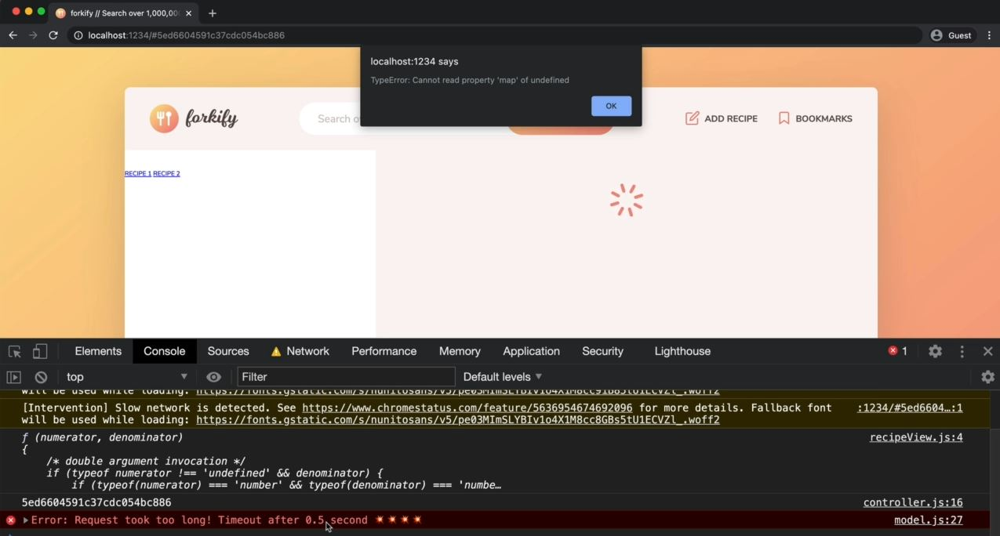

# Helpers and Configuration Files

- many real world applications have two special modules which are completely independent of the rest of the architecture <br>
    & these are a module for the project configuration & also a module for some general helper functions 💡💡💡
- let's start with the configuration module & then we'll see helper module 💡💡💡

## Steps - using helpers & configuration files/modules system for a project

- `STEP 1` : inside `src/js` folder create a file as config.js file 
    - & inside config.js file , we'll put all the variables that should be constants <br>
        & should be reused across the project 💡💡💡
    - & the purpose of having this `config.js` file with all these variables <br> 
        is that it'll allow us to easily configure or project by simply changing some of the data <br>
        which is inside this configuration file 
    - & we'll not want to put all the variables in this file , <br>
        the only variables that we want to put inside this configuration file which are responsible <br> 
        for kind-of defining some important data about the application itself 💡💡💡
    - Eg : inside model.js file , that API URL
        - so that API URL , we'll reuse it multiple places across this project
        - like for getting search data & also for uploading a recipe to the server 💡💡💡
        - but imagine , at some place , this API URL needs to change <br>
            like you're in version 3 of this API URL like this `https://forkify-api.herokuapp.com/api/v3/recipes/${id}` <br>
            that's why we don't want to change that everywhere & simple have a variable which contains this API URL <br>
            so that's why we can reuse this API URL & no need to change the URL everywhere manually
        - now you'll think that can we dine a global variable for at API URL inside model.js file  <br>
            but then we would have all these configuration variables spread across multiple modules <br>
            but it's easier to have all of those variables in one central place i.e inside config.js file 💡💡💡
    - `STEP 1.1` : cut the API URL from model.js file & paste it inside config.js file like this
        - inside config.js file 
            ```js
            export const API_URL = "https://forkify-api.herokuapp.com/api/v3/recipes"
            // Best practices ✅ : for defining constant variable
                // here we define name of the variable all in capital letters
                // because the value of this constant variable will never change 
                // & this is the common practice especially in a configuration file 💡💡💡 
            ```
        - inside model.js file , import the API URL
            ```js
            import { async } from 'regenerator-runtime' ;
            import { API_URL } from '.config.js'
                    
            export const state = {
                recipe: {}
            }

            export const loadRecipe = async function(id) {  
                try {
                    const res = await fetch(`${API_URL}/${id}`)
                    const data = res.json()
                    console.log(data)
                    if (!res.ok) throw new Error(`${data.message} (${res.status})`) 
                    let { recipe } = data.data 
                    
                    // this should be state.recipe , not recipe object
                    state.recipe = { 
                        id:  recipe.id , 
                        title: recipe.title, 
                        publisher: recipe.publisher,
                        sourceUrl: recipe.source_url ,
                        image: recipe.image_url, 
                        servings: recipe.servings, 
                        cookingTime: recipe.cooking_time ,
                        ingredients: recipe.ingredients
                    }

                    console.log(state.recipe) 
                } catch(err) {
                    alert(err)
                }
            }
            ```
            - output : everything works fine
                - so we successfully imported the configuration value i.e API_URL from the config.js file 

- `STEP 2` : now inside `src/js` folder , create a file as `helpers.js` for some helper functions 💡💡💡
    - & that file usually called as helpers.js for helper functions
    - `purpose of this helpers.js file/module` : 
        - it's used to contain a couple of functions that we reuse over & over in our project 
        - so in this helpers.js module , we can have a central place for all of them 💡💡💡
    - inside helpers.js file , 
        - we'll create a function which will get JSON which encapsulates code of loadRecipe async function of model.js file 
        ```js
        // this is will be an async function which will do the fetching & convert to JSON all in one step
            // so due to this , we abstract all the this functionality into one nice function
            // which we can use all over our project 💡💡💡
        export const getJSON = async  function(url) {
            try {
                const res = await fetch(url)
                const data = await res.json()

                if (!res.ok) throw new Error(`${data.message} (${res.status})`)

                return data // here returning the data 
            } catch(err) {
                // usually we console.log(err)
                // but let's say we actually want to handle that error 
                    // inside loadRecipe async function of model.js file 
            }
        }
        ```
    - inside model.js file , importing getJSON async function from helpers.js file/module
        ```js
        import { async } from 'regenerator-runtime' ;
        import { API_URL } from '.config.js'
        import { getJSON } from './helpers.js'
                
        export const state = {
            recipe: {}
        }

        export const loadRecipe = async function(id) {  
            try {

                const data = await getJSON(`${API_URL}/${id}`)
                    // Note ✅ :  here why we used await -> keyword , because if we see that  
                        // we have one async function i.e loadRecipe async function of model.js file which is 
                            // calling another async function i.e getJSON() async function of helpers.js 💡💡💡
                        // so inside getJSON async function returns that data -> variable
                            // so that data -> variable is going to be resolved value 
                                // of the promise which is the getJSON async function returns 💡💡💡
                        // that's why here we used await -> keyword to wait the promise 💡💡💡
                            // & then store that resolved value inside 
                            // the data -> variable inside of loadRecipe async function 
                
                const { recipe } = data.data 
                state.recipe = { 
                    id:  recipe.id , 
                    title: recipe.title, 
                    publisher: recipe.publisher,
                    sourceUrl: recipe.source_url ,
                    image: recipe.image_url, 
                    servings: recipe.servings, 
                    cookingTime: recipe.cooking_time ,
                    ingredients: recipe.ingredients
                }

                console.log(state.recipe) 
            } catch(err) {
                console.log(`${err} 💥💥💥`)
            }
        }
        ```
        - output : `Note` : if we'll get the two error like if we try define wrong API URL while fetching
            - first error will come from getJSON async function which is the actual error i.e 400 <br>
                & second error will come from the loadRecipe async function which is the custom error
            - but this is not we want to handle error like this means we want to handle error ultimately <br> 
                only inside the loadRecipe async function of model.js file 
            - so for this , we need to re-throw the error again inside getJSON async function of helpers.js file 💡💡💡
    - `STEP 2.1` : inside helpers.js file , re-throwing the error inside getJSON() function 
        ```js
        import { async } from 'regenerator-runtime' // this is putted by the parcel in order to make code work

        const timeout = function (s) => {
            return new Promise(function (_, reject) {
                setTimeout(function() {
                    reject(new Error(`Request took too long! Timeout after ${s} second`))
                }, s * 1000)
            })
        }

        export const getJSON = async  function(url) {
            try {
                const res = await Promise.race([fetch(url) , timeout(10)])

                const data = await res.json()

                if (!res.ok) throw new Error(`${data.message} (${res.status})`)

                return data 
            } catch(err) {
                throw err
            }
        }
        ```
    - output : inside model.js file , save the file 
        - now we'll be able to handle the error inside loadRecipe async function <br>
            even if the error occur inside the getJSON async function of helpers.js file 
        - so make a wrong API URL & now refresh the page then we'll get the both error i.e 400 error & custom error <br> 
            inside the catch block of loadRecipe async function 💡💡💡

- `STEP 3` : inside helpers.js file , 
    - let's make that getJSON async function a little bit more robust & real world by adding some timeout <br>
        means setting a time after we making the request & that request fail
    - `Note ✅` : & this is important to prevent for bad internet connections 
        - but if we don't prevent then that `fetch()` function could be running forever 💡💡💡
    - inside controller.js file , cut that timeout() function code 
        ```js
        import * as model from './model.js' 
        import recipeView from './views/recipeView.js'

        import 'core-js/stable' 
        import 'regenerator-runtime/runtime' 

        const recipeContainer = document.querySelector('.recipe')

        const timeout = function (s) => {
            return new Promise(function (_, reject) {
                setTimeout(function() {
                    reject(new Error(`Request took too long! Timeout after ${s} second`))
                }, s * 1000)
            })
        }

        const controlRecipe = async function() {
            try {
                const id = window.location.hash.slice(1)
                console.log(id)

                if (!id) return 
                recipeView.renderSpinner()

                // 1 - Loading recipe
                await model.loadRecipe(id) 

                // 2 - Rendering recipe
                recipeView.render(model.state.recipe)

            } catch(err) {
                alert(err)
            }
        }

        ['hashchange', 'load'].forEach((e) => window.addEventListener(e , controlRecipe)) 
        ```
    - inside helpers.js file , put that timeout() function code 
        ```js
        import { async } from 'regenerator-runtime' // this is putted by the parcel in order to make code work

        const timeout = function (s) => {
            return new Promise(function (_, reject) {
                setTimeout(function() {
                    reject(new Error(`Request took too long! Timeout after ${s} second`))
                }, s * 1000)
            })
        }
        // this function will return a new promise which will reject after a certain number of seconds

        export const getJSON = async  function(url) {
            try {
                const res = await Promise.race([fetch(url) , timeout(0.5)])
                    // so to use this timeout() function & fetch() function together , 
                        // we can use Promise.race([]) promise method
                    // so inside Promise.race([]) promise method , we'll pass two promise as arguments
                        // & if any one of the promise occur first time then it'll win the race 💡💡💡
                        // doesn't matter if that first occurred promise is fulfilled or reject
                    // means as soon as any of the promise inside the race i.e Promise.race([]) promise method 
                        // rejects or fulfilled then that promise will become the winner 💡💡💡
                        // but let's say if the first occurred promise is rejected then
                            // it's reject will be triggered as an error
                            // & then that rejected promise will go 
                                // inside loadRecipe() async function of model.js file 💡💡💡

                const data = await res.json()

                if (!res.ok) throw new Error(`${data.message} (${res.status})`)

                return data 
            } catch(err) {
                throw err
            }
        }
        ```
        - output : change the network as slow3G
            - then refresh the page , now we'll get the timeout error like this 
            
    - inside helpers.js file , change the timeout() value as 10
        ```js
        import { async } from 'regenerator-runtime'

        const timeout = function (s) => {
            return new Promise(function (_, reject) {
                setTimeout(function() {
                    reject(new Error(`Request took too long! Timeout after ${s} second`))
                }, s * 1000)
            })
        }

        export const getJSON = async  function(url) {
            try {
                const res = await Promise.race([fetch(url) , timeout(10)])

                const data = await res.json()

                if (!res.ok) throw new Error(`${data.message} (${res.status})`)

                return data 
            } catch(err) {
                throw err
            }
        }
        ```
        - here one this line i.e `const res = await Promise.race([fetch(url) , timeout(10)])`
            - we passed `10` for timeout which is called magic numbers/value
            - which is like a value nowhere will going to appear in our code 
            - so if someone reads this line code , then if they find the number `10` <br> 
                & not really understand what it's doing & where it came from 💡💡💡
            - so this is a prefect candidate for a configuration value 
        - so go inside config.js file 

- `STEP 4` : inside config.js file 
    ```js
    export const API_URL = "https://forkify-api.herokuapp.com/api/v3/recipes"
    export const TIMEOUT_SEC = 10
    ```
    - inside helpers.js file , import the TIMEOUT_SEC variable
        ```js
        import { async } from 'regenerator-runtime' 
            // this is putted by the parcel in order to make code work

        import { TIMEOUT_SEC } from './config.js'


        const timeout = function (s) => {
            return new Promise(function (_, reject) {
                setTimeout(function() {
                    reject(new Error(`Request took too long! Timeout after ${s} second`))
                }, s * 1000)
            })
        }

        export const getJSON = async  function(url) {
            try {
                const res = await Promise.race([fetch(url) , timeout(TIMEOUT_SEC)])
                    // now if the person see this TIMEOUT_SEC then he/she will understand
                        // that it's one of the configuration values

                const data = await res.json()

                if (!res.ok) throw new Error(`${data.message} (${res.status})`)

                return data 
            } catch(err) {
                throw err
            }
        }
        ```
