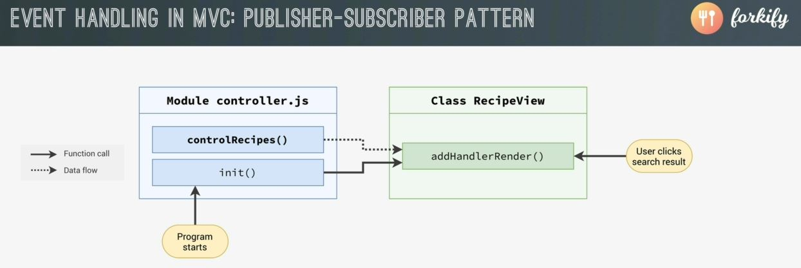
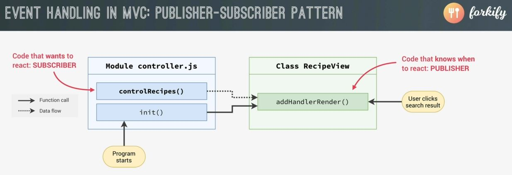
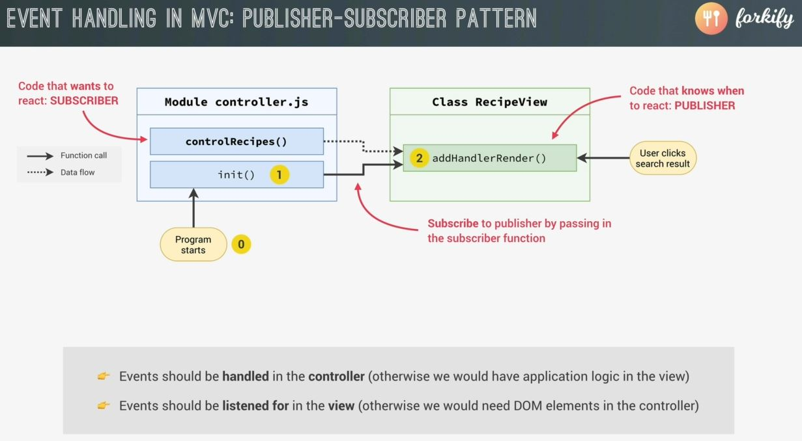
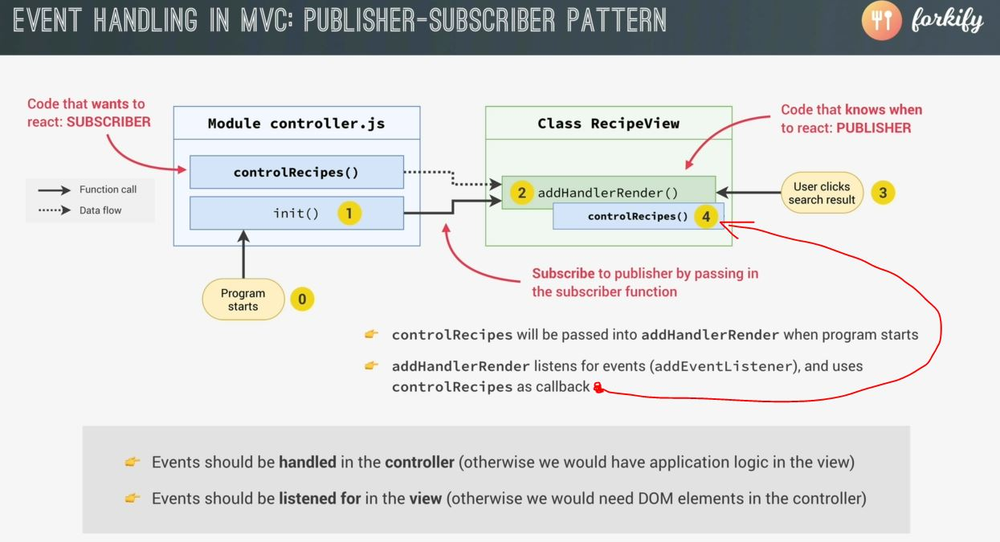
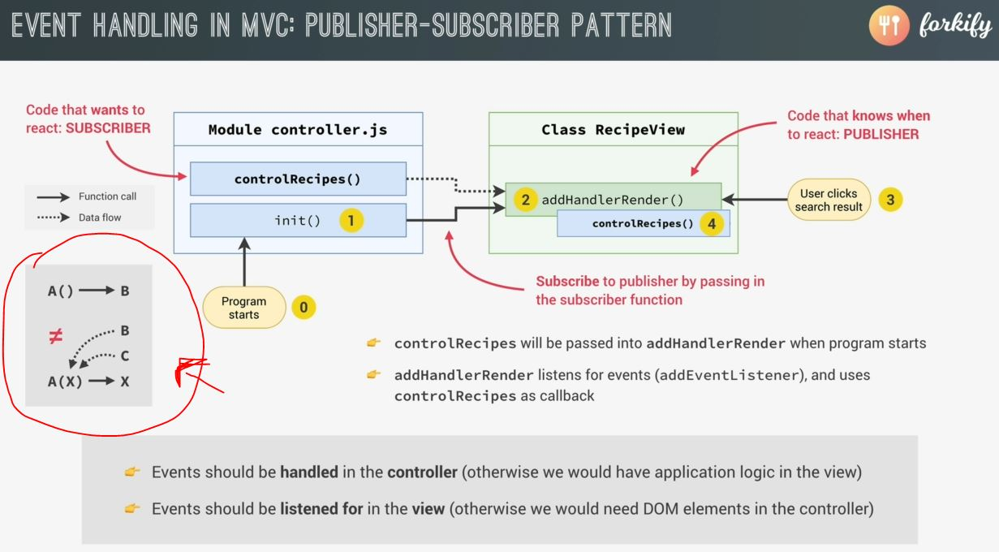

# Event Handlers in MVC : Publisher-Subscriber Pattern

- we'll see how to listen & handle events in MVC architecture by using Publisher-Subscriber Pattern 💡💡💡

## why we need Publisher-Subscriber Pattern ✅

- inside controller.js file , currently we're listening for the `hashchange` & `load` events inside controlRecipes() function
- but it doesn't make any sense because everything is related to the DOM means to the `view` folder <br>
    should be inside of the `view` folder instead of inside the controller.js file 
- now maybe those two events don't really look like they should be inside `view` folder means for the UI <br>
    but imagine that we would be handling the `click` event on some DOM element <br>
    so listening for that `click` event should go inside `view` folder
- so inside controller.js file , we want code of these two event listener inside recipeView.js file 
    ```js
    const controlRecipe = async function() {
        try {
            const id = window.location.hash.slice(1)
            console.log(id)

            if (!id) return 
            recipeView.renderSpinner()

            // 1 - Loading recipe
            await model.loadRecipe(id) 

            // 2 - Rendering recipe
            recipeView.render(model.state.recipe)

        } catch(err) {
            alert(err)
        }
    }

    ['hashchange', 'load'].forEach((e) => window.addEventListener(e , controlRecipe))
    ```
    - `['hashchange', 'load'].forEach((e) => window.addEventListener(e , controlRecipe))`
        - but if we take this line code inside recipeView.js file 
        - but we also want the `controlRecipe` function inside recipeView.js file <br> 
            but we don't want to put code of `controlRecipe` function inside any file of `view` folder 💡💡💡
- now let's see how we can fix this problem 
    - `recap words` : 
        - we want to handle events inside the controller.js file otherwise we would have application logic in the `view` <br>
            but we don't want to put application logic inside any files of `view` folder
        - & we want to listened for the events inside the `view` <br>
            because otherwise we would need DOM elements in the `controller` <br>
            means the presentation logic will be inside the `controller` <br>
            which we don't want & it's not good according to MVC architecture 
    - so actually , we want that listening for the events should be attached <br>
        with the DOM elements inside the files of `view` but the events should handled inside the controller.js
    - inside this architecture of why we need Publisher-Subscriber Pattern <br>
        
        - so we have controlRecipes() function inside controller.js file/module <br>
            & we have the special method inside recipeView.js file of View
        - now you'll think that we can easily connect these two functions through by just calling controlRecipes() function <br>
            inside the view whenever the an event occurs but this can't be possible because according to MVC architecture , <br>
            the `view` doesn't know anything about controller . so due to that , view doesn't import the controller <br>
            so we can't call any functions (of controller.js file) inside view 💡💡💡
        - but we have the good solution i.e Publisher-subscriber pattern  
        - Publisher-subscriber pattern is a one of the design pattern <br>
            & design pattern in programming are just standard solutions for certain kind of problems 💡💡💡
    - `about Publisher-subscriber pattern ✅` : 
        - so in Publisher-subscriber pattern , 
            - we have a `PUBLISHER` which means a code who knows when to react i.e addHandlerRender() function <br>
                because this function will contain add listener method & due to this , it'll know when to react
            - now on the opposite side , we have `SUBSCRIBER` which means a code who wants to react <br>
                means controlRecipes() function is a code should be executed when the event happens 
            - & `remember` : that the PUBLISHER doesn't not yet that SUBSCRIBER exist <br>
                because that SUBSCRIBER is inside the controller which can't be accessed by the view 💡💡💡
            
        - so the solution i.e now we can `Subscribe` to publisher by passing in the subscriber function means in practice , 
            - `first` : as soon as the program loads/starts of controller.js file 
            - `second` : then init() function will be called which immediately <br>
                then call addHandlerRender() function from the `view` 💡💡💡 
            - & this is possible because the controller doesn't import of the view & the model 
            
        - now as we call addHandlerRender() function then we'll pass our controlRecipes() function as an argument <br>
            which means we SUBSCRIBE the controlRecipes() to addHandlerRender() <br> 
            so at this point , two functions are connected with each other 💡💡
        - now addHandlerRender() function listens for events using addEventListener() method & then as soon as <br>
            the event happens then the `controlRecipes()` function will be called as callback function <br>
            of addHandlerRender() function like this 
            
            - means in other words , as soon as the PUBLISHER publish the event then SUBSCRIBER will get called 💡💡💡
        - & this is how we implement event listeners & event handlers in the MVC architecture & this design pattern <br>
            allow us to keep the event handler in the `controller` & the event listeners in the `view` <br>
            & due to this , we can keep things nicely separated according to MVC architecture 💡💡💡
    - `summary of Publisher-subscriber pattern` : 
        - the event handler SUBSCRIBE to the PUBLISHER which is the event listener
        - & then as the PUBLISHER publishes the event then the SUBSCRIBER is executed 💡💡💡
        - if we think even deeper about this pattern then we can see the difference 
            
            - here `A() ---> B` means simple A() function is calling B() directly but in second scenario , <br>
                function A() is receiving function B as an input in order to call that input function i.e X
            - so this is all about control , so in first scenario , function A() is in control but in second scenario , <br>
                function A() has no control . it can be executed whenever it receives that argument 💡💡💡

## Steps - of handling events in MVC via Publisher-Subscriber Pattern

- `STEP 1` : inside controller.js file , cut this line code & paste inside recipeView.js file 
    ```js
    ['hashchange', 'load'].forEach((e) => window.addEventListener(e , controlRecipe))
    ```
    - inside recipeView.js file 
        ```js
        import icons from 'url:../../img/icons.svg' 
        import { Fraction }  from 'fractional' 

        class RecipeView {
            #parentElement = document.querySelector('.recipe')
            #data

            render(data) {
                this.#data = data
                const markup = this.#generateMarkup()
                this.#clear()
                this.#parentElement.insertAdjacentHTML('afterbegin', markup)
            }

            #clear() {
                this.#parentElement.innerHTML = '' 
            }

            renderSpinner = function() { 
                const markup = `
                    <div class="spinner">
                        <svg><use href="${icons}#icon-loader"></use></svg>
                    </div>
                `

                this.#parentElement.innerHTML = ""
                this.#parentElement.insertAdjacentHTML('afterbegin', markup)
            }

            addHandlerRender(handler) {
                // this is not the private method because it needs to be a part 
                    // of the public API , so that we can it in controller.js file 

                ['hashchange', 'load'].forEach((e) => window.addEventListener(e , handler))
                // here we con't know about controlRecipe argument that's why we pass handler as an argument
            }


            #generateMarkup() {
                return `
                    <figure class="recipe__fig">
                        
                        <h1 class="recipe__title">
                          <span>${this.#data.title}</span>
                        </h1>
                    </figure>

                    <div class="recipe__details">
                        <div class="recipe__info">
                            <svg class="recipe__info-icon"><use href="${icons}#icon-clock"></use></svg>
                            <span class="recipe__info-data recipe__info-data--minutes">${this.#data.cookingTime}</span>
                            <span class="recipe__info-text">minutes</span>
                        </div>
                        <div class="recipe__info">
                            <svg class="recipe__info-icon"><use href="${icons}#icon"></use></svg>
                            <span class="recipe__info-data recipe__info-data--people">${this.#data.servings}</span>
                            <span class="recipe__info-text">servings</span>

                            <div class="recipe__info-buttons">
                                <button class="btn--tiny btn--increase-servings">
                                  <svg><use href="${icons}#icon-minus-circle"></use></svg>
                                </button>
                                <button class="btn--tiny btn--increase-servings">
                                  <svg><use href="${icons}#icon-plus-circle"></use></svg>
                                </button>
                            </div>
                        </div>

                        <div class="recipe__user-generated">
                            <svg><use href="${icons}#icon-user"></use></svg>
                        </div>
                        <button class="btn--round">
                            <svg class=""><use href="${icons}#icon-bookmark-fill"></use></svg>
                        </button>
                    </div>

                    <div class="recipe__ingredients">
                        <h2 class="heading--2">Recipe ingredients</h2>
                        <ul class="recipe__ingredient-list">
                            ${this.#data.ingredients.map(this.#generateMarkupIngredient).join('')}
                        </ul>
                    </div>

                    <div class="recipe__directions">
                        <h2 class="heading--2">How to cook it</h2>
                        <p class="recipe__directions-text">
                            This recipe was carefully designed and tested by
                            <span class="recipe__publisher">${this.#data.publisher}</span>. Please check out
                            directions at their website.
                        </p>
                        <a class="btn--small recipe__btn" href="${this.#data.sourceUrl}"target="_blank">
                        <span>Directions</span>
                        <svg class="search__icon"><use href="${icons}#icon-arrow-right"></use></svg>
                      </a>
                    </div>
                ` ;
            }

            #generateMarkupIngredient(ing) {
                return `
                    <li class="recipe__ingredient">
                        <svg class="recipe__icon"><use href="${icons}#icon-check"></use></svg>
                        <div class="recipe__quantity">${ing.quantity ? Fraction(ing.quantity).toString() : ""}</div>
                        <div class="recipe__description">
                            <span class="recipe__unit">${ing.unit}</span>
                            ${ing.description}
                        </div>
                    </li>
                `
            }
        }
        ```

- `STEP 2` : now inside controller.js file 
    ```js
    import * as model from './model.js' 
    import recipeView from './views/recipeView.js'

    import 'core-js/stable' 
    import 'regenerator-runtime/runtime' 

    const recipeContainer = document.querySelector('.recipe')

    const timeout = function (s) => {
        return new Promise(function (_, reject) {
            setTimeout(function() {
                reject(new Error(`Request took too long! Timeout after ${s} second`))
            }, s * 1000)
        })
    }

    const controlRecipe = async function() {
        try {
            const id = window.location.hash.slice(1)
            console.log(id)

            if (!id) return 
            recipeView.renderSpinner()

            // 1 - Loading recipe
            await model.loadRecipe(id) 

            // 2 - Rendering recipe
            recipeView.render(model.state.recipe)

        } catch(err) {
            console.log(err)
        }
    }

    const init = function() {
        recipeView.addHandlerRender(controlRecipes)
    }

    init()
    ```
    - output : now change the network type as online & now both the recipe link will work

- so if we see the flow-chart of forkify architecture recipe loading
    
    - so inside controller.js file , when the program starts then the init() function runs 
    - then init() function will immediately run addHandlerRender() (which is inside recipeView.js) <br> 
        & this addHandlerRender() function is actually listening for the events inside recipeView.js 
    - now as we called the addHandlerRender() function inside controller.js file <br>
        then inside addHandlerRender() , we're passing an argument i.e controlRecipes (which is a event handler function) <br>
        which we want to executed as soon as the event happens 
    - & then inside recipeView.js , receives as a `handler` argument & it'll be executed as soon as event happens
   
- & we can do in the way we like but this is the best way to implement according to MVC architecture <br>
    & we implement the functionality separately for the Model , controller , view <br>  
    without any overlapping responsibilities 💡💡💡

## Conclusion

- [x] see this lecture again because in next one , we'll add more addHandlerRender() function  
