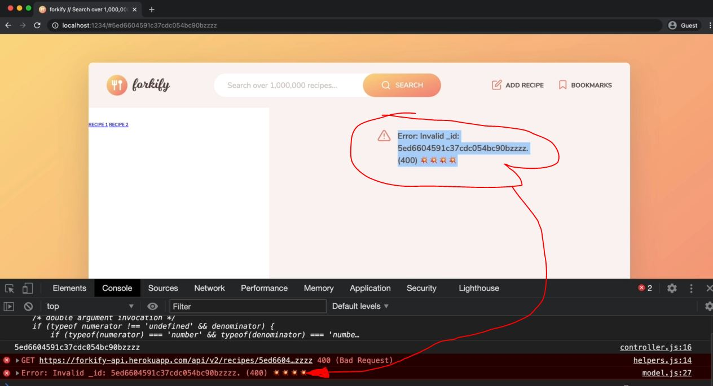

# Implementing Error and Success Messages

- we'll implement real world error handling in our application & show that error on UI instead of doing console.log() for errors
- & the error which which we'll handle i.e when we define false hash id on the URL which can't be found on the server
- right now we're handling errors in the model , but we want to handle the errors inside the recipeView.js file of `view`

## Steps - handling errors inside the recipeView.js file of View instead of in model

- `STEP 1` : go to index.html file & copy this error code which is commented
    ```html
    <div class="error">
        <div>
            <svg><use href="src/img/icons.svg#icon-alert-triangle"></use></svg>
        </div>
        <p>No recipes found for your query. Please try again!</p>
    </div> 
    ```
    - `STEP 1.1` : inside recipeView.js file , create a function for rendering error after the `renderSpinner` function
        ```js
        import icons from 'url:../../img/icons.svg' 
        import { Fraction }  from 'fractional' 

        class RecipeView {
            #parentElement = document.querySelector('.recipe')
            #data

            render(data) {
                this.#data = data
                const markup = this.#generateMarkup()
                this.#clear()
                this.#parentElement.insertAdjacentHTML('afterbegin', markup)
            }

            #clear() {
                this.#parentElement.innerHTML = '' 
            }

            renderSpinner() { 
                const markup = `
                    <div class="spinner">
                        <svg><use href="${icons}#icon-loader"></use></svg>
                    </div>
                `

                this.#clear()
                this.#parentElement.insertAdjacentHTML('afterbegin', markup)
            }

            renderError(message) {
                const markup = `
                    <div class="error">
                        <div>
                            <svg><use href="${icons}#icon-alert-triangle"></use></svg>
                        </div>
                        <p>${message}</p>
                    </div> 
                `

                this.#clear()
                this.#parentElement.insertAdjacentHTML('afterbegin', markup)
            }

            addHandlerRender(handler) {
                ['hashchange', 'load'].forEach((e) => window.addEventListener(e , handler))
            }

            #generateMarkup() {
                return `
                    <figure class="recipe__fig">
                        
                        <h1 class="recipe__title">
                          <span>${this.#data.title}</span>
                        </h1>
                    </figure>

                    <div class="recipe__details">
                        <div class="recipe__info">
                            <svg class="recipe__info-icon"><use href="${icons}#icon-clock"></use></svg>
                            <span class="recipe__info-data recipe__info-data--minutes">${this.#data.cookingTime}</span>
                            <span class="recipe__info-text">minutes</span>
                        </div>
                        <div class="recipe__info">
                            <svg class="recipe__info-icon"><use href="${icons}#icon"></use></svg>
                            <span class="recipe__info-data recipe__info-data--people">${this.#data.servings}</span>
                            <span class="recipe__info-text">servings</span>

                            <div class="recipe__info-buttons">
                                <button class="btn--tiny btn--increase-servings">
                                  <svg><use href="${icons}#icon-minus-circle"></use></svg>
                                </button>
                                <button class="btn--tiny btn--increase-servings">
                                  <svg><use href="${icons}#icon-plus-circle"></use></svg>
                                </button>
                            </div>
                        </div>

                        <div class="recipe__user-generated">
                            <svg><use href="${icons}#icon-user"></use></svg>
                        </div>
                        <button class="btn--round">
                            <svg class=""><use href="${icons}#icon-bookmark-fill"></use></svg>
                        </button>
                    </div>

                    <div class="recipe__ingredients">
                        <h2 class="heading--2">Recipe ingredients</h2>
                        <ul class="recipe__ingredient-list">
                            ${this.#data.ingredients.map(this.#generateMarkupIngredient).join('')}
                        </ul>
                    </div>

                    <div class="recipe__directions">
                        <h2 class="heading--2">How to cook it</h2>
                        <p class="recipe__directions-text">
                            This recipe was carefully designed and tested by
                            <span class="recipe__publisher">${this.#data.publisher}</span>. Please check out
                            directions at their website.
                        </p>
                        <a class="btn--small recipe__btn" href="${this.#data.sourceUrl}"target="_blank">
                        <span>Directions</span>
                        <svg class="search__icon"><use href="${icons}#icon-arrow-right"></use></svg>
                      </a>
                    </div>
                ` ;
            }

            #generateMarkupIngredient(ing) {
                return `
                    <li class="recipe__ingredient">
                        <svg class="recipe__icon"><use href="${icons}#icon-check"></use></svg>
                        <div class="recipe__quantity">${ing.quantity ? Fraction(ing.quantity).toString() : ""}</div>
                        <div class="recipe__description">
                            <span class="recipe__unit">${ing.unit}</span>
                            ${ing.description}
                        </div>
                    </li>
                `
            }
        }
        ```

- `STEP 2` : inside model.js file , we want that catch error inside the recipeView.js 
    - model.js & recipeView.js are connected with each other by the controller.js file 💡💡💡 <br> 
        that's why we need to call `recipeView.renderError()` inside the controller like this
    - inside controller.js file 
        ```js
        import * as model from './model.js' 
        import recipeView from './views/recipeView.js'

        import 'core-js/stable' 
        import 'regenerator-runtime/runtime' 

        const recipeContainer = document.querySelector('.recipe')

        const timeout = function (s) => {
            return new Promise(function (_, reject) {
                setTimeout(function() {
                    reject(new Error(`Request took too long! Timeout after ${s} second`))
                }, s * 1000)
            })
        }

        const controlRecipe = async function() {
            try {
                const id = window.location.hash.slice(1)
                console.log(id)

                if (!id) return 
                recipeView.renderSpinner()

                // 1 - Loading recipe
                await model.loadRecipe(id) 

                // 2 - Rendering recipe
                recipeView.render(model.state.recipe)

            } catch(err) {
                console.log(err)
                recipeView.renderError() // here
            }
        }

        const init = function() {
            recipeView.addHandlerRender(controlRecipes)
        }

        init()
        ```
    - but now from where are we going to get that error message <br>
        because now we have the same problem as before i.e inside helpers.js 
    - so inside helpers.js 
        ```js
        import { async } from 'regenerator-runtime' 
        import { TIMEOUT_SEC } from './config.js'

        const timeout = function (s) => {
            return new Promise(function (_, reject) {
                setTimeout(function() {
                    reject(new Error(`Request took too long! Timeout after ${s} second`))
                }, s * 1000)
            })
        }

        export const getJSON = async  function(url) {
            try {
                const res = await Promise.race([fetch(url) , timeout(TIMEOUT_SEC)])
                const data = await res.json()

                if (!res.ok) throw new Error(`${data.message} (${res.status})`)
                    // where we got this error then that error was not automatically propagated/traveled
                        // inside the async function i.e loadRecipe which is inside model.js file
                        // so we're calling async getJSON() function inside loadRecipe() async function
                    // & then we re-throw the error inside catch() function block  
                        // & that error will traveled/propagate inside mode.js file 💡💡💡
                        // & then again handle the error inside catch() function block inside model.js

                return data 
            } catch(err) {
                throw err
            }
        }
        ```
    - so if we get the error inside model.js file , then that whole loadRecipe() function will not get rejected <br>
        & due to this , inside controller.js file , we'll never enter the catch block of `controlRecipes` function 
    - so we need to throw the error inside loadRecipe() async function of model.js file ✔️✔️✔️

- `STEP 3` : inside model.js file , re-throwing the error
    ```js
    import { async } from 'regenerator-runtime' ;
    import { API_URL } from '.config.js'
    import { getJSON } from './helpers.js'
            
    export const state = {
        recipe: {}
    }

    export const loadRecipe = async function(id) {  
        try {

            const data = await getJSON(`${API_URL}/${id}`)

            const { recipe } = data.data 
            state.recipe = { 
                id:  recipe.id , 
                title: recipe.title, 
                publisher: recipe.publisher,
                sourceUrl: recipe.source_url ,
                image: recipe.image_url, 
                servings: recipe.servings, 
                cookingTime: recipe.cooking_time ,
                ingredients: recipe.ingredients
            }

            console.log(state.recipe) 
        } catch(err) {
            console.log(`${err} 💥💥💥`)
            throw err // here throwing the error again
        }
    }
    ```
    - inside controller.js file 
        ```js
        import * as model from './model.js' 
        import recipeView from './views/recipeView.js'

        import 'core-js/stable' 
        import 'regenerator-runtime/runtime' 

        const recipeContainer = document.querySelector('.recipe')

        const timeout = function (s) => {
            return new Promise(function (_, reject) {
                setTimeout(function() {
                    reject(new Error(`Request took too long! Timeout after ${s} second`))
                }, s * 1000)
            })
        }

        const controlRecipe = async function() {
            try {
                const id = window.location.hash.slice(1)
                console.log(id)

                if (!id) return 
                recipeView.renderSpinner()

                // 1 - Loading recipe
                await model.loadRecipe(id) 

                // 2 - Rendering recipe
                recipeView.render(model.state.recipe)

            } catch(err) {
                recipeView.renderError(`${err} 💥💥💥`) // here
            }
        }

        const init = function() {
            recipeView.addHandlerRender(controlRecipes)
        }

        init()
        ```
        - output : on the UI we'll get the error which is same as printed on console from the model.js file like this
            

- `STEP 4` : let's show the understandable error message for the user
    - inside controller.js file , do you think should we define the custom error message inside catch() function block <br>
        like this `recipeView.renderError("we could not find that recipe. Please try another one!")`
        - so Answer is No , because this error should be the enteric property of the recipeView.js file
    - `STEP 4.1` : inside recipeView.js file , creating a custom error property 
        ```js
        import icons from 'url:../../img/icons.svg' 
        import { Fraction }  from 'fractional' 

        class RecipeView {
            #parentElement = document.querySelector('.recipe')
            #data
            #errorMessage = "we could not find that recipe. Please try another one!"

            render(data) {
                this.#data = data
                const markup = this.#generateMarkup()
                this.#clear()
                this.#parentElement.insertAdjacentHTML('afterbegin', markup)
            }

            #clear() {
                this.#parentElement.innerHTML = '' 
            }

            renderSpinner() { 
                const markup = `
                    <div class="spinner">
                        <svg><use href="${icons}#icon-loader"></use></svg>
                    </div>
                `

                this.#clear()
                this.#parentElement.insertAdjacentHTML('afterbegin', markup)
            }

            renderError(message = this.#errorMessage) {
                // if we don't pass any message then that default custom error will come 💡💡💡

                const markup = `
                    <div class="error">
                        <div>
                            <svg><use href="${icons}#icon-alert-triangle"></use></svg>
                        </div>
                        <p>${message}</p>
                    </div> 
                `

                this.#clear()
                this.#parentElement.insertAdjacentHTML('afterbegin', markup)
            }

            addHandlerRender(handler) {
                ['hashchange', 'load'].forEach((e) => window.addEventListener(e , handler))
            }

            #generateMarkup() {
                return `
                    <figure class="recipe__fig">
                        
                        <h1 class="recipe__title">
                          <span>${this.#data.title}</span>
                        </h1>
                    </figure>

                    <div class="recipe__details">
                        <div class="recipe__info">
                            <svg class="recipe__info-icon"><use href="${icons}#icon-clock"></use></svg>
                            <span class="recipe__info-data recipe__info-data--minutes">${this.#data.cookingTime}</span>
                            <span class="recipe__info-text">minutes</span>
                        </div>
                        <div class="recipe__info">
                            <svg class="recipe__info-icon"><use href="${icons}#icon"></use></svg>
                            <span class="recipe__info-data recipe__info-data--people">${this.#data.servings}</span>
                            <span class="recipe__info-text">servings</span>

                            <div class="recipe__info-buttons">
                                <button class="btn--tiny btn--increase-servings">
                                  <svg><use href="${icons}#icon-minus-circle"></use></svg>
                                </button>
                                <button class="btn--tiny btn--increase-servings">
                                  <svg><use href="${icons}#icon-plus-circle"></use></svg>
                                </button>
                            </div>
                        </div>

                        <div class="recipe__user-generated">
                            <svg><use href="${icons}#icon-user"></use></svg>
                        </div>
                        <button class="btn--round">
                            <svg class=""><use href="${icons}#icon-bookmark-fill"></use></svg>
                        </button>
                    </div>

                    <div class="recipe__ingredients">
                        <h2 class="heading--2">Recipe ingredients</h2>
                        <ul class="recipe__ingredient-list">
                            ${this.#data.ingredients.map(this.#generateMarkupIngredient).join('')}
                        </ul>
                    </div>

                    <div class="recipe__directions">
                        <h2 class="heading--2">How to cook it</h2>
                        <p class="recipe__directions-text">
                            This recipe was carefully designed and tested by
                            <span class="recipe__publisher">${this.#data.publisher}</span>. Please check out
                            directions at their website.
                        </p>
                        <a class="btn--small recipe__btn" href="${this.#data.sourceUrl}"target="_blank">
                        <span>Directions</span>
                        <svg class="search__icon"><use href="${icons}#icon-arrow-right"></use></svg>
                      </a>
                    </div>
                ` ;
            }

            #generateMarkupIngredient(ing) {
                return `
                    <li class="recipe__ingredient">
                        <svg class="recipe__icon"><use href="${icons}#icon-check"></use></svg>
                        <div class="recipe__quantity">${ing.quantity ? Fraction(ing.quantity).toString() : ""}</div>
                        <div class="recipe__description">
                            <span class="recipe__unit">${ing.unit}</span>
                            ${ing.description}
                        </div>
                    </li>
                `
            }
        }
        ```
    - `STEP 4.2` : inside controller.js file , calling recipeView.renderError() inside catch() block
        ```js
        import * as model from './model.js' 
        import recipeView from './views/recipeView.js'

        import 'core-js/stable' 
        import 'regenerator-runtime/runtime' 

        const recipeContainer = document.querySelector('.recipe')

        const timeout = function (s) => {
            return new Promise(function (_, reject) {
                setTimeout(function() {
                    reject(new Error(`Request took too long! Timeout after ${s} second`))
                }, s * 1000)
            })
        }

        const controlRecipe = async function() {
            try {
                const id = window.location.hash.slice(1)
                console.log(id)

                if (!id) return 
                recipeView.renderSpinner()

                // 1 - Loading recipe
                await model.loadRecipe(id) 

                // 2 - Rendering recipe
                recipeView.render(model.state.recipe)

            } catch(err) {
                recipeView.renderError() 
            }
        }

        const init = function() {
            recipeView.addHandlerRender(controlRecipes)
        }

        init()
        ```
        - output : we'll get the custom error message on the UI
            - now with this , we can use this error message strategy in the future 
            - Eg : when there's no search result then we can show this error message

- `STEP 5` : let's implement the success message also
    - right now we don't need this , but good for the future
    - inside reviewView.js file 
        ```js
        import icons from 'url:../../img/icons.svg' 
        import { Fraction }  from 'fractional' 

        class RecipeView {
            #parentElement = document.querySelector('.recipe') ;
            #data ;
            #errorMessage = "we could not find that recipe. Please try another one!" ;
            #message = "";
                // we're leaving empty string we'll tackle in the future

            render(data) {
                this.#data = data
                const markup = this.#generateMarkup()
                this.#clear()
                this.#parentElement.insertAdjacentHTML('afterbegin', markup)
            }

            #clear() {
                this.#parentElement.innerHTML = '' 
            }

            renderSpinner() { 
                const markup = `
                    <div class="spinner">
                        <svg><use href="${icons}#icon-loader"></use></svg>
                    </div>
                `

                this.#clear()
                this.#parentElement.insertAdjacentHTML('afterbegin', markup)
            }

            renderError(message = this.#errorMessage) {
                const markup = `
                    <div class="error">
                        <div>
                            <svg><use href="${icons}#icon-alert-triangle"></use></svg>
                        </div>
                        <p>${message}</p>
                    </div> 
                `

                this.#clear()
                this.#parentElement.insertAdjacentHTML('afterbegin', markup)
            }

            renderMessage(message = this.#message) {
                const markup = `
                    <div class="message">
                        <div>
                            <svg><use href="${icons}#icon-smile"></use></svg>
                        </div>
                        <p>${message}</p>
                    </div> 
                `

                this.#clear()
                this.#parentElement.insertAdjacentHTML('afterbegin', markup)
            }

            addHandlerRender(handler) {
                ['hashchange', 'load'].forEach((e) => window.addEventListener(e , handler))
            }

            #generateMarkup() {
                return `
                    <figure class="recipe__fig">
                        
                        <h1 class="recipe__title">
                          <span>${this.#data.title}</span>
                        </h1>
                    </figure>

                    <div class="recipe__details">
                        <div class="recipe__info">
                            <svg class="recipe__info-icon"><use href="${icons}#icon-clock"></use></svg>
                            <span class="recipe__info-data recipe__info-data--minutes">${this.#data.cookingTime}</span>
                            <span class="recipe__info-text">minutes</span>
                        </div>
                        <div class="recipe__info">
                            <svg class="recipe__info-icon"><use href="${icons}#icon"></use></svg>
                            <span class="recipe__info-data recipe__info-data--people">${this.#data.servings}</span>
                            <span class="recipe__info-text">servings</span>

                            <div class="recipe__info-buttons">
                                <button class="btn--tiny btn--increase-servings">
                                  <svg><use href="${icons}#icon-minus-circle"></use></svg>
                                </button>
                                <button class="btn--tiny btn--increase-servings">
                                  <svg><use href="${icons}#icon-plus-circle"></use></svg>
                                </button>
                            </div>
                        </div>

                        <div class="recipe__user-generated">
                            <svg><use href="${icons}#icon-user"></use></svg>
                        </div>
                        <button class="btn--round">
                            <svg class=""><use href="${icons}#icon-bookmark-fill"></use></svg>
                        </button>
                    </div>

                    <div class="recipe__ingredients">
                        <h2 class="heading--2">Recipe ingredients</h2>
                        <ul class="recipe__ingredient-list">
                            ${this.#data.ingredients.map(this.#generateMarkupIngredient).join('')}
                        </ul>
                    </div>

                    <div class="recipe__directions">
                        <h2 class="heading--2">How to cook it</h2>
                        <p class="recipe__directions-text">
                            This recipe was carefully designed and tested by
                            <span class="recipe__publisher">${this.#data.publisher}</span>. Please check out
                            directions at their website.
                        </p>
                        <a class="btn--small recipe__btn" href="${this.#data.sourceUrl}"target="_blank">
                        <span>Directions</span>
                        <svg class="search__icon"><use href="${icons}#icon-arrow-right"></use></svg>
                      </a>
                    </div>
                ` ;
            }

            #generateMarkupIngredient(ing) {
                return `
                    <li class="recipe__ingredient">
                        <svg class="recipe__icon"><use href="${icons}#icon-check"></use></svg>
                        <div class="recipe__quantity">${ing.quantity ? Fraction(ing.quantity).toString() : ""}</div>
                        <div class="recipe__description">
                            <span class="recipe__unit">${ing.unit}</span>
                            ${ing.description}
                        </div>
                    </li>
                `
            }
        }
        ```

- now in next lecture , we'll implement the searching functionality 
