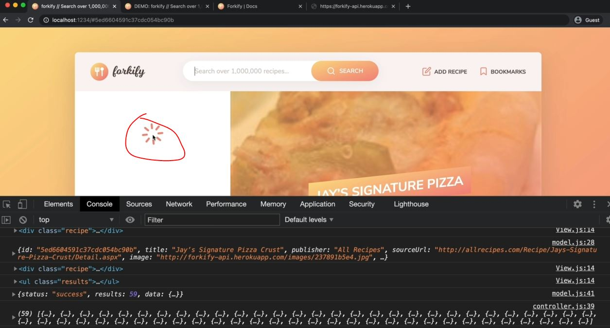
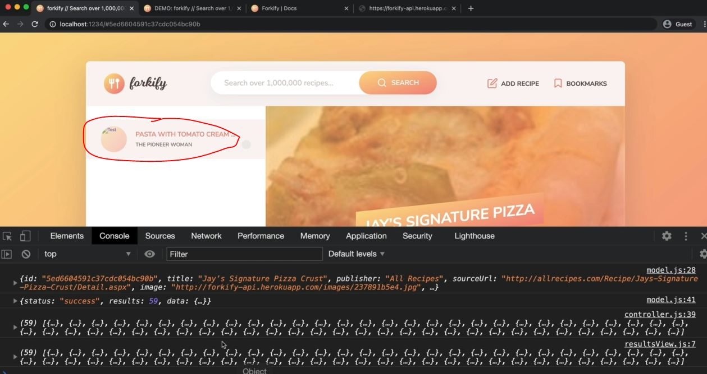

# Implementing Search Results - Part 2

- now let's now render those different stuff related to a food by creating a new view i.e resultsView <br>
    which will contain a render , so that we can call that render inside controller.js file 

## Steps - Implementing Search Results : Part 2

- `STEP 1` : inside `js/views` folder , create a resultsView.js file 
    - inside resultsView.js file 
        ```js
        class ResultsView {
            // this would be same as recipeView.js file
            
        }
        ```
    - now refactor the code of `js/views` folder & create a parent class <br>
        so by creating a parent class then we'll able to reuse all of these methods 
    
- `STEP 2` : inside `js/views` folder , create a `View.js` file 
    - inside View.js file 
        ```js
        export default class View {

        }
        // here we're exporting parent class itself , because we're not going to create any instance 
            // of this View -> class , so we'll only use it as a parent class ✔️
        ```
    - inside recipeView.js file , import that `View` parent class
        ```js
        import View from './View.js'

        import icons from 'url:../../img/icons.svg' 
        import { Fraction }  from 'fractional' 

        class RecipeView {
            #parentElement = document.querySelector('.recipe') ;
            #data ;
            #errorMessage = "we could not find that recipe. Please try another one!" ;
            #message = "";
                // we're leaving empty string we'll tackle in the future

            render(data) {
                this.#data = data
                const markup = this.#generateMarkup()
                this.#clear()
                this.#parentElement.insertAdjacentHTML('afterbegin', markup)
            }

            #clear() {
                this.#parentElement.innerHTML = '' 
            }

            renderSpinner() { 
                const markup = `
                    <div class="spinner">
                        <svg><use href="${icons}#icon-loader"></use></svg>
                    </div>
                `

                this.#clear()
                this.#parentElement.insertAdjacentHTML('afterbegin', markup)
            }

            renderError(message = this.#errorMessage) {
                const markup = `
                    <div class="error">
                        <div>
                            <svg><use href="${icons}#icon-alert-triangle"></use></svg>
                        </div>
                        <p>${message}</p>
                    </div> 
                `

                this.#clear()
                this.#parentElement.insertAdjacentHTML('afterbegin', markup)
            }

            renderMessage(message = this.#message) {
                const markup = `
                    <div class="message">
                        <div>
                            <svg><use href="${icons}#icon-smile"></use></svg>
                        </div>
                        <p>${message}</p>
                    </div> 
                `

                this.#clear()
                this.#parentElement.insertAdjacentHTML('afterbegin', markup)
            }

            addHandlerRender(handler) {
                ['hashchange', 'load'].forEach((e) => window.addEventListener(e , handler))
            }

            #generateMarkup() {
                return `
                    <figure class="recipe__fig">
                        
                        <h1 class="recipe__title">
                          <span>${this.#data.title}</span>
                        </h1>
                    </figure>

                    <div class="recipe__details">
                        <div class="recipe__info">
                            <svg class="recipe__info-icon"><use href="${icons}#icon-clock"></use></svg>
                            <span class="recipe__info-data recipe__info-data--minutes">${this.#data.cookingTime}</span>
                            <span class="recipe__info-text">minutes</span>
                        </div>
                        <div class="recipe__info">
                            <svg class="recipe__info-icon"><use href="${icons}#icon"></use></svg>
                            <span class="recipe__info-data recipe__info-data--people">${this.#data.servings}</span>
                            <span class="recipe__info-text">servings</span>

                            <div class="recipe__info-buttons">
                                <button class="btn--tiny btn--increase-servings">
                                  <svg><use href="${icons}#icon-minus-circle"></use></svg>
                                </button>
                                <button class="btn--tiny btn--increase-servings">
                                  <svg><use href="${icons}#icon-plus-circle"></use></svg>
                                </button>
                            </div>
                        </div>

                        <div class="recipe__user-generated">
                            <svg><use href="${icons}#icon-user"></use></svg>
                        </div>
                        <button class="btn--round">
                            <svg class=""><use href="${icons}#icon-bookmark-fill"></use></svg>
                        </button>
                    </div>

                    <div class="recipe__ingredients">
                        <h2 class="heading--2">Recipe ingredients</h2>
                        <ul class="recipe__ingredient-list">
                            ${this.#data.ingredients.map(this.#generateMarkupIngredient).join('')}
                        </ul>
                    </div>

                    <div class="recipe__directions">
                        <h2 class="heading--2">How to cook it</h2>
                        <p class="recipe__directions-text">
                            This recipe was carefully designed and tested by
                            <span class="recipe__publisher">${this.#data.publisher}</span>. Please check out
                            directions at their website.
                        </p>
                        <a class="btn--small recipe__btn" href="${this.#data.sourceUrl}"target="_blank">
                        <span>Directions</span>
                        <svg class="search__icon"><use href="${icons}#icon-arrow-right"></use></svg>
                      </a>
                    </div>
                ` ;
            }

            #generateMarkupIngredient(ing) {
                return `
                    <li class="recipe__ingredient">
                        <svg class="recipe__icon"><use href="${icons}#icon-check"></use></svg>
                        <div class="recipe__quantity">${ing.quantity ? Fraction(ing.quantity).toString() : ""}</div>
                        <div class="recipe__description">
                            <span class="recipe__unit">${ing.unit}</span>
                            ${ing.description}
                        </div>
                    </li>
                `
            }
        }
        ```
        - now we need to copy everything that should be common to all the views to that parent class <br>
            & right now we need to change on thing i.e with Parcel & babel <br>
            establish inheritance b/w these private fields/properties & private methods
        - that's why we need to use the native way of JS of protected methods & properties <br>
            to establish the inheritance b/w these private fields/properties & private methods of each child classes 💡💡💡

- `STEP 3` : inside recipeView.js file , 
    - converting all the private properties & methods as protected by using a `_` underscore <br>
        before all those properties & methods name
    - in order to establish the inheritance b/w all these properties & methods of a class
    - inside recipeView.js file , 
        ```js
        import View from './View.js'

        import icons from 'url:../../img/icons.svg' 
        import { Fraction }  from 'fractional' 

        class RecipeView {
            _parentElement = document.querySelector('.recipe') ;
            _data ;
            _errorMessage = "we could not find that recipe. Please try another one!" ;
            _message = "";
                // we're leaving empty string we'll tackle in the future

            render(data) {
                this._data = data
                const markup = this._generateMarkup()
                this._clear()
                this._parentElement.insertAdjacentHTML('afterbegin', markup)
            }

            _clear() {
                this._parentElement.innerHTML = '' 
            }

            renderSpinner() { 
                const markup = `
                    <div class="spinner">
                        <svg><use href="${icons}_icon-loader"></use></svg>
                    </div>
                `

                this._clear()
                this._parentElement.insertAdjacentHTML('afterbegin', markup)
            }

            renderError(message = this._errorMessage) {
                const markup = `
                    <div class="error">
                        <div>
                            <svg><use href="${icons}_icon-alert-triangle"></use></svg>
                        </div>
                        <p>${message}</p>
                    </div> 
                `

                this._clear()
                this._parentElement.insertAdjacentHTML('afterbegin', markup)
            }

            renderMessage(message = this._message) {
                const markup = `
                    <div class="message">
                        <div>
                            <svg><use href="${icons}_icon-smile"></use></svg>
                        </div>
                        <p>${message}</p>
                    </div> 
                `

                this._clear()
                this._parentElement.insertAdjacentHTML('afterbegin', markup)
            }

            addHandlerRender(handler) {
                ['hashchange', 'load'].forEach((e) => window.addEventListener(e , handler))
            }

            _generateMarkup() {
                return `
                    <figure class="recipe__fig">
                        
                        <h1 class="recipe__title">
                          <span>${this._data.title}</span>
                        </h1>
                    </figure>

                    <div class="recipe__details">
                        <div class="recipe__info">
                            <svg class="recipe__info-icon"><use href="${icons}#icon-clock"></use></svg>
                            <span class="recipe__info-data recipe__info-data--minutes">${this._data.cookingTime}</span>
                            <span class="recipe__info-text">minutes</span>
                        </div>
                        <div class="recipe__info">
                            <svg class="recipe__info-icon"><use href="${icons}#icon"></use></svg>
                            <span class="recipe__info-data recipe__info-data--people">${this._data.servings}</span>
                            <span class="recipe__info-text">servings</span>

                            <div class="recipe__info-buttons">
                                <button class="btn--tiny btn--increase-servings">
                                  <svg><use href="${icons}#icon-minus-circle"></use></svg>
                                </button>
                                <button class="btn--tiny btn--increase-servings">
                                  <svg><use href="${icons}#icon-plus-circle"></use></svg>
                                </button>
                            </div>
                        </div>

                        <div class="recipe__user-generated">
                            <svg><use href="${icons}#icon-user"></use></svg>
                        </div>
                        <button class="btn--round">
                            <svg class=""><use href="${icons}#icon-bookmark-fill"></use></svg>
                        </button>
                    </div>

                    <div class="recipe__ingredients">
                        <h2 class="heading--2">Recipe ingredients</h2>
                        <ul class="recipe__ingredient-list">
                            ${this._data.ingredients.map(this._generateMarkupIngredient).join('')}
                        </ul>
                    </div>

                    <div class="recipe__directions">
                        <h2 class="heading--2">How to cook it</h2>
                        <p class="recipe__directions-text">
                            This recipe was carefully designed and tested by
                            <span class="recipe__publisher">${this._data.publisher}</span>. Please check out
                            directions at their website.
                        </p>
                        <a class="btn--small recipe__btn" href="${this._data.sourceUrl}"target="_blank">
                        <span>Directions</span>
                        <svg class="search__icon"><use href="${icons}#icon-arrow-right"></use></svg>
                      </a>
                    </div>
                ` ;
            }

            _generateMarkupIngredient(ing) {
                return `
                    <li class="recipe__ingredient">
                        <svg class="recipe__icon"><use href="${icons}#icon-check"></use></svg>
                        <div class="recipe__quantity">${ing.quantity ? Fraction(ing.quantity).toString() : ""}</div>
                        <div class="recipe__description">
                            <span class="recipe__unit">${ing.unit}</span>
                            ${ing.description}
                        </div>
                    </li>
                `
            }
        }
        ```
    - inside searchView.js file , also convert those private properties & methods into as protected
        ```js
        class SearchView {
            _parentEl = document.querySelector('.search')  

            getQuery() {
                const query = this._parentEl.querySelector('.search__field').value
                this._clearInput()
                return query
            }

            _clearInput() {
                this._parentEl.querySelector('.search__field').value = ""
            }

            addHandlerSearch(handler) {
                this._parentEl.addEventListener('submit' , e => {
                    e.preventDefault()
                    handler()
                })
            }
        }

        export default new SearchView() 
        ```
    - now let's extra view related class from that recipeView.js file so in all the view , <br>
        we need render() method , renderSpinner() , etc ... except _generateMarkup() , addHandlerRender() functions <br>
        because _generateMarkup() , addHandlerRender() function are going to be unique to every single view
    - but everything else we want to be the same on all the views , Eg : rendering a spinner will be really easy <br> 
        so all the views will simply have that renderSpinner() method & then we'll be able to call it on that method <br>
        due to `_parentElement` property because it'll know exactly to which element it should attach the spinner <br>
        because _parentElement , _errorMessage & _message property will be unique to each single view <br> 
        but _data will be 

- `STEP 4` : inside recipeView.js file , cut these lines of code 
    ```js
    import View from './View.js'

    import icons from 'url:../../img/icons.svg' 
    import { Fraction }  from 'fractional' 

    class RecipeView {
        _parentElement = document.querySelector('.recipe') ;
        _errorMessage = "we could not find that recipe. Please try another one!" ;
        _message = "";
            // we're leaving empty string we'll tackle in the future

        // cut the code from there
        _data ; // this property also be on the parent
        render(data) {
            this._data = data
            const markup = this._generateMarkup()
            this._clear()
            this._parentElement.insertAdjacentHTML('afterbegin', markup)
        }

        _clear() {
            this._parentElement.innerHTML = '' 
        }

        renderSpinner() { 
            const markup = `
                <div class="spinner">
                    <svg><use href="${icons}_icon-loader"></use></svg>
                </div>
            `

            this._clear()
            this._parentElement.insertAdjacentHTML('afterbegin', markup)
        }

        renderError(message = this._errorMessage) {
            const markup = `
                <div class="error">
                    <div>
                        <svg><use href="${icons}_icon-alert-triangle"></use></svg>
                    </div>
                    <p>${message}</p>
                </div> 
            `

            this._clear()
            this._parentElement.insertAdjacentHTML('afterbegin', markup)
        }

        renderMessage(message = this._message) {
            const markup = `
                <div class="message">
                    <div>
                        <svg><use href="${icons}_icon-smile"></use></svg>
                    </div>
                    <p>${message}</p>
                </div> 
            `

            this._clear()
            this._parentElement.insertAdjacentHTML('afterbegin', markup)
        }
        // till here

        addHandlerRender(handler) {
            ['hashchange', 'load'].forEach((e) => window.addEventListener(e , handler))
        }

        _generateMarkup() {
            return `
                <figure class="recipe__fig">
                    
                    <h1 class="recipe__title">
                      <span>${this._data.title}</span>
                    </h1>
                </figure>

                <div class="recipe__details">
                    <div class="recipe__info">
                        <svg class="recipe__info-icon"><use href="${icons}#icon-clock"></use></svg>
                        <span class="recipe__info-data recipe__info-data--minutes">${this._data.cookingTime}</span>
                        <span class="recipe__info-text">minutes</span>
                    </div>
                    <div class="recipe__info">
                        <svg class="recipe__info-icon"><use href="${icons}#icon"></use></svg>
                        <span class="recipe__info-data recipe__info-data--people">${this._data.servings}</span>
                        <span class="recipe__info-text">servings</span>

                        <div class="recipe__info-buttons">
                            <button class="btn--tiny btn--increase-servings">
                              <svg><use href="${icons}#icon-minus-circle"></use></svg>
                            </button>
                            <button class="btn--tiny btn--increase-servings">
                              <svg><use href="${icons}#icon-plus-circle"></use></svg>
                            </button>
                        </div>
                    </div>

                    <div class="recipe__user-generated">
                        <svg><use href="${icons}#icon-user"></use></svg>
                    </div>
                    <button class="btn--round">
                        <svg class=""><use href="${icons}#icon-bookmark-fill"></use></svg>
                    </button>
                </div>

                <div class="recipe__ingredients">
                    <h2 class="heading--2">Recipe ingredients</h2>
                    <ul class="recipe__ingredient-list">
                        ${this._data.ingredients.map(this._generateMarkupIngredient).join('')}
                    </ul>
                </div>

                <div class="recipe__directions">
                    <h2 class="heading--2">How to cook it</h2>
                    <p class="recipe__directions-text">
                        This recipe was carefully designed and tested by
                        <span class="recipe__publisher">${this._data.publisher}</span>. Please check out
                        directions at their website.
                    </p>
                    <a class="btn--small recipe__btn" href="${this._data.sourceUrl}"target="_blank">
                    <span>Directions</span>
                    <svg class="search__icon"><use href="${icons}#icon-arrow-right"></use></svg>
                  </a>
                </div>
            ` ;
        }

        _generateMarkupIngredient(ing) {
            return `
                <li class="recipe__ingredient">
                    <svg class="recipe__icon"><use href="${icons}#icon-check"></use></svg>
                    <div class="recipe__quantity">${ing.quantity ? Fraction(ing.quantity).toString() : ""}</div>
                    <div class="recipe__description">
                        <span class="recipe__unit">${ing.unit}</span>
                        ${ing.description}
                    </div>
                </li>
            `
        }
    }
    ```
    - inside View.js file , paste those lines of code 
        ```js
        import icons from 'url:../../img/icons.svg' // because inside View.js file , we're also using icons

        export default class View {
            _data ; 

            render(data) {
                this._data = data
                const markup = this._generateMarkup()
                this._clear()
                this._parentElement.insertAdjacentHTML('afterbegin', markup)
            }

            _clear() {
                this._parentElement.innerHTML = '' 
            }

            renderSpinner() { 
                const markup = `
                    <div class="spinner">
                        <svg><use href="${icons}_icon-loader"></use></svg>
                    </div>
                `

                this._clear()
                this._parentElement.insertAdjacentHTML('afterbegin', markup)
            }

            renderError(message = this._errorMessage) {
                const markup = `
                    <div class="error">
                        <div>
                            <svg><use href="${icons}_icon-alert-triangle"></use></svg>
                        </div>
                        <p>${message}</p>
                    </div> 
                `

                this._clear()
                this._parentElement.insertAdjacentHTML('afterbegin', markup)
            }

            renderMessage(message = this._message) {
                const markup = `
                    <div class="message">
                        <div>
                            <svg><use href="${icons}_icon-smile"></use></svg>
                        </div>
                        <p>${message}</p>
                    </div> 
                `

                this._clear()
                this._parentElement.insertAdjacentHTML('afterbegin', markup)
            }
        }
        ```
    - inside recipeView.js file , we need to use `extends` keyword to inherit from `View`
        ```js
        import View from './View.js'

        import icons from 'url:../../img/icons.svg' 
        import { Fraction }  from 'fractional' 

        class RecipeView extends View {
            _parentElement = document.querySelector('.recipe') ;
            _errorMessage = "we could not find that recipe. Please try another one!" ;
            _message = "";

            addHandlerRender(handler) {
                ['hashchange', 'load'].forEach((e) => window.addEventListener(e , handler))
            }

            _generateMarkup() {
                return `
                    <figure class="recipe__fig">
                        
                        <h1 class="recipe__title">
                          <span>${this._data.title}</span>
                        </h1>
                    </figure>

                    <div class="recipe__details">
                        <div class="recipe__info">
                            <svg class="recipe__info-icon"><use href="${icons}#icon-clock"></use></svg>
                            <span class="recipe__info-data recipe__info-data--minutes">${this._data.cookingTime}</span>
                            <span class="recipe__info-text">minutes</span>
                        </div>
                        <div class="recipe__info">
                            <svg class="recipe__info-icon"><use href="${icons}#icon"></use></svg>
                            <span class="recipe__info-data recipe__info-data--people">${this._data.servings}</span>
                            <span class="recipe__info-text">servings</span>

                            <div class="recipe__info-buttons">
                                <button class="btn--tiny btn--increase-servings">
                                  <svg><use href="${icons}#icon-minus-circle"></use></svg>
                                </button>
                                <button class="btn--tiny btn--increase-servings">
                                  <svg><use href="${icons}#icon-plus-circle"></use></svg>
                                </button>
                            </div>
                        </div>

                        <div class="recipe__user-generated">
                            <svg><use href="${icons}#icon-user"></use></svg>
                        </div>
                        <button class="btn--round">
                            <svg class=""><use href="${icons}#icon-bookmark-fill"></use></svg>
                        </button>
                    </div>

                    <div class="recipe__ingredients">
                        <h2 class="heading--2">Recipe ingredients</h2>
                        <ul class="recipe__ingredient-list">
                            ${this._data.ingredients.map(this._generateMarkupIngredient).join('')}
                        </ul>
                    </div>

                    <div class="recipe__directions">
                        <h2 class="heading--2">How to cook it</h2>
                        <p class="recipe__directions-text">
                            This recipe was carefully designed and tested by
                            <span class="recipe__publisher">${this._data.publisher}</span>. Please check out
                            directions at their website.
                        </p>
                        <a class="btn--small recipe__btn" href="${this._data.sourceUrl}"target="_blank">
                        <span>Directions</span>
                        <svg class="search__icon"><use href="${icons}#icon-arrow-right"></use></svg>
                      </a>
                    </div>
                ` ;
            }

            _generateMarkupIngredient(ing) {
                return `
                    <li class="recipe__ingredient">
                        <svg class="recipe__icon"><use href="${icons}#icon-check"></use></svg>
                        <div class="recipe__quantity">${ing.quantity ? Fraction(ing.quantity).toString() : ""}</div>
                        <div class="recipe__description">
                            <span class="recipe__unit">${ing.unit}</span>
                            ${ing.description}
                        </div>
                    </li>
                `
            }
        }
        ```
        - output : so we successfully extracted the `View` class from the recipeView.js 
            - so even without any code in the resultsView.js file <br>
                we're already be able to add a spinner to the search results

- `STEP 5` : inside resultsView.js file 
    ```js
    import View from './View.js'

    class ResultsView extends View {
        _parentElement = document.querySelector('.results')
            // setting the parentEl as 'results' class ul element  
    }

    export default new ResultsView() // only one instance for a result
    ```
    - inside controller.js file , importing resultsView to load the spinner 
        ```js
        import * as model from './model.js' 
        import recipeView from './views/recipeView.js'
        import searchView from './views/searchView.js'
        import resultsView from './views/resultsView.js'

        import 'core-js/stable' 
        import 'regenerator-runtime/runtime' 

        const timeout = function (s) => {
            return new Promise(function (_, reject) {
                setTimeout(function() {
                    reject(new Error(`Request took too long! Timeout after ${s} second`))
                }, s * 1000)
            })
        }

        const controlRecipe = async function() {
            try {
                const id = window.location.hash.slice(1)
                if (!id) return 

                resultsView.renderSpinner()

                // 1 - Loading recipe
                await model.loadRecipe(id) 

                // 2 - Rendering recipe
                recipeView.render(model.state.recipe)

            } catch(err) {
                recipeView.renderError() 
            }
        }

        const controlSearchResults = async function() {
            try {
                resultsView.renderSpinner()
                console.log(resultsView) // to see the whole prototype chain
                    // output : we'll get ResultsView object
                        // which contain undefined value of _data & 
                        // & we don't have any methods inside ResultsView but we have methods inside the parent class

                // 1) Get search query
                const query = searchView.getQuery()
                if (!query) return

                // 2) load search results
                await model.loadSearchResults(query) 

                // 3) Render results
                console.log(model.state.search.results)
            } catch(err) {
                console.log(err)
            }
        }

        controlSearchResults()

        const init = function() {
            recipeView.addHandlerRender(controlRecipes)
            searchView.addHandlerSearch(controlSearchResults)
        }
        init()
        ```
        - output : resultsView.renderSpinner()
            - when we search of pizza & hit ENTER key then we'll get the loading spinner on left side section Like this 
            
        - now ResultsView (of resultsView.js file) is inheriting the renderSpinner() method from it's parent class i.e View.js file 

- `STEP 6` : inside resultsView.js file , creating a html markup for all the food items of that food name
    ```js
    import View from './View.js'

    class ResultsView extends View {
        _parentElement = document.querySelector('.results')

        _generateMarkup() {
            return `
                <li class="preview">
                    <a class="preview__link preview__link--active" href="#23456">
                        <figure class="preview__fig">
                            
                        </figure>
                        <div class="preview__data">
                            <h4 class="preview__title">Pasta with Tomato Cream ...</h4>
                            <p class="preview__publisher">The Pioneer Woman</p>
                            <div class="preview__user-generated">
                                <svg><use href="src/img/icons.svg#icon-user"></use></svg>
                            </div>
                        </div>
                    </a>
                </li>
            `
            // we use preview -> class because later on we'll use the same class to render the bookmarks
        }
    }

    export default new ResultsView() 
    ```
    - now we need to take our data & actually put that data in this html markup <br>
    - inside controller.js file , calling the render() method of resultsView class
        ```js
        import * as model from './model.js' 
        import recipeView from './views/recipeView.js'
        import searchView from './views/searchView.js'
        import resultsView from './views/resultsView.js'

        import 'core-js/stable' 
        import 'regenerator-runtime/runtime' 

        const timeout = function (s) => {
            return new Promise(function (_, reject) {
                setTimeout(function() {
                    reject(new Error(`Request took too long! Timeout after ${s} second`))
                }, s * 1000)
            })
        }

        const controlRecipe = async function() {
            try {
                const id = window.location.hash.slice(1)
                if (!id) return 

                resultsView.renderSpinner()

                // 1 - Loading recipe
                await model.loadRecipe(id) 

                // 2 - Rendering recipe
                recipeView.render(model.state.recipe)

            } catch(err) {
                recipeView.renderError() 
            }
        }

        const controlSearchResults = async function() {
            try {
                resultsView.renderSpinner()

                // 1) Get search query
                const query = searchView.getQuery()
                if (!query) return

                // 2) load search results
                await model.loadSearchResults(query) 

                // 3) Render results
                console.log(model.state.search.results)
                resultsView.render(model.state.search.results)
            } catch(err) {
                console.log(err)
            }
        }

        controlSearchResults()

        const init = function() {
            recipeView.addHandlerRender(controlRecipes)
            searchView.addHandlerSearch(controlSearchResults)
        }
        init()
        ```
    - now inside resultsView.js file , checking this._data
        ```js
        import View from './View.js'

        class ResultsView extends View {
            _parentElement = document.querySelector('.results')

            _generateMarkup() {
                console.log(this._data) // so here this._data is model.state.search.results

                return `
                    <li class="preview">
                        <a class="preview__link preview__link--active" href="#23456">
                            <figure class="preview__fig">
                                
                            </figure>
                            <div class="preview__data">
                                <h4 class="preview__title">Pasta with Tomato Cream ...</h4>
                                <p class="preview__publisher">The Pioneer Woman</p>
                                <div class="preview__user-generated">
                                    <svg><use href="src/img/icons.svg#icon-user"></use></svg>
                                </div>
                            </div>
                        </a>
                    </li>
                `
                // we use preview -> class because later on we'll use the same class to render the bookmarks
            }
        }

        export default new ResultsView() 
        ```
        - output : let's say when we search for `pizza` then we'll get the predefined html code like this
            
        - now here `this._data` is a array so that's why we need to loop over it 

- `STEP 7` : inside resultsView.js file , looping over the this._data 
    - because we don't want to return pre-defined hard coded html markup 
    ```js
    
    ```


✔️✔️✔️
💡💡💡
✅
🔥

