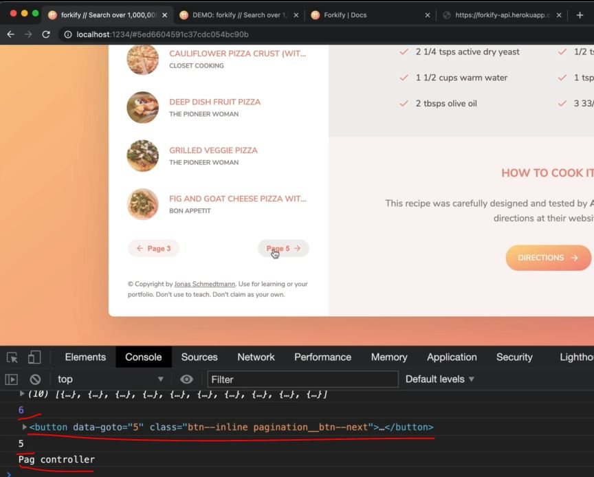

# Implementing Pagination - Part 2

- here we'll render the pagination button 

## different scenario of showing pagination button

- `1 scenario` : if have less than 10 results then don't show any pagination button
- `2 scenario` : when we're on first page then show only the `Page 2` pagination button & no button to go back
- `3 scenario` : if we're on second page then we need to show two buttons , on left side for back & on right side for forward
- `4 scenario` : if we go to the last page then only show a button on left side to go back , not for forward

## Steps - Implementing pagination : Part 2

- let's create a new view for the pagination
- `STEP 1` : inside `js/view` folder , create a file as paginationView.js
    - inside resultsView.js file , copy these lines of code 
        ```js
        import View from './View.js'
        import icons from 'url:../../img/icons.svg' 

        class ResultsView extends View {
            _parentElement = document.querySelector('.results')
        }
        ```
    - inside paginationView.js file , paste those lines of code
        ```js
        import View from './View.js'
        import icons from 'url:../../img/icons.svg' 

        class ResultsView extends View {
            _parentElement = document.querySelector('.results')
        }
        ```
    - inside paginationView.js file , do the changes in the code 
        ```js
        import View from './View.js'
        import icons from 'url:../../img/icons.svg' 

        class PaginationView extends View {
            _parentElement = document.querySelector('.pagination')

            _generateMarkup() {
                // we define same name because because every view that renders something on UI , 
                    // needs a generate markup method

                // now here inside this function , we'll write those scenarios
                
            }
        }
        ```

- `STEP 2` : inside paginationView.js 
    ```js
    import View from './View.js'
    import icons from 'url:../../img/icons.svg' 

    class PaginationView extends View {
        _parentElement = document.querySelector('.pagination')

        _generateMarkup() {
            // Page 1 & there are other pages

            // Page 1 & there are NO other pages

            // last page

            // other page
            
        }
    }

    export default new PaginationView() 
    ```
    - so if we're on Page 1 & there are other pages , then we need that `search` object of `state` object of model.js file <br>
        so we need results , page , resultPerPage -> these data (which are inside `search` object) <br>
        in order to compute which buttons should be displayed
    - so now come inside controller.js file & call the render() function , so that we can parse in the data that we need <br>
        & we want to display the pagination when we're displaying the search results 💡💡💡
    - `STEP 2.1` : inside controller.js file , importing PaginationView class from View.js file 
        ```js
        import * as model from './model.js' 
        import recipeView from './views/recipeView.js'
        import searchView from './views/searchView.js'
        import resultsView from './views/resultsView.js'
        import paginationView from './views/paginationView.js'

        import 'core-js/stable' 
        import 'regenerator-runtime/runtime' 

        const timeout = function (s) => {
            return new Promise(function (_, reject) {
                setTimeout(function() {
                    reject(new Error(`Request took too long! Timeout after ${s} second`))
                }, s * 1000)
            })
        }

        const controlRecipe = async function() {
            try {
                const id = window.location.hash.slice(1)
                if (!id) return 

                resultsView.renderSpinner()

                // 1 - Loading recipe
                await model.loadRecipe(id) 

                // 2 - Rendering recipe
                recipeView.render(model.state.recipe)

            } catch(err) {
                recipeView.renderError() 
            }
        }

        const controlSearchResults = async function() {
            try {
                resultsView.renderSpinner()

                // 1) Get search query
                const query = searchView.getQuery()
                if (!query) return

                // 2) load search results
                await model.loadSearchResults(query) 

                // 3) Render results
                // resultsView.render(model.state.search.results)
                resultsView.render(model.getSearchResultsPage(1)) // & we pass 1 which means starts from page 1

                // 4) render initial pagination buttons
                paginationView.render(model.state.search)

            } catch(err) {
                console.log(err)
            }
        }

        controlSearchResults()

        const init = function() {
            recipeView.addHandlerRender(controlRecipes)
            searchView.addHandlerSearch(controlSearchResults)
        }
        init()
        ```
    - now in order to know if we're on page 1 & there are other pages , we need to know how many pages there are <br>
        so let's compute it also inside paginationView.js file
    - `STEP 2.2` : inside paginationView.js file , computing how many pages are there
        ```js
        import View from './View.js'
        import icons from 'url:../../img/icons.svg' 

        class PaginationView extends View {
            _parentElement = document.querySelector('.pagination')

            _generateMarkup() {
                const numPages = this._data.results / this._data.resultsPerPage
                    // for Eg : we have total 60 results & 10 results for per page 
                        // if we divide 60 / 10 = 6 pages ✔️✔️✔️
                console.log(numPages)

                // Page 1 & there are other pages

                // Page 1 & there are NO other pages

                // last page

                // other page
                
            }
        }

        export default new PaginationView() 
        ```
        - output : when we search pizza & then hit ENTER key the inside the console tab , we'll get NaN
            - & on the UI , inside the pagination section , we'll get undefined <br>
                because if we don't return anything from that thing then by-default undefined is returned   
        - & we need length of the array , not just array like this `this._data.results.length / this._data.resultsPerPage`
    - `STEP 2.3` : inside paginationView.js file , computing number of pages
        ```js
        import View from './View.js'
        import icons from 'url:../../img/icons.svg' 

        class PaginationView extends View {
            _parentElement = document.querySelector('.pagination')

            _generateMarkup() {
                const numPages = this._data.results.length / this._data.resultsPerPage
                    // for Eg : we have total 60 results & 10 results for per page 
                        // if we divide 60 / 10 = 6 pages ✔️✔️✔️
                console.log(numPages)

                // Page 1 & there are other pages

                // Page 1 & there are NO other pages

                // last page

                // other page
                
            }
        }

        export default new PaginationView() 
        ```
        - output : when we search for pizza then we'll get 5.9 inside the console tab
            - so we need to round that number by using Math.ceil() , not Math.round() method 💡💡💡
    - `STEP 2.4` : inside paginationView.js file , rounding the number of pages & doing checking
        ```js
        import View from './View.js'
        import icons from 'url:../../img/icons.svg' 

        class PaginationView extends View {
            _parentElement = document.querySelector('.pagination')

            _generateMarkup() {
                const numPages = Math.ceil(this._data.results.length / this._data.resultsPerPage)
                console.log(numPages)

                // Page 1 & there are other pages
                if (this._data.page === 1) {
                    // this is important that the current page should exist inside state -> object of model.js file
                    
                }

                // Page 1 & there are NO other pages

                // last page

                // other page
                
            }
        }

        export default new PaginationView() 
        ```
        - `STEP 2.4.1` : inside controller.js file , pass `2` as page 2 inside getSearchResultsPage()
            ```js
            import * as model from './model.js' 
            import recipeView from './views/recipeView.js'
            import searchView from './views/searchView.js'
            import resultsView from './views/resultsView.js'
            import paginationView from './views/paginationView.js'

            import 'core-js/stable' 
            import 'regenerator-runtime/runtime' 

            const timeout = function (s) => {
                return new Promise(function (_, reject) {
                    setTimeout(function() {
                        reject(new Error(`Request took too long! Timeout after ${s} second`))
                    }, s * 1000)
                })
            }

            const controlRecipe = async function() {
                try {
                    const id = window.location.hash.slice(1)
                    if (!id) return 

                    resultsView.renderSpinner()

                    // 1 - Loading recipe
                    await model.loadRecipe(id) 

                    // 2 - Rendering recipe
                    recipeView.render(model.state.recipe)

                } catch(err) {
                    recipeView.renderError() 
                }
            }

            const controlSearchResults = async function() {
                try {
                    resultsView.renderSpinner()

                    // 1) Get search query
                    const query = searchView.getQuery()
                    if (!query) return

                    // 2) load search results
                    await model.loadSearchResults(query) 

                    // 3) Render results
                    // resultsView.render(model.state.search.results)
                    resultsView.render(model.getSearchResultsPage(2)) 
                        // & we pass 2 which means starts from page 2 for testing

                    // 4) render initial pagination buttons
                    paginationView.render(model.state.search)

                } catch(err) {
                    console.log(err)
                }
            }

            controlSearchResults()

            const init = function() {
                recipeView.addHandlerRender(controlRecipes)
                searchView.addHandlerSearch(controlSearchResults)
            }
            init()
            ```
        - `STEP 2.4.2` : inside paginationView.js file , we're testing this._data.page === 1
            ```js
            import View from './View.js'
            import icons from 'url:../../img/icons.svg' 

            class PaginationView extends View {
                _parentElement = document.querySelector('.pagination')

                _generateMarkup() {
                    const numPages = Math.ceil(this._data.results.length / this._data.resultsPerPage)
                    console.log(numPages)

                    // Page 1 & there are other pages
                    if (this._data.page === 1 && numPages > 1) {
                        // & current page needs to be less than the number of pages
                        // means number of pages is greater than 1 💡💡💡
                        return 'Page 1, others' 
                    }

                    // last page
                    if (this._data.page === numPages && numPages > 1) {
                        // if current page gets equal-to number of pages then means we're on last page
                        // here we putted the numPages > 1 because if we do this only this._data.page === numPages
                            // then what if we have total 1 page then this condition gets true
                            // that's why we use this._data.page === numPages && numPages > 1
                            // then we'll really on the last page & to render some other buttons 💡💡💡

                        return 'last page'
                    }

                    // other page
                    if (this._data.page < numPages) {
                        return "Other page"
                    }

                    // Page 1 & there are NO other pages
                    return "Only 1 page"
                }
            }

            export default new PaginationView() 
            ```
            - output : now search pizza & hit Enter key , then we'll get Other page when we pass `2` as second page
                - inside controller.js file , pass 6 as a argument inside `resultsView.render(model.getSearchResultsPage(6))` <br> 
                    now search pizza & hit Enter key , we can see `last page` as a output inside pagination section
                - inside controller.js file , pass 1 as a argument inside `resultsView.render(model.getSearchResultsPage(1))` <br>
                    now search pizza & hit Enter key , we can see `page 1, others` as a output inside pagination section
            - now we need to create html markup

- `STEP 3` : inside paginationView.js file , creating html markup for those scenarios
    ```js
    import View from './View.js'
    import icons from 'url:../../img/icons.svg' 

    class PaginationView extends View {
        _parentElement = document.querySelector('.pagination')

        _generateMarkup() {
            const curPage = this._data.page
            const numPages = Math.ceil(this._data.results.length / this._data.resultsPerPage)
            console.log(numPages)

            // Page 1 & there are other pages
            if (curPage === 1 && numPages > 1) {
                return `
                    <button class="btn--inline pagination__btn--next">
                        <span>Page ${curPage + 1}</span>
                        <svg class="search__icon"><use href="${icons}#icon-arrow-right"></use></svg>
                    </button>
                ` 
            }

            // last page
            if (curPage === numPages && numPages > 1) {
                return `
                    <button class="btn--inline pagination__btn--prev">
                        <svg class="search__icon"><use href="${icons}#icon-arrow-left"></use></svg>
                        <span>Page ${curPage - 1}</span>
                    </button>
                `
            }

            // other page
            if (curPage < numPages) {
                return `
                    <button class="btn--inline pagination__btn--prev">
                        <svg class="search__icon"><use href="${icons}#icon-arrow-left"></use></svg>
                        <span>Page ${curPage - 1}</span>
                    </button>
                    <button class="btn--inline pagination__btn--next">
                        <span>Page ${curPage + 1}</span>
                        <svg class="search__icon"><use href="${icons}#icon-arrow-right"></use></svg>
                    </button>
                ` 
            }

            // Page 1 & there are NO other pages
            return "" 
                // if we're on Page 1 then return nothing 
        }
    }

    export default new PaginationView() 
    ```
    - output : inside controller.js file , 
        - `1 scenario` : we already pass `1` as argument i.e `resultsView.render(model.getSearchResultsPage(1))` <br> 
            - which means we'll get the page 2 
            - so inside search pizza then hit ENTER then we'll get `Page 2` button inside pagination section
        - `2 scenario` : now if we pass 4 as a argument like this `resultsView.render(model.getSearchResultsPage(4))` 
            - now search pizza then we'll get `<- Page 3` & `Page 5 ->` inside pagination section 
            - so passing 4 as a argument there means we're right now on page 4
        - `3 scenario` :  
            - now pass 6 as a argument like this `resultsView.render(model.getSearchResultsPage(6))` 
            - now search pizza then we'll get `<- Page 5` button & no forward button we'll get 
    - now inside paginationView.js file , things html markup is getting repeated , so let's refactor it <br>
        & we'll not do refactoring here inside this file & try to do it by yourself as a challenge 💡💡💡 <br>
        Eg : you might create a method called like generate markup button & then refactor that code in that method

- `STEP 4` : now we need to add the click event on those buttons of pagination
    - so for that , we're gonna use PUBLISHER SUBSCRIBER pattern 💡💡💡 <br>
    - inside paginationView.js file , creating a function which is going to be a PUBLISHER
        ```js
        import View from './View.js'
        import icons from 'url:../../img/icons.svg' 

        class PaginationView extends View {
            _parentElement = document.querySelector('.pagination')

            addHandlerClick(handler) {
                // here we're going to use event delegation concept
                    // because there are going to be two buttons 
                    // & we don't want to listen to each of them individually 
                // so we'll add the event listener to the common parent element 💡💡💡
                this._parentElement.addEventListener('click' , function(e) {
                    // first we need to know which button was clicked based on the event i.e event delegation
                    const btn = e.target.closest('.btn--inline')
                        // closest() method used to lookup in the DOM tree for that parent 
                        // querySelector() or querySelectorAll() method used to search down 
                            // in the DOM tree for that child or children 💡💡💡

                        // we're selecting the parent element because we might actually click on that span element
                            // which is inside the those pagination buttons or on that svg 
                            // instead of clicking on the button itself 
                        // so we can't simply set the button as e.target but we actually need to search 
                            // for the closest button element itself

                    console.log(btn)
                    handler()
                })
            }

            _generateMarkup() {
                const curPage = this._data.page
                const numPages = Math.ceil(this._data.results.length / this._data.resultsPerPage)
                console.log(numPages)

                // Page 1 & there are other pages
                if (curPage === 1 && numPages > 1) {
                    return `
                        <button class="btn--inline pagination__btn--next">
                            <span>Page ${curPage + 1}</span>
                            <svg class="search__icon"><use href="${icons}#icon-arrow-right"></use></svg>
                        </button>
                    ` 
                }

                // last page
                if (curPage === numPages && numPages > 1) {
                    return `
                        <button class="btn--inline pagination__btn--prev">
                            <svg class="search__icon"><use href="${icons}#icon-arrow-left"></use></svg>
                            <span>Page ${curPage - 1}</span>
                        </button>
                    `
                }

                // other page
                if (curPage < numPages) {
                    return `
                        <button class="btn--inline pagination__btn--prev">
                            <svg class="search__icon"><use href="${icons}#icon-arrow-left"></use></svg>
                            <span>Page ${curPage - 1}</span>
                        </button>
                        <button class="btn--inline pagination__btn--next">
                            <span>Page ${curPage + 1}</span>
                            <svg class="search__icon"><use href="${icons}#icon-arrow-right"></use></svg>
                        </button>
                    ` 
                }

                // Page 1 & there are NO other pages
                return "" 
            }
        }

        export default new PaginationView() 
        ```
    - `STEP 4.1` : inside controller.js file , creating a new controller
        ```js
        import * as model from './model.js' 
        import recipeView from './views/recipeView.js'
        import searchView from './views/searchView.js'
        import resultsView from './views/resultsView.js'
        import paginationView from './views/paginationView.js'

        import 'core-js/stable' 
        import 'regenerator-runtime/runtime' 

        const timeout = function (s) => {
            return new Promise(function (_, reject) {
                setTimeout(function() {
                    reject(new Error(`Request took too long! Timeout after ${s} second`))
                }, s * 1000)
            })
        }

        const controlRecipe = async function() {
            try {
                const id = window.location.hash.slice(1)
                if (!id) return 

                resultsView.renderSpinner()

                // 1 - Loading recipe
                await model.loadRecipe(id) 

                // 2 - Rendering recipe
                recipeView.render(model.state.recipe)

            } catch(err) {
                recipeView.renderError() 
            }
        }

        const controlSearchResults = async function() {
            try {
                resultsView.renderSpinner()

                // 1) Get search query
                const query = searchView.getQuery()
                if (!query) return

                // 2) load search results
                await model.loadSearchResults(query) 

                // 3) Render results
                // resultsView.render(model.state.search.results)
                resultsView.render(model.getSearchResultsPage(2)) 
                    // & we pass 2 which means starts from page 2 for testing

                // 4) render initial pagination buttons
                paginationView.render(model.state.search)

            } catch(err) {
                console.log(err)
            }
        }

        const controlPagination = function() {
            console.log("Pag controller")
        }

        const init = function() {
            recipeView.addHandlerRender(controlRecipes)
            searchView.addHandlerSearch(controlSearchResults)
            paginationView.addHandlerClick(controlPagination)
        }
        init()
        ```
        - output : when we search pizza & then hit ENTER key
            - then inside the console tab , we'll get a button i.e `<- Page 5` button 
            - & when we click on that pagination button <br>
                then we'll get that button element itself & the `Pag controller` as a output
        - but we selected the button because we need a way of knowing which is the page we need to go now <br>
            & that button say page 5 but how will JS know that it should now actually display the results of page number 5 . <br>
            that's why we need to establish a connection b/w the DOM & our code by using the custom data attributes ✅
        - so let's create a custom data attribute on each of the buttons which will contain the page that we want to go <br>
            then in our code , we can read that data & make JS or make our application go to that exact page
    - `STEP 4.2` : inside paginationView.js file , 
        - creating custom data attribute for each pagination button of those different scenarios
        ```js
        import View from './View.js'
        import icons from 'url:../../img/icons.svg' 

        class PaginationView extends View {
            _parentElement = document.querySelector('.pagination')

            addHandlerClick(handler) {
                this._parentElement.addEventListener('click' , function(e) {
                    const btn = e.target.closest('.btn--inline')

                    const goToPage = btn.dataset.goto
                    console.log(goToPage)

                    handler()
                })
            }

            _generateMarkup() {
                const curPage = this._data.page
                const numPages = Math.ceil(this._data.results.length / this._data.resultsPerPage)
                console.log(numPages)

                // Page 1 & there are other pages
                if (curPage === 1 && numPages > 1) {
                    return `
                        <button data-goto="${curPage + 1}" class="btn--inline pagination__btn--next">
                            <span>Page ${curPage + 1}</span>
                            <svg class="search__icon"><use href="${icons}#icon-arrow-right"></use></svg>
                        </button>
                    ` 
                }

                // last page
                if (curPage === numPages && numPages > 1) {
                    return `
                        <button data-goto="${curPage - 1}" class="btn--inline pagination__btn--prev">
                            <svg class="search__icon"><use href="${icons}#icon-arrow-left"></use></svg>
                            <span>Page ${curPage - 1}</span>
                        </button>
                    `
                }

                // other page
                if (curPage < numPages) {
                    return `
                        <button data-goto="${curPage - 1}" class="btn--inline pagination__btn--prev">
                            <svg class="search__icon"><use href="${icons}#icon-arrow-left"></use></svg>
                            <span>Page ${curPage - 1}</span>
                        </button>
                        <button data-goto="${curPage + 1}" class="btn--inline pagination__btn--next">
                            <span>Page ${curPage + 1}</span>
                            <svg class="search__icon"><use href="${icons}#icon-arrow-right"></use></svg>
                        </button>
                    ` 
                }

                // Page 1 & there are NO other pages
                return "" 
            }
        }

        export default new PaginationView() 
        ```
        - `STEP 4.2.1` : inside controller.js file , pass 4 to start from page 4 
            - inside this `resultsView.model(model.getSearchResultsPage(4))` , just to get two buttons 
        - output : when we search pizza & then we'll get two button i.e `Page 3` & `Page 5` 
            - & if we click on `Page 5` then we'll get this output 
                
            - if we again click on output means on pagination section then we'll get `null`
    - `STEP 4.3` : inside paginationView.js file , using guard clause for if there's no button 
        - & convert value of data attribute into integer
        ```js
        import View from './View.js'
        import icons from 'url:../../img/icons.svg' 

        class PaginationView extends View {
            _parentElement = document.querySelector('.pagination')

            addHandlerClick(handler) {
                this._parentElement.addEventListener('click' , function(e) {
                    const btn = e.target.closest('.btn--inline')
                    if (!btn) return

                    const goToPage = +btn.dataset.goto
                    console.log(goToPage)

                    handler()
                })
            }

            _generateMarkup() {
                const curPage = this._data.page
                const numPages = Math.ceil(this._data.results.length / this._data.resultsPerPage)
                console.log(numPages)

                // Page 1 & there are other pages
                if (curPage === 1 && numPages > 1) {
                    return `
                        <button data-goto="${curPage + 1}" class="btn--inline pagination__btn--next">
                            <span>Page ${curPage + 1}</span>
                            <svg class="search__icon"><use href="${icons}#icon-arrow-right"></use></svg>
                        </button>
                    ` 
                }

                // last page
                if (curPage === numPages && numPages > 1) {
                    return `
                        <button data-goto="${curPage - 1}" class="btn--inline pagination__btn--prev">
                            <svg class="search__icon"><use href="${icons}#icon-arrow-left"></use></svg>
                            <span>Page ${curPage - 1}</span>
                        </button>
                    `
                }

                // other page
                if (curPage < numPages) {
                    return `
                        <button data-goto="${curPage - 1}" class="btn--inline pagination__btn--prev">
                            <svg class="search__icon"><use href="${icons}#icon-arrow-left"></use></svg>
                            <span>Page ${curPage - 1}</span>
                        </button>
                        <button data-goto="${curPage + 1}" class="btn--inline pagination__btn--next">
                            <span>Page ${curPage + 1}</span>
                            <svg class="search__icon"><use href="${icons}#icon-arrow-right"></use></svg>
                        </button>
                    ` 
                }

                // Page 1 & there are NO other pages
                return "" 
            }
        }

        export default new PaginationView() 
        ```
        - output : search pasta & hit ENTER & then we'll get `Page 3` & `Page 5`
            - & when we click on `Page 3` button then we'll get `3` & same with `Page 5`
        - so we can pass that number to the controller & then inside the controller , use that number <br>
            to render the results on that page that we want by using getSearchResultsPage() method ✔️✔️✔️

- `STEP 5` : inside paginationView.js file , pass that goToPage inside handler() function
    ```js
    import View from './View.js'
    import icons from 'url:../../img/icons.svg' 

    class PaginationView extends View {
        _parentElement = document.querySelector('.pagination')

        addHandlerClick(handler) {
            this._parentElement.addEventListener('click' , function(e) {
                const btn = e.target.closest('.btn--inline')
                if (!btn) return

                const goToPage = +btn.dataset.goto

                handler(goToPage)
            })
        }

        _generateMarkup() {
            const curPage = this._data.page
            const numPages = Math.ceil(this._data.results.length / this._data.resultsPerPage)
            console.log(numPages)

            // Page 1 & there are other pages
            if (curPage === 1 && numPages > 1) {
                return `
                    <button data-goto="${curPage + 1}" class="btn--inline pagination__btn--next">
                        <span>Page ${curPage + 1}</span>
                        <svg class="search__icon"><use href="${icons}#icon-arrow-right"></use></svg>
                    </button>
                ` 
            }

            // last page
            if (curPage === numPages && numPages > 1) {
                return `
                    <button data-goto="${curPage - 1}" class="btn--inline pagination__btn--prev">
                        <svg class="search__icon"><use href="${icons}#icon-arrow-left"></use></svg>
                        <span>Page ${curPage - 1}</span>
                    </button>
                `
            }

            // other page
            if (curPage < numPages) {
                return `
                    <button data-goto="${curPage - 1}" class="btn--inline pagination__btn--prev">
                        <svg class="search__icon"><use href="${icons}#icon-arrow-left"></use></svg>
                        <span>Page ${curPage - 1}</span>
                    </button>
                    <button data-goto="${curPage + 1}" class="btn--inline pagination__btn--next">
                        <span>Page ${curPage + 1}</span>
                        <svg class="search__icon"><use href="${icons}#icon-arrow-right"></use></svg>
                    </button>
                ` 
            }

            // Page 1 & there are NO other pages
            return "" 
        }
    }

    export default new PaginationView() 
    ```
    - `STEP 5.1` : inside controller.js file , let's work on controlPagination() function
        ```js
        import * as model from './model.js' 
        import recipeView from './views/recipeView.js'
        import searchView from './views/searchView.js'
        import resultsView from './views/resultsView.js'
        import paginationView from './views/paginationView.js'

        import 'core-js/stable' 
        import 'regenerator-runtime/runtime' 

        const timeout = function (s) => {
            return new Promise(function (_, reject) {
                setTimeout(function() {
                    reject(new Error(`Request took too long! Timeout after ${s} second`))
                }, s * 1000)
            })
        }

        const controlRecipe = async function() {
            try {
                const id = window.location.hash.slice(1)
                if (!id) return 

                resultsView.renderSpinner()

                // 1 - Loading recipe
                await model.loadRecipe(id) 

                // 2 - Rendering recipe
                recipeView.render(model.state.recipe)

            } catch(err) {
                recipeView.renderError() 
            }
        }

        const controlSearchResults = async function() {
            try {
                resultsView.renderSpinner()

                // 1) Get search query
                const query = searchView.getQuery()
                if (!query) return

                // 2) load search results
                await model.loadSearchResults(query) 

                // 3) Render results
                // resultsView.render(model.state.search.results)
                resultsView.render(model.getSearchResultsPage(2)) 
                    // & we pass 2 which means starts from page 2 for testing

                // 4) render initial pagination buttons
                paginationView.render(model.state.search) // here we're rendering the pagination 

            } catch(err) {
                console.log(err)
            }
        }

        const controlPagination = function(goToPage) { // here we're controlling pagination
            console.log(goToPage)  
        }

        const init = function() {
            recipeView.addHandlerRender(controlRecipes)
            searchView.addHandlerSearch(controlSearchResults)
            paginationView.addHandlerClick(controlPagination)
        }
        init()
        ```
        - output : search pizza & click on `Page 5` then inside the console , we'll get `5` from controller.js:55
        - so when we click on `Page 5` then we should get number of items of `Page 5` <br>
            & then also new buttons should render inside pagination section i.e `Page 4` & `Page 6`  
    - `STEP 5.2` : inside controller.js file , creating new results
        ```js
        import * as model from './model.js' 
        import recipeView from './views/recipeView.js'
        import searchView from './views/searchView.js'
        import resultsView from './views/resultsView.js'
        import paginationView from './views/paginationView.js'

        import 'core-js/stable' 
        import 'regenerator-runtime/runtime' 

        const timeout = function (s) => {
            return new Promise(function (_, reject) {
                setTimeout(function() {
                    reject(new Error(`Request took too long! Timeout after ${s} second`))
                }, s * 1000)
            })
        }

        const controlRecipe = async function() {
            try {
                const id = window.location.hash.slice(1)
                if (!id) return 

                resultsView.renderSpinner()

                // 1 - Loading recipe
                await model.loadRecipe(id) 

                // 2 - Rendering recipe
                recipeView.render(model.state.recipe)

            } catch(err) {
                recipeView.renderError() 
            }
        }

        const controlSearchResults = async function() {
            try {
                resultsView.renderSpinner()

                // 1) Get search query
                const query = searchView.getQuery()
                if (!query) return

                // 2) load search results
                await model.loadSearchResults(query) 

                // 3) Render results
                resultsView.render(model.getSearchResultsPage(3)) // for testing , we pass 3 

                // 4) render initial pagination buttons
                paginationView.render(model.state.search) 

            } catch(err) {
                console.log(err)
            }
        }

        const controlPagination = function(goToPage) { 
            // 1) Render NEW results
            resultsView.render(model.getSearchResultsPage(goToPage)) 
                // here render() method will work means it'll overwrite the markup which was previously there
                // because inside View.js file , 
                    // we have this._clear()
                    // so before any new HTML inserted into the page , the parentElement will get cleared 
                // so render() method will overwrite everything which was there & puts the new content in the same place  

            // 2) render NEW  pagination buttons
            paginationView.render(model.state.search) 
        }

        const init = function() {
            recipeView.addHandlerRender(controlRecipes)
            searchView.addHandlerSearch(controlSearchResults)
            paginationView.addHandlerClick(controlPagination)
        }
        init()
        ```
        - output : search pizza & hit ENTER 
            - then click on `Page 4` then we'll get items of `Page 4` & we change the forward button as `Page 5`
            - & if we click on `Page 5` then we'll get items of `Page 5` & both back & forward button gets changed
    - `STEP 5.3` : inside controller.js file , pass nothing inside getSearchResultsPage() method
        - like this
        ```js
        import * as model from './model.js' 
        import recipeView from './views/recipeView.js'
        import searchView from './views/searchView.js'
        import resultsView from './views/resultsView.js'
        import paginationView from './views/paginationView.js'

        import 'core-js/stable' 
        import 'regenerator-runtime/runtime' 

        const timeout = function (s) => {
            return new Promise(function (_, reject) {
                setTimeout(function() {
                    reject(new Error(`Request took too long! Timeout after ${s} second`))
                }, s * 1000)
            })
        }

        const controlRecipe = async function() {
            try {
                const id = window.location.hash.slice(1)
                if (!id) return 

                resultsView.renderSpinner()

                // 1 - Loading recipe
                await model.loadRecipe(id) 

                // 2 - Rendering recipe
                recipeView.render(model.state.recipe)

            } catch(err) {
                recipeView.renderError() 
            }
        }

        const controlSearchResults = async function() {
            try {
                resultsView.renderSpinner()

                // 1) Get search query
                const query = searchView.getQuery()
                if (!query) return

                // 2) load search results
                await model.loadSearchResults(query) 

                // 3) Render results
                resultsView.render(model.getSearchResultsPage()) 
                    // here we didn't pass anything which means we're on Page 1 

                // 4) render initial pagination buttons
                paginationView.render(model.state.search) 

            } catch(err) {
                console.log(err)
            }
        }

        const controlPagination = function(goToPage) { 
            // 1) Render NEW results
            resultsView.render(model.getSearchResultsPage(goToPage)) 

            // 2) render NEW  pagination buttons
            paginationView.render(model.state.search) 
        }

        const init = function() {
            recipeView.addHandlerRender(controlRecipes)
            searchView.addHandlerSearch(controlSearchResults)
            paginationView.addHandlerClick(controlPagination)
        }
        init()
        ```
        - output : inside config.js file , if we change the RES_PER_PAGE as 50
            - & search pasta then inside the console tab , we'll get (45) result
            - & we'll not get any pagination button
            - so now change the RES_PER_PAGE as 10 only as meaningful value

- so inside flowchart of forkify flowchart part 1 , we did everything <br>
    so in this lecture , we did user clicks pagination & render pagination button <br>
    & render the corresponding search results

## conclusion 

- analyze the code which is inside controlPagination() function & that initializing the pagination <br>
    inside controller.js file & understand the flow of code especially goToPage
