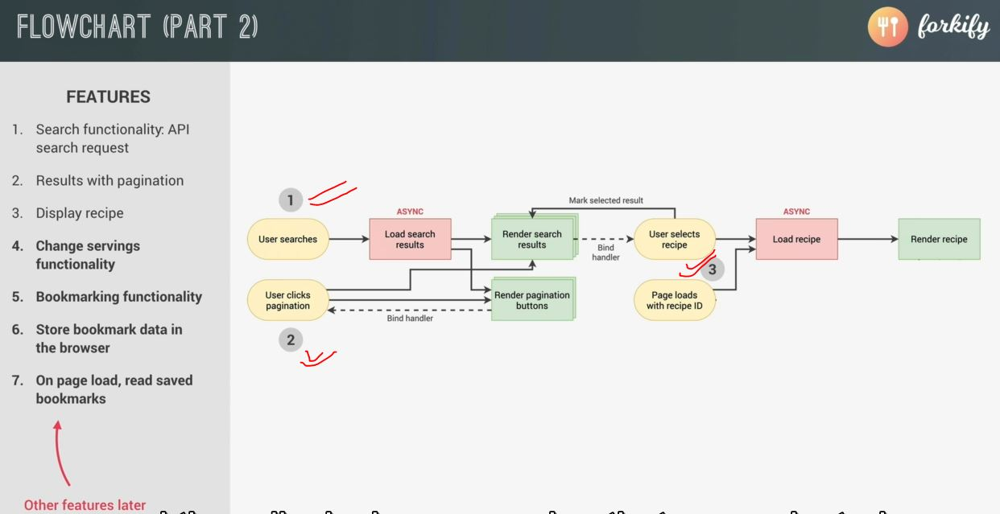
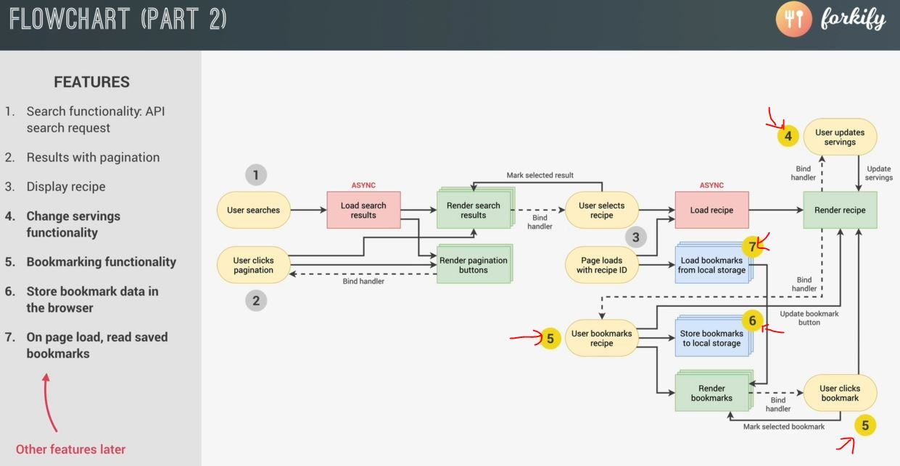

# Project Planning 2

- so the core functionality is already working of our app i.e 
    - `1` : search functionality
    - `2` : displaying the pagination
    - `3` : displaying any recipe that was selected
    

- let's think about how to implement next features
    - `4` : change servings functionality
        - for this we need to listen & handle events on the change servings buttons
        - & then update the recipe & render it again
    - `5` : bookmarking functionality
        - it's little bit complex to implement 
        - so starting with the event , more on the left side whenever the user bookmarks a certain recipe  
            then we want to render that bookmarks in the special bookmarks panel  
            & we also want to update the button in the recipe . so basically , we'll re-render the recipe  
            now whenever the user clicks one of the bookmarks (which is another event)  
            then we want to render exactly that a recipe that was clicked
        - here we need two events 
    - `6` : store bookmark data in the browser
        - we want to store this personalized bookmark data in the browser  
            & also a read it back when the page is loaded for the next time
        - so whenever there's a new bookmark then store all the bookmarks to local storage  
            & then when the page loads then we load all the bookmarks back from the local storage & render them
    - `7` : on page load , read saved bookmarks 

- flow chart of new features
    
