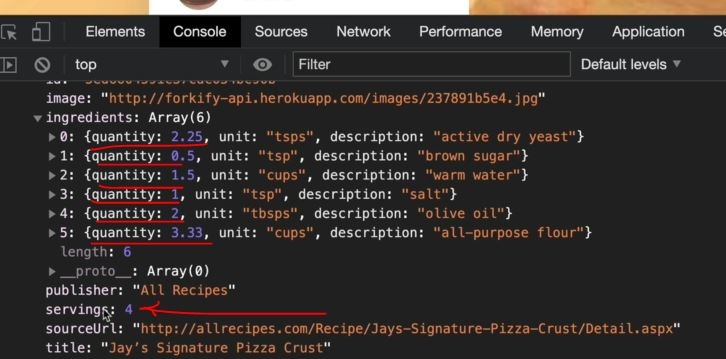

# Updating Recipe Servings

- here we'll implement the feature of updating recipe servings

## Steps - Updating Recipe Servings

- `STEP 1` : inside controller.js , making another controller function
    ```js
    import * as model from './model.js' 
    import recipeView from './views/recipeView.js'
    import searchView from './views/searchView.js'
    import resultsView from './views/resultsView.js'
    import paginationView from './views/paginationView.js'

    import 'core-js/stable' 
    import 'regenerator-runtime/runtime' 

    const timeout = function (s) => {
        return new Promise(function (_, reject) {
            setTimeout(function() {
                reject(new Error(`Request took too long! Timeout after ${s} second`))
            }, s * 1000)
        })
    }

    const controlRecipe = async function() {
        try {
            const id = window.location.hash.slice(1)
            if (!id) return 

            resultsView.renderSpinner()

            // 1 - Loading recipe
            await model.loadRecipe(id) 

            // 2 - Rendering recipe
            recipeView.render(model.state.recipe)

        } catch(err) {
            recipeView.renderError() 
        }
    }

    const controlSearchResults = async function() {
        try {
            resultsView.renderSpinner()

            // 1) Get search query
            const query = searchView.getQuery()
            if (!query) return

            // 2) load search results
            await model.loadSearchResults(query) 

            // 3) Render results
            resultsView.render(model.getSearchResultsPage()) 
                // here we didn't pass anything which means we're on Page 1 

            // 4) render initial pagination buttons
            paginationView.render(model.state.search) 

        } catch(err) {
            console.log(err)
        }
    }

    const controlPagination = function(goToPage) { 
        // 1) Render NEW results
        resultsView.render(model.getSearchResultsPage(goToPage)) 

        // 2) render NEW  pagination buttons
        paginationView.render(model.state.search) 
    }

    const controlServings = function() {
        // we're calling these kind-of functions as controllers
            // because we're using MVC pattern , so they could also called handlers 
            // because at the end , they're simple event handlers , so they'll run whenever some event happens 💡💡💡
            // when user clicks on those buttons of servings to either increase or decrease the servings 
                // & ingredients section

        // update the recipe servings (in state)

        // update the recipe view

    }

    const init = function() {
        recipeView.addHandlerRender(controlRecipes)
        searchView.addHandlerSearch(controlSearchResults)
        paginationView.addHandlerClick(controlPagination)
    }
    init()
    ```
    - so inside controlServings() function , we need to do 2 things
        - `1` : update the recipe servings
            - doing this has to do with the model , so in the model , we would like to have <br>
                some method which does that 
            - & again , we'll not want to manipulate data directly in a controller <br>
                instead we delegate that task to the model which is all about the data 💡💡💡
        - `2` : update the recipe view
            - this is the view which will be impacted by controlling the servings
            - & right now , we don't have servings view , because these buttons & everything that happens <br>
                when we click on them is already in the recipe view
    - `STEP 1.1` : inside controller.js file , inside controlServings() function
        ```js
        // put code from STEP 1 before this 

        const controlServings = function() {
            // update the recipe servings (in state)
            model.updateServings(6) // for testing purpose , we pass 6 servings

            // update the recipe view
        }

        const init = function() {
            recipeView.addHandlerRender(controlRecipes)
            searchView.addHandlerSearch(controlSearchResults)
            paginationView.addHandlerClick(controlPagination)
        }
        init()
        ```

- `STEP 2` : inside model.js file ,  exporting update servings
    ```js
    import { async } from 'regenerator-runtime' ;
    import { API_URL , RES_PER_PAGE} from '.config.js'
    import { getJSON } from './helpers.js'
            
    export const state = {
        recipe: {} , 
        search: {
            query: "" ,
            result: [] , 
            page: 1 , // by-default page number will be 1
            resultsPerPage: RES_PER_PAGE, 
        }
    }

    export const loadRecipe = async function(id) {  
        try {
            const data = await getJSON(`${API_URL}${id}`)

            const { recipe } = data.data 
            state.recipe = { 
                id:  recipe.id , 
                title: recipe.title, 
                publisher: recipe.publisher,
                sourceUrl: recipe.source_url ,
                image: recipe.image_url, 
                servings: recipe.servings, 
                cookingTime: recipe.cooking_time ,
                ingredients: recipe.ingredients
            }

            console.log(state.recipe) 
        } catch(err) {
            console.log(`${err} 💥💥💥`)
            throw err 
        }
    }

    export const loadSearchResults = async function() {
        try {
            state.search.query = query                
            const data = await getJSON(`${API_URL}?search=${query}`)

            state.search.results = data.data.recipes.map(rec => {
                return {
                    id:  rec.id , 
                    title: rec.title, 
                    publisher: rec.publisher,
                    image: rec.image_url, 
                }
            })

        } catch(err) {
            console.log(`${err} 💥💥💥`)
            throw err 
        }
    }

    export const getSearchResultsPage = function(page = state.search.page) { // passing default argument
        state.search.page = page

        const start = (page - 1) * state.search.resultsPerPage 
        const end = page * state.search.resultsPerPage
        return state.search.results.slice(start, end)
    }   

    export const updateServings = function(newServings) {
        // this function will do is that reach into the state & specifically , into the recipe ingredients
            // & then change the quantity in each ingredient

        // state.recipe.ingredients
    }
    ```
    - output : state.recipe.ingredients
        - search for pizza then we'll get the object & inside the object , ingredients contain array of values like this
        
        - Eg : quantity which has 2 then servings will be 4 but if we had 8 servings then the quantity should become 8 <br>
            so when servings gets doubled of that recipe then quantity needs to double as well 💡💡💡
    - `STEP 2.1` : inside model.js file , now mutate the quantity property of the ingredients
        ```js
        // put code from STEP 2 before this code

        export const updateServings = function(newServings) {

            // we don't want to return new array that's why we're using forEach() array method
                // but we could return a new array & then override state.recipe
                // but let's just use forEach() with side effects 💡💡💡
            state.recipe.ingredients.forEach(ing => {

                // formula to calculate new quantity -> newQty = oldQty * newServings / oldServings 
                    // Eg : (2 * 8) / 4 = 4 , so if we double the servings then we also need to double the quantity
                        // then we multiply the original quantity ✔️
                ing.quantity = (ing.quantity * newServings) / state.recipe.servings
            })

            // we also need to update  the servings in the state
                // because otherwise , if we tried to update the servings twice
                // then in second time , we would still be using -> state.recipe.servings
                    // which is the old value of two servings
                // so that's why we need to update this value
            state.recipe.servings = newServings
                // we're define this outside & after the state.recipe.ingredients.forEach()
                    // because otherwise , we could not preserve that old value i.e state.recipe.servings
        }
        // this function is to update the servings of the current recipe
            // & this will work because we already have recipe on the state ✔️✔️✔️
        ```
    - `STEP 2.2` : inside controller.js file , we need to update the recipe view
        - so we'll just overwrite the complete recipe means simply render it again
        - just like we did inside controlRecipes() async function i.e recipeView.render(model.state.recipe)
        ```js
        // put code from STEP 1 before this 

        const controlServings = function() {
            // update the recipe servings (in state)
            model.updateServings(8) // for testing purpose , we pass 8 servings to double the values

            // update the recipe view
            recipeView.render(model.state.recipe)
                // we did this because we don't want to change the value manually 
                    // of recipe ingredients section of that recipe
                // byt just selecting the elements
        }

        const init = function() {
            recipeView.addHandlerRender(controlRecipes)
            searchView.addHandlerSearch(controlSearchResults)
            paginationView.addHandlerClick(controlPagination)
            controlServings() // output : we'll get undefined , because we're not handling the asynchronous nature
                // here we're trying to control the servings , after these handler functions
                    // but at that time , no recipe has yet arrived from the API
                    // that's why , state.recipe is not yet defined
                // & inside model.js file , inside updateServings() function , state.recipe is not yet defined
                    // & we're trying to read ingredients from the recipe that doesn't exist
                // & this is a great demonstration of the pitfalls of working with async JS 💡💡💡
        }
        init()
        ```
        - so inside controller.js file , for testing purpose , we need to call controlServings() <br>
            inside controlRecipes() async function after try catch block for temporary purpose
        - means after recipe is loaded 
    - `STEP 2.3` : inside controller.js file , calling controlServings() inside controlRecipes() async function
        ```js

        ```


✔️✔️✔️
💡💡💡
✅
🔥


