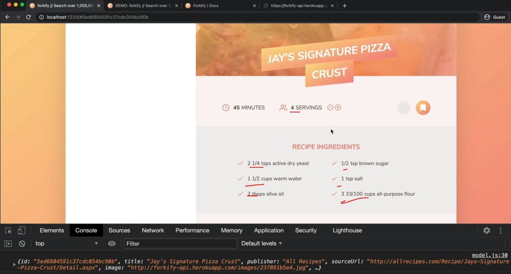

# Updating Recipe Servings

- here we'll implement the feature of updating recipe servings

## Steps - Updating Recipe Servings

- `STEP 1` : inside controller.js , making another controller function
    ```js
    import * as model from './model.js' 
    import recipeView from './views/recipeView.js'
    import searchView from './views/searchView.js'
    import resultsView from './views/resultsView.js'
    import paginationView from './views/paginationView.js'

    import 'core-js/stable' 
    import 'regenerator-runtime/runtime' 

    const timeout = function (s) => {
        return new Promise(function (_, reject) {
            setTimeout(function() {
                reject(new Error(`Request took too long! Timeout after ${s} second`))
            }, s * 1000)
        })
    }

    const controlRecipe = async function() {
        try {
            const id = window.location.hash.slice(1)
            if (!id) return 

            resultsView.renderSpinner()

            // 1 - Loading recipe
            await model.loadRecipe(id) 

            // 2 - Rendering recipe
            recipeView.render(model.state.recipe)

        } catch(err) {
            recipeView.renderError() 
        }
    }

    const controlSearchResults = async function() {
        try {
            resultsView.renderSpinner()

            // 1) Get search query
            const query = searchView.getQuery()
            if (!query) return

            // 2) load search results
            await model.loadSearchResults(query) 

            // 3) Render results
            resultsView.render(model.getSearchResultsPage()) 
                // here we didn't pass anything which means we're on Page 1 

            // 4) render initial pagination buttons
            paginationView.render(model.state.search) 

        } catch(err) {
            console.log(err)
        }
    }

    const controlPagination = function(goToPage) { 
        // 1) Render NEW results
        resultsView.render(model.getSearchResultsPage(goToPage)) 

        // 2) render NEW  pagination buttons
        paginationView.render(model.state.search) 
    }

    const controlServings = function() {
        // we're calling these kind-of functions as controllers
            // because we're using MVC pattern , so they could also called handlers 
            // because at the end , they're simple event handlers , so they'll run whenever some event happens 💡💡💡
            // when user clicks on those buttons of servings to either increase or decrease the servings 
                // & ingredients section

        // update the recipe servings (in state)

        // update the recipe view

    }

    const init = function() {
        recipeView.addHandlerRender(controlRecipes)
        searchView.addHandlerSearch(controlSearchResults)
        paginationView.addHandlerClick(controlPagination)
    }
    init()
    ```
    - so inside controlServings() function , we need to do 2 things
        - `1` : update the recipe servings
            - doing this has to do with the model , so in the model , we would like to have <br>
                some method which does that 
            - & again , we'll not want to manipulate data directly in a controller <br>
                instead we delegate that task to the model which is all about the data 💡💡💡
        - `2` : update the recipe view
            - this is the view which will be impacted by controlling the servings
            - & right now , we don't have servings view , because these buttons & everything that happens <br>
                when we click on them is already in the recipe view
    - `STEP 1.1` : inside controller.js file , inside controlServings() function
        ```js
        // put code from STEP 1 before this 

        const controlServings = function() {
            // update the recipe servings (in state)
            model.updateServings(6) // for testing purpose , we pass 6 servings

            // update the recipe view
        }

        const init = function() {
            recipeView.addHandlerRender(controlRecipes)
            searchView.addHandlerSearch(controlSearchResults)
            paginationView.addHandlerClick(controlPagination)
        }
        init()
        ```

- `STEP 2` : inside model.js file ,  exporting update servings
    ```js
    import { async } from 'regenerator-runtime' ;
    import { API_URL , RES_PER_PAGE} from '.config.js'
    import { getJSON } from './helpers.js'
            
    export const state = {
        recipe: {} , 
        search: {
            query: "" ,
            result: [] , 
            page: 1 , // by-default page number will be 1
            resultsPerPage: RES_PER_PAGE, 
        }
    }

    export const loadRecipe = async function(id) {  
        try {
            const data = await getJSON(`${API_URL}${id}`)

            const { recipe } = data.data 
            state.recipe = { 
                id:  recipe.id , 
                title: recipe.title, 
                publisher: recipe.publisher,
                sourceUrl: recipe.source_url ,
                image: recipe.image_url, 
                servings: recipe.servings, 
                cookingTime: recipe.cooking_time ,
                ingredients: recipe.ingredients
            }

            console.log(state.recipe) 
        } catch(err) {
            console.log(`${err} 💥💥💥`)
            throw err 
        }
    }

    export const loadSearchResults = async function() {
        try {
            state.search.query = query                
            const data = await getJSON(`${API_URL}?search=${query}`)

            state.search.results = data.data.recipes.map(rec => {
                return {
                    id:  rec.id , 
                    title: rec.title, 
                    publisher: rec.publisher,
                    image: rec.image_url, 
                }
            })

        } catch(err) {
            console.log(`${err} 💥💥💥`)
            throw err 
        }
    }

    export const getSearchResultsPage = function(page = state.search.page) { // passing default argument
        state.search.page = page

        const start = (page - 1) * state.search.resultsPerPage 
        const end = page * state.search.resultsPerPage
        return state.search.results.slice(start, end)
    }   

    export const updateServings = function(newServings) {
        // this function will do is that reach into the state & specifically , into the recipe ingredients
            // & then change the quantity in each ingredient

        // state.recipe.ingredients
    }
    ```
    - output : state.recipe.ingredients
        - search for pizza then we'll get the object & inside the object , ingredients contain array of values like this
        
        - Eg : quantity which has 2 then servings will be 4 but if we had 8 servings then the quantity should become 8 <br>
            so when servings gets doubled of that recipe then quantity needs to double as well 💡💡💡
    - `STEP 2.1` : inside model.js file , now mutate the quantity property of the ingredients
        ```js
        // put code from STEP 2 before this code

        export const updateServings = function(newServings) {

            // we don't want to return new array that's why we're using forEach() array method
                // but we could return a new array & then override state.recipe
                // but let's just use forEach() with side effects 💡💡💡
            state.recipe.ingredients.forEach(ing => {

                // formula to calculate new quantity -> newQty = oldQty * newServings / oldServings 
                    // Eg : (2 * 8) / 4 = 4 , so if we double the servings then we also need to double the quantity
                        // then we multiply the original quantity ✔️
                ing.quantity = (ing.quantity * newServings) / state.recipe.servings
            })

            // we also need to update  the servings in the state
                // because otherwise , if we tried to update the servings twice
                // then in second time , we would still be using -> state.recipe.servings
                    // which is the old value of two servings
                // so that's why we need to update this value
            state.recipe.servings = newServings
                // we're define this outside & after the state.recipe.ingredients.forEach()
                    // because otherwise , we could not preserve that old value i.e state.recipe.servings
        }
        // this function is to update the servings of the current recipe
            // & this will work because we already have recipe on the state ✔️✔️✔️
        ```
    - `STEP 2.2` : inside controller.js file , we need to update the recipe view
        - so we'll just overwrite the complete recipe means simply render it again
        - just like we did inside controlRecipes() async function i.e recipeView.render(model.state.recipe)
        ```js
        // put code from STEP 1 before this 

        const controlServings = function() {
            // update the recipe servings (in state)
            model.updateServings(8) // for testing purpose , we pass 8 servings to double the values

            // update the recipe view
            recipeView.render(model.state.recipe)
                // we did this because we don't want to change the value manually 
                    // of recipe ingredients section of that recipe
                // byt just selecting the elements
        }

        const init = function() {
            recipeView.addHandlerRender(controlRecipes)
            searchView.addHandlerSearch(controlSearchResults)
            paginationView.addHandlerClick(controlPagination)
            controlServings() // output : we'll get undefined , because we're not handling the asynchronous nature
                // here we're trying to control the servings , after these handler functions
                    // but at that time , no recipe has yet arrived from the API
                    // that's why , state.recipe is not yet defined
                // & inside model.js file , inside updateServings() function , state.recipe is not yet defined
                    // & we're trying to read ingredients from the recipe that doesn't exist
                // & this is a great demonstration of the pitfalls of working with async JS 💡💡💡
        }
        init()
        ```
        - so inside controller.js file , for testing purpose , we need to call controlServings() <br>
            inside controlRecipes() async function outside try catch block or inside try block for temporary purpose
        - means after recipe is loaded 
    - `STEP 2.3` : inside controller.js file , calling controlServings() inside controlRecipes() async function
        ```js
        import * as model from './model.js' 
        import recipeView from './views/recipeView.js'
        import searchView from './views/searchView.js'
        import resultsView from './views/resultsView.js'
        import paginationView from './views/paginationView.js'

        import 'core-js/stable' 
        import 'regenerator-runtime/runtime' 

        const timeout = function (s) => {
            return new Promise(function (_, reject) {
                setTimeout(function() {
                    reject(new Error(`Request took too long! Timeout after ${s} second`))
                }, s * 1000)
            })
        }

        const controlRecipe = async function() {
            try {
                const id = window.location.hash.slice(1)
                if (!id) return 

                resultsView.renderSpinner()

                // 1 - Loading recipe
                await model.loadRecipe(id) 

                // 2 - Rendering recipe
                recipeView.render(model.state.recipe)

                // calling controlServings() function after recipe is loaded
                controlServings() // for testing purpose

            } catch(err) {
                recipeView.renderError() 
            }
        }

        const controlSearchResults = async function() {
            try {
                resultsView.renderSpinner()

                // 1) Get search query
                const query = searchView.getQuery()
                if (!query) return

                // 2) load search results
                await model.loadSearchResults(query) 

                // 3) Render results
                resultsView.render(model.getSearchResultsPage()) 
                    // here we didn't pass anything which means we're on Page 1 

                // 4) render initial pagination buttons
                paginationView.render(model.state.search) 

            } catch(err) {
                console.log(err)
            }
        }

        const controlPagination = function(goToPage) { 
            // 1) Render NEW results
            resultsView.render(model.getSearchResultsPage(goToPage)) 

            // 2) render NEW  pagination buttons
            paginationView.render(model.state.search) 
        }

        const controlServings = function() {
            // update the recipe servings (in state)
            model.updateServings(4)

            // update the recipe view
            recipeView.render(model.state.recipe)
        }

        const init = function() {
            recipeView.addHandlerRender(controlRecipes)
            searchView.addHandlerSearch(controlSearchResults)
            paginationView.addHandlerClick(controlPagination)
        }
        init()
        ```
        - output : we'll see 4 servings & value of recipe ingredients also change like this 
            
        - now remove controlServings() function from `try` block of controlRecipes() async function <br>
            because now actually we want the controller to run whenever we click one of the buttons in the recipe view
        - so now let's create a new event listener in the recipe i.e inside recipeView.js file <br>
            because inside of this file , buttons are already exist . So there's no need to create a new like servingsView.js 

- `STEP 3` : inside recipeView.js file , creating a new method to update servings
    ```js
    import View from './View.js'

    import icons from 'url:../../img/icons.svg' 
    import { Fraction }  from 'fractional' 

    class RecipeView extends View {
        _parentElement = document.querySelector('.recipe') ;
        _errorMessage = "we could not find that recipe. Please try another one!" ;
        _message = "";

        addHandlerRender(handler) {
            ['hashchange', 'load'].forEach((e) => window.addEventListener(e , handler))
        }

        addHandlerUpdateServings(handler) {
            // to access both buttons of servings , we'll use event delegation  
                // so we'll listen for a click event on that & then check the target element which was clicked 
                // if those target are buttons or not through parent element
            this._parentElement.addEventListener('click' , function(e) {
                const btn = e.target.closest('.btn-tiny')
                    // closet() method is a great method to select element for event delegation concept ✅
                
                if (!btn) return // we define this because maybe user can click on svg element of that element 
                    // then we'll get undefined

                console.log(btn)

                handler()
            })
        }

        _generateMarkup() {
            return `
                <figure class="recipe__fig">
                    
                    <h1 class="recipe__title">
                      <span>${this._data.title}</span>
                    </h1>
                </figure>

                <div class="recipe__details">
                    <div class="recipe__info">
                        <svg class="recipe__info-icon"><use href="${icons}#icon-clock"></use></svg>
                        <span class="recipe__info-data recipe__info-data--minutes">${this._data.cookingTime}</span>
                        <span class="recipe__info-text">minutes</span>
                    </div>
                    <div class="recipe__info">
                        <svg class="recipe__info-icon"><use href="${icons}#icon"></use></svg>
                        <span class="recipe__info-data recipe__info-data--people">${this._data.servings}</span>
                        <span class="recipe__info-text">servings</span>

                        <div class="recipe__info-buttons">
                            <button class="btn--tiny btn--increase-servings">
                              <svg><use href="${icons}#icon-minus-circle"></use></svg>
                            </button>
                            <button class="btn--tiny btn--increase-servings">
                              <svg><use href="${icons}#icon-plus-circle"></use></svg>
                            </button>
                        </div>
                    </div>

                    <div class="recipe__user-generated">
                        <svg><use href="${icons}#icon-user"></use></svg>
                    </div>
                    <button class="btn--round">
                        <svg class=""><use href="${icons}#icon-bookmark-fill"></use></svg>
                    </button>
                </div>

                <div class="recipe__ingredients">
                    <h2 class="heading--2">Recipe ingredients</h2>
                    <ul class="recipe__ingredient-list">
                        ${this._data.ingredients.map(this._generateMarkupIngredient).join('')}
                    </ul>
                </div>

                <div class="recipe__directions">
                    <h2 class="heading--2">How to cook it</h2>
                    <p class="recipe__directions-text">
                        This recipe was carefully designed and tested by
                        <span class="recipe__publisher">${this._data.publisher}</span>. Please check out
                        directions at their website.
                    </p>
                    <a class="btn--small recipe__btn" href="${this._data.sourceUrl}"target="_blank">
                    <span>Directions</span>
                    <svg class="search__icon"><use href="${icons}#icon-arrow-right"></use></svg>
                  </a>
                </div>
            ` ;
        }

        _generateMarkupIngredient(ing) {
            return `
                <li class="recipe__ingredient">
                    <svg class="recipe__icon"><use href="${icons}#icon-check"></use></svg>
                    <div class="recipe__quantity">${ing.quantity ? Fraction(ing.quantity).toString() : ""}</div>
                    <div class="recipe__description">
                        <span class="recipe__unit">${ing.unit}</span>
                        ${ing.description}
                    </div>
                </li>
            `
        }
    }
    ```
    - now we need to connect with the controller.js file 
    - `STEP 3.1` : inside controller.js file , connecting that addHandlerUpdateServings() method 
        ```js
        import * as model from './model.js' 
        import recipeView from './views/recipeView.js'
        import searchView from './views/searchView.js'
        import resultsView from './views/resultsView.js'
        import paginationView from './views/paginationView.js'

        import 'core-js/stable' 
        import 'regenerator-runtime/runtime' 

        const timeout = function (s) => {
            return new Promise(function (_, reject) {
                setTimeout(function() {
                    reject(new Error(`Request took too long! Timeout after ${s} second`))
                }, s * 1000)
            })
        }

        const controlRecipe = async function() {
            try {
                const id = window.location.hash.slice(1)
                if (!id) return 

                resultsView.renderSpinner()

                // 1 - Loading recipe
                await model.loadRecipe(id) 

                // 2 - Rendering recipe
                recipeView.render(model.state.recipe)

            } catch(err) {
                recipeView.renderError() 
            }
        }

        const controlSearchResults = async function() {
            try {
                resultsView.renderSpinner()

                // 1) Get search query
                const query = searchView.getQuery()
                if (!query) return

                // 2) load search results
                await model.loadSearchResults(query) 

                // 3) Render results
                resultsView.render(model.getSearchResultsPage()) 
                    // here we didn't pass anything which means we're on Page 1 

                // 4) render initial pagination buttons
                paginationView.render(model.state.search) 

            } catch(err) {
                console.log(err)
            }
        }

        const controlPagination = function(goToPage) { 
            // 1) Render NEW results
            resultsView.render(model.getSearchResultsPage(goToPage)) 

            // 2) render NEW  pagination buttons
            paginationView.render(model.state.search) 
        }

        const controlServings = function() {
            // update the recipe servings (in state)
            model.updateServings(8)

            // update the recipe view
            recipeView.render(model.state.recipe)
        }

        const init = function() {
            recipeView.addHandlerRender(controlRecipes)
            recipeView.addHandlerUpdateServings(controlServings)
            searchView.addHandlerSearch(controlSearchResults)
            paginationView.addHandlerClick(controlPagination)
        }
        init()
        ```
        - output : right now we have 4 servings & based on this , we have recipe ingredients like this
            
            - & then movement we click on `+` plus button of serving then we'll get this output 
            
            - so here servings become 8 & all the values of recipe ingredients changed <br>
                & inside the console tab , we'll get that button which was clicked on on <br>
                & when we hover on that button then it'll not selected in UI because DOM was re-rendered 💡💡💡
        - now we want to work on increase button to increasing serving & decrease button to decrease servings <br>
            & there are many ways but we'll do inside controller.js file because we already know <br>
            what the current number of servings is . so take that value & simple decrease or increase the value by 1 <br>
            However , Jonas like to keep the controller as flexible & as robust as possible <br>
            so Jonas don't want the controller to be the one responsible for telling which should be the next serving <br>
        - so that should be handle by view , because the user is actually updating the servings <br>
            so in order to keep that controller.js file as flexible as possible , we can pass the new servings <br>
            & then pass that new servings into update servings 💡💡💡

- `STEP 4` : inside controller.js file , passing new servings as a argument inside controlServings() function
    ```js
    // put code from STEP 3.1 before this

    const controlServings = function(newServings) {
        // update the recipe servings (in state)
        model.updateServings(newServings8)

        // update the recipe view
        recipeView.render(model.state.recipe)
    }

    const init = function() {
        recipeView.addHandlerRender(controlRecipes)
        recipeView.addHandlerUpdateServings(controlServings)
        searchView.addHandlerSearch(controlSearchResults)
        paginationView.addHandlerClick(controlPagination)
    }
    init()
    ```
    - now inside recipeView.js file , inside addHandlerUpdateServings() function how will we determine the new servings ? <br>
        so once again , we'll need to connect the user interface with decode , so we'll use the custom data attribute
    - `STEP 4.1` : inside recipeView.js file , defining data attribute inside those servings buttons 
        - in order to determine the new servings
        ```js
        import View from './View.js'

        import icons from 'url:../../img/icons.svg' 
        import { Fraction }  from 'fractional' 

        class RecipeView extends View {
            _parentElement = document.querySelector('.btn') ;
            _errorMessage = "we could not find that recipe. Please try another one!" ;
            _message = "";

            addHandlerRender(handler) {
                ['hashchange', 'load'].forEach((e) => window.addEventListener(e , handler))
            }

            addHandlerUpdateServings(handler) {
                this._parentElement.addEventListener('click' , function(e) {
                    const btn = e.target.closest('.btn--update-servings')
                        // now we'll select btn--update-servings -> class of both buttons instead of btn--tiny 
                            // because btn--tiny -> class is more about styling 
                            // & btn--update-servings class is about functionality 💡💡💡
                    if (!btn) return 

                    // const updateTo = btn.dataset.updateTo // here we used camel case of that data attribute 
                        // because behind the scene , JS will convert that data attribute in camel case 💡💡💡
                    // const { updateTo } = +btn.dataset // converted from string into integer type
                        // we used object destructuring concept to access the property
                            // instead of old way of accessing properties of an object
                        // but here we can't use object destructuring because we're also changing the data type also
                            // that's why we need to use old way
                    const updateTo = +btn.dataset.updateTo

                    handler(updateTo)
                })
            }

            _generateMarkup() {
                return `
                    <figure class="recipe__fig">
                        
                        <h1 class="recipe__title">
                          <span>${this._data.title}</span>
                        </h1>
                    </figure>

                    <div class="recipe__details">
                        <div class="recipe__info">
                            <svg class="recipe__info-icon"><use href="${icons}#icon-clock"></use></svg>
                            <span class="recipe__info-data recipe__info-data--minutes">${this._data.cookingTime}</span>
                            <span class="recipe__info-text">minutes</span>
                        </div>
                        <div class="recipe__info">
                            <svg class="recipe__info-icon"><use href="${icons}#icon"></use></svg>
                            <span class="recipe__info-data recipe__info-data--people">${this._data.servings}</span>
                            <span class="recipe__info-text">servings</span>

                            <div class="recipe__info-buttons">
                                <button class="btn--tiny btn--update-servings" data-update-to="${this._data.servings - 1}">
                                  <svg><use href="${icons}#icon-minus-circle"></use></svg>
                                </button>
                                <button class="btn--tiny btn--update-servings" data-update-to="${this._data.servings + 1}">
                                  <svg><use href="${icons}#icon-plus-circle"></use></svg>
                                </button>
                            </div>
                        </div>

                        <div class="recipe__user-generated">
                            <svg><use href="${icons}#icon-user"></use></svg>
                        </div>
                        <button class="btn--round">
                            <svg class=""><use href="${icons}#icon-bookmark-fill"></use></svg>
                        </button>
                    </div>

                    <div class="recipe__ingredients">
                        <h2 class="heading--2">Recipe ingredients</h2>
                        <ul class="recipe__ingredient-list">
                            ${this._data.ingredients.map(this._generateMarkupIngredient).join('')}
                        </ul>
                    </div>

                    <div class="recipe__directions">
                        <h2 class="heading--2">How to cook it</h2>
                        <p class="recipe__directions-text">
                            This recipe was carefully designed and tested by
                            <span class="recipe__publisher">${this._data.publisher}</span>. Please check out
                            directions at their website.
                        </p>
                        <a class="btn--small recipe__btn" href="${this._data.sourceUrl}"target="_blank">
                        <span>Directions</span>
                        <svg class="search__icon"><use href="${icons}#icon-arrow-right"></use></svg>
                      </a>
                    </div>
                ` ;
            }

            _generateMarkupIngredient(ing) {
                return `
                    <li class="recipe__ingredient">
                        <svg class="recipe__icon"><use href="${icons}#icon-check"></use></svg>
                        <div class="recipe__quantity">${ing.quantity ? Fraction(ing.quantity).toString() : ""}</div>
                        <div class="recipe__description">
                            <span class="recipe__unit">${ing.unit}</span>
                            ${ing.description}
                        </div>
                    </li>
                `
            }
        }
        ```
        - output : when we click on `+` plus button of servings then it'll get increase
            - & value of data-update-to data attribute will get updated
            - & when we're clicking on `+` plus button then , image flickering is happening which will fix later on
            - but when we're decreasing the servings then values goes in negative after 0
    - `STEP 4.2` : inside recipeView.js file , calling handler() function of addHandlerUpdateServings() function
        - in order to fix when we're decreasing the servings then values goes in negative after 0
        ```js
        import View from './View.js'

        import icons from 'url:../../img/icons.svg' 
        import { Fraction }  from 'fractional' 

        class RecipeView extends View {
            _parentElement = document.querySelector('.btn') ;
            _errorMessage = "we could not find that recipe. Please try another one!" ;
            _message = "";

            addHandlerRender(handler) {
                ['hashchange', 'load'].forEach((e) => window.addEventListener(e , handler))
            }

            addHandlerUpdateServings(handler) {
                this._parentElement.addEventListener('click' , function(e) {
                    const btn = e.target.closest('.btn--update-servings')
                    if (!btn) return 
                    const { updateTo } = btn.dataset
                    if (+updateTo > 0) handler(+updateTo) 
                        // we only want to call handler value if updateTo is greater than 0
                })
            }

        // put code from STEP 4.1 after this above code
        ```
        - output : when we decrease the servings & as we reach `1 servings` 
            - then if we click on `-` button then things will not get updated 
        - now everything is working fine but we're still using the hack of updating <br>
            the entire view at once which will take sometime & due to this , especially that image is flicking

- so in next lecture , we'll develop a simple algorithm <br>
    which will only update the DOM in places where we actually want to update the html markup 💡💡💡
