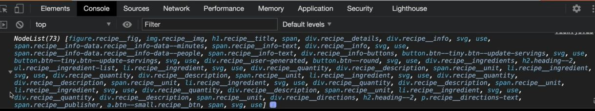
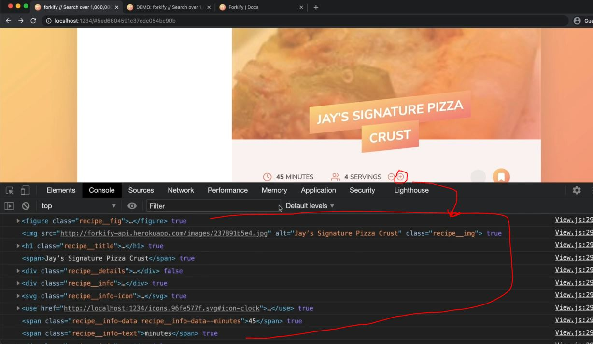
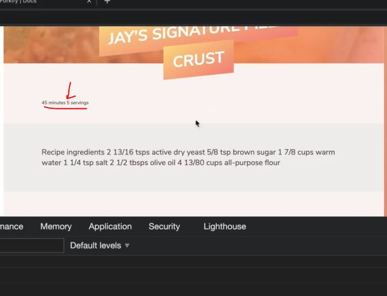
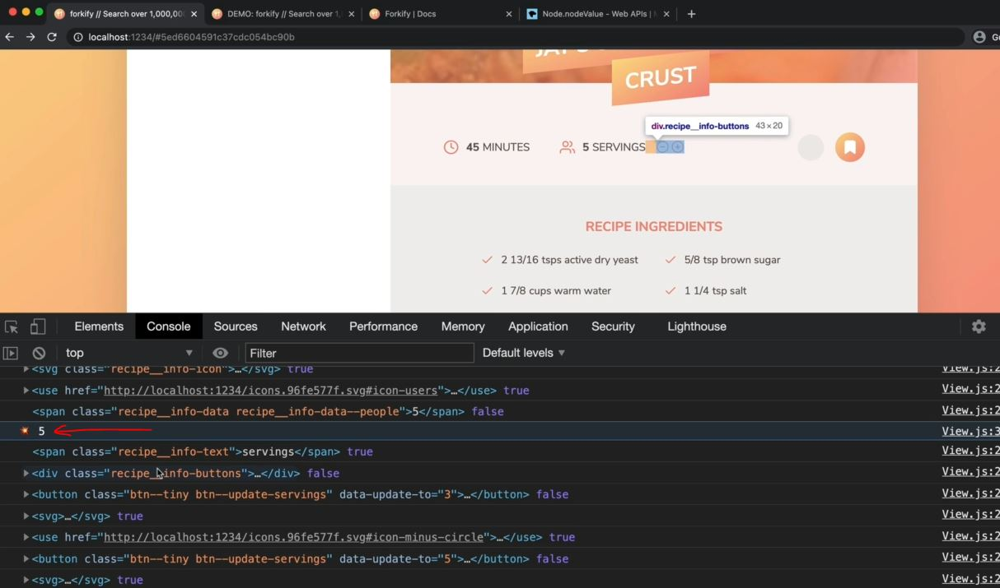
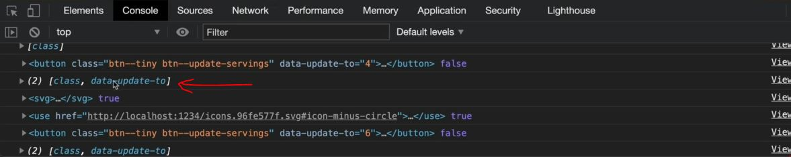
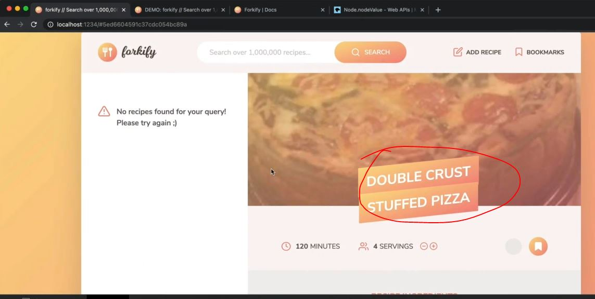

# Developing a DOM Updating Algorithm

- in this lecture , we'll develop an algorithm which will update the DOM <br>
    only on those places where it actually changed
- `about issue in previous lecture` : 
    - when we were updating the servings then that will always re-render the entire recipe view
    - so when we were increasing or decreasing the servings then image gets reload <br>
        & due to this , flicking is happening on that image
    - & due to that re-render the entire view means all those HTML elements is actually a bit overkill <br>
        & put too much strain on the browser

## Steps - developing a DOM updating algorithm

- `STEP 1` : inside controller.js file , calling update method
    ```js
    import * as model from './model.js' 
    import recipeView from './views/recipeView.js'
    import searchView from './views/searchView.js'
    import resultsView from './views/resultsView.js'
    import paginationView from './views/paginationView.js'

    import 'core-js/stable' 
    import 'regenerator-runtime/runtime' 

    const timeout = function (s) => {
        return new Promise(function (_, reject) {
            setTimeout(function() {
                reject(new Error(`Request took too long! Timeout after ${s} second`))
            }, s * 1000)
        })
    }

    const controlRecipe = async function() {
        try {
            const id = window.location.hash.slice(1)
            if (!id) return 

            resultsView.renderSpinner()

            // 1 - Loading recipe
            await model.loadRecipe(id) 

            // 2 - Rendering recipe
            recipeView.render(model.state.recipe)

        } catch(err) {
            recipeView.renderError() 
        }
    }

    const controlSearchResults = async function() {
        try {
            resultsView.renderSpinner()

            // 1) Get search query
            const query = searchView.getQuery()
            if (!query) return

            // 2) load search results
            await model.loadSearchResults(query) 

            // 3) Render results
            resultsView.render(model.getSearchResultsPage()) 
                // here we didn't pass anything which means we're on Page 1 

            // 4) render initial pagination buttons
            paginationView.render(model.state.search) 

        } catch(err) {
            console.log(err)
        }
    }

    const controlPagination = function(goToPage) { 
        // 1) Render NEW results
        resultsView.render(model.getSearchResultsPage(goToPage)) 

        // 2) render NEW  pagination buttons
        paginationView.render(model.state.search) 
    }
        
    const controlServings = function(newServings) {
        // update the recipe servings (in state)
        model.updateServings(newServings8)

        // update the recipe view
        // recipeView.render(model.state.recipe)
        recipeView.update(model.state.recipe)
            // here difference b/w recipeView.render() Vs recipeView.update()
                // update() method will only update text & attributes in the DOM
                    // without re-rendering the entire view 💡💡💡
    }

    const init = function() {
        recipeView.addHandlerRender(controlRecipes)
        recipeView.addHandlerUpdateServings(controlServings)
        searchView.addHandlerSearch(controlSearchResults)
        paginationView.addHandlerClick(controlPagination)
    }
    init()
    ```

- `STEP 2` : inside View.js file , 
    - creating update() method because we want to make this method available on the different view & for multiple situations
    ```js
    import icons from 'url:../../img/icons.svg' 

    export default class View {
        _data ; 

        render(data) {
            if (!data || (Array.isArray(data) && data.length === 0)) return this.renderError()
            this._data = data
            const markup = this._generateMarkup()
            this._clear()
            this._parentElement.insertAdjacentHTML('afterbegin', markup)
        }

        update(data) {
            if (!data || (Array.isArray(data) && data.length === 0)) return this.renderError()
            this._data = data
            const newMarkup = this._generateMarkup()
                // here we just going to update the html markup . But for doing this , we still need the entire markup
                    // so that we can compare it to the old markup so we'll create a new markup but not render it
                // so we'll just generate the new htm markup 
                    // & then compare with new html markup with previous html markup
                    // & then only change text & attributes that actually have changed from the old version 
                        // to the new version 💡💡💡

            // Note ✅ : we'll get the html markup in string & due to this , comparing old html compare 
                // will become difficult to the DOM elements that we currently have on the page
            // so we'll convert that html markup string to a DOM object , so that we can compare
                // with the actual DOM which is no the page 💡💡💡
            const newDOM = document.createRange().createContextualFragment(newMarkup)
                // createRange() method will create range
                // createContextualFragment() method takes one argument i.e html markup which is in string type
                    // & then this method will convert that string html markup into real DOM node objects 💡💡💡

            // & then newDOM -> variable will become an object which is like a virtual DOM
                // which means a DOM is not really living on the page but which lives in our memory
                // so we can use that DOM as like a real DOM on our page 💡💡💡
            const newElements = newDOM.querySelectorAll("*") // star sign means all elements
            console.log(newElements)
        }

        _clear() {
            this._parentElement.innerHTML = '' 
        }

        renderSpinner() { 
            const markup = `
                <div class="spinner">
                    <svg><use href="${icons}_icon-loader"></use></svg>
                </div>
            `

            this._clear()
            this._parentElement.insertAdjacentHTML('afterbegin', markup)
        }

        renderError(message = this._errorMessage) {
            const markup = `
                <div class="error">
                    <div>
                        <svg><use href="${icons}_icon-alert-triangle"></use></svg>
                    </div>
                    <p>${message}</p>
                </div> 
            `

            this._clear()
            this._parentElement.insertAdjacentHTML('afterbegin', markup)
        }

        renderMessage(message = this._message) {
            const markup = `
                <div class="message">
                    <div>
                        <svg><use href="${icons}_icon-smile"></use></svg>
                    </div>
                    <p>${message}</p>
                </div> 
            `

            this._clear()
            this._parentElement.insertAdjacentHTML('afterbegin', markup)
        }
    }
    ```
    - output : when we click on the increase button of servings then inside console tab
        - we'll get an NodeList array which contain our all the html elements of that section in the new DOM
        
        - & if we check this element i.e inside `span.recipe__info-data.recipe__info-data--people` <br>
            inside innerHTML or innerText will contain `5` as updated serving
        - so we can compare this virtual DOM with the actual DOM which is really on the page <br>
            based on which things are changed 

- `STEP 3` : inside View.js file , getting html elements which are on the actual page in order to compare
    ```js
    import icons from 'url:../../img/icons.svg' 

    export default class View {
        _data ; 

        render(data) {
            if (!data || (Array.isArray(data) && data.length === 0)) return this.renderError()
            this._data = data
            const markup = this._generateMarkup()
            this._clear()
            this._parentElement.insertAdjacentHTML('afterbegin', markup)
        }

        update(data) {
            if (!data || (Array.isArray(data) && data.length === 0)) return this.renderError()
            this._data = data
            const newMarkup = this._generateMarkup()

            const newDOM = document.createRange().createContextualFragment(newMarkup)
            const newElements = Array.from(newDOM.querySelectorAll("*")) 
            const curElements = Array.from(this._parentElement.querySelectorAll("*"))
            console.log(curElements)
            console.log(newElements)
        }

        _clear() {
            this._parentElement.innerHTML = '' 
        }

        renderSpinner() { 
            const markup = `
                <div class="spinner">
                    <svg><use href="${icons}_icon-loader"></use></svg>
                </div>
            `

            this._clear()
            this._parentElement.insertAdjacentHTML('afterbegin', markup)
        }

        renderError(message = this._errorMessage) {
            const markup = `
                <div class="error">
                    <div>
                        <svg><use href="${icons}_icon-alert-triangle"></use></svg>
                    </div>
                    <p>${message}</p>
                </div> 
            `

            this._clear()
            this._parentElement.insertAdjacentHTML('afterbegin', markup)
        }

        renderMessage(message = this._message) {
            const markup = `
                <div class="message">
                    <div>
                        <svg><use href="${icons}_icon-smile"></use></svg>
                    </div>
                    <p>${message}</p>
                </div> 
            `

            this._clear()
            this._parentElement.insertAdjacentHTML('afterbegin', markup)
        }
    }
    ```
    - output : console.log(curElements) & console.log(newElements)
        - currently servings is `4` & when we click on increase button of servings then will become 5
        - & then inside console tab , if we see curElements <br>
            then inside `span.recipe__info-data.recipe__info-data--people` , innerHTML or innerText will be 4
        - but if see inside `span.recipe__info-data.recipe__info-data--people` of newElements <br>
            then innerHTML or innerText will be 5 because newElements is a new DOM 💡💡💡
    - `STEP 3.1` : inside View.js file , looping over that new DOM
        ```js
        import icons from 'url:../../img/icons.svg' 

        export default class View {
            _data ; 

            render(data) {
                if (!data || (Array.isArray(data) && data.length === 0)) return this.renderError()
                this._data = data
                const markup = this._generateMarkup()
                this._clear()
                this._parentElement.insertAdjacentHTML('afterbegin', markup)
            }

            update(data) {
                if (!data || (Array.isArray(data) && data.length === 0)) return this.renderError()
                this._data = data
                const newMarkup = this._generateMarkup()

                const newDOM = document.createRange().createContextualFragment(newMarkup)
                const newElements = Array.from(newDOM.querySelectorAll("*")) 
                const curElements = Array.from(this._parentElement.querySelectorAll("*"))

                newElements.forEach((newEl, i) => {
                    const curEl = curElements[i]
                    console.log(curEl , newEl.isEqualNode(curEl))
                        // about isEqualNode() method ✅ :
                            // used to check whether two Nodes are equal or not 💡💡💡
                        
                })
            }

            _clear() {
                this._parentElement.innerHTML = '' 
            }

            renderSpinner() { 
                const markup = `
                    <div class="spinner">
                        <svg><use href="${icons}_icon-loader"></use></svg>
                    </div>
                `

                this._clear()
                this._parentElement.insertAdjacentHTML('afterbegin', markup)
            }

            renderError(message = this._errorMessage) {
                const markup = `
                    <div class="error">
                        <div>
                            <svg><use href="${icons}_icon-alert-triangle"></use></svg>
                        </div>
                        <p>${message}</p>
                    </div> 
                `

                this._clear()
                this._parentElement.insertAdjacentHTML('afterbegin', markup)
            }

            renderMessage(message = this._message) {
                const markup = `
                    <div class="message">
                        <div>
                            <svg><use href="${icons}_icon-smile"></use></svg>
                        </div>
                        <p>${message}</p>
                    </div> 
                `

                this._clear()
                this._parentElement.insertAdjacentHTML('afterbegin', markup)
            }
        }
        ```
        - `difference b/w elements vs nodes in JS` : 
            - https://stackoverflow.com/questions/9979172/difference-between-node-object-and-element-object 💡💡💡
            - check jonas lecture module related to DOM & events
        - output : when we click on `+` button of servings
            - then we'll get nodes with true or false like this
            
            - some of them are false because inside of them content is changed
    - `STEP 3.2` : inside View.js file , updating the stuff of current element of the actual page
        ```js
        import icons from 'url:../../img/icons.svg' 

        export default class View {
            _data ; 

            render(data) {
                if (!data || (Array.isArray(data) && data.length === 0)) return this.renderError()
                this._data = data
                const markup = this._generateMarkup()
                this._clear()
                this._parentElement.insertAdjacentHTML('afterbegin', markup)
            }

            update(data) {
                if (!data || (Array.isArray(data) && data.length === 0)) return this.renderError()
                this._data = data
                const newMarkup = this._generateMarkup()

                const newDOM = document.createRange().createContextualFragment(newMarkup)
                const newElements = Array.from(newDOM.querySelectorAll("*")) 
                const curElements = Array.from(this._parentElement.querySelectorAll("*"))

                newElements.forEach((newEl, i) => {
                    const curEl = curElements[i]
                    console.log(curEl , newEl.isEqualNode(curEl))

                    if (!newEl.isEqualNode(curEl)) {
                        curEl.innerText = newEl.innerText
                    }
                })
            }

            _clear() {
                this._parentElement.innerHTML = '' 
            }

            renderSpinner() { 
                const markup = `
                    <div class="spinner">
                        <svg><use href="${icons}_icon-loader"></use></svg>
                    </div>
                `

                this._clear()
                this._parentElement.insertAdjacentHTML('afterbegin', markup)
            }

            renderError(message = this._errorMessage) {
                const markup = `
                    <div class="error">
                        <div>
                            <svg><use href="${icons}_icon-alert-triangle"></use></svg>
                        </div>
                        <p>${message}</p>
                    </div> 
                `

                this._clear()
                this._parentElement.insertAdjacentHTML('afterbegin', markup)
            }

            renderMessage(message = this._message) {
                const markup = `
                    <div class="message">
                        <div>
                            <svg><use href="${icons}_icon-smile"></use></svg>
                        </div>
                        <p>${message}</p>
                    </div> 
                `

                this._clear()
                this._parentElement.insertAdjacentHTML('afterbegin', markup)
            }
        }
        ```
        - output : when we click on `+` plus button of servings then all the things get removed 
            - & we'll get this output like this
            
            - so we replace all the things from `recipe__details` div , because inside this div , <br>
                some thing has changed that's why everything which is inside this div <br>
                has been changed when we did `curEl.innerText = newEl.innerText`
        - so we need find the thing which only replace/change the text <br>
            so we can use property which is available on all nodes i.e `nodeValue` 💡💡💡 <br>
            so if it's a element then node value will be null <br>
            but if it's a text then we'll get the content of the text node 💡💡💡
    - `STEP 3.3` : inside View.js file , using nodeValue property to check further condition ✅
        - `firstChild` property : https://www.w3schools.com/jsref/prop_node_firstchild.asp
            - it deals with html elements like ul , select element , ol , etc
            - Whitespace between elements is considered text nodes. so inside ul element <br>
                If there is a whitespace before the first "li" element, the result will be "undefined". 💡💡💡
        ```js
        import icons from 'url:../../img/icons.svg' 

        export default class View {
            _data ; 

            render(data) {
                if (!data || (Array.isArray(data) && data.length === 0)) return this.renderError()
                this._data = data
                const markup = this._generateMarkup()
                this._clear()
                this._parentElement.insertAdjacentHTML('afterbegin', markup)
            }

            update(data) {
                if (!data || (Array.isArray(data) && data.length === 0)) return this.renderError()
                this._data = data
                const newMarkup = this._generateMarkup()

                const newDOM = document.createRange().createContextualFragment(newMarkup)
                const newElements = Array.from(newDOM.querySelectorAll("*")) 
                const curElements = Array.from(this._parentElement.querySelectorAll("*"))

                newElements.forEach((newEl, i) => {
                    const curEl = curElements[i]
                    console.log(curEl , newEl.isEqualNode(curEl))

                    if (!newEl.isEqualNode(curEl) && newEl.firstChild.nodeValue.trim() !== "") {
                        // there we used trim() method to remove the white space
                        console.log(newEl.firstChild.nodeValue.trim())
                        curEl.innerText = newEl.innerText
                    }
                })
            }

            _clear() {
                this._parentElement.innerHTML = '' 
            }

            renderSpinner() { 
                const markup = `
                    <div class="spinner">
                        <svg><use href="${icons}_icon-loader"></use></svg>
                    </div>
                `

                this._clear()
                this._parentElement.insertAdjacentHTML('afterbegin', markup)
            }

            renderError(message = this._errorMessage) {
                const markup = `
                    <div class="error">
                        <div>
                            <svg><use href="${icons}_icon-alert-triangle"></use></svg>
                        </div>
                        <p>${message}</p>
                    </div> 
                `

                this._clear()
                this._parentElement.insertAdjacentHTML('afterbegin', markup)
            }

            renderMessage(message = this._message) {
                const markup = `
                    <div class="message">
                        <div>
                            <svg><use href="${icons}_icon-smile"></use></svg>
                        </div>
                        <p>${message}</p>
                    </div> 
                `

                this._clear()
                this._parentElement.insertAdjacentHTML('afterbegin', markup)
            }
        }
        ```
        - output : `newEl.firstChild.nodeValue.trim()`
            - when we click on `+` plus button of servings then we'll get this output
            
            - so got output of `newEl.firstChild.nodeValue.trim()` i.e 5 <br>
                so in other elements which didn't contain text directly then there nodeValue will be null 💡💡💡 <br>
                & due to that , that condition gets false
        - now let's add optional chaining like this `newEl.firstChild?.nodeValue.trim()` <br>
            because might be firstChild doesn't exist always 💡💡💡
    - `STEP 3.4` : inside View.js file , using optional chaining on firstChild
        ```js
        import icons from 'url:../../img/icons.svg' 

        export default class View {
            // put code from STEP 3.3 before below code 

            update(data) {
                if (!data || (Array.isArray(data) && data.length === 0)) return this.renderError()
                this._data = data
                const newMarkup = this._generateMarkup()

                const newDOM = document.createRange().createContextualFragment(newMarkup)
                const newElements = Array.from(newDOM.querySelectorAll("*")) 
                const curElements = Array.from(this._parentElement.querySelectorAll("*"))

                newElements.forEach((newEl, i) => {
                    const curEl = curElements[i]
                    console.log(curEl , newEl.isEqualNode(curEl))

                    if (!newEl.isEqualNode(curEl) && newEl.firstChild?.nodeValue.trim() !== "") {
                        // here using optional chaining to make sure 100% that the code is going to work 💡💡💡

                        curEl.innerText = newEl.innerText
                    }
                })
            }

            // put code from STEP 3.3 after above code
        }
        ```
        - output : when we click on `-` minus button of servings then servings become from 4 into 3
            - & value of recipe ingredients will updated , but we'll not see any flickering on any element 
            - because there's nothing replaced except that servings text & value of recipe ingredients 💡💡💡 <br>
                & everything will remain same
            - & currently we can increase or decrease servings b/w 3 to 5 <br>
                because data attribute of `-` button of servings has a value of 3 & `+` plus button has 5 <br>
                so we also need to update data attribute value of these buttons also instead of just updating in the UI 

- `STEP 4` : inside View.js file , updating the attribute
    ```js
    import icons from 'url:../../img/icons.svg' 

    export default class View {
        _data ; 

        render(data) {
            if (!data || (Array.isArray(data) && data.length === 0)) return this.renderError()
            this._data = data
            const markup = this._generateMarkup()
            this._clear()
            this._parentElement.insertAdjacentHTML('afterbegin', markup)
        }

        update(data) {
            if (!data || (Array.isArray(data) && data.length === 0)) return this.renderError()
            this._data = data
            const newMarkup = this._generateMarkup()

            const newDOM = document.createRange().createContextualFragment(newMarkup)
            const newElements = Array.from(newDOM.querySelectorAll("*")) 
            const curElements = Array.from(this._parentElement.querySelectorAll("*"))

            newElements.forEach((newEl, i) => {
                const curEl = curElements[i]
                console.log(curEl , newEl.isEqualNode(curEl))

                // Updates changed TEXT
                if (!newEl.isEqualNode(curEl) && newEl.firstChild?.nodeValue.trim() !== "") {
                    curEl.innerText = newEl.innerText
                }
                // here're we're updating the changed text

                // Updates changed ATTRIBUTES
                if (!newEl.isEqualNode(curEl)) {
                    // console.log(newEl.attributes) // output : we'll get the output in object form
                        // this will print all the attributes of that element which has been changed

                    console.log(Array.from(newEl.attributes))
                    Array.from(newEl.attributes).forEach(attr => {
                        curEl.setAttribute(att.name, attr.value)
                    })
                }
            })
        }

        _clear() {
            this._parentElement.innerHTML = '' 
        }

        renderSpinner() { 
            const markup = `
                <div class="spinner">
                    <svg><use href="${icons}_icon-loader"></use></svg>
                </div>
            `

            this._clear()
            this._parentElement.insertAdjacentHTML('afterbegin', markup)
        }

        renderError(message = this._errorMessage) {
            const markup = `
                <div class="error">
                    <div>
                        <svg><use href="${icons}_icon-alert-triangle"></use></svg>
                    </div>
                    <p>${message}</p>
                </div> 
            `

            this._clear()
            this._parentElement.insertAdjacentHTML('afterbegin', markup)
        }

        renderMessage(message = this._message) {
            const markup = `
                <div class="message">
                    <div>
                        <svg><use href="${icons}_icon-smile"></use></svg>
                    </div>
                    <p>${message}</p>
                </div> 
            `

            this._clear()
            this._parentElement.insertAdjacentHTML('afterbegin', markup)
        }
    }
    ```
    - output : console.log(Array.from(newEl.attributes))
        - after clicking on `+` plus button of servings then we'll get this output of that button
        
        - so inside this array , inside `class` , we have name property <br>
            so we can take that `name` property & set it to the `value` property of `data-update-to` 
        - so we want to replace all the attributes in the current element by the attributes which is coming from newEl
        - so when we click on `+` or `-` button then servings value also change & value of recipe ingredients updated <br>
            & also value of data attribute of those servings will also gets updated 
    - & only servings number & value of recipe ingredients changing & nothing is changing <br>
        so we 100% updated the DOM only where text & attributes is changing 💡💡💡
    - inside this section of code 
        ```
        // Updates changed TEXT
        if (!newEl.isEqualNode(curEl) && newEl.firstChild?.nodeValue.trim() !== "") {
            curEl.innerText = newEl.innerText
        }
        // here're we're updating the changed text

        // Updates changed ATTRIBUTES
        if (!newEl.isEqualNode(curEl)) {
            // console.log(newEl.attributes) // output : we'll get the output in object form
                // this will print all the attributes of that element which has been changed

            console.log(Array.from(newEl.attributes))
            Array.from(newEl.attributes).forEach(attr => {
                curEl.setAttribute(att.name, attr.value)
            })
        }
        ```
        - this is no the robust solution & not the best algorithm to use in real world apps <br>
            unless we have kind-of small application like this one
        - but for huge big application is not good one in terms of performance

- inside forkify flowchart of part2 , we did `user updates servings` <br>
    now we'll use that algorithm to `mark selected result` b/w render search results & user selects recipe <br>
    means when we select the recipe which is on left side then it should me highlighted
- `STEP 5` : inside resultsView.js file , 
    - marking that selected recipe by putting this class `preview__link--active` on the anchor element <br>
        based on if result id as same as hash id on the URL
    ```js
    import View from './View.js'
    import icons from 'url:../../img/icons.svg' 

    class ResultsView extends View {
        _parentElement = document.querySelector('.results')
        _errorMessage = 'No recipes found for your query! Please try again :-D'
        _message = ""

        _generateMarkup() {
            console.log(this._data)
            return this._data.map(this._generateMarkupPreview).join("")
        }

        _generateMarkupPreview(result) {
            const id = window.location.hash.slice(1) // getting first element

            return ` 
                <li class="preview">
                    <a class="preview__link ${result.id === id ? 'preview__link--active' : ''}" href="#${result.id}">
                        <figure class="preview__fig">
                            
                        </figure>
                        <div class="preview__data">
                            <h4 class="preview__title">${result.title}</h4>
                            <p class="preview__publisher">${result.publisher}</p>
                        </div>
                    </a>
                </li>
            `
        }
    }

    export default new ResultsView() 
    ```
    - `STEP 5.1` : inside controller.js file , updating the results view after recipeView.renderSpinner()
        ```js
        import * as model from './model.js' 
        import recipeView from './views/recipeView.js'
        import searchView from './views/searchView.js'
        import resultsView from './views/resultsView.js'
        import paginationView from './views/paginationView.js'

        import 'core-js/stable' 
        import 'regenerator-runtime/runtime' 

        const timeout = function (s) => {
            return new Promise(function (_, reject) {
                setTimeout(function() {
                    reject(new Error(`Request took too long! Timeout after ${s} second`))
                }, s * 1000)
            })
        }

        const controlRecipe = async function() {
            try {
                const id = window.location.hash.slice(1)

                if (!id) return 
                resultsView.renderSpinner()

                // 0) update results view to mark selected search result
                resultsView.render(model.getSearchResultsPage()) // for checking purpose we're using render() method 
                    // & then we'll see through update() method of resultsView

                // 1 - Loading recipe
                await model.loadRecipe(id) 

                // 2 - Rendering recipe
                recipeView.render(model.state.recipe)

            } catch(err) {
                recipeView.renderError() 
            }
        }

        const controlSearchResults = async function() {
            try {
                resultsView.renderSpinner()

                // 1) Get search query
                const query = searchView.getQuery()
                if (!query) return

                // 2) load search results
                await model.loadSearchResults(query) 

                // 3) Render results
                resultsView.render(model.getSearchResultsPage()) 
                    // here we didn't pass anything which means we're on Page 1 

                // 4) render initial pagination buttons
                paginationView.render(model.state.search) 

            } catch(err) {
                console.log(err)
            }
        }

        const controlPagination = function(goToPage) { 
            // 1) Render NEW results
            resultsView.render(model.getSearchResultsPage(goToPage)) 

            // 2) render NEW  pagination buttons
            paginationView.render(model.state.search) 
        }

        const init = function() {
            recipeView.addHandlerRender(controlRecipes)
            searchView.addHandlerSearch(controlSearchResults)
            paginationView.addHandlerClick(controlPagination)
        }
        init()
        ```
        - output : on the address bar , remove that hash id & then refresh the page
            - now search pizza & hit ENTER , now click on any item then that item gets selected 
            - & this happen because when we click on that item then URL change <br>
                then that recipe is loaded on right side & then all the search results of left side , re-rendered again <br>
                & now that hash id is same as selected recipe id that's why it got active class
            - when we click on another recipe then all the images get flicker which means everything is re-rendered <br>
                that's why we need use update() method of recipeView instead of render() 💡💡💡
    - `STEP 5.2` : inside controller.js file , using update() method of recipeView
        ```js
        // put code from STEP 5.1 before below code

        const controlRecipe = async function() {
            try {
                const id = window.location.hash.slice(1)

                if (!id) return 
                resultsView.renderSpinner()

                // 0) update results view to mark selected search result
                resultsView.render(model.getSearchResultsPage()) 

                // 1 - Loading recipe
                await model.loadRecipe(id) 

                // 2 - Rendering recipe
                recipeView.render(model.state.recipe)

            } catch(err) {
                recipeView.renderError() 
            }
        }

        // put code from STEP 5.2 after above code 
        ```
        - output : we'll get this output 
            
            - when we search pizza then we can see that recipe also selected automatically
                
            - now when we select any recipe of left side section then no other recipe gets flicker even selected one too <br>
                except on right side section
            - because only those elements which are changed , they're just updated

        - now when we load the page then on left side , no recipe will come & we'll get 'No recipes found...' <br>
            message on left side because our application is immediately trying to update the view . 
        - so inside controller.js file , inside controlRecipes() async function , when we page loads <br>
            & there's an id then that recipe will get loaded of that id even though there's no search before <br>
            & then we're trying to update via `resultsView.update(model.getSearchResultsPage())` but there's no search results <br>
            then this -> `resultsView.update(model.getSearchResultsPage())` will return an empty array
        - so go inside View.js file , remove this condition `if (!data || Array.isArray(data) && data.length === 0)` from <br>
            update() method because when we have an empty array then this part `Array.isArray(data) && data.length === 0` <br>
            will gets true & that error gets rendered which doesn't make sense
    - `STEP 5.3` : inside View.js file , 
        - remove this condition -> `if (!data || Array.isArray(data) && data.length === 0)` from update() method
        ```js
        import icons from 'url:../../img/icons.svg' 

        export default class View {
            _data ; 

            render(data) {
                this._data = data
                const markup = this._generateMarkup()
                this._clear()
                this._parentElement.insertAdjacentHTML('afterbegin', markup)
            }

            update(data) {
                if (!data || (Array.isArray(data) && data.length === 0)) return this.renderError()
                this._data = data
                const newMarkup = this._generateMarkup()

                const newDOM = document.createRange().createContextualFragment(newMarkup)
                const newElements = Array.from(newDOM.querySelectorAll("*")) 
                const curElements = Array.from(this._parentElement.querySelectorAll("*"))

                newElements.forEach((newEl, i) => {
                    const curEl = curElements[i]
                    console.log(curEl , newEl.isEqualNode(curEl))

                    // Updates changed TEXT
                    if (!newEl.isEqualNode(curEl) && newEl.firstChild?.nodeValue.trim() !== "") {
                        curEl.innerText = newEl.innerText
                    }

                    // Updates changed ATTRIBUTES
                    if (!newEl.isEqualNode(curEl)) {
                        Array.from(newEl.attributes).forEach(attr => {
                            curEl.setAttribute(att.name, attr.value)
                        })
                    }
                })
            }

            _clear() {
                this._parentElement.innerHTML = '' 
            }

            renderSpinner() { 
                const markup = `
                    <div class="spinner">
                        <svg><use href="${icons}_icon-loader"></use></svg>
                    </div>
                `

                this._clear()
                this._parentElement.insertAdjacentHTML('afterbegin', markup)
            }

            renderError(message = this._errorMessage) {
                const markup = `
                    <div class="error">
                        <div>
                            <svg><use href="${icons}_icon-alert-triangle"></use></svg>
                        </div>
                        <p>${message}</p>
                    </div> 
                `

                this._clear()
                this._parentElement.insertAdjacentHTML('afterbegin', markup)
            }

            renderMessage(message = this._message) {
                const markup = `
                    <div class="message">
                        <div>
                            <svg><use href="${icons}_icon-smile"></use></svg>
                        </div>
                        <p>${message}</p>
                    </div> 
                `

                this._clear()
                this._parentElement.insertAdjacentHTML('afterbegin', markup)
            }
        }
        ```
        - output : when we refresh the page then on left side that message/error won't come on UI
