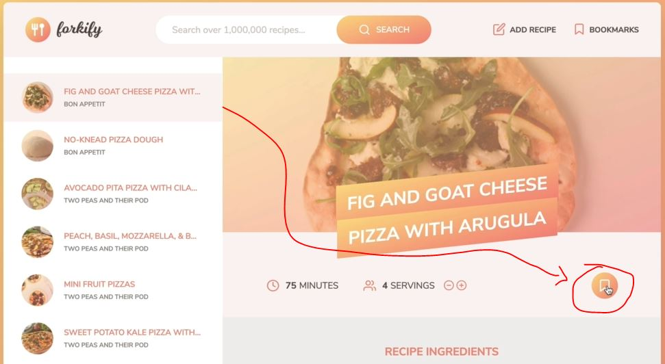
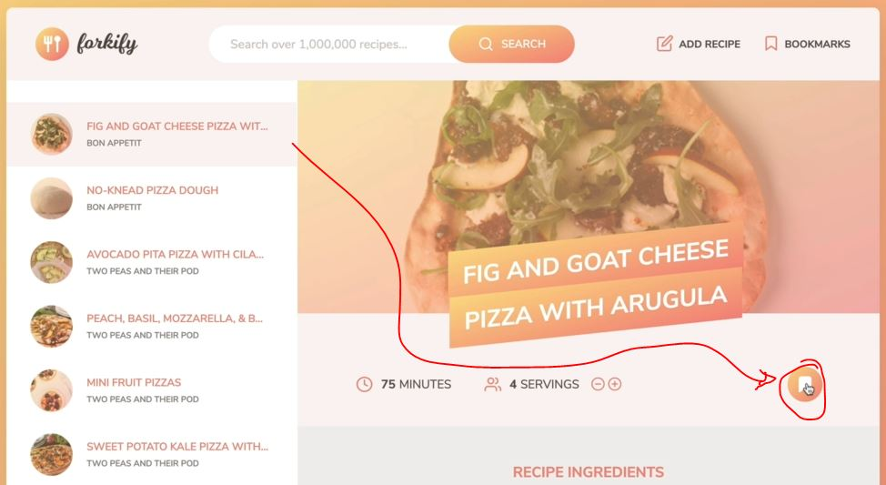
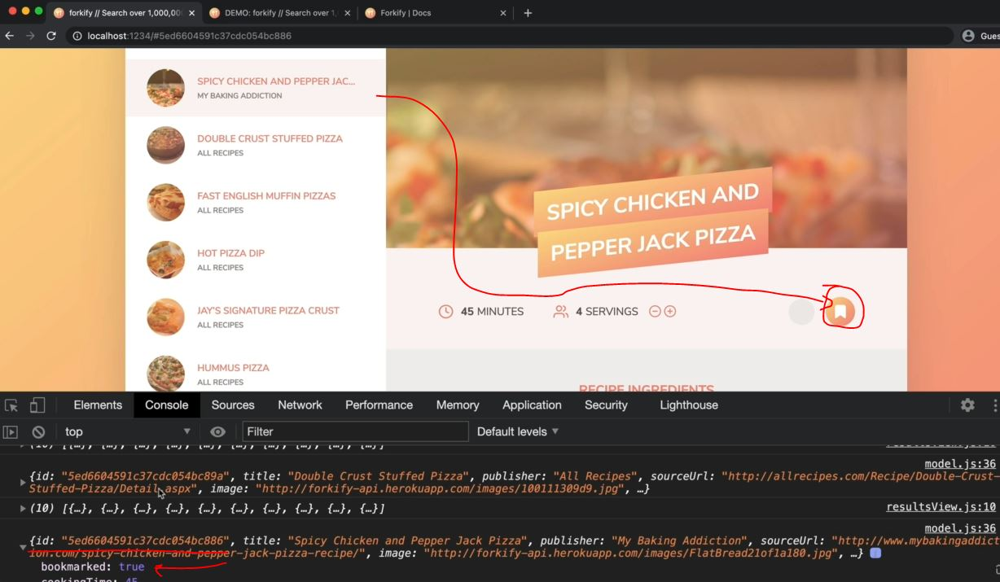

# Implementing Bookmarks - Part 1

- for implementing bookmarks , let's see inside flowchart forkify part 2
    - we'll simple add a handler to the recipe . so that the user can bookmark the recipe 
    - & then that will render or update the recipe with the bookmark button & then update it

- working example : 
    - when we click on a specific recipe then when we click on that bookmark recipe icon like this
        
    - then icon gets changed into like this , which means that recipe is bookmarked
        
    - now when we click on a different recipe then it's bookmark icon is empty <br>
        but when we go back to that recipe which was bookmarked then it's back to begin filled
    - & in next lecture , we'll see of displaying all the bookmarks up

## Fixing a bug of pagination

- when we search `pizza` then scroll down & then come to `Page 3` & then search for pasta & then again scroll down <br>
    & we can see that we're still on that `Page 3` instead of `Page 1` <br>
    so we want `Page 1` as default page for every new searched query even it's a same
- so this is the bug that we need to fix
- `solution` : 
    - so the issue is inside model.js file , <br>
        inside `loadSearchResults()` async function & inside `state` object , we have page property as 1
    - however , as we move to another page then that `page` property of `state` object gets updated <br>
        & when we search for something else then we never reset that `page` into 1 

- `STEP 1` : inside model.js file , inside `loadSearchResults()` async function
    ```js
    import { async } from 'regenerator-runtime' ;
    import { API_URL , RES_PER_PAGE} from '.config.js'
    import { getJSON } from './helpers.js'
            
    export const state = {
        recipe: {} , 
        search: {
            query: "" ,
            result: [] , 
            page: 1 , // by-default page number will be 1
            resultsPerPage: RES_PER_PAGE, 
        }
    }

    export const loadRecipe = async function(id) {  
        try {
            const data = await getJSON(`${API_URL}${id}`)

            const { recipe } = data.data 
            state.recipe = { 
                id:  recipe.id , 
                title: recipe.title, 
                publisher: recipe.publisher,
                sourceUrl: recipe.source_url ,
                image: recipe.image_url, 
                servings: recipe.servings, 
                cookingTime: recipe.cooking_time ,
                ingredients: recipe.ingredients
            }

            console.log(state.recipe) 
        } catch(err) {
            console.log(`${err} 💥💥💥`)
            throw err 
        }
    }

    export const loadSearchResults = async function() {
        try {
            state.search.query = query                
            const data = await getJSON(`${API_URL}?search=${query}`)

            state.search.results = data.data.recipes.map(rec => {
                return {
                    id:  rec.id , 
                    title: rec.title, 
                    publisher: rec.publisher,
                    image: rec.image_url, 
                }
            })

            state.search.page = 1 // now here we set the page -> property of state -> object as 1
                // when we load the search results based on that searched query 💡💡💡
                // means whenever we do a new search then the page will reset to 1

        } catch(err) {
            console.log(`${err} 💥💥💥`)
            throw err 
        }
    }

    export const getSearchResultsPage = function(page = state.search.page) { // passing default argument
        state.search.page = page

        const start = (page - 1) * state.search.resultsPerPage 
        const end = page * state.search.resultsPerPage
        return state.search.results.slice(start, end)
    }   
    ```
    - output : page will get reset as 1 whenever we do new search

## Steps - Implementing Bookmarks - Part 1

- so bookmark is all about data
- `STEP 1` : inside model.js file , exporting a new function for bookmark
    ```js
    import { async } from 'regenerator-runtime' ;
    import { API_URL , RES_PER_PAGE } from '.config.js'
    import { getJSON } from './helpers.js'
            
    export const state = {
        recipe: {} , 
        search: {
            query: "" ,
            result: [] , 
            page: 1 , 
            resultsPerPage: RES_PER_PAGE, 
        } ,

        bookmarks: [] // here we set the bookmarks as empty array & when we start bookmarking recipes 
            // then we'll push them inside this array
    }

    export const loadRecipe = async function(id) {  
        try {
            const data = await getJSON(`${API_URL}${id}`)

            const { recipe } = data.data 
            state.recipe = { 
                id:  recipe.id , 
                title: recipe.title, 
                publisher: recipe.publisher,
                sourceUrl: recipe.source_url ,
                image: recipe.image_url, 
                servings: recipe.servings, 
                cookingTime: recipe.cooking_time ,
                ingredients: recipe.ingredients
            }

            console.log(state.recipe) 
        } catch(err) {
            console.log(`${err} 💥💥💥`)
            throw err 
        }
    }

    export const loadSearchResults = async function() {
        try {
            state.search.query = query                
            const data = await getJSON(`${API_URL}?search=${query}`)

            state.search.results = data.data.recipes.map(rec => {
                return {
                    id:  rec.id , 
                    title: rec.title, 
                    publisher: rec.publisher,
                    image: rec.image_url, 
                }
            })

            state.search.page = 1 
        } catch(err) {
            console.log(`${err} 💥💥💥`)
            throw err 
        }
    }

    export const getSearchResultsPage = function(page = state.search.page) { // passing default argument
        state.search.page = page

        const start = (page - 1) * state.search.resultsPerPage 
        const end = page * state.search.resultsPerPage
        return state.search.results.slice(start, end)
    }   

    export const addBookmark = function(recipe) {
        // this function will receive a recipe & then it'll set that recipe as a bookmark

        // add bookmark
        state.bookmarks.push(recipe)

        // Mark current recipe as bookmark
            // we also want to mark the current recipe as being bookmarked
            // so if the current recipe is the same recipe as this i.e recipe -> parameter which we're adding
            // because this will allow us to display that current recipe as bookmarked in the recipe view
        if (recipe.id === state.recipe.id) {
            // if recipe.id is equal-to to the ID of the current recipe (means which is currently loaded in our app)
                // i.e state.recipe.id

            state.recipe.bookmarked = true // setting new property inside state.recipe -> object
        }
    }
    ```

- `STEP 2` : inside controller.js file , let's creating a new controller to add a new bookmark
    ```js
    import * as model from './model.js' 
    import recipeView from './views/recipeView.js'
    import searchView from './views/searchView.js'
    import resultsView from './views/resultsView.js'
    import paginationView from './views/paginationView.js'

    import 'core-js/stable' 
    import 'regenerator-runtime/runtime' 

    const timeout = function (s) => {
        return new Promise(function (_, reject) {
            setTimeout(function() {
                reject(new Error(`Request took too long! Timeout after ${s} second`))
            }, s * 1000)
        })
    }

    const controlRecipe = async function() {
        try {
            const id = window.location.hash.slice(1)

            if (!id) return 
            resultsView.renderSpinner()

            // 0) update results view to mark selected search result
            resultsView.render(model.getSearchResultsPage()) 

            // 1 - Loading recipe
            await model.loadRecipe(id) 

            // 2 - Rendering recipe
            recipeView.render(model.state.recipe)

        } catch(err) {
            recipeView.renderError() 
        }
    }

    const controlSearchResults = async function() {
        try {
            resultsView.renderSpinner()

            // 1) Get search query
            const query = searchView.getQuery()
            if (!query) return

            // 2) load search results
            await model.loadSearchResults(query) 

            // 3) Render results
            resultsView.render(model.getSearchResultsPage()) 

            // 4) render initial pagination buttons
            paginationView.render(model.state.search) 

        } catch(err) {
            console.log(err)
        }
    }

    const controlPagination = function(goToPage) { 
        // 1) Render NEW results
        resultsView.render(model.getSearchResultsPage(goToPage)) 

        // 2) render NEW  pagination buttons
        paginationView.render(model.state.search) 
    }

    const controlAddBookmark = function() {
        model.addBookmark(model.state.recipe)
        console.log(model.state.recipe)
    }

    const init = function() {
        recipeView.addHandlerRender(controlRecipes)
        recipeView.addHandlerUpdateServings(controlServings)
        searchView.addHandlerSearch(controlSearchResults)
        paginationView.addHandlerClick(controlPagination)
    }
    init()
    ```
    - now we want to call controlAddBookmark() function when we click on that bookmark button
    - `STEP 2.1` : inside recipeView.js file , fixing that bookmark button svg 
        ```js
        import View from './View.js'

        import icons from 'url:../../img/icons.svg' 
        import { Fraction }  from 'fractional' 

        class RecipeView extends View {
            _parentElement = document.querySelector('.btn') ;
            _errorMessage = "we could not find that recipe. Please try another one!" ;
            _message = "";

            addHandlerRender(handler) {
                ['hashchange', 'load'].forEach((e) => window.addEventListener(e , handler))
            }

            addHandlerUpdateServings(handler) {
                this._parentElement.addEventListener('click' , function(e) {
                    const btn = e.target.closest('.btn--update-servings')
                    if (!btn) return 
                    const { updateTo } = btn.dataset
                    if (+updateTo > 0) handler(+updateTo) 
                })
            }

            _generateMarkup() {
                return `
                    <figure class="recipe__fig">
                        
                        <h1 class="recipe__title">
                          <span>${this._data.title}</span>
                        </h1>
                    </figure>

                    <div class="recipe__details">
                        <div class="recipe__info">
                            <svg class="recipe__info-icon"><use href="${icons}#icon-clock"></use></svg>
                            <span class="recipe__info-data recipe__info-data--minutes">${this._data.cookingTime}</span>
                            <span class="recipe__info-text">minutes</span>
                        </div>
                        <div class="recipe__info">
                            <svg class="recipe__info-icon"><use href="${icons}#icon"></use></svg>
                            <span class="recipe__info-data recipe__info-data--people">${this._data.servings}</span>
                            <span class="recipe__info-text">servings</span>

                            <div class="recipe__info-buttons">
                                <button class="btn--tiny btn--update-servings" data-update-to="${this._data.servings - 1}">
                                  <svg><use href="${icons}#icon-minus-circle"></use></svg>
                                </button>
                                <button class="btn--tiny btn--update-servings" data-update-to="${this._data.servings + 1}">
                                  <svg><use href="${icons}#icon-plus-circle"></use></svg>
                                </button>
                            </div>
                        </div>

                        <div class="recipe__user-generated"></div>
                        <button class="btn--round btn-bookmark">
                            <svg class=""><use href="${icons}#icon-bookmark"></use></svg>
                        </button>
                    </div>

                    <div class="recipe__ingredients">
                        <h2 class="heading--2">Recipe ingredients</h2>
                        <ul class="recipe__ingredient-list">
                            ${this._data.ingredients.map(this._generateMarkupIngredient).join('')}
                        </ul>
                    </div>

                    <div class="recipe__directions">
                        <h2 class="heading--2">How to cook it</h2>
                        <p class="recipe__directions-text">
                            This recipe was carefully designed and tested by
                            <span class="recipe__publisher">${this._data.publisher}</span>. Please check out
                            directions at their website.
                        </p>
                        <a class="btn--small recipe__btn" href="${this._data.sourceUrl}"target="_blank">
                        <span>Directions</span>
                        <svg class="search__icon"><use href="${icons}#icon-arrow-right"></use></svg>
                      </a>
                    </div>
                ` ;
            }

            _generateMarkupIngredient(ing) {
                return `
                    <li class="recipe__ingredient">
                        <svg class="recipe__icon"><use href="${icons}#icon-check"></use></svg>
                        <div class="recipe__quantity">${ing.quantity ? Fraction(ing.quantity).toString() : ""}</div>
                        <div class="recipe__description">
                            <span class="recipe__unit">${ing.unit}</span>
                            ${ing.description}
                        </div>
                    </li>
                `
            }
        }
        ```
        - output : now in the UI , that bookmark button will be empty
            - & we also add `btn-bookmark` class when we listen for clicks on that bookmark button <br>
                but we'll not select this class directly , we'll use event delegation concept 💡💡💡
    
- `STEP 3` : inside recipeView.js file , creating a function for bookmark 
    - in order to select that `btn-bookmark` class via event delegation
    ```js
    import View from './View.js'

    import icons from 'url:../../img/icons.svg' 
    import { Fraction }  from 'fractional' 

    class RecipeView extends View {
        _parentElement = document.querySelector('.btn') ;
        _errorMessage = "we could not find that recipe. Please try another one!" ;
        _message = "";

        addHandlerRender(handler) {
            ['hashchange', 'load'].forEach((e) => window.addEventListener(e , handler))
        }

        addHandlerUpdateServings(handler) {
            this._parentElement.addEventListener('click' , function(e) {
                const btn = e.target.closest('.btn--update-servings')
                if (!btn) return 
                const { updateTo } = btn.dataset
                if (+updateTo > 0) handler(+updateTo) 
            })
        }

        addHandlerAddBookmark(handler) {
            this._parentElement.addEventListener('click' , function(e) {
                // Note : use-case of event delegation 🔥 : 
                    // we're implementing this because the element which we'll select 
                        // i.e that button with that btn-bookmark -> class is actually not exist
                        // when the application is loaded
                    // so it's impossible to add an event listener to an element that doesn't exist
                        // that's why this is great use-case of event delegation 💡💡💡
                
                // so here we'll listen for the event on a parent element 
                    // & then figure out if the click actually happened on the element that we're looking for 💡💡💡
                
                const btn = e.target.closest('.btn--update-servings')
                if (!btn) return 
                handler()
            })
        }

        _generateMarkup() {
            return `
                <figure class="recipe__fig">
                    
                    <h1 class="recipe__title">
                      <span>${this._data.title}</span>
                    </h1>
                </figure>

                <div class="recipe__details">
                    <div class="recipe__info">
                        <svg class="recipe__info-icon"><use href="${icons}#icon-clock"></use></svg>
                        <span class="recipe__info-data recipe__info-data--minutes">${this._data.cookingTime}</span>
                        <span class="recipe__info-text">minutes</span>
                    </div>
                    <div class="recipe__info">
                        <svg class="recipe__info-icon"><use href="${icons}#icon"></use></svg>
                        <span class="recipe__info-data recipe__info-data--people">${this._data.servings}</span>
                        <span class="recipe__info-text">servings</span>

                        <div class="recipe__info-buttons">
                            <button class="btn--tiny btn--update-servings" data-update-to="${this._data.servings - 1}">
                              <svg><use href="${icons}#icon-minus-circle"></use></svg>
                            </button>
                            <button class="btn--tiny btn--update-servings" data-update-to="${this._data.servings + 1}">
                              <svg><use href="${icons}#icon-plus-circle"></use></svg>
                            </button>
                        </div>
                    </div>

                    <div class="recipe__user-generated"></div>
                    <button class="btn--round btn-bookmark">
                        <svg class=""><use href="${icons}#icon-bookmark"></use></svg>
                    </button>
                </div>

                <div class="recipe__ingredients">
                    <h2 class="heading--2">Recipe ingredients</h2>
                    <ul class="recipe__ingredient-list">
                        ${this._data.ingredients.map(this._generateMarkupIngredient).join('')}
                    </ul>
                </div>

                <div class="recipe__directions">
                    <h2 class="heading--2">How to cook it</h2>
                    <p class="recipe__directions-text">
                        This recipe was carefully designed and tested by
                        <span class="recipe__publisher">${this._data.publisher}</span>. Please check out
                        directions at their website.
                    </p>
                    <a class="btn--small recipe__btn" href="${this._data.sourceUrl}"target="_blank">
                    <span>Directions</span>
                    <svg class="search__icon"><use href="${icons}#icon-arrow-right"></use></svg>
                  </a>
                </div>
            ` ;
        }

        _generateMarkupIngredient(ing) {
            return `
                <li class="recipe__ingredient">
                    <svg class="recipe__icon"><use href="${icons}#icon-check"></use></svg>
                    <div class="recipe__quantity">${ing.quantity ? Fraction(ing.quantity).toString() : ""}</div>
                    <div class="recipe__description">
                        <span class="recipe__unit">${ing.unit}</span>
                        ${ing.description}
                    </div>
                </li>
            `
        }
    }
    ```
    - `STEP 3.1` : inside controller.js file , calling addHandlerAddBookmark() function inside init() function
        ```js
        import * as model from './model.js' 
        import recipeView from './views/recipeView.js'
        import searchView from './views/searchView.js'
        import resultsView from './views/resultsView.js'
        import paginationView from './views/paginationView.js'

        import 'core-js/stable' 
        import 'regenerator-runtime/runtime' 

        const timeout = function (s) => {
            return new Promise(function (_, reject) {
                setTimeout(function() {
                    reject(new Error(`Request took too long! Timeout after ${s} second`))
                }, s * 1000)
            })
        }

        const controlRecipe = async function() {
            try {
                const id = window.location.hash.slice(1)

                if (!id) return 
                resultsView.renderSpinner()

                // 0) update results view to mark selected search result
                resultsView.render(model.getSearchResultsPage()) 

                // 1 - Loading recipe
                await model.loadRecipe(id) 

                // 2 - Rendering recipe
                recipeView.render(model.state.recipe)

            } catch(err) {
                recipeView.renderError() 
            }
        }

        const controlSearchResults = async function() {
            try {
                resultsView.renderSpinner()

                // 1) Get search query
                const query = searchView.getQuery()
                if (!query) return

                // 2) load search results
                await model.loadSearchResults(query) 

                // 3) Render results
                resultsView.render(model.getSearchResultsPage()) 

                // 4) render initial pagination buttons
                paginationView.render(model.state.search) 

            } catch(err) {
                console.log(err)
            }
        }

        const controlPagination = function(goToPage) { 
            // 1) Render NEW results
            resultsView.render(model.getSearchResultsPage(goToPage)) 

            // 2) render NEW  pagination buttons
            paginationView.render(model.state.search) 
        }

        const controlAddBookmark = function() {
            model.addBookmark(model.state.recipe)
            console.log(model.state.recipe)
        }

        const init = function() {
            recipeView.addHandlerRender(controlRecipes)
            recipeView.addHandlerUpdateServings(controlServings)
            recipeView.addHandlerAddBookmark(controlAddBookmark)
            searchView.addHandlerSearch(controlSearchResults)
            paginationView.addHandlerClick(controlPagination)
        }
        init()
        ```
        - output : when we click on that bookmark button then we'll get the object inside console tab
            - & inside of that object , we'll get `bookmarked` property as true
        - now we want to render/update the svg icon of that bookmark button as filled <br>
            if the bookmarked is true & if bookmark is false then set the bookmark button empty svg

- `STEP 4` : inside recipeView.js file , putting filled svg or empty svg inside bookmarked button based on the condition
    ```js
    import View from './View.js'

    import icons from 'url:../../img/icons.svg' 
    import { Fraction }  from 'fractional' 

    class RecipeView extends View {
        _parentElement = document.querySelector('.btn') ;
        _errorMessage = "we could not find that recipe. Please try another one!" ;
        _message = "";

        addHandlerRender(handler) {
            ['hashchange', 'load'].forEach((e) => window.addEventListener(e , handler))
        }

        addHandlerUpdateServings(handler) {
            this._parentElement.addEventListener('click' , function(e) {
                const btn = e.target.closest('.btn--update-servings')
                if (!btn) return 
                const { updateTo } = btn.dataset
                if (+updateTo > 0) handler(+updateTo) 
            })
        }

        addHandlerAddBookmark(handler) {
            this._parentElement.addEventListener('click' , function(e) {
                const btn = e.target.closest('.btn--update-servings')
                if (!btn) return 
                handler()
            })
        }

        _generateMarkup() {
            return `
                <figure class="recipe__fig">
                    
                    <h1 class="recipe__title">
                      <span>${this._data.title}</span>
                    </h1>
                </figure>

                <div class="recipe__details">
                    <div class="recipe__info">
                        <svg class="recipe__info-icon"><use href="${icons}#icon-clock"></use></svg>
                        <span class="recipe__info-data recipe__info-data--minutes">${this._data.cookingTime}</span>
                        <span class="recipe__info-text">minutes</span>
                    </div>
                    <div class="recipe__info">
                        <svg class="recipe__info-icon"><use href="${icons}#icon"></use></svg>
                        <span class="recipe__info-data recipe__info-data--people">${this._data.servings}</span>
                        <span class="recipe__info-text">servings</span>

                        <div class="recipe__info-buttons">
                            <button class="btn--tiny btn--update-servings" data-update-to="${this._data.servings - 1}">
                              <svg><use href="${icons}#icon-minus-circle"></use></svg>
                            </button>
                            <button class="btn--tiny btn--update-servings" data-update-to="${this._data.servings + 1}">
                              <svg><use href="${icons}#icon-plus-circle"></use></svg>
                            </button>
                        </div>
                    </div>

                    <div class="recipe__user-generated"></div>
                    <button class="btn--round btn-bookmark">
                        <svg class=""><use href="${icons}#icon-bookmark${this._data.bookmarked ? '-fill' : ""}"></use></svg>
                    </button>
                </div>

                <div class="recipe__ingredients">
                    <h2 class="heading--2">Recipe ingredients</h2>
                    <ul class="recipe__ingredient-list">
                        ${this._data.ingredients.map(this._generateMarkupIngredient).join('')}
                    </ul>
                </div>

                <div class="recipe__directions">
                    <h2 class="heading--2">How to cook it</h2>
                    <p class="recipe__directions-text">
                        This recipe was carefully designed and tested by
                        <span class="recipe__publisher">${this._data.publisher}</span>. Please check out
                        directions at their website.
                    </p>
                    <a class="btn--small recipe__btn" href="${this._data.sourceUrl}"target="_blank">
                    <span>Directions</span>
                    <svg class="search__icon"><use href="${icons}#icon-arrow-right"></use></svg>
                  </a>
                </div>
            ` ;
        }

        _generateMarkupIngredient(ing) {
            return `
                <li class="recipe__ingredient">
                    <svg class="recipe__icon"><use href="${icons}#icon-check"></use></svg>
                    <div class="recipe__quantity">${ing.quantity ? Fraction(ing.quantity).toString() : ""}</div>
                    <div class="recipe__description">
                        <span class="recipe__unit">${ing.unit}</span>
                        ${ing.description}
                    </div>
                </li>
            `
        }
    }
    ```
    - `STEP 4.1` : inside controller.js file , updating the entire recipe inside controlAddBookmark() function
        ```js
        import * as model from './model.js' 
        import recipeView from './views/recipeView.js'
        import searchView from './views/searchView.js'
        import resultsView from './views/resultsView.js'
        import paginationView from './views/paginationView.js'

        import 'core-js/stable' 
        import 'regenerator-runtime/runtime' 

        const timeout = function (s) => {
            return new Promise(function (_, reject) {
                setTimeout(function() {
                    reject(new Error(`Request took too long! Timeout after ${s} second`))
                }, s * 1000)
            })
        }

        const controlRecipe = async function() {
            try {
                const id = window.location.hash.slice(1)

                if (!id) return 
                resultsView.renderSpinner()

                // 0) update results view to mark selected search result
                resultsView.render(model.getSearchResultsPage()) 

                // 1 - Loading recipe
                await model.loadRecipe(id) 

                // 2 - Rendering recipe
                recipeView.render(model.state.recipe)

            } catch(err) {
                recipeView.renderError() 
            }
        }

        const controlSearchResults = async function() {
            try {
                resultsView.renderSpinner()

                // 1) Get search query
                const query = searchView.getQuery()
                if (!query) return

                // 2) load search results
                await model.loadSearchResults(query) 

                // 3) Render results
                resultsView.render(model.getSearchResultsPage()) 

                // 4) render initial pagination buttons
                paginationView.render(model.state.search) 

            } catch(err) {
                console.log(err)
            }
        }

        const controlPagination = function(goToPage) { 
            // 1) Render NEW results
            resultsView.render(model.getSearchResultsPage(goToPage)) 

            // 2) render NEW  pagination buttons
            paginationView.render(model.state.search) 
        }

        const controlAddBookmark = function() {
            model.addBookmark(model.state.recipe)
            console.log(model.state.recipe)
            recipeView.update(model.state.recipe)
        }

        const init = function() {
            recipeView.addHandlerRender(controlRecipes)
            recipeView.addHandlerUpdateServings(controlServings)
            recipeView.addHandlerAddBookmark(controlAddBookmark)
            searchView.addHandlerSearch(controlSearchResults)
            paginationView.addHandlerClick(controlPagination)
        }
        init()
        ``` 
        - output : now search for pizza
            - then bookmark the first item & then second item 
            - & then when we come back on first item then bookmark is not bookmarked because inside console tab, <br>
                that particular bookmarked item object doesn't contain `bookmarked` property set to true
            - because when we click on an recipe item then each recipe gets loaded from scratch means it'll be loaded <br>
                from the API means we're not loading that recipe (which is bookmarked) from the bookmarks 💡💡💡
            - so we want to use the data that we store in the `bookmarks` array of that state object <br>
                in order to mark any recipe that we load as bookmarked if it's already in the `bookmarks` array
    - `STEP 4.2` : inside model.js file , 
        - `Note - use case of some() array method ✅` : 
            - inside loadRecipe() async function , we got all those data & we stored those data inside state.recipe object 
            - so we can do check if there's already a recipe with the same ID in the bookmark state & if it's the case , <br>
                then we'll mark the current recipe that we just loaded from the API as bookmarked set to true 
            - so for this condition , we'll use `some()` array method 💡💡💡
        ```js
        import { async } from 'regenerator-runtime' ;
        import { API_URL , RES_PER_PAGE } from '.config.js'
        import { getJSON } from './helpers.js'
                
        export const state = {
            recipe: {} , 
            search: {
                query: "" ,
                result: [] , 
                page: 1 , 
                resultsPerPage: RES_PER_PAGE, 
            } ,

            bookmarks: [] // here we set the bookmarks as empty array & when we start bookmarking recipes 
                // then we'll push them inside this array
        }

        export const loadRecipe = async function(id) {  
            try {
                const data = await getJSON(`${API_URL}${id}`)

                const { recipe } = data.data 
                state.recipe = { 
                    id:  recipe.id , 
                    title: recipe.title, 
                    publisher: recipe.publisher,
                    sourceUrl: recipe.source_url ,
                    image: recipe.image_url, 
                    servings: recipe.servings, 
                    cookingTime: recipe.cooking_time ,
                    ingredients: recipe.ingredients
                }

                if (state.bookmarks.some(bookmark => bookmark.id === id)) {
                    // this condition means if there's any bookmark which has the bookmark ID equal-to
                        // the ID that we just received  

                    state.recipe.bookmarked = true
                } else {
                    state.recipe.bookmarked = false
                }
                // through these conditions we had stored the recipe in the bookmarks -> array
                    // & we just use bookmarks -> array to store all the bookmarks
                        // & when we come back that that recipe that that recipe should be bookmarked

                console.log(state.recipe) 
            } catch(err) {
                console.log(`${err} 💥💥💥`)
                throw err 
            }
        }

        export const loadSearchResults = async function() {
            try {
                state.search.query = query                
                const data = await getJSON(`${API_URL}?search=${query}`)

                state.search.results = data.data.recipes.map(rec => {
                    return {
                        id:  rec.id , 
                        title: rec.title, 
                        publisher: rec.publisher,
                        image: rec.image_url, 
                    }
                })

                state.search.page = 1 
            } catch(err) {
                console.log(`${err} 💥💥💥`)
                throw err 
            }
        }

        export const getSearchResultsPage = function(page = state.search.page) { // passing default argument
            state.search.page = page

            const start = (page - 1) * state.search.resultsPerPage 
            const end = page * state.search.resultsPerPage
            return state.search.results.slice(start, end)
        }   

        export const addBookmark = function(recipe) {
            // add bookmark
            state.bookmarks.push(recipe)

            if (recipe.id === state.recipe.id) {
                state.recipe.bookmarked = true
            }
        }
        ```
        - output : search for pizza
            - & click on first recipe & bookmark it & then click on any other recipe 
            - & then come back to that first recipe then we can see that it's bookmarked button filled <br>
                & inside that bookmark recipe object , `bookmarked` property is set to true like this
                
            - & that previous recipe which is clicked on , it's object will contain bookmarked recipe as false
        - now we need to un-bookmark when we click on that bookmarked button of that recipe

- `STEP 5` : inside model.js file , exporting another new function to un-bookmark that recipe
    ```js
    
    ```


✔️✔️✔️
💡💡💡
✅
🔥

