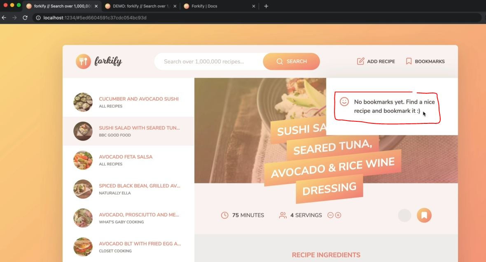
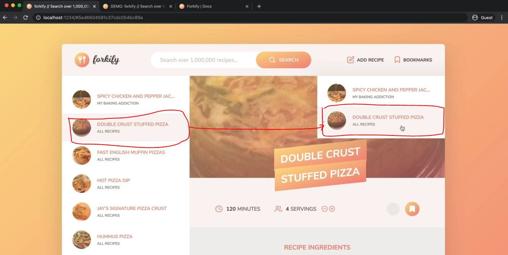

# Implementing Bookmarks - Part 2

- when we bookmark a recipe then we want to display that recipe inside the bookmarks panel
- current , when we hover on the bookmarks panel then we'll get the message like this
    

## Steps - implementing bookmarks - Part 2

- `STEP 1` : inside index.html file , copy this html markup of bookmark which is commented out
    ```html
    <li class="preview">
        <a class="preview__link" href="#23456">
            <figure class="preview__fig">
                
            </figure>
            <div class="preview__data">
                <h4 class="preview__name">Pasta with Tomato Cream ...</h4>
                <p class="preview__author">The Pioneer Woman</p>
            </div>
        </a>
    </li>
    ```
    - just like we have `preview` class div for search

- `STEP 2` : inside resultsView.js file , copy all the code
    ```js
    import View from './View.js'
    import icons from 'url:../../img/icons.svg' 

    class ResultsView extends View {
        _parentElement = document.querySelector('.results')
        _errorMessage = 'No recipes found for your query! Please try again :-D'
        _message = ""

        _generateMarkup() {
            console.log(this._data)
            return this._data.map(this._generateMarkupPreview).join("")
        }

        _generateMarkupPreview(result) {
            const id = window.location.hash.slice(1) // getting first element

            return ` 
                <li class="preview">
                    <a class="preview__link ${result.id === id ? 'preview__link--active' : ''}" href="#${result.id}">
                        <figure class="preview__fig">
                            
                        </figure>
                        <div class="preview__data">
                            <h4 class="preview__title">${result.title}</h4>
                            <p class="preview__publisher">${result.publisher}</p>
                        </div>
                    </a>
                </li>
            `
        }
    }

    export default new ResultsView() 
    ```
    - `STEP 2.1` : inside `js/views` folder , create a file as bookmarksView.js file
        - inside bookmarksView.js file , paste all the code of resultsView.js file & refactor it
            ```js
            import View from './View.js'
            import icons from 'url:../../img/icons.svg' 

            class BookmarksView extends View {
                _parentElement = document.querySelector('.bookmarks__list')
                _errorMessage = 'No bookmarks yet. Find a nice recipe and bookmark it :-D'
                _message = ""

                _generateMarkup() {
                    console.log(this._data)
                    return this._data.map(this._generateMarkupPreview).join("")
                }

                _generateMarkupPreview(result) {
                    const id = window.location.hash.slice(1) 

                    return ` 
                        <li class="preview">
                            <a class="preview__link ${result.id === id ? 'preview__link--active' : ''}" href="#${result.id}">
                                <figure class="preview__fig">
                                    
                                </figure>
                                <div class="preview__data">
                                    <h4 class="preview__title">${result.title}</h4>
                                    <p class="preview__publisher">${result.publisher}</p>
                                </div>
                            </a>
                        </li>
                    `
                }
            }

            export default new BookmarksView() 
            ```
    - `STEP 2.2` : inside controller.js file , importing BookmarksView() class
        ```js
        import * as model from './model.js' 
        import recipeView from './views/recipeView.js'
        import searchView from './views/searchView.js'
        import resultsView from './views/resultsView.js'
        import paginationView from './views/paginationView.js'
        import bookmarksView from './views/bookmarksView.js'

        import 'core-js/stable' 
        import 'regenerator-runtime/runtime' 

        const timeout = function (s) => {
            return new Promise(function (_, reject) {
                setTimeout(function() {
                    reject(new Error(`Request took too long! Timeout after ${s} second`))
                }, s * 1000)
            })
        }

        const controlRecipe = async function() {
            try {
                const id = window.location.hash.slice(1)

                if (!id) return 
                resultsView.renderSpinner()

                // 0) update results view to mark selected search result
                resultsView.render(model.getSearchResultsPage()) 

                // 1 - Loading recipe
                await model.loadRecipe(id) 

                // 2 - Rendering recipe
                recipeView.render(model.state.recipe)

            } catch(err) {
                recipeView.renderError() 
            }
        }

        const controlSearchResults = async function() {
            try {
                resultsView.renderSpinner()

                // 1) Get search query
                const query = searchView.getQuery()
                if (!query) return

                // 2) load search results
                await model.loadSearchResults(query) 

                // 3) Render results
                resultsView.render(model.getSearchResultsPage()) 

                // 4) render initial pagination buttons
                paginationView.render(model.state.search) 

            } catch(err) {
                console.log(err)
            }
        }

        const controlPagination = function(goToPage) { 
            // 1) Render NEW results
            resultsView.render(model.getSearchResultsPage(goToPage)) 

            // 2) render NEW  pagination buttons
            paginationView.render(model.state.search) 
        }

        const controlAddBookmark = function() {
            if (!model.state.recipe.bookmarked) {
                model.addBookmark(model.state.recipe)
            } else (model.state.recipe.bookmarked) {
                model.deleteBookmark(model.state.recipe.id)
            }

            console.log(model.state.recipe)
            recipeView.update(model.state.recipe)
        }

        const init = function() {
            recipeView.addHandlerRender(controlRecipes)
            recipeView.addHandlerUpdateServings(controlServings)
            recipeView.addHandlerAddBookmark(controlAddBookmark)
            searchView.addHandlerSearch(controlSearchResults)
            paginationView.addHandlerClick(controlPagination)
        }
        init()
        ```
        - now we need to do is whenever a new bookmark is added <br>
            then we want to render the bookmarks view with all the bookmarks

- `STEP 3` : inside controller.js file , implementing functionality 
    - of whenever a new bookmark is added then we want to render the bookmarks view with all the bookmarks
    ```js
    import * as model from './model.js' 
    import recipeView from './views/recipeView.js'
    import searchView from './views/searchView.js'
    import resultsView from './views/resultsView.js'
    import paginationView from './views/paginationView.js'
    import bookmarksView from './views/bookmarksView.js'

    import 'core-js/stable' 
    import 'regenerator-runtime/runtime' 

    const timeout = function (s) => {
        return new Promise(function (_, reject) {
            setTimeout(function() {
                reject(new Error(`Request took too long! Timeout after ${s} second`))
            }, s * 1000)
        })
    }

    const controlRecipe = async function() {
        try {
            const id = window.location.hash.slice(1)

            if (!id) return 
            resultsView.renderSpinner()

            // 0) update results view to mark selected search result
            resultsView.render(model.getSearchResultsPage()) 

            // 1 - Loading recipe
            await model.loadRecipe(id) 

            // 2 - Rendering recipe
            recipeView.render(model.state.recipe)

        } catch(err) {
            recipeView.renderError() 
        }
    }

    const controlSearchResults = async function() {
        try {
            resultsView.renderSpinner()

            // 1) Get search query
            const query = searchView.getQuery()
            if (!query) return

            // 2) load search results
            await model.loadSearchResults(query) 

            // 3) Render results
            resultsView.render(model.getSearchResultsPage()) 

            // 4) render initial pagination buttons
            paginationView.render(model.state.search) 

        } catch(err) {
            console.log(err)
        }
    }

    const controlPagination = function(goToPage) { 
        // 1) Render NEW results
        resultsView.render(model.getSearchResultsPage(goToPage)) 

        // 2) render NEW  pagination buttons
        paginationView.render(model.state.search) 
    }

    const controlAddBookmark = function() {
        // 1) Add/remove bookmark
        if (!model.state.recipe.bookmarked) {
            model.addBookmark(model.state.recipe)
        } else (model.state.recipe.bookmarked) {
            model.deleteBookmark(model.state.recipe.id)
        }

        // 2) Update recipe view
        recipeView.update(model.state.recipe)

        // 3) Render bookmarks
        bookmarksView.render(model.state.bookmarks)
            // this is the reason that we not only store the id of bookmarks inside state -> object
                // but we also stored the bookmarks array of all the bookmarks 💡💡💡
    }

    const init = function() {
        recipeView.addHandlerRender(controlRecipes)
        recipeView.addHandlerUpdateServings(controlServings)
        recipeView.addHandlerAddBookmark(controlAddBookmark)
        searchView.addHandlerSearch(controlSearchResults)
        paginationView.addHandlerClick(controlPagination)
    }
    init()
    ```
    - output : search for pizza & then when we bookmark first item 
        - then inside bookmarks view , we can see that first bookmarked recipe
        - & then bookmark second recipe then we can see previous & second one recipe inside bookmarks view
        - & then we can see that current recipe also gets highlighted inside bookmarks view like this
             
        - but if select first recipe & then inside bookmarks view , still that second recipe is selected 💡💡💡
    - so need to do is that each time we display a recipe , we should probably update that entire bookmarks <br>
        which is inside bookmarks panel . So then it can select or highlight the current recipe 💡💡💡
    - `STEP 3.1` : inside controller.js file , fixing current bookmark highlighted inside bookmarks view 
        ```js
        import * as model from './model.js' 
        import recipeView from './views/recipeView.js'
        import searchView from './views/searchView.js'
        import resultsView from './views/resultsView.js'
        import paginationView from './views/paginationView.js'
        import bookmarksView from './views/bookmarksView.js'

        import 'core-js/stable' 
        import 'regenerator-runtime/runtime' 

        const timeout = function (s) => {
            return new Promise(function (_, reject) {
                setTimeout(function() {
                    reject(new Error(`Request took too long! Timeout after ${s} second`))
                }, s * 1000)
            })
        }

        const controlRecipe = async function() {
            try {
                const id = window.location.hash.slice(1)

                if (!id) return 
                resultsView.renderSpinner()

                // 0) update results view to mark selected search result
                resultsView.render(model.getSearchResultsPage()) 
                bookmarksView.update(model.state.bookmarks) 
                    // highlighting the bookmark inside bookmarks view which is selected

                // 1 - Loading recipe
                await model.loadRecipe(id) 

                // 2 - Rendering recipe
                recipeView.render(model.state.recipe)

            } catch(err) {
                recipeView.renderError() 
            }
        }

        const controlSearchResults = async function() {
            try {
                resultsView.renderSpinner()

                // 1) Get search query
                const query = searchView.getQuery()
                if (!query) return

                // 2) load search results
                await model.loadSearchResults(query) 

                // 3) Render results
                resultsView.render(model.getSearchResultsPage()) 

                // 4) render initial pagination buttons
                paginationView.render(model.state.search) 

            } catch(err) {
                console.log(err)
            }
        }

        const controlPagination = function(goToPage) { 
            // 1) Render NEW results
            resultsView.render(model.getSearchResultsPage(goToPage)) 

            // 2) render NEW  pagination buttons
            paginationView.render(model.state.search) 
        }

        const controlAddBookmark = function() {
            // 1) Add/remove bookmark
            if (!model.state.recipe.bookmarked) {
                model.addBookmark(model.state.recipe)
            } else (model.state.recipe.bookmarked) {
                model.deleteBookmark(model.state.recipe.id)
            }

            // 2) Update recipe view
            recipeView.update(model.state.recipe)

            // 3) Render bookmarks
            bookmarksView.render(model.state.bookmarks)
        }

        const init = function() {
            recipeView.addHandlerRender(controlRecipes)
            recipeView.addHandlerUpdateServings(controlServings)
            recipeView.addHandlerAddBookmark(controlAddBookmark)
            searchView.addHandlerSearch(controlSearchResults)
            paginationView.addHandlerClick(controlPagination)
        }
        init()
        ```
        - output : search for pizza & then select second recipe & bookmark it & it'll added inside bookmarks View
            - now select first recipe & bookmark it & it's also added inside bookmarks view <br>
                & now when we see the bookmarks view , then first recipe will get selected as current 
            - now when we select third recipe which is not bookmarked & if we see bookmarks view <br>
                then nothing is highlighted because we didn't bookmarked it 
            - now when we click on any recipe then we'll be displayed on right side <br>
                & that recipe also selected on left side 

    - now think about that if we don't follow the architecture way like MVC & keeping all the code in one file <br>
        then things become difficult to understand & flow of the code , even debugging also

    - now we need to fix two thins i.e resultsView.js file & bookmarksView.js file are essentially same <br>
        & even html markup which we're generating is also same . So we'll creating a parent view of those two views <br>
        which will be called as previewView.js file 💡💡💡

- `STEP 4` : inside `js/views` folder , create previewView.js file 
    - copy all the code from resultsView.js file & paste inside previewView.js file 
    - inside previewView.js file , now refactoring the code
        - so this previewView.js file will only generate the html markup for those preview elements
        ```js
        import View from './View.js'
        import icons from 'url:../../img/icons.svg' 

        class PreviewView extends View {
            // this PreviewView class will only generate 1 preview element

            _parentElement = "" // we don't need parent element 

            _generateMarkup(result) {
                const id = window.location.hash.slice(1) // getting first element

                return ` 
                    <li class="preview">
                        <a class="preview__link ${result.id === id ? 'preview__link--active' : ''}" href="#${result.id}">
                            <figure class="preview__fig">
                                
                            </figure>
                            <div class="preview__data">
                                <h4 class="preview__title">${result.title}</h4>
                                <p class="preview__publisher">${result.publisher}</p>
                            </div>
                        </a>
                    </li>
                `
            }
        }

        export default new PreviewView() 
        ```
    - `STEP 4.1` : inside bookmarksView.js file , remove the _generateMarkupPreview() function
        - & we'll use previewView as a child view of the bookmarksView & resultsView 
        - so let's import previewView inside both of them
        ```js
        import View from './View.js'
        import previewView from './previewView.js'
        import icons from 'url:../../img/icons.svg' 

        class BookmarksView extends View {
            _parentElement = document.querySelector('.bookmarks__list')
            _errorMessage = 'No bookmarks yet. Find a nice recipe and bookmark it :-D'
            _message = ""

            _generateMarkup() {
                console.log(this._data)
                return this._data.map(bookmark => previewView.render(bookmark)).join("")
            }
        }

        export default new BookmarksView() 
        ```
    - now just analyze these three files i.e View.js , previewView.js , bookmarksView.js files <br>
        so as the render method on bookmarksView is called from View.js file <br>
        then it'll set the data on the bookmarksView & then it'll generate the markup <br>
        then it'll called _generateMarkup() function of bookmarksView.js file
    - & then inside bookmarksView.js file , inside _generateMarkup() function , gets access of this.data <br>
        then we map over that data for each of the bookmark , we want to render a preview <br>
        however , we actually need to return a string i.e `this._data.map(bookmark => previewView.render(bookmark)).join("")` <br>
        so this line should return a string via _generateMarkup() function
    - & then in the View.js file , it can insert that html markup inside the DOM via render() function but we'll not get <br>
        the html markup generated in the DOM . So we need to pas second parameter of render() function of View.js file 

- `STEP 5` : inside View.js file , refactoring the code of render() function
    ```js
    import icons from 'url:../../img/icons.svg' 

    export default class View {
        _data ; 

        render(data, render = true) {
            this._data = data
            const markup = this._generateMarkup()

            if (!render) return markup
                // now why we didn't call the previewView.generateMarkup() inside bookmarksView.js file
                    // instead of previewView.render(bookmark)
                // because here , we still need to set the data -> property
                    // so that inside previewView.js file , we can use this._data -> keyword instead of result.id & etc

            this._clear()
            this._parentElement.insertAdjacentHTML('afterbegin', markup)
        }

        update(data) {
            if (!data || (Array.isArray(data) && data.length === 0)) return this.renderError()
            this._data = data
            const newMarkup = this._generateMarkup()

            const newDOM = document.createRange().createContextualFragment(newMarkup)
            const newElements = Array.from(newDOM.querySelectorAll("*")) 
            const curElements = Array.from(this._parentElement.querySelectorAll("*"))

            newElements.forEach((newEl, i) => {
                const curEl = curElements[i]
                console.log(curEl , newEl.isEqualNode(curEl))

                // Updates changed TEXT
                if (!newEl.isEqualNode(curEl) && newEl.firstChild?.nodeValue.trim() !== "") {
                    curEl.innerText = newEl.innerText
                }

                // Updates changed ATTRIBUTES
                if (!newEl.isEqualNode(curEl)) {
                    Array.from(newEl.attributes).forEach(attr => {
                        curEl.setAttribute(att.name, attr.value)
                    })
                }
            })
        }

        _clear() {
            this._parentElement.innerHTML = '' 
        }

        renderSpinner() { 
            const markup = `
                <div class="spinner">
                    <svg><use href="${icons}_icon-loader"></use></svg>
                </div>
            `

            this._clear()
            this._parentElement.insertAdjacentHTML('afterbegin', markup)
        }

        renderError(message = this._errorMessage) {
            const markup = `
                <div class="error">
                    <div>
                        <svg><use href="${icons}_icon-alert-triangle"></use></svg>
                    </div>
                    <p>${message}</p>
                </div> 
            `

            this._clear()
            this._parentElement.insertAdjacentHTML('afterbegin', markup)
        }

        renderMessage(message = this._message) {
            const markup = `
                <div class="message">
                    <div>
                        <svg><use href="${icons}_icon-smile"></use></svg>
                    </div>
                    <p>${message}</p>
                </div> 
            `

            this._clear()
            this._parentElement.insertAdjacentHTML('afterbegin', markup)
        }
    }
    ```
    - `STEP 5.1` : inside previewView.js file , refactoring the code
        - using `this._data` keyword inside that html markup instead of result.id & etc
        ```js
        import View from './View.js'
        import icons from 'url:../../img/icons.svg' 

        class PreviewView extends View {
            _parentElement = "" // we don't need parent element 

            _generateMarkup(result) {
                const id = window.location.hash.slice(1) // getting first element

                return ` 
                    <li class="preview">
                        <a class="preview__link ${this._data.id === id ? 'preview__link--active' : ''}" href="#${this._data.id}">
                            <figure class="preview__fig">
                                
                            </figure>
                            <div class="preview__data">
                                <h4 class="preview__title">${this._data.title}</h4>
                                <p class="preview__publisher">${this._data.publisher}</p>
                            </div>
                        </a>
                    </li>
                `
            }
        }

        export default new PreviewView() 
        ```
    - `STEP 5.2` : inside bookmarksView.js file , passing second argument inside render() method
        ```js
        import View from './View.js'
        import previewView from './previewView.js'
        import icons from 'url:../../img/icons.svg' 

        class BookmarksView extends View {
            _parentElement = document.querySelector('.bookmarks__list')
            _errorMessage = 'No bookmarks yet. Find a nice recipe and bookmark it :-D'
            _message = ""

            _generateMarkup() {
                console.log(this._data)
                return this._data.map(bookmark => previewView.render(bookmark, false)).join("")
            }
        }

        export default new BookmarksView() 
        ```
    - take recap : 
        - what happens when bookmarksView.render() is called then we enter inside _generateMarkup() function <br>
            so inside previewView.js file , inside PreviewView class , we're returning the html markup 
        - & then inside bookmarksView.js file , we rendering `previewView.render(bookmark, false)` <br>
            for each of the bookmarks but instead of actually rendering it to the DOM
        - we have render() method which will returned html markup as a string that's why inside bookmarksView.js file , <br>
            we set false explicitly as a 2nd argument inside _generateMarkup() function
        - which will then trigger this code `if (!render) return markup` of render() function <br>
        - & generating html markup code for those both view is same & encapsulated it inside the child view            
    - output : we can bookmark the recipe then it'll added inside the bookmark view also
        - & when we un-bookmark that recipe then it'll get removed from the bookmark view section
        - & if there's no bookmark then bookmarks view will get the message inside bookmark view panel

- now in lecture , we need to persist those bookmarks <br> 
    means if we bookmarking a recipe & reload the page then that bookmarked recipe will be gone <br>
    so we'll persist all the bookmarks in the local storage & then when we load the page , we'll get that data back 
