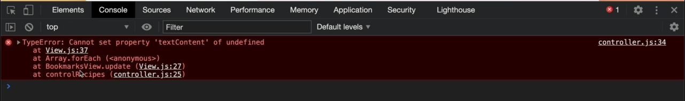

# Storing Bookmarks With localStorage

- using local storage to persist all the bookmarks inside bookmarked panel <br>
    & it's easy to implement because now we have working project 
- see the forkify flowchart part 2 
    - so we need to store bookmarks to local storage & load bookmarks from local storage 
    - so `when should the bookmarks be stored to local storage`
        - whenever the user bookmarks a recipe & also when user un-bookmarks the recipe 
        - so either of these cases , the current bookmarks array needs to be stored to local storage <br>
            means inside model.js file , whenever we add or delete a bookmark then we need to persist the data 💡💡💡

## Steps - Storing Bookmarks with localStorage

- `STEP 1` : inside model.js file , creating a new function to persist the bookmarks
    ```js
    import { async } from 'regenerator-runtime' ;
    import { API_URL , RES_PER_PAGE } from '.config.js'
    import { getJSON } from './helpers.js'
            
    export const state = {
        recipe: {} , 
        search: {
            query: "" ,
            result: [] , 
            page: 1 , 
            resultsPerPage: RES_PER_PAGE, 
        } ,
        bookmarks: [] 
    }

    export const loadRecipe = async function(id) {  
        try {
            const data = await getJSON(`${API_URL}${id}`)

            const { recipe } = data.data 
            state.recipe = { 
                id:  recipe.id , 
                title: recipe.title, 
                publisher: recipe.publisher,
                sourceUrl: recipe.source_url ,
                image: recipe.image_url, 
                servings: recipe.servings, 
                cookingTime: recipe.cooking_time ,
                ingredients: recipe.ingredients
            }

            if (state.bookmarks.some(bookmark => bookmark.id === id)) {
                state.recipe.bookmarked = true
            } else {
                state.recipe.bookmarked = false
            }
            
            console.log(state.recipe) 
        } catch(err) {
            console.log(`${err} 💥💥💥`)
            throw err 
        }
    }

    export const loadSearchResults = async function() {
        try {
            state.search.query = query                
            const data = await getJSON(`${API_URL}?search=${query}`)

            state.search.results = data.data.recipes.map(rec => {
                return {
                    id:  rec.id , 
                    title: rec.title, 
                    publisher: rec.publisher,
                    image: rec.image_url, 
                }
            })

            state.search.page = 1 
        } catch(err) {
            console.log(`${err} 💥💥💥`)
            throw err 
        }
    }

    export const getSearchResultsPage = function(page = state.search.page) { // passing default argument
        state.search.page = page

        const start = (page - 1) * state.search.resultsPerPage 
        const end = page * state.search.resultsPerPage
        return state.search.results.slice(start, end)
    }   

    const persistBookmarks = function() {
        localStorage.setItem("bookmarks", JSON.stringify(state.bookmarks))
    }

    export const addBookmark = function(recipe) {
        // add bookmark
        state.bookmarks.push(recipe)

        // Mark Current recipe as bookmarked
        if (recipe.id === state.recipe.id) {
            state.recipe.bookmarked = true
        }

        persistBookmarks()
    }

    export const deleteBookmark = function(id) {
        // Delete bookmark
        const index = state.bookmarks.findIndex(el => el.id === id)
        state.bookmarks.splice(index, 1)

        // Mark Current recipe as NOT bookmarked
        if (id === state.recipe.id) {
            state.recipe.bookmarked = false
        }

        persistBookmarks()
    }
    ```
    - output : search pizza 
        - bookmark some recipe & those recipe will be added inside bookmarks view & also inside localStorage
        - & when we load the page then those recipes will be removed from bookmarks view panel
    - now we want that when the page gets loaded then we want to get those recipe from localStorage 💡💡💡
  
- `STEP 2` : inside model.js file , create a initialization function
    ```js
    import { async } from 'regenerator-runtime' ;
    import { API_URL , RES_PER_PAGE } from '.config.js'
    import { getJSON } from './helpers.js'
            
    export const state = {
        recipe: {} , 
        search: {
            query: "" ,
            result: [] , 
            page: 1 , 
            resultsPerPage: RES_PER_PAGE, 
        } ,
        bookmarks: [] 
    }

    export const loadRecipe = async function(id) {  
        try {
            const data = await getJSON(`${API_URL}${id}`)

            const { recipe } = data.data 
            state.recipe = { 
                id:  recipe.id , 
                title: recipe.title, 
                publisher: recipe.publisher,
                sourceUrl: recipe.source_url ,
                image: recipe.image_url, 
                servings: recipe.servings, 
                cookingTime: recipe.cooking_time ,
                ingredients: recipe.ingredients
            }

            if (state.bookmarks.some(bookmark => bookmark.id === id)) {
                state.recipe.bookmarked = true
            } else {
                state.recipe.bookmarked = false
            }
            
            console.log(state.recipe) 
        } catch(err) {
            console.log(`${err} 💥💥💥`)
            throw err 
        }
    }

    export const loadSearchResults = async function() {
        try {
            state.search.query = query                
            const data = await getJSON(`${API_URL}?search=${query}`)

            state.search.results = data.data.recipes.map(rec => {
                return {
                    id:  rec.id , 
                    title: rec.title, 
                    publisher: rec.publisher,
                    image: rec.image_url, 
                }
            })

            state.search.page = 1 
        } catch(err) {
            console.log(`${err} 💥💥💥`)
            throw err 
        }
    }

    export const getSearchResultsPage = function(page = state.search.page) { 
        state.search.page = page

        const start = (page - 1) * state.search.resultsPerPage 
        const end = page * state.search.resultsPerPage
        return state.search.results.slice(start, end)
    }   

    const persistBookmarks = function() {
        localStorage.setItem("bookmarks", JSON.stringify(state.bookmarks))
    }

    export const addBookmark = function(recipe) {
        // add bookmark
        state.bookmarks.push(recipe)

        // Mark Current recipe as bookmarked
        if (recipe.id === state.recipe.id) {
            state.recipe.bookmarked = true
        }

        persistBookmarks()
    }

    export const deleteBookmark = function(id) {
        // Delete bookmark
        const index = state.bookmarks.findIndex(el => el.id === id)
        state.bookmarks.splice(index, 1)

        // Mark Current recipe as NOT bookmarked
        if (id === state.recipe.id) {
            state.recipe.bookmarked = false
        }

        persistBookmarks()
    }

    const init = function() {

        // here we need to opposite , means get the items from the localStorage
        const storage = localStorage.getItem("bookmarks")
        if (storage) {
            state.bookmarks = JSON.parse(storage)
        } 
    }
    init()
    ```
    - output : we'll get the error from controller.js file 
    - `STEP 2.1` : inside controller.js file , checking the error
        ```js
        import * as model from './model.js' 
        import recipeView from './views/recipeView.js'
        import searchView from './views/searchView.js'
        import resultsView from './views/resultsView.js'
        import paginationView from './views/paginationView.js'
        import bookmarksView from './views/bookmarksView.js'

        import 'core-js/stable' 
        import 'regenerator-runtime/runtime' 

        const timeout = function (s) => {
            return new Promise(function (_, reject) {
                setTimeout(function() {
                    reject(new Error(`Request took too long! Timeout after ${s} second`))
                }, s * 1000)
            })
        }

        const controlRecipe = async function() {
            try {
                const id = window.location.hash.slice(1)

                if (!id) return 
                resultsView.renderSpinner()

                // 0) update results view to mark selected search result
                resultsView.render(model.getSearchResultsPage()) 
                bookmarksView.update(model.state.bookmarks) 
                    // highlighting the bookmark inside bookmarks view which is selected

                // 1 - Loading recipe
                await model.loadRecipe(id) 

                // 2 - Rendering recipe
                recipeView.render(model.state.recipe)

            } catch(err) {
                recipeView.renderError() 
                console.error(err) 
            }
        }

        const controlSearchResults = async function() {
            try {
                resultsView.renderSpinner()

                // 1) Get search query
                const query = searchView.getQuery()
                if (!query) return

                // 2) load search results
                await model.loadSearchResults(query) 

                // 3) Render results
                resultsView.render(model.getSearchResultsPage()) 

                // 4) render initial pagination buttons
                paginationView.render(model.state.search) 

            } catch(err) {
                console.log(err)
            }
        }

        const controlPagination = function(goToPage) { 
            // 1) Render NEW results
            resultsView.render(model.getSearchResultsPage(goToPage)) 

            // 2) render NEW  pagination buttons
            paginationView.render(model.state.search) 
        }

        const controlAddBookmark = function() {
            // 1) Add/remove bookmark
            if (!model.state.recipe.bookmarked) {
                model.addBookmark(model.state.recipe)
            } else (model.state.recipe.bookmarked) {
                model.deleteBookmark(model.state.recipe.id)
            }

            // 2) Update recipe view
            recipeView.update(model.state.recipe)

            // 3) Render bookmarks
            bookmarksView.render(model.state.bookmarks)
        }

        const init = function() {
            recipeView.addHandlerRender(controlRecipes)
            recipeView.addHandlerUpdateServings(controlServings)
            recipeView.addHandlerAddBookmark(controlAddBookmark)
            searchView.addHandlerSearch(controlSearchResults)
            paginationView.addHandlerClick(controlPagination)
        }
        init()
        ```
        - output : console.error(err)
            - we'll get i.e 'textContent' of undefined & see the stack trace also like this
            
            - so on line 27 , we're updating the bookmarksView inside View.js file 
            - so inside controller.js file , inside controlRecipe() async function <br>
                if we put this line of code `bookmarksView.update(model.state.bookmarks)` after the <br>
                this line of code `recipeView.render(model.state.recipe)` like this 
                ```
                const controlRecipe = async function() {
                    try {
                        const id = window.location.hash.slice(1)

                        if (!id) return 
                        resultsView.renderSpinner()

                        // 0) update results view to mark selected search result
                        resultsView.render(model.getSearchResultsPage()) 

                        // 1 - Loading recipe
                        await model.loadRecipe(id) 

                        // 2 - Rendering recipe
                        recipeView.render(model.state.recipe)

                        // 3 - updating bookmarks view
                        bookmarksView.update(model.state.bookmarks) 
                    } catch(err) {
                        recipeView.renderError() 
                        console.error(err) 
                    }
                }
                ```
            - but we'll still get the error , so you can use `debugger` keyword <br>
                before this line `bookmarksView.update(model.state.bookmarks)`
            - so after using debugging then we'll able to know that inside View.js file , <br> 
                newElements & curElements arrays are comparing each other because goal of these two arrays <br>
                is not to add new elements but only to replace some text & elements that already exist <br>
                however , right now that bookmarks view is empty
            - & that update() function of View.js file , is trying to insert the data in there & this shouldn't happen
    - so now first thing , we need to on the page is to render the bookmarks & this should happen <br> 
        at the beginning when we load the page 💡💡💡

- `STEP 3` : inside bookmarksView.js file , creating a function to render the bookmarks when page loads
    ```js
    import View from './View.js'
    import previewView from './previewView.js'
    import icons from 'url:../../img/icons.svg' 

    class BookmarksView extends View {
        _parentElement = document.querySelector('.bookmarks__list')
        _errorMessage = 'No bookmarks yet. Find a nice recipe and bookmark it :-D'
        _message = ""

        addHandlerRender(handler) {
            window.addEventListener('load', handler)
        }

        _generateMarkup() {
            console.log(this._data)
            return this._data.map(bookmark => previewView.render(bookmark, false)).join("")
        }
    }

    export default new BookmarksView() 
    ```
    - `STEP 3.1` : inside controller.js file , creating the handler function
        ```js
        import * as model from './model.js' 
        import recipeView from './views/recipeView.js'
        import searchView from './views/searchView.js'
        import resultsView from './views/resultsView.js'
        import paginationView from './views/paginationView.js'
        import bookmarksView from './views/bookmarksView.js'

        import 'core-js/stable' 
        import 'regenerator-runtime/runtime' 

        const timeout = function (s) => {
            return new Promise(function (_, reject) {
                setTimeout(function() {
                    reject(new Error(`Request took too long! Timeout after ${s} second`))
                }, s * 1000)
            })
        }

            const controlRecipe = async function() {
                try {
                    const id = window.location.hash.slice(1)

                    if (!id) return 
                    resultsView.renderSpinner()

                    // 0) update results view to mark selected search result
                    resultsView.render(model.getSearchResultsPage()) 

                    // 1 - updating bookmarks view
                    bookmarksView.update(model.state.bookmarks) 
                        // we can put this line of code after this -> recipeView.render(model.state.recipe)

                    // 2 - Loading recipe
                    await model.loadRecipe(id) 

                    // 3 - Rendering recipe
                    recipeView.render(model.state.recipe)
                } catch(err) {
                    recipeView.renderError() 
                }
            }

        const controlSearchResults = async function() {
            try {
                resultsView.renderSpinner()

                // 1) Get search query
                const query = searchView.getQuery()
                if (!query) return

                // 2) load search results
                await model.loadSearchResults(query) 

                // 3) Render results
                resultsView.render(model.getSearchResultsPage()) 

                // 4) render initial pagination buttons
                paginationView.render(model.state.search) 

            } catch(err) {
                console.log(err)
            }
        }

        const controlPagination = function(goToPage) { 
            // 1) Render NEW results
            resultsView.render(model.getSearchResultsPage(goToPage)) 

            // 2) render NEW  pagination buttons
            paginationView.render(model.state.search) 
        }

        const controlAddBookmark = function() {
            // 1) Add/remove bookmark
            if (!model.state.recipe.bookmarked) {
                model.addBookmark(model.state.recipe)
            } else (model.state.recipe.bookmarked) {
                model.deleteBookmark(model.state.recipe.id)
            }

            // 2) Update recipe view
            recipeView.update(model.state.recipe)

            // 3) Render bookmarks
            bookmarksView.render(model.state.bookmarks)
        }

        const controlBookmarks = function() {
            bookmarksView.render(model.state.bookmarks)
        }

        const init = function() {
            bookmarksView.addHandlerRender(controlBookmarks)
            recipeView.addHandlerRender(controlRecipes)
            recipeView.addHandlerUpdateServings(controlServings)
            recipeView.addHandlerAddBookmark(controlAddBookmark)
            searchView.addHandlerSearch(controlSearchResults)
            paginationView.addHandlerClick(controlPagination)
        }
        init()
        ```
        - output : when we hover on the bookmarks View panel then we'll get those recipe back 
            - now the page tries to update the bookmarks view , bookmarks are already there & there's nothing to update 
            - when we click on any recipe from bookmarks view panel , then that recipe gets loaded on the UI
            - & when we un-bookmark that recipe then it's gone from the local storage & from bookmarks view also 💡💡💡 <br>
                & when we un-bookmark all the recipe then inside "bookmarks view" panel we'll get that message <br>
                even when we reload the page
        - now we need to clear explicitly the localStorage
    - `STEP 3.2` : inside model.js file , explicitly clearing the localStorage just for checking 
        ```js
        import { async } from 'regenerator-runtime' ;
        import { API_URL , RES_PER_PAGE } from '.config.js'
        import { getJSON } from './helpers.js'
                
        export const state = {
            recipe: {} , 
            search: {
                query: "" ,
                result: [] , 
                page: 1 , 
                resultsPerPage: RES_PER_PAGE, 
            } ,
            bookmarks: [] 
        }

        export const loadRecipe = async function(id) {  
            try {
                const data = await getJSON(`${API_URL}${id}`)

                const { recipe } = data.data 
                state.recipe = { 
                    id:  recipe.id , 
                    title: recipe.title, 
                    publisher: recipe.publisher,
                    sourceUrl: recipe.source_url ,
                    image: recipe.image_url, 
                    servings: recipe.servings, 
                    cookingTime: recipe.cooking_time ,
                    ingredients: recipe.ingredients
                }

                if (state.bookmarks.some(bookmark => bookmark.id === id)) {
                    state.recipe.bookmarked = true
                } else {
                    state.recipe.bookmarked = false
                }
                
                console.log(state.recipe) 
            } catch(err) {
                console.log(`${err} 💥💥💥`)
                throw err 
            }
        }

        export const loadSearchResults = async function() {
            try {
                state.search.query = query                
                const data = await getJSON(`${API_URL}?search=${query}`)

                state.search.results = data.data.recipes.map(rec => {
                    return {
                        id:  rec.id , 
                        title: rec.title, 
                        publisher: rec.publisher,
                        image: rec.image_url, 
                    }
                })

                state.search.page = 1 
            } catch(err) {
                console.log(`${err} 💥💥💥`)
                throw err 
            }
        }

        export const getSearchResultsPage = function(page = state.search.page) { 
            state.search.page = page

            const start = (page - 1) * state.search.resultsPerPage 
            const end = page * state.search.resultsPerPage
            return state.search.results.slice(start, end)
        }   

        const persistBookmarks = function() {
            localStorage.setItem("bookmarks", JSON.stringify(state.bookmarks))
        }

        export const addBookmark = function(recipe) {
            // add bookmark
            state.bookmarks.push(recipe)

            // Mark Current recipe as bookmarked
            if (recipe.id === state.recipe.id) {
                state.recipe.bookmarked = true
            }

            persistBookmarks()
        }

        export const deleteBookmark = function(id) {
            // Delete bookmark
            const index = state.bookmarks.findIndex(el => el.id === id)
            state.bookmarks.splice(index, 1)

            // Mark Current recipe as NOT bookmarked
            if (id === state.recipe.id) {
                state.recipe.bookmarked = false
            }

            persistBookmarks()
        }

        const init = function() {

            // here we need to opposite , means get the items from the localStorage
            const storage = localStorage.getItem("bookmarks")
            if (storage) {
                state.bookmarks = JSON.parse(storage)
            } 
        }
        init()

        // just for checking purpose
            // if you want to clear the bookmarks then comment the init() function
            // & then call this function
        const clearBookmarks = function() {
            localStorage.clear('bookmarks')
        }
        // clearBookmarks()
        ```

- if we check the flowchart part 2 of forkify
    - `1` : when the user clicks on bookmark button to bookmark recipe <br>
        then mark that recipe as bookmark & render the bookmarks & render the recipe on the right side
    - `2` : when the page loads then the bookmarks are loaded from the local storage & they're rendered
    - `3` : when the user bookmarks a recipe then that recipe gets stored to local storage
