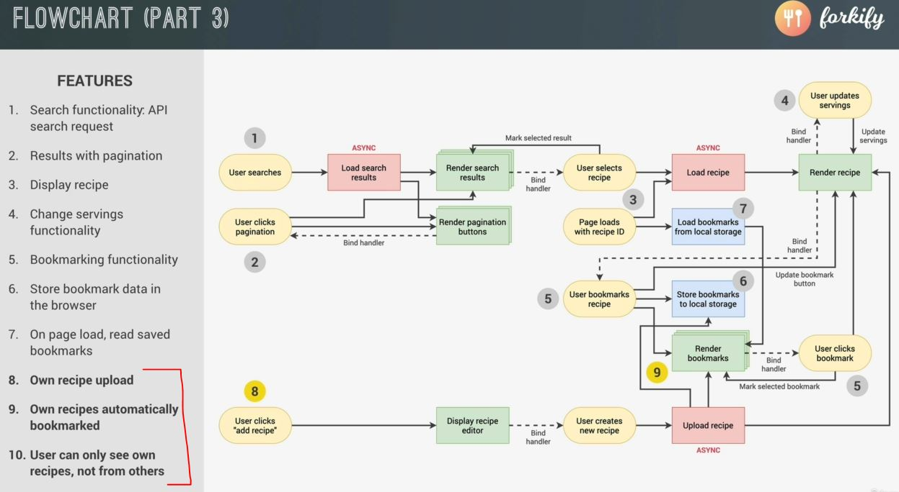

# Project Planning 3

- let's see about implementing next feature i.e 
    
    - so these last 3 steps are about the user being able to upload their own recipes
    - so whenever the user clicks the add recipe button (which is in the menu bar)  
        then we want to do is to display a recipe form which is like a model which will popup  
        which contain a form
    - & then on that form , we'll have to bind an event handler . so that when the user submits that form  
        means when the user creates a new recipe then we want to asynchronously upload that recipe to the API  
        & render that recipe & edit to the user's bookmarks . so that's the feature 9  
        so that all our own recipes are automatically bookmarked
    - finally , we're going to setup in a way that only that user which uploaded the recipe  
        that user only will be able to see that recipe . means if i upload my own pizza recipe then if you search for pizza  
        afterwards then you'll not be able to see the recipe . so those recipes belong to that user only , not other users  
        we'll do by using API developer key
