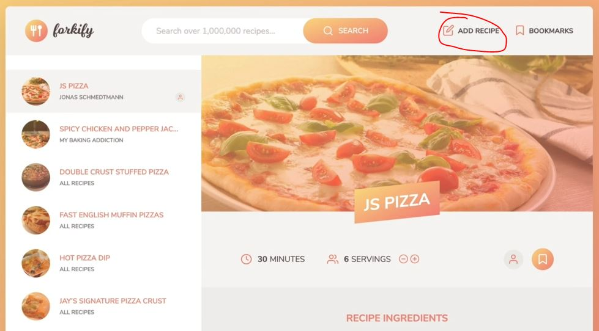
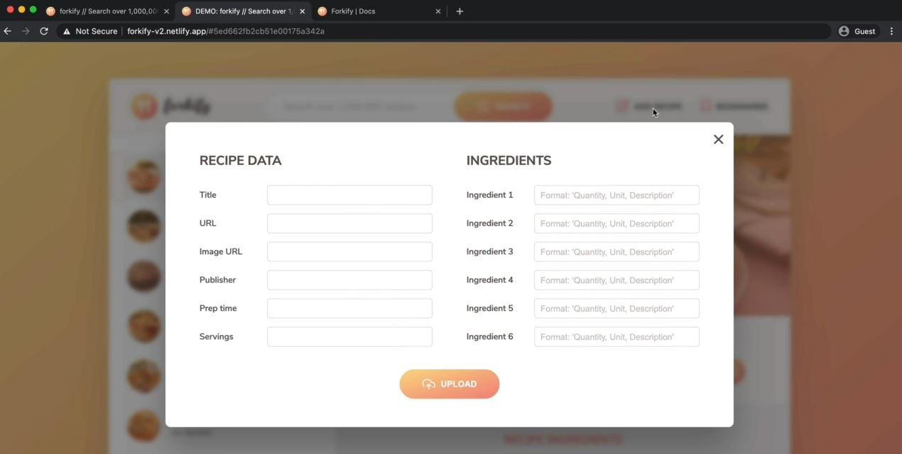
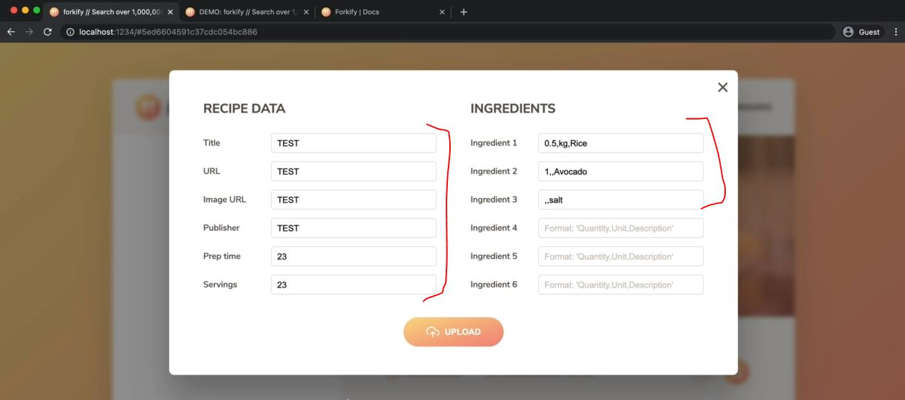
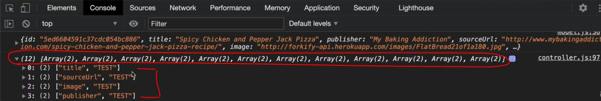
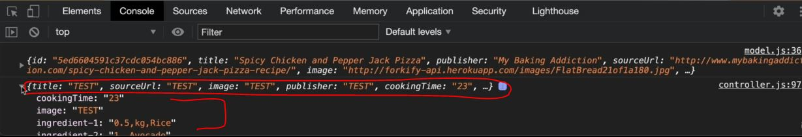

# Uploading a New Recipe - Part 1

- here we'll implement the feature of opening the model popup which contains the form to add the new recipe
- working example : 
    - when we click on `Add Recipe` button 
        
    - after click clicking on it then we'll get the popup model which contains the form like this
        
    - & then when we click on the `X` button or outside the model popup then the model popup gets closed

## Steps - uploading a new Recipe - Part 1

- `STEP 1` : inside `js/views` folder , create a file as addRecipeView.js file
    - copy the code from paginationView.js file & paste it inside addRecipeView.js
    - inside addRecipeView.js file , refactoring the code 
        ```js
        import View from './View.js'
        import icons from 'url:../../img/icons.svg' 

        class AddRecipeView extends View {
            _parentElement = document.querySelector('.pagination')

            _generateMarkup() {

            }
        }

        export default new AddRecipeView() 
        ```
    - now when we see the index.html file , we can see the form with `upload` class & overlay has `hidden` class
    - `STEP 1.1` : inside addRecipeView.js file , selecting elements & "add recipe" button
        ```js
        import View from './View.js'
        import icons from 'url:../../img/icons.svg' 

        class AddRecipeView extends View {
            _parentElement = document.querySelector('.upload')

            _window = document.querySelector('.add-recipe-window')
            _overlay = document.querySelector('.overlay')
            _btnOpen = document.querySelector('.nav__btn--add-recipe')
            _btnClose = document.querySelector('.btn--close-modal')

            _generateMarkup() {

            }
        }

        export default new AddRecipeView() 
        ```
    - `STEP 1.2` : inside addRecipeView.js file , adding handler function to handle the click event
        ```js
        import View from './View.js'
        import icons from 'url:../../img/icons.svg' 

        class AddRecipeView extends View {
            _parentElement = document.querySelector('.upload')

            _window = document.querySelector('.add-recipe-window')
            _overlay = document.querySelector('.overlay')
            _btnOpen = document.querySelector('.nav__btn--add-recipe')
            _btnClose = document.querySelector('.btn--close-modal')

            addHandlerShowWindow() {
                this._btnOpen.addEventListener('click' , function() {
                    this._overlay.classList.toggle('hidden')
                    this._window.classList.toggle('hidden')
                })
            }

            _generateMarkup() {}
        }

        export default new AddRecipeView() 
        ```
        - now we want to call this `addHandlerShowWindow()` function as soon as the page loads <br>
            & here controller.js file has nothing to do with this because here nothing special is happening <br>
            that controller needs to tell us
        - so simple run that function as soon as the object (of `addRecipeView` class) is created <br>
            so here we'll create constructor() function of this class 💡💡💡
    - `STEP 1.3` : inside addRecipeView.js file , creating the constructor() function
        ```js
        import View from './View.js'
        import icons from 'url:../../img/icons.svg' 

        class AddRecipeView extends View {
            _parentElement = document.querySelector('.upload')

            _window = document.querySelector('.add-recipe-window')
            _overlay = document.querySelector('.overlay')
            _btnOpen = document.querySelector('.nav__btn--add-recipe')
            _btnClose = document.querySelector('.btn--close-modal')

            constructor() {
                super()
                this._addHandlerShowWindow()
                    // here this function is only be used inside this class that's why it's marked as protected 💡💡💡
            }

            _addHandlerShowWindow() {
                this._btnOpen.addEventListener('click' , function() {
                    this._overlay.classList.toggle('hidden')
                    this._window.classList.toggle('hidden')
                })
            }

            _generateMarkup() {}
        }

        export default new AddRecipeView() 
            // now controller doesn't interfere to show the modal window
            // but we have to import this class inside the controller because otherwise , 
                // our main script sort of controller , will never execute this file
                // & due to this , object will never be created of this class 💡💡💡
        ```

- `STEP 2` : inside controller.js file , importing the AddRecipeView class in order to create a object
    ```js
    import * as model from './model.js' 
    import recipeView from './views/recipeView.js'
    import searchView from './views/searchView.js'
    import resultsView from './views/resultsView.js'
    import paginationView from './views/paginationView.js'
    import bookmarksView from './views/bookmarksView.js'
    import addRecipeView from './views/addRecipeView.js'

    import 'core-js/stable' 
    import 'regenerator-runtime/runtime' 

    const timeout = function (s) => {
        return new Promise(function (_, reject) {
            setTimeout(function() {
                reject(new Error(`Request took too long! Timeout after ${s} second`))
            }, s * 1000)
        })
    }

        const controlRecipe = async function() {
            try {
                const id = window.location.hash.slice(1)

                if (!id) return 
                resultsView.renderSpinner()

                // 0) update results view to mark selected search result
                resultsView.render(model.getSearchResultsPage()) 

                // 1 - updating bookmarks view
                bookmarksView.update(model.state.bookmarks) 
                    // we can put this line of code after this -> recipeView.render(model.state.recipe)

                // 2 - Loading recipe
                await model.loadRecipe(id) 

                // 3 - Rendering recipe
                recipeView.render(model.state.recipe)
            } catch(err) {
                recipeView.renderError() 
            }
        }

    const controlSearchResults = async function() {
        try {
            resultsView.renderSpinner()

            // 1) Get search query
            const query = searchView.getQuery()
            if (!query) return

            // 2) load search results
            await model.loadSearchResults(query) 

            // 3) Render results
            resultsView.render(model.getSearchResultsPage()) 

            // 4) render initial pagination buttons
            paginationView.render(model.state.search) 

        } catch(err) {
            console.log(err)
        }
    }

    const controlPagination = function(goToPage) { 
        // 1) Render NEW results
        resultsView.render(model.getSearchResultsPage(goToPage)) 

        // 2) render NEW  pagination buttons
        paginationView.render(model.state.search) 
    }

    const controlAddBookmark = function() {
        // 1) Add/remove bookmark
        if (!model.state.recipe.bookmarked) {
            model.addBookmark(model.state.recipe)
        } else (model.state.recipe.bookmarked) {
            model.deleteBookmark(model.state.recipe.id)
        }

        // 2) Update recipe view
        recipeView.update(model.state.recipe)

        // 3) Render bookmarks
        bookmarksView.render(model.state.bookmarks)
    }

    const controlBookmarks = function() {
        bookmarksView.render(model.state.bookmarks)
    }

    const init = function() {
        bookmarksView.addHandlerRender(controlBookmarks)
        recipeView.addHandlerRender(controlRecipes)
        recipeView.addHandlerUpdateServings(controlServings)
        recipeView.addHandlerAddBookmark(controlAddBookmark)
        searchView.addHandlerSearch(controlSearchResults)
        paginationView.addHandlerClick(controlPagination)
    }
    init()
    ```
    - output : when we click on the `add recipe` button then we'll get the error from _addHandlerShowWindow() function
        - so inside this function of AddRecipeView class
        ```js
        _addHandlerShowWindow() {
            this._btnOpen.addEventListener('click' , function() {
                this._overlay.classList.toggle('hidden')
                this._window.classList.toggle('hidden')
            })
            // here the problem is when we use this -> keyword to access _overlay , this._window
                // then this -> keyword will point to this._btnOpen
                // because this -> keyword inside the event handler function will point to that element
                    // on which that listener is attached to 💡💡💡
        }
        ```
        - so to fix the problem , we'll create a method inside that class <br>
            & call that method with correct `this` keyword bound to it via bind() method <br>
            otherwise we have to use bind() method on both of the lines 💡💡💡
    - `STEP 2.1` : inside addRecipeView.js file , making `this` keyword correct inside _addHandlerShowWindow() function
        ```js
        import View from './View.js'
        import icons from 'url:../../img/icons.svg' 

        class AddRecipeView extends View {
            _parentElement = document.querySelector('.upload')

            _window = document.querySelector('.add-recipe-window')
            _overlay = document.querySelector('.overlay')
            _btnOpen = document.querySelector('.nav__btn--add-recipe')
            _btnClose = document.querySelector('.btn--close-modal')

            constructor() {
                super()
                this._addHandlerShowWindow()
            }

            toggleWindow() {
                this._overlay.classList.toggle('hidden')
                this._window.classList.toggle('hidden')
            }

            _addHandlerShowWindow() {
                this._btnOpen.addEventListener('click' , this.toggleWindow.bind(this))
                    // Note ✅ : what happen if we don' use bind() method on this.toggleWindow() function
                        // now this -> keyword which is inside bind() method , will point to the current object 
                        // but if we don't use bind() method 
                            // then this -> keyword which are inside toggleWindow() function will point 
                                // to the that open button i.e this._btnOpen 💡💡💡
                            // on which the event listener is attached to
            }

            _generateMarkup() {}
        }

        export default new AddRecipeView() 
        ```
        - output : click on `add recipe` button then we'll get the model popup
            - now we need to implement to close the modal popup
  
- `STEP 3` : inside addRecipeView.js file , hiding the model popup
    ```js
    import View from './View.js'
    import icons from 'url:../../img/icons.svg' 

    class AddRecipeView extends View {
        _parentElement = document.querySelector('.upload')

        _window = document.querySelector('.add-recipe-window')
        _overlay = document.querySelector('.overlay')
        _btnOpen = document.querySelector('.nav__btn--add-recipe')
        _btnClose = document.querySelector('.btn--close-modal')

        constructor() {
            super()
            this._addHandlerShowWindow()
            this._addHandlerHideWindow() // we have to call this function 
                // because we want to call these methods immediately inside the constructor() function 
                // when a object of this call is created 💡💡💡
        }

        toggleWindow() {
            this._overlay.classList.toggle('hidden')
            this._window.classList.toggle('hidden')
        }

        _addHandlerShowWindow() {
            this._btnOpen.addEventListener('click' , this.toggleWindow.bind(this))
        }

        _addHandlerHideWindow() {
            this._btnClose.addEventListener('click' , this.toggleWindow.bind(this))
            this._overlay.addEventListener('click' , this.toggleWindow.bind(this))
        }

        _generateMarkup() {}
    }

    export default new AddRecipeView() 
    ```
    - output : click on `add recipe` then modal gets opened 
        - & when we click on outside of modal popup or cross button of modal popup then it's gets hide
    - now we need to implement that get all the data from each inputs of a form <br>
        when we click on `upload` button of modal popup
    - & we hard coded the value of each input for development only but we'll remove it once we got the output

- `STEP 4` : inside addRecipeView.js file , handling the data of all inputs field of modal popup form submission
    ```js
    import View from './View.js'
    import icons from 'url:../../img/icons.svg' 

    class AddRecipeView extends View {
        _parentElement = document.querySelector('.upload')

        _window = document.querySelector('.add-recipe-window')
        _overlay = document.querySelector('.overlay')
        _btnOpen = document.querySelector('.nav__btn--add-recipe')
        _btnClose = document.querySelector('.btn--close-modal')

        constructor() {
            super()
            this._addHandlerShowWindow()
            this._addHandlerHideWindow() 
        }

        toggleWindow() {
            this._overlay.classList.toggle('hidden')
            this._window.classList.toggle('hidden')
        }

        _addHandlerShowWindow() {
            this._btnOpen.addEventListener('click' , this.toggleWindow.bind(this))
        }

        _addHandlerHideWindow() {
            this._btnClose.addEventListener('click' , this.toggleWindow.bind(this))
            this._overlay.addEventListener('click' , this.toggleWindow.bind(this))
        }

        addHandlerUpload() {
            this._parentElement.addEventListener('submit' , function(e) {
                e.preventDefault()
                
                // now how we get access to all of those values of each inputs
                    // first way - select all of those form elements one by one 
                        // & then read the value property of all of them 💡💡💡
                    // second way ✅ - which is easier way i.e a modern browser API
                        // i.e new FormData()
                        // we pass an element which is a form inside this FormData() constructor function 💡💡💡 

                const data = new FormData(this) // here this -> keyword is this._parentElement
                    // because if we use this -> keyword inside an event handler callback function 
                        // then that this -> keyword will point to the this._parentElement i.e upload form 💡💡💡
            })
        }

        _generateMarkup() {}
    }

    export default new AddRecipeView
    ```
    - `STEP 4.1` : inside addRecipeView.js file , using spread operator on `new FormData()`
        - because `new FormData(this)` will return a weird object which you can't use
        ```js
        import View from './View.js'
        import icons from 'url:../../img/icons.svg' 

        class AddRecipeView extends View {
            _parentElement = document.querySelector('.upload')

            _window = document.querySelector('.add-recipe-window')
            _overlay = document.querySelector('.overlay')
            _btnOpen = document.querySelector('.nav__btn--add-recipe')
            _btnClose = document.querySelector('.btn--close-modal')

            constructor() {
                super()
                this._addHandlerShowWindow()
                this._addHandlerHideWindow() 
            }

            toggleWindow() {
                this._overlay.classList.toggle('hidden')
                this._window.classList.toggle('hidden')
            }

            _addHandlerShowWindow() {
                this._btnOpen.addEventListener('click' , this.toggleWindow.bind(this))
            }

            _addHandlerHideWindow() {
                this._btnClose.addEventListener('click' , this.toggleWindow.bind(this))
                this._overlay.addEventListener('click' , this.toggleWindow.bind(this))
            }

            addHandlerUpload() {
                this._parentElement.addEventListener('submit' , function(e) {
                    e.preventDefault()
                    
                    const data = [...new FormData(this)] // this will get converted into an array
                    console.log(data) // this data , eventually we want to upload to the API
                        // & this action of uploading the data is going to be to be just another API call
                        // & where do API calls happen ? 
                            // that API calls will happen in the model
                            // so that's why we need a way of getting , this data -> variable in the model
                                // just like we did many times before
                        // we need to create a controller function which will be the handler of this event 💡💡💡 
                })
            }

            _generateMarkup() {}
        }

        export default new AddRecipeView
        ```
    - `STEP 4.2` : inside controller.js file , creating a function to control the add recipe data of the user
        ```js
        import * as model from './model.js' 
        import recipeView from './views/recipeView.js'
        import searchView from './views/searchView.js'
        import resultsView from './views/resultsView.js'
        import paginationView from './views/paginationView.js'
        import bookmarksView from './views/bookmarksView.js'
        import addRecipeView from './views/addRecipeView.js'

        import 'core-js/stable' 
        import 'regenerator-runtime/runtime' 

        const timeout = function (s) => {
            return new Promise(function (_, reject) {
                setTimeout(function() {
                    reject(new Error(`Request took too long! Timeout after ${s} second`))
                }, s * 1000)
            })
        }

            const controlRecipe = async function() {
                try {
                    const id = window.location.hash.slice(1)

                    if (!id) return 
                    resultsView.renderSpinner()

                    // 0) update results view to mark selected search result
                    resultsView.render(model.getSearchResultsPage()) 

                    // 1 - updating bookmarks view
                    bookmarksView.update(model.state.bookmarks) 

                    // 2 - Loading recipe
                    await model.loadRecipe(id) 

                    // 3 - Rendering recipe
                    recipeView.render(model.state.recipe)
                } catch(err) {
                    recipeView.renderError() 
                }
            }

        const controlSearchResults = async function() {
            try {
                resultsView.renderSpinner()

                // 1) Get search query
                const query = searchView.getQuery()
                if (!query) return

                // 2) load search results
                await model.loadSearchResults(query) 

                // 3) Render results
                resultsView.render(model.getSearchResultsPage()) 

                // 4) render initial pagination buttons
                paginationView.render(model.state.search) 

            } catch(err) {
                console.log(err)
            }
        }

        const controlPagination = function(goToPage) { 
            // 1) Render NEW results
            resultsView.render(model.getSearchResultsPage(goToPage)) 

            // 2) render NEW  pagination buttons
            paginationView.render(model.state.search) 
        }

        const controlAddBookmark = function() {
            // 1) Add/remove bookmark
            if (!model.state.recipe.bookmarked) {
                model.addBookmark(model.state.recipe)
            } else (model.state.recipe.bookmarked) {
                model.deleteBookmark(model.state.recipe.id)
            }

            // 2) Update recipe view
            recipeView.update(model.state.recipe)

            // 3) Render bookmarks
            bookmarksView.render(model.state.bookmarks)
        }

        const controlBookmarks = function() {
            bookmarksView.render(model.state.bookmarks)
        }

        const controlAddRecipe = function(newRecipe) {
            console.log(newRecipe)

            // Upload the new recipe data
        }

        const init = function() {
            bookmarksView.addHandlerRender(controlBookmarks)
            recipeView.addHandlerRender(controlRecipes)
            recipeView.addHandlerUpdateServings(controlServings)
            recipeView.addHandlerAddBookmark(controlAddBookmark)
            searchView.addHandlerSearch(controlSearchResults)
            paginationView.addHandlerClick(controlPagination)
            addRecipeView.addHandlerUpload(controlAddRecipe) // so this is the PUBLISHER - SUBSCRIBER pattern
        }
        init()
        ```
    - `STEP 4.3` : inside addRecipeView.js file , accepting that handler function inside addHandlerUpload()
        ```js
        import View from './View.js'
        import icons from 'url:../../img/icons.svg' 

        class AddRecipeView extends View {
            _parentElement = document.querySelector('.upload')

            _window = document.querySelector('.add-recipe-window')
            _overlay = document.querySelector('.overlay')
            _btnOpen = document.querySelector('.nav__btn--add-recipe')
            _btnClose = document.querySelector('.btn--close-modal')

            constructor() {
                super()
                this._addHandlerShowWindow()
                this._addHandlerHideWindow() 
            }

            toggleWindow() {
                this._overlay.classList.toggle('hidden')
                this._window.classList.toggle('hidden')
            }

            _addHandlerShowWindow() {
                this._btnOpen.addEventListener('click' , this.toggleWindow.bind(this))
            }

            _addHandlerHideWindow() {
                this._btnClose.addEventListener('click' , this.toggleWindow.bind(this))
                this._overlay.addEventListener('click' , this.toggleWindow.bind(this))
            }

            addHandlerUpload(handler) {
                this._parentElement.addEventListener('submit' , function(e) {
                    e.preventDefault()
                    
                    const data = [...new FormData(this)]
                    handler(data) // here handler function is a controlAddRecipe() function of controller.js file
                })
            }

            _generateMarkup() {}
        }

        export default new AddRecipeView
        ```
        - output : after clicking on the `add recipe` button then we'll get this form like this
            
            - we'll get already filled data & when we click on the `upload` button then we'll get an array like this
                
            - here first element is name of the input field & second one is the value 💡💡💡
            - now usually , our recipe data is always an object , not an array above <br>
                so in JS , we have a new method to convert array entires to an object i.e `Object.fromEntries()` 💡💡💡
            - Object.fromEntries() takes an array as an argument 💡💡💡
    - `STEP 4.4` : inside addRecipeView.js file , converting that array into an object by using Object.fromEntries() ✅
        ```js
        import View from './View.js'
        import icons from 'url:../../img/icons.svg' 

        class AddRecipeView extends View {
            _parentElement = document.querySelector('.upload')

            _window = document.querySelector('.add-recipe-window')
            _overlay = document.querySelector('.overlay')
            _btnOpen = document.querySelector('.nav__btn--add-recipe')
            _btnClose = document.querySelector('.btn--close-modal')

            constructor() {
                super()
                this._addHandlerShowWindow()
                this._addHandlerHideWindow() 
            }

            toggleWindow() {
                this._overlay.classList.toggle('hidden')
                this._window.classList.toggle('hidden')
            }

            _addHandlerShowWindow() {
                this._btnOpen.addEventListener('click' , this.toggleWindow.bind(this))
            }

            _addHandlerHideWindow() {
                this._btnClose.addEventListener('click' , this.toggleWindow.bind(this))
                this._overlay.addEventListener('click' , this.toggleWindow.bind(this))
            }

            addHandlerUpload(handler) {
                this._parentElement.addEventListener('submit' , function(e) {
                    e.preventDefault()
                    
                    const dataArr = [...new FormData(this)]
                    const data = Object.fromEntries(dataArr)
                    handler(data)
                })
            }

            _generateMarkup() {}
        }

        export default new AddRecipeView
        ```
        - output : of handler(data) , click on `add recipe` button then click on `upload` button 
            - then we'll get this output like this
            
            - so this output looks like original recipe object <br>
                but inside of it , there are some formatting missing & some data ID , which we'll do in next lecture
