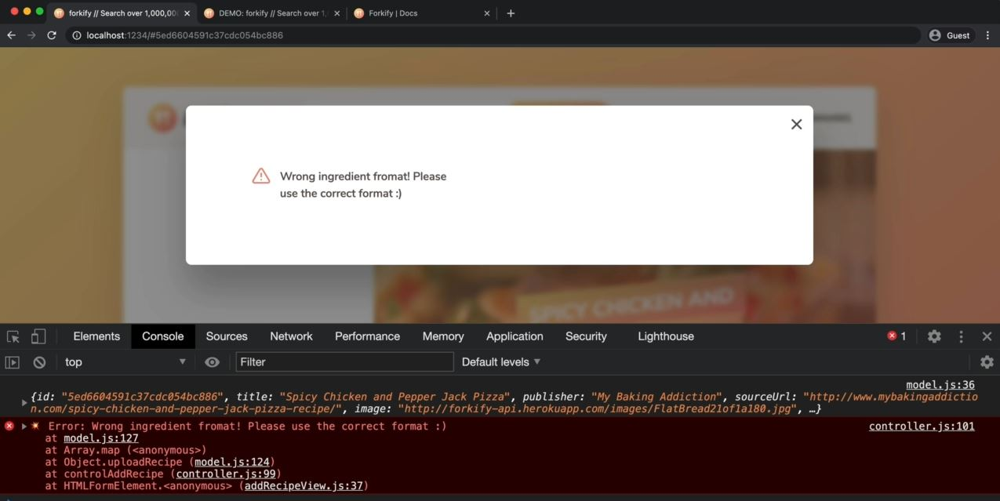
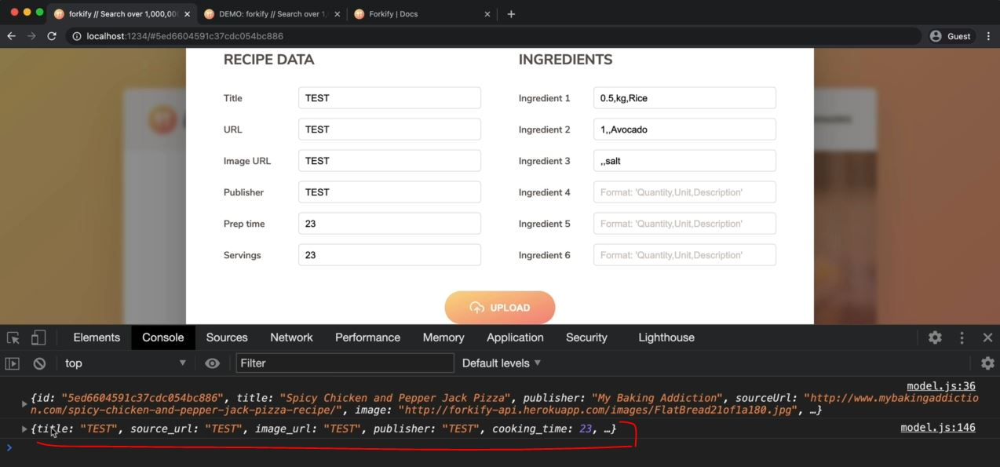
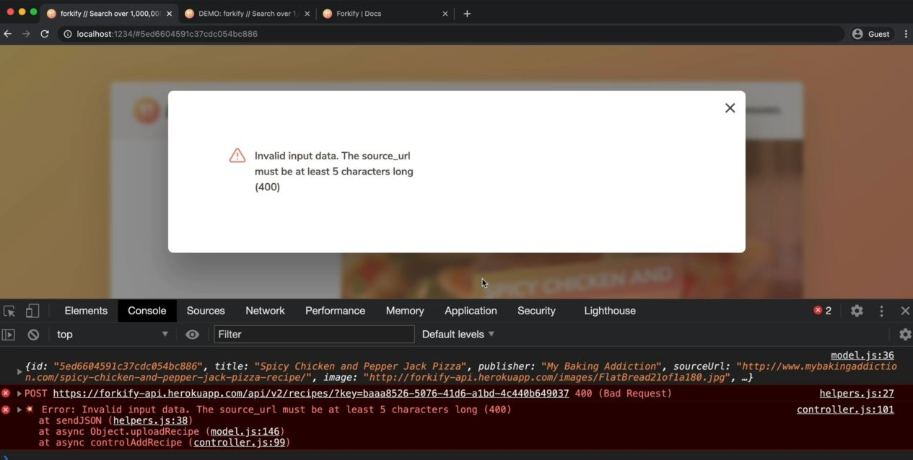
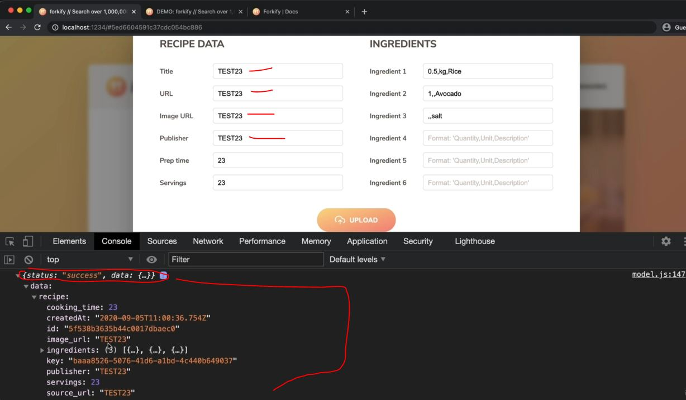
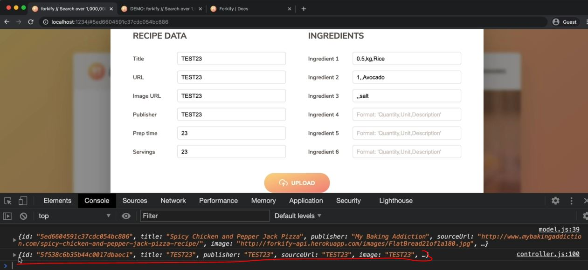
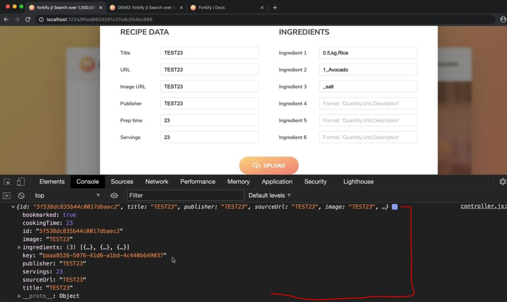
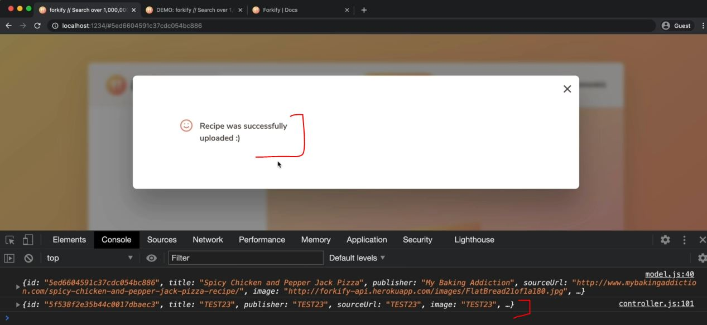
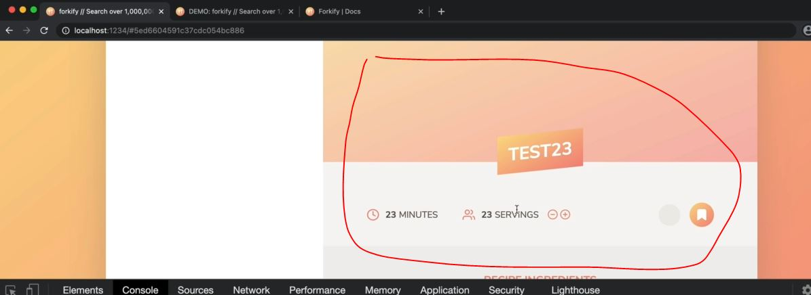
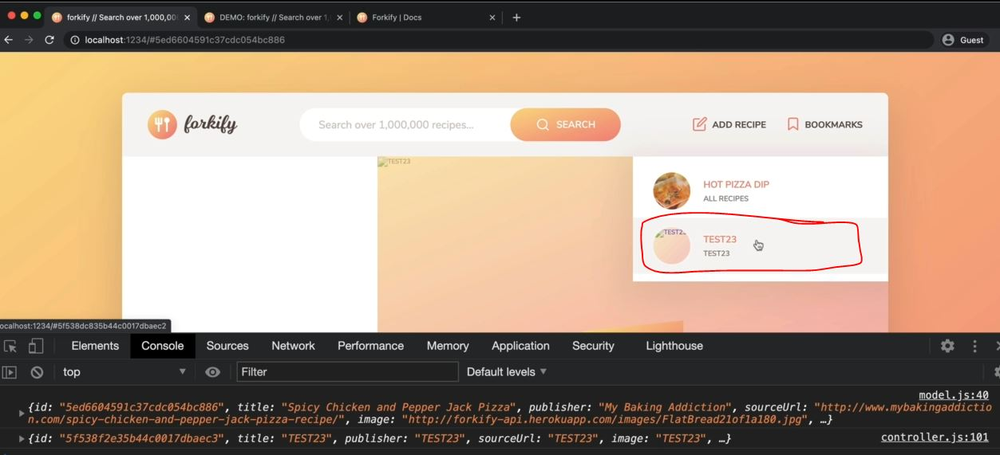

# Uploading a New Recipe - Part 2

- we'll implement a feature for sending the recipe data to the forkify API

## Steps - Uploading a New Recipe - Part 2

- `STEP 1` : inside model.js file , create a new function & export it
    ```js
    import { async } from 'regenerator-runtime' ;
    import { API_URL , RES_PER_PAGE } from '.config.js'
    import { getJSON } from './helpers.js'
            
    export const state = {
        recipe: {} , 
        search: {
            query: "" ,
            result: [] , 
            page: 1 , 
            resultsPerPage: RES_PER_PAGE, 
        } ,
        bookmarks: [] 
    }

    export const loadRecipe = async function(id) {  
        try {
            const data = await getJSON(`${API_URL}${id}`)

            const { recipe } = data.data 
            state.recipe = { 
                id:  recipe.id , 
                title: recipe.title, 
                publisher: recipe.publisher,
                sourceUrl: recipe.source_url ,
                image: recipe.image_url, 
                servings: recipe.servings, 
                cookingTime: recipe.cooking_time ,
                ingredients: recipe.ingredients
            }

            if (state.bookmarks.some(bookmark => bookmark.id === id)) {
                state.recipe.bookmarked = true
            } else {
                state.recipe.bookmarked = false
            }
            
            console.log(state.recipe) 
        } catch(err) {
            console.log(`${err} 💥💥💥`)
            throw err 
        }
    }

    export const loadSearchResults = async function() {
        try {
            state.search.query = query                
            const data = await getJSON(`${API_URL}?search=${query}`)

            state.search.results = data.data.recipes.map(rec => {
                return {
                    id:  rec.id , 
                    title: rec.title, 
                    publisher: rec.publisher,
                    image: rec.image_url, 
                }
            })

            state.search.page = 1 
        } catch(err) {
            console.log(`${err} 💥💥💥`)
            throw err 
        }
    }

    export const getSearchResultsPage = function(page = state.search.page) { 
        state.search.page = page

        const start = (page - 1) * state.search.resultsPerPage 
        const end = page * state.search.resultsPerPage
        return state.search.results.slice(start, end)
    }   

    const persistBookmarks = function() {
        localStorage.setItem("bookmarks", JSON.stringify(state.bookmarks))
    }

    export const addBookmark = function(recipe) {
        // add bookmark
        state.bookmarks.push(recipe)

        // Mark Current recipe as bookmarked
        if (recipe.id === state.recipe.id) {
            state.recipe.bookmarked = true
        }

        persistBookmarks()
    }

    export const deleteBookmark = function(id) {
        // Delete bookmark
        const index = state.bookmarks.findIndex(el => el.id === id)
        state.bookmarks.splice(index, 1)

        // Mark Current recipe as NOT bookmarked
        if (id === state.recipe.id) {
            state.recipe.bookmarked = false
        }

        persistBookmarks()
    }

    const init = function() {
        const storage = localStorage.getItem("bookmarks")
        if (storage) state.bookmarks = JSON.parse(storage)
    }
    init()

    const clearBookmarks = function() {
        localStorage.clear('bookmarks')
    }
    // clearBookmarks()

    export const uploadRecipe = async function(newRecipe) {

    }
    ```
    - now 1st task of this uploadRecipe function is to take the raw input data <br>
        & transform it into the same format as the data that we also get out of the API
    - output : click on `add Recipe` button then click on `upload` button , now see the console tab
        - the data that we'll get from the API is like this
            
            - here `ingredients` property are nicely stored inside an array like this
            
        - but the data which we got from model popup form , we have ingredients like in this form
            
            - & here value each of these ingredients , are separated by the comma inside a string
            - so we want all ingredients in an array & value of each ingredients as quantity , unit & description
        - now inside the modal popup form , we can see that 
            
            - so here we created 3 different fields for each ingredient
            - so one input field for quantity , the unit & description for 1st ingredient <br>
                & for 2nd ingredient , we leave the unit by comma because don't have & same with others
    - `STEP 1.1` : inside model.js file , creating an array of ingredients
        ```js
        // put code from STEP 1 before this code 

        export const uploadRecipe = async function(newRecipe) {
            console.log(Object.entries(newRecipe))
                // Object.entries() method is opposite of Object.fromEntries()
                    // Object.entries() method used to convert from a object into an array 💡💡💡
        }
        ```
    - `STEP 1.2` : inside controller.js file , creating a function to control a add recipe
        ```js
        import * as model from './model.js' 
        import recipeView from './views/recipeView.js'
        import searchView from './views/searchView.js'
        import resultsView from './views/resultsView.js'
        import paginationView from './views/paginationView.js'
        import bookmarksView from './views/bookmarksView.js'
        import addRecipeView from './views/addRecipeView.js'

        import 'core-js/stable' 
        import 'regenerator-runtime/runtime' 

        const timeout = function (s) => {
            return new Promise(function (_, reject) {
                setTimeout(function() {
                    reject(new Error(`Request took too long! Timeout after ${s} second`))
                }, s * 1000)
            })
        }

            const controlRecipe = async function() {
                try {
                    const id = window.location.hash.slice(1)

                    if (!id) return 
                    resultsView.renderSpinner()

                    // 0) update results view to mark selected search result
                    resultsView.render(model.getSearchResultsPage()) 

                    // 1 - updating bookmarks view
                    bookmarksView.update(model.state.bookmarks) 

                    // 2 - Loading recipe
                    await model.loadRecipe(id) 

                    // 3 - Rendering recipe
                    recipeView.render(model.state.recipe)
                } catch(err) {
                    recipeView.renderError() 
                }
            }

        const controlSearchResults = async function() {
            try {
                resultsView.renderSpinner()

                // 1) Get search query
                const query = searchView.getQuery()
                if (!query) return

                // 2) load search results
                await model.loadSearchResults(query) 

                // 3) Render results
                resultsView.render(model.getSearchResultsPage()) 

                // 4) render initial pagination buttons
                paginationView.render(model.state.search) 

            } catch(err) {
                console.log(err)
            }
        }

        const controlPagination = function(goToPage) { 
            // 1) Render NEW results
            resultsView.render(model.getSearchResultsPage(goToPage)) 

            // 2) render NEW  pagination buttons
            paginationView.render(model.state.search) 
        }

        const controlAddBookmark = function() {
            // 1) Add/remove bookmark
            if (!model.state.recipe.bookmarked) {
                model.addBookmark(model.state.recipe)
            } else (model.state.recipe.bookmarked) {
                model.deleteBookmark(model.state.recipe.id)
            }

            // 2) Update recipe view
            recipeView.update(model.state.recipe)

            // 3) Render bookmarks
            bookmarksView.render(model.state.bookmarks)
        }

        const controlBookmarks = function() {
            bookmarksView.render(model.state.bookmarks)
        }

        const controlAddRecipe = function(newRecipe) {
            // Upload the new recipe data
            model.uploadRecipe(newRecipe)
        }

        const init = function() {
            bookmarksView.addHandlerRender(controlBookmarks)
            recipeView.addHandlerRender(controlRecipes)
            recipeView.addHandlerUpdateServings(controlServings)
            recipeView.addHandlerAddBookmark(controlAddBookmark)
            searchView.addHandlerSearch(controlSearchResults)
            paginationView.addHandlerClick(controlPagination)
            addRecipeView.addHandlerUpload(controlAddRecipe) 
        }
        init()
        ```
        - output : click on `add recipe` & then click on `upload` button of model popup 
            - then we'll get an array like this 
            
        - now we only want those elements from this array which starts with `ingredients` key <br>
            & we're not interested on those ingredients which has empty value 

- `STEP 2` : inside model.js file , getting only those elements which has `ingredients` key
    - & those ingredients which has no empty value
    ```js
    // put code from STEP 1 before this code 

    export const uploadRecipe = async function(newRecipe) {
        const ingredients = Object.entries(newRecipe).filter(entry => {
            return entry[0].startsWith(ingredient) && entry[1] !== ""
        })        

        console.log(ingredients)
    }
    ```
    - output : click on `add recipe` & then click on `upload` button of model popup 
        - then we'll get only those ingredients based the condition <br>
        
        - now we need to take the data from this string value of these ingredients & put that into an object
    - `STEP 2.1` : inside model.js file , using map() array method
        ```js
        // put code from STEP 1 before this code 

        export const uploadRecipe = async function(newRecipe) {
            const ingredients = Object.entries(newRecipe).filter(entry => {
                return entry[0].startsWith(ingredient) && entry[1] !== ""
            }).map(ing => {

                    // here we replaced empty string & a white space also
                const [quantity, unit, description] = ing[1].replaceAll(" ", "").split(",")
                    // here using array destructuring 

                return {quantity, unit, description}
            })

            console.log(ingredients)
        }
        ```
        - output : click on `add recipe` & then click on `upload` button of model popup 
            - then we'll get the object for those each ingredients
            
            - now we want to set quantity to null if there's no quantity defined <br>
                & convert those quantity from string into number
    - `STEP 2.2` : inside model.js file ,  
        - set quantity to null if there's no quantity defined & convert those quantity from string into number
        ```js
        // put code from STEP 1 before this code 

        export const uploadRecipe = async function(newRecipe) {
            const ingredients = Object.entries(newRecipe).filter(entry => {
                return entry[0].startsWith(ingredient) && entry[1] !== ""
            }).map(ing => {

                const [quantity, unit, description] = ing[1].replaceAll(" ", "").split(",")

                return {quantity : quantity ? +quantity : null , unit, description}
                    // for empty string , we use null , not undefined 💡💡💡
            })

            console.log(ingredients)
        }
        ```
        - output : click on `add recipe` & then click on `upload` button of model popup 
            - then we'll get the object for those each ingredients 
            - but what if we add just `5` in ingredient 4 input field then we'll get this output like this
                
                - so here unit & description is undefined which we don't want <br>
            - but if we pass `5,,` in ingredient 4 input field then we'll get this output
                
                - so we got value of the unit & description keys in empty string
    - `STEP 2.3` : inside model.js file , refactoring the code & throwing the error if ingArr length is less than 3
        ```js
        // put code from STEP 1 before this code 

        export const uploadRecipe = async function(newRecipe) {
            const ingredients = Object.entries(newRecipe).filter(entry => {
                return entry[0].startsWith(ingredient) && entry[1] !== ""
            }).map(ing => {
                const ingArr = ing[1].replaceAll(" ", "").split(",")
                if (ingArr.length !== 3) {
                    throw new Error('Wrong ingredient format! Please use the correct format :)')
                        // if the condition is true then after this line code the function gets immediately exit 💡💡💡
                }

                const [quantity, unit, description] = ingArr

                return {quantity : quantity ? +quantity : null , unit, description}
            })

            console.log(ingredients)
        }
        ```
        - now if the error happened then we want to show that error when user click on `add recipe` button
    - `STEP 2.4` : inside controller.js file , getting the error from model.js file 
        ```js
        // put code from STEP 1.2 before this
                
        const controlAddRecipe = function(newRecipe) {
            try {
                // Upload the new recipe data
                model.uploadRecipe(newRecipe)

            } catch(err) {
                console.error(err)
                addRecipeView.renderError(err.message)
            }

        }

        const init = function() {
            bookmarksView.addHandlerRender(controlBookmarks)
            recipeView.addHandlerRender(controlRecipes)
            recipeView.addHandlerUpdateServings(controlServings)
            recipeView.addHandlerAddBookmark(controlAddBookmark)
            searchView.addHandlerSearch(controlSearchResults)
            paginationView.addHandlerClick(controlPagination)
            addRecipeView.addHandlerUpload(controlAddRecipe) 
        }
        init()
        ```
        - output : click on `add Recipe` button & then click on `upload` button then we'll get those 3 ingredients
            - but if we write just `5` inside ingredient 4 input field then we'll get the error inside console
        - so now let's use the try catch block inside uploadRecipe() async function 
    - `STEP 2.5` : inside model.js file , using try catch block inside uploadRecipe() async function
        ```js
        // put code from STEP 1 before this code 

        export const uploadRecipe = async function(newRecipe) {
            try {
                const ingredients = Object.entries(newRecipe).filter(entry => {
                    return entry[0].startsWith(ingredient) && entry[1] !== ""
                }).map(ing => {
                    const ingArr = ing[1].replaceAll(" ", "").split(",")
                    if (ingArr.length !== 3) {
                        throw new Error('Wrong ingredient format! Please use the correct format :)')
                            // if the condition is true then after this line code the function gets immediately exit 💡💡💡
                            // & so our promise gets rejected by throw new Error()
                    }

                    const [quantity, unit, description] = ingArr

                    return {quantity : quantity ? +quantity : null , unit, description}
                })

                console.log(ingredients)
            } catch(err) {
                throw err
            }
        }
        ```
        - output : click on `add Recipe` button & then just write `5` inside ingredient 4 input field
            - & then click on `upload` button then we'll get the error inside the console tab 
            - but we want to show the error on UI & that should come from the controller <br>
                so the problem is from controller because inside model.js file , uploadRecipe() is a async function <br>
                & inside controller.js file , inside controlAddRecipe() function , we didn't await <br>
                this line of code i.e `model.uploadRecipe(newRecipe)` 💡💡💡
    - `STEP 2.6` : inside controller.js file , 
        - using `await` keyword on `model.uploadRecipe(newRecipe)` <br>
            because only then we can handle this function which returns a promise 💡💡💡 <br>
            so that rejected promise can get caught
        - & make controlAddRecipe() function as async function
        ```js
        // put code from STEP 1.2 before this
                
        const controlAddRecipe = async function(newRecipe) {
            try {
                // Upload the new recipe data
                await model.uploadRecipe(newRecipe)

            } catch(err) {
                console.error(err)
                addRecipeView.renderError(err.message)
            }

        }

        const init = function() {
            bookmarksView.addHandlerRender(controlBookmarks)
            recipeView.addHandlerRender(controlRecipes)
            recipeView.addHandlerUpdateServings(controlServings)
            recipeView.addHandlerAddBookmark(controlAddBookmark)
            searchView.addHandlerSearch(controlSearchResults)
            paginationView.addHandlerClick(controlPagination)
            addRecipeView.addHandlerUpload(controlAddRecipe) 
        }
        init()
        ```
        - output : click on `add Recipe` button & then just write `5` inside ingredient 7 input field
            - & then click on `upload` button then we'll get the error inside the console tab & on UI also like this
            

- `STEP 3` : inside model.js file , creating a recipe object
    ```js
    // put code from STEP 1 before this code 

    export const uploadRecipe = async function(newRecipe) {
        try {
            const ingredients = Object.entries(newRecipe).filter(entry => {
                return entry[0].startsWith(ingredient) && entry[1] !== ""
            }).map(ing => {
                const ingArr = ing[1].replaceAll(" ", "").split(",")
                if (ingArr.length !== 3) {
                    throw new Error('Wrong ingredient format! Please use the correct format :)')
                }

                const [quantity, unit, description] = ingArr

                return {quantity : quantity ? +quantity : null , unit, description}
            })

            const recipe = {
                // inside loadRecipe() async function , inside state.recipe object
                    // whatever sequence we define the keys & properties for receiving/getting things from an API
                    // that exactly should be same for posting the data on the API
                
                title: newRecipe.title ,
                source_url: newRecipe.sourceUrl,
                image_url: newRecipe.image ,
                publisher: newRecipe.publisher,
                cooking_time: +newRecipe.cookingTime,
                servings: +newRecipe.servings,
                ingredients,
            }

            console.log(recipe)
        } catch(err) {
            throw err
        }
    }
    ```
    - output : click on `add recipe` button & then click on `upload` button without filling any input field
        - then we'll get this object like this
        
        - now this object data we can send to the API

- `STEP 4` : inside helpers.js file , 
    - we already have getJSON() async function for sending JSON in our helper function inside helpers.js file
    - so copy code of getJSON() async function & paste inside this file itself & refactor it 
    ```js
    import { async } from 'regenerator-runtime' 
    import { TIMEOUT_SEC } from './config.js'

    const timeout = function (s) => {
        return new Promise(function (_, reject) {
            setTimeout(function() {
                reject(new Error(`Request took too long! Timeout after ${s} second`))
            }, s * 1000)
        })
    }

    export const getJSON = async  function(url) {
        try {
            const fetchPro = fetch(url)
            const res = await Promise.race([fetchPro , timeout(TIMEOUT_SEC)])
            const data = await res.json()

            if (!res.ok) throw new Error(`${data.message} (${res.status})`)

            return data 
        } catch(err) {
            throw err
        }
    }

    export const sendJSON = async  function(url) {
        try {
            const res = await Promise.race([fetch(url) , timeout(TIMEOUT_SEC)])
            const data = await res.json()

            if (!res.ok) throw new Error(`${data.message} (${res.status})`)

            return data 
        } catch(err) {
            throw err
        }
    }
    ```
    - now we'll see how to send the data to the API by using fetch() function API <br>
        so up until this point , we just pass a URL inside the fetch() api function <br>
        & then it would automatically create a `GET` request 💡💡💡
    - however , to send data , we use post request , so passing URL as first argument inside fetch() <br>
        we also need to pass an object with some options as second argument 💡💡💡
    - `STEP 4.1` : inside helpers.js file , passing an object as 2nd argument inside fetch() function for post request 🔥
        ```js
        import { async } from 'regenerator-runtime' 
        import { TIMEOUT_SEC } from './config.js'

        const timeout = function (s) => {
            return new Promise(function (_, reject) {
                setTimeout(function() {
                    reject(new Error(`Request took too long! Timeout after ${s} second`))
                }, s * 1000)
            })
        }

        export const getJSON = async function(url) {
            try {
                const fetchPro = fetch(url)
                const res = await Promise.race([fetchPro , timeout(TIMEOUT_SEC)])
                const data = await res.json()

                if (!res.ok) throw new Error(`${data.message} (${res.status})`)

                return data 
            } catch(err) {
                throw err
            }
        }

        export const sendJSON = async  function(url , uploadData) {
            try {
                const fetchPro = fetch(url, {
                    // first option is a method -> key/property
                    method: "POST" , 
                    // second option is a headers -> property
                        // headers -> property takes value in object form 💡💡💡
                    headers: {
                        "Content-Type": 'application/json'
                        // C & T should be capital & other things should be exactly same 
                            // 'application/json' -> this value means the data which we're sending to the API
                                // is going to be in JSON Format 
                            // so only then our API can correctly accept that data 
                                // & create a new recipe in the database 
                                // because this API accept data in JSON format only 💡💡💡 
                    }, 
                    // 3rd option - is a payload of the request
                        // means the data that we want to send i.e body -> property 💡💡💡
                        // & value of body -> property should be only in JSON 💡💡💡
                    body: JSON.stringify(uploadData)
                        // so here we parsed the data in json format , so that it can be sent to the API
                })
                // means we pass the URL , upload data & then take the URL , upload data
                    // & then simply create a fetch() request 

                const res = await Promise.race([fetchPro , timeout(TIMEOUT_SEC)])
                const data = await res.json()

                if (!res.ok) throw new Error(`${data.message} (${res.status})`)

                return data 
            } catch(err) {
                throw err
            }
        }
        ```
    - `STEP 4.2` : inside model.js file , importing sendJSON() async function
        ```js
        import { async } from 'regenerator-runtime' ;
        import { API_URL , RES_PER_PAGE } from '.config.js'
        import { getJSON , sendJSON } from './helpers.js'
                
        export const state = {
            recipe: {} , 
            search: {
                query: "" ,
                result: [] , 
                page: 1 , 
                resultsPerPage: RES_PER_PAGE, 
            } ,
            bookmarks: [] 
        }

        export const loadRecipe = async function(id) {  
            try {
                const data = await getJSON(`${API_URL}${id}`)

                const { recipe } = data.data 
                state.recipe = { 
                    id:  recipe.id , 
                    title: recipe.title, 
                    publisher: recipe.publisher,
                    sourceUrl: recipe.source_url ,
                    image: recipe.image_url, 
                    servings: recipe.servings, 
                    cookingTime: recipe.cooking_time ,
                    ingredients: recipe.ingredients
                }

                if (state.bookmarks.some(bookmark => bookmark.id === id)) {
                    state.recipe.bookmarked = true
                } else {
                    state.recipe.bookmarked = false
                }
                
                console.log(state.recipe) 
            } catch(err) {
                console.log(`${err} 💥💥💥`)
                throw err 
            }
        }

        export const loadSearchResults = async function() {
            try {
                state.search.query = query                
                const data = await getJSON(`${API_URL}?search=${query}`)

                state.search.results = data.data.recipes.map(rec => {
                    return {
                        id:  rec.id , 
                        title: rec.title, 
                        publisher: rec.publisher,
                        image: rec.image_url, 
                    }
                })

                state.search.page = 1 
            } catch(err) {
                console.log(`${err} 💥💥💥`)
                throw err 
            }
        }

        export const getSearchResultsPage = function(page = state.search.page) { 
            state.search.page = page

            const start = (page - 1) * state.search.resultsPerPage 
            const end = page * state.search.resultsPerPage
            return state.search.results.slice(start, end)
        }   

        const persistBookmarks = function() {
            localStorage.setItem("bookmarks", JSON.stringify(state.bookmarks))
        }

        export const addBookmark = function(recipe) {
            // add bookmark
            state.bookmarks.push(recipe)

            // Mark Current recipe as bookmarked
            if (recipe.id === state.recipe.id) {
                state.recipe.bookmarked = true
            }

            persistBookmarks()
        }

        export const deleteBookmark = function(id) {
            // Delete bookmark
            const index = state.bookmarks.findIndex(el => el.id === id)
            state.bookmarks.splice(index, 1)

            // Mark Current recipe as NOT bookmarked
            if (id === state.recipe.id) {
                state.recipe.bookmarked = false
            }

            persistBookmarks()
        }

        const init = function() {
            const storage = localStorage.getItem("bookmarks")
            if (storage) state.bookmarks = JSON.parse(storage)
        }
        init()

        const clearBookmarks = function() {
            localStorage.clear('bookmarks')
        }
        // clearBookmarks()

        export const uploadRecipe = async function(newRecipe) {
            try {
                const ingredients = Object.entries(newRecipe).filter(entry => {
                    return entry[0].startsWith(ingredient) && entry[1] !== ""
                }).map(ing => {
                    const ingArr = ing[1].replaceAll(" ", "").split(",")
                    if (ingArr.length !== 3) {
                        throw new Error('Wrong ingredient format! Please use the correct format :)')
                    }

                    const [quantity, unit, description] = ingArr

                    return {quantity : quantity ? +quantity : null , unit, description}
                })

                const recipe = {
                    title: newRecipe.title ,
                    source_url: newRecipe.sourceUrl,
                    image_url: newRecipe.image ,
                    publisher: newRecipe.publisher,
                    cooking_time: +newRecipe.cookingTime,
                    servings: +newRecipe.servings,
                    ingredients,
                }

                sendJSON(`${API_URL}`)

            } catch(err) {
                throw err
            }
        }
        ```
        - now go to this URL `https://forkify-api.herokuapp.com/v2` & click on generate API key
            - & if you get any error while generating api key then might be you requested more than one API keys per hour
            - so we can't do multiple request in per hour
        - so copy that API key & scroll down & under `Parameters` section , URL path will be same for getting all the recipes , <br>
            we don't need `search` parameter but we need `key` parameter
        - & we're doing POST request to create a new recipe <br>
            & then when we hit that end point i.e `https://forkify-api.herokuapp.com/api/v2/recipes` <br>
            with a POST request & some data 💡💡💡

- `STEP 5` : inside config.js file , storing the API key or developer key
    ```js
    export const API_URL = 'https://forkify-api.herokuapp.com/api/v2/recipes/'; 
    export const TIMEOUT_SEC = 10;
    export const RES_PER_PAGE = 10
    export const key = 'baaa8526-5076-41d6-a1bd-4c440b649037'
    ```
    - `STEP 5.1` : inside model.js file , specifying the parameters inside sendJSON() async function
        ```js
        import { async } from 'regenerator-runtime' ;
        import { API_URL , RES_PER_PAGE, KEY } from '.config.js'
        import { getJSON } from './helpers.js'

        // put this code from STEP 4.2 after & before , below & above code 

        export const uploadRecipe = async function(newRecipe) {
            try {
                const ingredients = Object.entries(newRecipe).filter(entry => {
                    return entry[0].startsWith(ingredient) && entry[1] !== ""
                }).map(ing => {
                    const ingArr = ing[1].replaceAll(" ", "").split(",")
                    if (ingArr.length !== 3) {
                        throw new Error('Wrong ingredient format! Please use the correct format :)')
                    }

                    const [quantity, unit, description] = ingArr

                    return {quantity : quantity ? +quantity : null , unit, description}
                })

                const recipe = {
                    title: newRecipe.title ,
                    source_url: newRecipe.sourceUrl,
                    image_url: newRecipe.image ,
                    publisher: newRecipe.publisher,
                    cooking_time: +newRecipe.cookingTime,
                    servings: +newRecipe.servings,
                    ingredients,
                }

                const data = await sendJSON(`${API_URL}?key=${KEY}`, recipe)
                    // Imp Note 🔥 : why we need question mark after end point means a URL
                        // here question mark (before the end point i.e URL)
                        // is used to specify a list of parameters 💡💡💡

                console.log(data)
            } catch(err) {
                throw err
            }
        }
        ```
        - output : console.log(data)
            - click on `add recipe` button & then click on `upload` button 
            - then we'll get the error like this
                
                - so this error is coming from the API
            - this error means the input data is invalid because the source URL needs to be at least 5 characters long <br>
                because in URL input field , length of URL should be least 5 characters long
    - `STEP 5.2` : inside index.html file , passing value like `TEST23` in each input field which has `TEST` value
        ```html
        <div class="upload__column">
            <h3 class="upload__heading">Recipe data</h3>
            <label>Title</label>
            <input value="TEST23" required name="title" type="text" />
            <label>URL</label>
            <input value="TEST23" required name="sourceUrl" type="text" />
            <label>Image URL</label>
            <input value="TEST23" required name="image" type="text" />
            <label>Publisher</label>
            <input value="TEST23" required name="publisher" type="text" />
            <label>Prep time</label>
            <input value="23" required name="cookingTime" type="number" />
            <label>Servings</label>
            <input value="23" required name="servings" type="number" />
        </div>
        ```
        - output : now click `add recipe` button then we'll get the those input fields with `TEST23`
            - now click on `upload` button then we'll get this object    
            
            - so we got the data which we need to send & inside this object , we got createdAt & id <br>
                & the API key which we got which is very important when we want to mark our own recipes 💡💡💡 
        - now render that newly created recipe on UI after closing that model popup
        - so inside model.js file , inside loadRecipe() async function , we have state.recipe object like this
            ```
            state.recipe = { 
                id: recipe.id , 
                title: recipe.title, 
                publisher: recipe.publisher,
                sourceUrl: recipe.source_url ,
                image: recipe.image_url, 
                servings: recipe.servings, 
                cookingTime: recipe.cooking_time ,
                ingredients: recipe.ingredients
            }
            ```
            - so we need this same thing to render that newly recipe , so we'll create a function of it instead of repeating

- `STEP 6` : inside model.js file , creating a function of this state.recipe
    ```js
    import { async } from 'regenerator-runtime' ;
    import { API_URL , RES_PER_PAGE } from '.config.js'
    import { getJSON , sendJSON } from './helpers.js'
            
    export const state = {
        recipe: {} , 
        search: {
            query: "" ,
            result: [] , 
            page: 1 , 
            resultsPerPage: RES_PER_PAGE, 
        } ,
        bookmarks: [] 
    }

    const createRecipeObject = function(data) {
        const { recipe } = data.data 
        return { 
            id:  recipe.id , 
            title: recipe.title, 
            publisher: recipe.publisher,
            sourceUrl: recipe.source_url ,
            image: recipe.image_url, 
            servings: recipe.servings, 
            cookingTime: recipe.cooking_time ,
            ingredients: recipe.ingredients
        }
    }

    export const loadRecipe = async function(id) {  
        try {
            const data = await getJSON(`${API_URL}${id}`)

            state.recipe = createRecipeObject(data)

            if (state.bookmarks.some(bookmark => bookmark.id === id)) {
                state.recipe.bookmarked = true
            } else {
                state.recipe.bookmarked = false
            }
            
            console.log(state.recipe) 
        } catch(err) {
            console.log(`${err} 💥💥💥`)
            throw err 
        }
    }

    export const loadSearchResults = async function() {
        try {
            state.search.query = query                
            const data = await getJSON(`${API_URL}?search=${query}`)

            state.search.results = data.data.recipes.map(rec => {
                return {
                    id:  rec.id , 
                    title: rec.title, 
                    publisher: rec.publisher,
                    image: rec.image_url, 
                }
            })

            state.search.page = 1 
        } catch(err) {
            console.log(`${err} 💥💥💥`)
            throw err 
        }
    }

    export const getSearchResultsPage = function(page = state.search.page) { 
        state.search.page = page

        const start = (page - 1) * state.search.resultsPerPage 
        const end = page * state.search.resultsPerPage
        return state.search.results.slice(start, end)
    }   

    const persistBookmarks = function() {
        localStorage.setItem("bookmarks", JSON.stringify(state.bookmarks))
    }

    export const addBookmark = function(recipe) {
        // add bookmark
        state.bookmarks.push(recipe)

        // Mark Current recipe as bookmarked
        if (recipe.id === state.recipe.id) {
            state.recipe.bookmarked = true
        }

        persistBookmarks()
    }

    export const deleteBookmark = function(id) {
        // Delete bookmark
        const index = state.bookmarks.findIndex(el => el.id === id)
        state.bookmarks.splice(index, 1)

        // Mark Current recipe as NOT bookmarked
        if (id === state.recipe.id) {
            state.recipe.bookmarked = false
        }

        persistBookmarks()
    }

    const init = function() {
        const storage = localStorage.getItem("bookmarks")
        if (storage) state.bookmarks = JSON.parse(storage)
    }
    init()

    const clearBookmarks = function() {
        localStorage.clear('bookmarks')
    }
    // clearBookmarks()

    export const uploadRecipe = async function(newRecipe) {
        try {
            const ingredients = Object.entries(newRecipe).filter(entry => {
                return entry[0].startsWith(ingredient) && entry[1] !== ""
            }).map(ing => {
                const ingArr = ing[1].replaceAll(" ", "").split(",")
                if (ingArr.length !== 3) {
                    throw new Error('Wrong ingredient format! Please use the correct format :)')
                }

                const [quantity, unit, description] = ingArr

                return {quantity : quantity ? +quantity : null , unit, description}
            })

            const recipe = {
                title: newRecipe.title ,
                source_url: newRecipe.sourceUrl,
                image_url: newRecipe.image ,
                publisher: newRecipe.publisher,
                cooking_time: +newRecipe.cookingTime,
                servings: +newRecipe.servings,
                ingredients,
            }

            const data = await sendJSON(`${API_URL}?key=${KEY}`, recipe)
            state.recipe = createRecipeObject(data)

        } catch(err) {
            throw err
        }
    }
    ```
    - `STEP 6.1` : inside controller.js file , printing that data recipe
        ```js
        // put code from STEP 1.2 before this
                
        const controlAddRecipe = async function(newRecipe) {
            try {
                // Upload the new recipe data
                await model.uploadRecipe(newRecipe)
                console.log(model.state.recipe)
            } catch(err) {
                console.error(err)
                addRecipeView.renderError(err.message)
            }

        }

        const init = function() {
            bookmarksView.addHandlerRender(controlBookmarks)
            recipeView.addHandlerRender(controlRecipes)
            recipeView.addHandlerUpdateServings(controlServings)
            recipeView.addHandlerAddBookmark(controlAddBookmark)
            searchView.addHandlerSearch(controlSearchResults)
            paginationView.addHandlerClick(controlPagination)
            addRecipeView.addHandlerUpload(controlAddRecipe) 
        }
        init()
        ```
        - output : click on `add recipe` button & then click on `upload` button of model popup
            - then we'll get the newly recipe in object form like this
            
            - but it doesn't have `bookmarks` property to set true or false & the API key   
    - `STEP 6.2` : inside model.js file , adding `bookmarks` property 
        ```js
        // put code from STEP 6 before this below code 

        export const uploadRecipe = async function(newRecipe) {
            try {
                const ingredients = Object.entries(newRecipe).filter(entry => {
                    return entry[0].startsWith(ingredient) && entry[1] !== ""
                }).map(ing => {
                    const ingArr = ing[1].replaceAll(" ", "").split(",")
                    if (ingArr.length !== 3) {
                        throw new Error('Wrong ingredient format! Please use the correct format :)')
                    }

                    const [quantity, unit, description] = ingArr

                    return {quantity : quantity ? +quantity : null , unit, description}
                })

                const recipe = {
                    title: newRecipe.title ,
                    source_url: newRecipe.sourceUrl,
                    image_url: newRecipe.image ,
                    publisher: newRecipe.publisher,
                    cooking_time: +newRecipe.cookingTime,
                    servings: +newRecipe.servings,
                    ingredients,
                }

                const data = await sendJSON(`${API_URL}?key=${KEY}`, recipe)
                state.recipe = createRecipeObject(data)
                addBookmark(state.recipe)
            } catch(err) {
                throw err
            }
        }
        ```
        - now to add the API key inside that newly recipe object , in the case of loading recipe <br>
            not always there will be a key . means most of the recipes , don't have any key <br>
            so we can't do like this inside model.js file , inside createRecipeObject() function
            ```
            const createRecipeObject = function(data) {
                const { recipe } = data.data 
                return { 
                    id:  recipe.id , 
                    title: recipe.title, 
                    publisher: recipe.publisher,
                    sourceUrl: recipe.source_url ,
                    image: recipe.image_url, 
                    servings: recipe.servings, 
                    cookingTime: recipe.cooking_time ,
                    ingredients: recipe.ingredients ,
                    key: recipe.key
                }
            }
            ```
            - so we only want to add the API key if that recipe exist ✔️✔️✔️
    - `STEP 6.3` : inside model.js file , adding the API key on the newly created recipe
        ```js
        import { async } from 'regenerator-runtime' ;
        import { API_URL , RES_PER_PAGE } from '.config.js'
        import { getJSON , sendJSON } from './helpers.js'
                
        export const state = {
            recipe: {} , 
            search: {
                query: "" ,
                result: [] , 
                page: 1 , 
                resultsPerPage: RES_PER_PAGE, 
            } ,
            bookmarks: [] 
        }

        const createRecipeObject = function(data) {
            const { recipe } = data.data 
            return { 
                id:  recipe.id , 
                title: recipe.title, 
                publisher: recipe.publisher,
                sourceUrl: recipe.source_url ,
                image: recipe.image_url, 
                servings: recipe.servings, 
                cookingTime: recipe.cooking_time ,
                ingredients: recipe.ingredients,
                ...(recipe.key && { key : recipe.key })
                    // here we know && operator will do short-circuiting
                    // so if the recipe.key is a falsy value means if it doesn't exist then nothing happens
                    // but if recipe.key has a value then second part of the operator is executed & returned
                        // then this -> (recipe.key && { key : recipe.key }) whole expression become an object 💡💡💡
                        // & then we spread that object like this -> 'key : recipe.key
                    // so this is a good way to conditionally add properties to an object 💡💡💡
            }
        }

        export const loadRecipe = async function(id) {  
            try {
                const data = await getJSON(`${API_URL}${id}`)

                state.recipe = createRecipeObject(data)

                if (state.bookmarks.some(bookmark => bookmark.id === id)) {
                    state.recipe.bookmarked = true
                } else {
                    state.recipe.bookmarked = false
                }
                
                console.log(state.recipe) 
            } catch(err) {
                console.log(`${err} 💥💥💥`)
                throw err 
            }
        }

        export const loadSearchResults = async function() {
            try {
                state.search.query = query                
                const data = await getJSON(`${API_URL}?search=${query}`)

                state.search.results = data.data.recipes.map(rec => {
                    return {
                        id:  rec.id , 
                        title: rec.title, 
                        publisher: rec.publisher,
                        image: rec.image_url, 
                    }
                })

                state.search.page = 1 
            } catch(err) {
                console.log(`${err} 💥💥💥`)
                throw err 
            }
        }

        export const getSearchResultsPage = function(page = state.search.page) { 
            state.search.page = page

            const start = (page - 1) * state.search.resultsPerPage 
            const end = page * state.search.resultsPerPage
            return state.search.results.slice(start, end)
        }   

        const persistBookmarks = function() {
            localStorage.setItem("bookmarks", JSON.stringify(state.bookmarks))
        }

        export const addBookmark = function(recipe) {
            // add bookmark
            state.bookmarks.push(recipe)

            // Mark Current recipe as bookmarked
            if (recipe.id === state.recipe.id) {
                state.recipe.bookmarked = true
            }

            persistBookmarks()
        }

        export const deleteBookmark = function(id) {
            // Delete bookmark
            const index = state.bookmarks.findIndex(el => el.id === id)
            state.bookmarks.splice(index, 1)

            // Mark Current recipe as NOT bookmarked
            if (id === state.recipe.id) {
                state.recipe.bookmarked = false
            }

            persistBookmarks()
        }

        const init = function() {
            const storage = localStorage.getItem("bookmarks")
            if (storage) state.bookmarks = JSON.parse(storage)
        }
        init()

        const clearBookmarks = function() {
            localStorage.clear('bookmarks')
        }
        // clearBookmarks()

        export const uploadRecipe = async function(newRecipe) {
            try {
                const ingredients = Object.entries(newRecipe).filter(entry => {
                    return entry[0].startsWith(ingredient) && entry[1] !== ""
                }).map(ing => {
                    const ingArr = ing[1].replaceAll(" ", "").split(",")
                    if (ingArr.length !== 3) {
                        throw new Error('Wrong ingredient format! Please use the correct format :)')
                    }

                    const [quantity, unit, description] = ingArr

                    return {quantity : quantity ? +quantity : null , unit, description}
                })

                const recipe = {
                    title: newRecipe.title ,
                    source_url: newRecipe.sourceUrl,
                    image_url: newRecipe.image ,
                    publisher: newRecipe.publisher,
                    cooking_time: +newRecipe.cookingTime,
                    servings: +newRecipe.servings,
                    ingredients,
                }

                const data = await sendJSON(`${API_URL}?key=${KEY}`, recipe)
                state.recipe = createRecipeObject(data)
                addBookmark(state.recipe)
            } catch(err) {
                throw err
            }
        }
        ```
        - output : click on `add recipe` button & then click on `upload` button of model popup
            - then we'll get the `bookmarks` & `key` property inside that newly created object like this
             
        - now let's render that newly recipe on left side of the UI
    - `STEP 6.4` : inside controller.js file , rendering the recipe on left side of the UI
        ```js
        // put code from STEP 1.2 before this
                
        const controlAddRecipe = async function(newRecipe) {
            try {
                // Upload the new recipe data
                await model.uploadRecipe(newRecipe)
                console.log(model.state.recipe)

                // Render recipe
                recipeView.render(model.state.recipe)

                // close form window
                    // we're closing the window after some time
                setTimeout(function() {
                    addRecipeView.toggleWindow()
                }, 2500) 

            } catch(err) {
                console.error(err)
                addRecipeView.renderError(err.message)
            }
        }

        const init = function() {
            bookmarksView.addHandlerRender(controlBookmarks)
            recipeView.addHandlerRender(controlRecipes)
            recipeView.addHandlerUpdateServings(controlServings)
            recipeView.addHandlerAddBookmark(controlAddBookmark)
            searchView.addHandlerSearch(controlSearchResults)
            paginationView.addHandlerClick(controlPagination)
            addRecipeView.addHandlerUpload(controlAddRecipe) 
        }
        init()
        ```
        - now here 2500 is a magic number , so store it inside config.js file 
        - `STEP 6.4.1` : inside config.js file , storing another magic number
            ```js
            export const API_URL = 'https://forkify-api.herokuapp.com/api/v2/recipes/'; 
            export const TIMEOUT_SEC = 10;
            export const RES_PER_PAGE = 10
            export const key = 'baaa8526-5076-41d6-a1bd-4c440b649037'
            export const MODAL_CLOSE_SEC = 2.5
            ```
        - `STEP 6.4.2` : inside controller.js file , exporting MODAL_CLOSE_SEC 
            ```js
            import * as model from './model.js' 
            import { MODAL_CLOSE_SEC } from './config.js'
            import recipeView from './views/recipeView.js'
            import searchView from './views/searchView.js'
            import resultsView from './views/resultsView.js'
            import paginationView from './views/paginationView.js'
            import bookmarksView from './views/bookmarksView.js'
            import addRecipeView from './views/addRecipeView.js'

            // put code from STEP 1.2 b/w these
                    
            const controlAddRecipe = async function(newRecipe) {
                try {
                    // Upload the new recipe data
                    await model.uploadRecipe(newRecipe)
                    console.log(model.state.recipe)

                    // Render recipe
                    recipeView.render(model.state.recipe)

                    // Success message

                    // close form window
                    setTimeout(function() {
                        addRecipeView.toggleWindow()
                    }, MODAL_CLOSE_SEC * 1000) 

                } catch(err) {
                    console.error(err)
                    addRecipeView.renderError(err.message)
                }
            }

            const init = function() {
                bookmarksView.addHandlerRender(controlBookmarks)
                recipeView.addHandlerRender(controlRecipes)
                recipeView.addHandlerUpdateServings(controlServings)
                recipeView.addHandlerAddBookmark(controlAddBookmark)
                searchView.addHandlerSearch(controlSearchResults)
                paginationView.addHandlerClick(controlPagination)
                addRecipeView.addHandlerUpload(controlAddRecipe) 
            }
            init()
            ```
        - `STEP 6.4.3` : inside addRecipeView.js file , working on success message after adding newly created recipe
            ```js
            import View from './View.js'
            import icons from 'url:../../img/icons.svg' 

            class AddRecipeView extends View {
                _parentElement = document.querySelector('.upload')
                _message = "Recipe was successfully uploaded :)"

                _window = document.querySelector('.add-recipe-window')
                _overlay = document.querySelector('.overlay')
                _btnOpen = document.querySelector('.nav__btn--add-recipe')
                _btnClose = document.querySelector('.btn--close-modal')

                constructor() {
                    super()
                    this._addHandlerShowWindow()
                    this._addHandlerHideWindow() 
                }

                toggleWindow() {
                    this._overlay.classList.toggle('hidden')
                    this._window.classList.toggle('hidden')
                }

                _addHandlerShowWindow() {
                    this._btnOpen.addEventListener('click' , this.toggleWindow.bind(this))
                }

                _addHandlerHideWindow() {
                    this._btnClose.addEventListener('click' , this.toggleWindow.bind(this))
                    this._overlay.addEventListener('click' , this.toggleWindow.bind(this))
                }

                addHandlerUpload(handler) {
                    this._parentElement.addEventListener('submit' , function(e) {
                        e.preventDefault()
                        
                        const dataArr = [...new FormData(this)]
                        const data = Object.fromEntries(dataArr)
                        handler(data)
                    })
                }

                _generateMarkup() {}
            }

            export default new AddRecipeView
            ``` 
        - `STEP 6.4.4` : inside controller.js file , rendering success message
            ```js
            import * as model from './model.js' 
            import { MODAL_CLOSE_SEC } from './config.js'
            import recipeView from './views/recipeView.js'
            import searchView from './views/searchView.js'
            import resultsView from './views/resultsView.js'
            import paginationView from './views/paginationView.js'
            import bookmarksView from './views/bookmarksView.js'
            import addRecipeView from './views/addRecipeView.js'

            // put code from STEP 1.2 b/w these
                    
            const controlAddRecipe = async function(newRecipe) {
                try {
                    // Upload the new recipe data
                    await model.uploadRecipe(newRecipe)
                    console.log(model.state.recipe)

                    // Render recipe
                    recipeView.render(model.state.recipe)

                    // Success message
                    addRecipeView.renderMessage()

                    // close form window
                    setTimeout(function() {
                        addRecipeView.toggleWindow()
                    }, MODAL_CLOSE_SEC * 1000) 

                } catch(err) {
                    console.error(err)
                    addRecipeView.renderError(err.message)
                }
            }

            const init = function() {
                bookmarksView.addHandlerRender(controlBookmarks)
                recipeView.addHandlerRender(controlRecipes)
                recipeView.addHandlerUpdateServings(controlServings)
                recipeView.addHandlerAddBookmark(controlAddBookmark)
                searchView.addHandlerSearch(controlSearchResults)
                paginationView.addHandlerClick(controlPagination)
                addRecipeView.addHandlerUpload(controlAddRecipe) 
            }
            init()
            ```
            - output : click on `add recipe` button & then click on `upload` button of model popup
                - then we'll get this success popup like this
                
                - now after some time success message popup will gone & in UI , that newly recipe added like this
                
                - now in bookmarks view panel , that recipe is also added like this 
                
                - we'll fix image later on

- `STEP 7` : inside controller.js file 
    - now let's add a loading spinner in the add recipe view before start to upload the data
    - so to show the user something is happening 
    ```js
    import * as model from './model.js' 
    import { MODAL_CLOSE_SEC } from './config.js'
    import recipeView from './views/recipeView.js'
    import searchView from './views/searchView.js'
    import resultsView from './views/resultsView.js'
    import paginationView from './views/paginationView.js'
    import bookmarksView from './views/bookmarksView.js'
    import addRecipeView from './views/addRecipeView.js'

    // put code from STEP 1.2 b/w these
            
    const controlAddRecipe = async function(newRecipe) {
        try {
            // show loading spinner
            addRecipeView.renderSpinner()

            // Upload the new recipe data
            await model.uploadRecipe(newRecipe)
            console.log(model.state.recipe)

            // Render recipe
            recipeView.render(model.state.recipe)

            // Success message
            addRecipeView.renderMessage()

            // close form window
            setTimeout(function() {
                addRecipeView.toggleWindow()
            }, MODAL_CLOSE_SEC * 1000) 

        } catch(err) {
            console.error(err)
            addRecipeView.renderError(err.message)
        }
    }

    const init = function() {
        bookmarksView.addHandlerRender(controlBookmarks)
        recipeView.addHandlerRender(controlRecipes)
        recipeView.addHandlerUpdateServings(controlServings)
        recipeView.addHandlerAddBookmark(controlAddBookmark)
        searchView.addHandlerSearch(controlSearchResults)
        paginationView.addHandlerClick(controlPagination)
        addRecipeView.addHandlerUpload(controlAddRecipe) 
    }
    init()
    ```
    - output : set the network as slow 3G
        - click on `add recipe` button & then click on `upload` button of model popup
        - then we'll get loading spinner before this success message popup 
    - so just comment this line code `setTimeout(function() { addRecipeView.toggleWindow() }, MODAL_CLOSE_SEC * 1000)` 
    - `STEP 7.1` : inside controller.js file , 
        - commenting this line code `setTimeout(function() { addRecipeView.toggleWindow() }, MODAL_CLOSE_SEC * 1000)`
        ```js
        import * as model from './model.js' 
        import { MODAL_CLOSE_SEC } from './config.js'
        import recipeView from './views/recipeView.js'
        import searchView from './views/searchView.js'
        import resultsView from './views/resultsView.js'
        import paginationView from './views/paginationView.js'
        import bookmarksView from './views/bookmarksView.js'
        import addRecipeView from './views/addRecipeView.js'

        // put code from STEP 1.2 b/w these
                
        const controlAddRecipe = async function(newRecipe) {
            try {
                // show loading spinner
                addRecipeView.renderSpinner()

                // Upload the new recipe data
                await model.uploadRecipe(newRecipe)
                console.log(model.state.recipe)

                // Render recipe
                recipeView.render(model.state.recipe)

                // Success message
                addRecipeView.renderMessage()

                // close form window
                // setTimeout(function() {
                //     addRecipeView.toggleWindow()
                // }, MODAL_CLOSE_SEC * 1000) 

            } catch(err) {
                console.error(err)
                addRecipeView.renderError(err.message)
            }
        }

        const init = function() {
            bookmarksView.addHandlerRender(controlBookmarks)
            recipeView.addHandlerRender(controlRecipes)
            recipeView.addHandlerUpdateServings(controlServings)
            recipeView.addHandlerAddBookmark(controlAddBookmark)
            searchView.addHandlerSearch(controlSearchResults)
            paginationView.addHandlerClick(controlPagination)
            addRecipeView.addHandlerUpload(controlAddRecipe) 
        }
        init()
        ```
        - output : set the network as slow 3G
            - click on `add recipe` button & then click on `upload` button of model popup
            - then we'll get loading spinner & then success message on the popup
