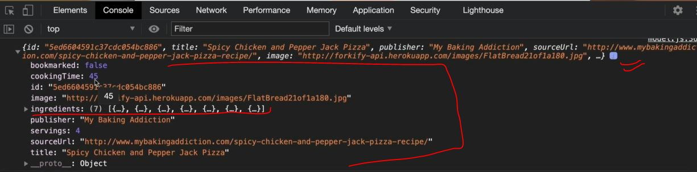
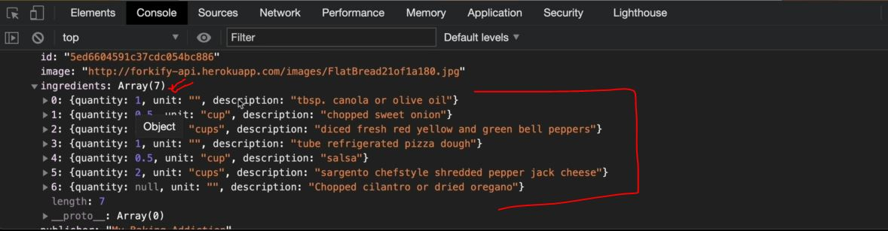
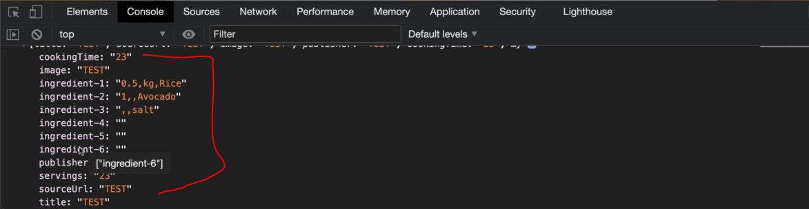
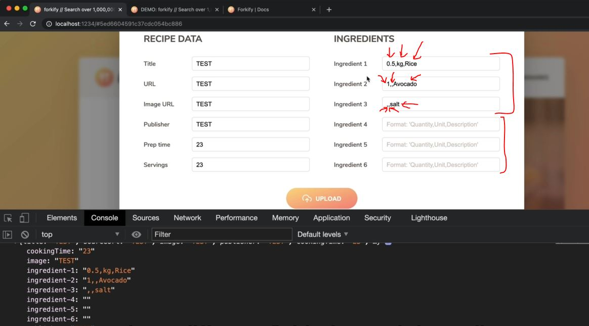
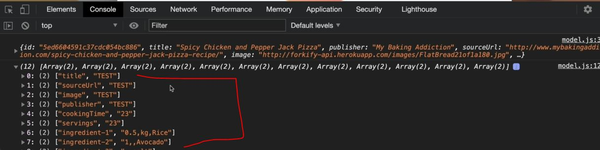
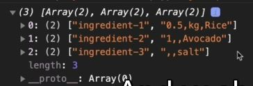
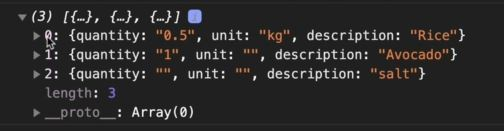
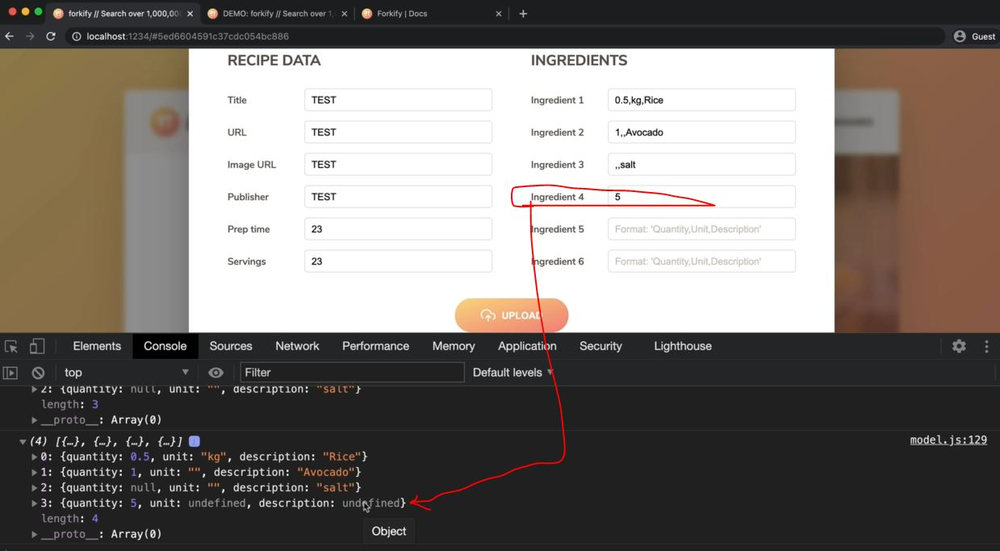
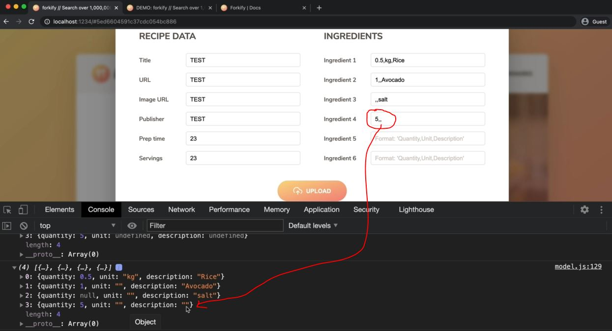

# Uploading a New Recipe - Part 2

- we'll implement a feature for sending the recipe data to the forkify API

## Steps - Uploading a New Recipe - Part 2

- `STEP 1` : inside model.js file , create a new function & export it
    ```js
    import { async } from 'regenerator-runtime' ;
    import { API_URL , RES_PER_PAGE } from '.config.js'
    import { getJSON } from './helpers.js'
            
    export const state = {
        recipe: {} , 
        search: {
            query: "" ,
            result: [] , 
            page: 1 , 
            resultsPerPage: RES_PER_PAGE, 
        } ,
        bookmarks: [] 
    }

    export const loadRecipe = async function(id) {  
        try {
            const data = await getJSON(`${API_URL}${id}`)

            const { recipe } = data.data 
            state.recipe = { 
                id:  recipe.id , 
                title: recipe.title, 
                publisher: recipe.publisher,
                sourceUrl: recipe.source_url ,
                image: recipe.image_url, 
                servings: recipe.servings, 
                cookingTime: recipe.cooking_time ,
                ingredients: recipe.ingredients
            }

            if (state.bookmarks.some(bookmark => bookmark.id === id)) {
                state.recipe.bookmarked = true
            } else {
                state.recipe.bookmarked = false
            }
            
            console.log(state.recipe) 
        } catch(err) {
            console.log(`${err} 💥💥💥`)
            throw err 
        }
    }

    export const loadSearchResults = async function() {
        try {
            state.search.query = query                
            const data = await getJSON(`${API_URL}?search=${query}`)

            state.search.results = data.data.recipes.map(rec => {
                return {
                    id:  rec.id , 
                    title: rec.title, 
                    publisher: rec.publisher,
                    image: rec.image_url, 
                }
            })

            state.search.page = 1 
        } catch(err) {
            console.log(`${err} 💥💥💥`)
            throw err 
        }
    }

    export const getSearchResultsPage = function(page = state.search.page) { 
        state.search.page = page

        const start = (page - 1) * state.search.resultsPerPage 
        const end = page * state.search.resultsPerPage
        return state.search.results.slice(start, end)
    }   

    const persistBookmarks = function() {
        localStorage.setItem("bookmarks", JSON.stringify(state.bookmarks))
    }

    export const addBookmark = function(recipe) {
        // add bookmark
        state.bookmarks.push(recipe)

        // Mark Current recipe as bookmarked
        if (recipe.id === state.recipe.id) {
            state.recipe.bookmarked = true
        }

        persistBookmarks()
    }

    export const deleteBookmark = function(id) {
        // Delete bookmark
        const index = state.bookmarks.findIndex(el => el.id === id)
        state.bookmarks.splice(index, 1)

        // Mark Current recipe as NOT bookmarked
        if (id === state.recipe.id) {
            state.recipe.bookmarked = false
        }

        persistBookmarks()
    }

    const init = function() {
        const storage = localStorage.getItem("bookmarks")
        if (storage) state.bookmarks = JSON.parse(storage)
    }
    init()

    const clearBookmarks = function() {
        localStorage.clear('bookmarks')
    }
    // clearBookmarks()

    export const uploadRecipe = async function(newRecipe) {

    }
    ```
    - now 1st task of this uploadRecipe function is to take the raw input data <br>
        & transform it into the same format as the data that we also get out of the API
    - output : click on `add Recipe` button then click on `upload` button , now see the console tab
        - the data that we'll get from the API is like this
            
            - here `ingredients` property are nicely stored inside an array like this
            
        - but the data which we got from model popup form , we have ingredients like in this form
            
            - & here value each of these ingredients , are separated by the comma inside a string
            - so we want all ingredients in an array & value of each ingredients as quantity , unit & description
        - now inside the modal popup form , we can see that 
            
            - so here we created 3 different fields for each ingredient
            - so one input field for quantity , the unit & description for 1st ingredient <br>
                & for 2nd ingredient , we leave the unit by comma because don't have & same with others
    - `STEP 1.1` : inside model.js file , creating an array of ingredients
        ```js
        // put code from STEP 1 before this code 

        export const uploadRecipe = async function(newRecipe) {
            console.log(Object.entries(newRecipe))
                // Object.entries() method is opposite of Object.fromEntries()
                    // Object.entries() method used to convert from a object into an array 💡💡💡
        }
        ```
    - `STEP 1.2` : inside controller.js file , creating a function to control a add recipe
        ```js
        import * as model from './model.js' 
        import recipeView from './views/recipeView.js'
        import searchView from './views/searchView.js'
        import resultsView from './views/resultsView.js'
        import paginationView from './views/paginationView.js'
        import bookmarksView from './views/bookmarksView.js'
        import addRecipeView from './views/addRecipeView.js'

        import 'core-js/stable' 
        import 'regenerator-runtime/runtime' 

        const timeout = function (s) => {
            return new Promise(function (_, reject) {
                setTimeout(function() {
                    reject(new Error(`Request took too long! Timeout after ${s} second`))
                }, s * 1000)
            })
        }

            const controlRecipe = async function() {
                try {
                    const id = window.location.hash.slice(1)

                    if (!id) return 
                    resultsView.renderSpinner()

                    // 0) update results view to mark selected search result
                    resultsView.render(model.getSearchResultsPage()) 

                    // 1 - updating bookmarks view
                    bookmarksView.update(model.state.bookmarks) 

                    // 2 - Loading recipe
                    await model.loadRecipe(id) 

                    // 3 - Rendering recipe
                    recipeView.render(model.state.recipe)
                } catch(err) {
                    recipeView.renderError() 
                }
            }

        const controlSearchResults = async function() {
            try {
                resultsView.renderSpinner()

                // 1) Get search query
                const query = searchView.getQuery()
                if (!query) return

                // 2) load search results
                await model.loadSearchResults(query) 

                // 3) Render results
                resultsView.render(model.getSearchResultsPage()) 

                // 4) render initial pagination buttons
                paginationView.render(model.state.search) 

            } catch(err) {
                console.log(err)
            }
        }

        const controlPagination = function(goToPage) { 
            // 1) Render NEW results
            resultsView.render(model.getSearchResultsPage(goToPage)) 

            // 2) render NEW  pagination buttons
            paginationView.render(model.state.search) 
        }

        const controlAddBookmark = function() {
            // 1) Add/remove bookmark
            if (!model.state.recipe.bookmarked) {
                model.addBookmark(model.state.recipe)
            } else (model.state.recipe.bookmarked) {
                model.deleteBookmark(model.state.recipe.id)
            }

            // 2) Update recipe view
            recipeView.update(model.state.recipe)

            // 3) Render bookmarks
            bookmarksView.render(model.state.bookmarks)
        }

        const controlBookmarks = function() {
            bookmarksView.render(model.state.bookmarks)
        }

        const controlAddRecipe = function(newRecipe) {
            // Upload the new recipe data
            model.uploadRecipe(newRecipe)
        }

        const init = function() {
            bookmarksView.addHandlerRender(controlBookmarks)
            recipeView.addHandlerRender(controlRecipes)
            recipeView.addHandlerUpdateServings(controlServings)
            recipeView.addHandlerAddBookmark(controlAddBookmark)
            searchView.addHandlerSearch(controlSearchResults)
            paginationView.addHandlerClick(controlPagination)
            addRecipeView.addHandlerUpload(controlAddRecipe) 
        }
        init()
        ```
        - output : click on `add recipe` & then click on `upload` button of model popup 
            - then we'll get an array like this 
            
        - now we only want those elements from this array which starts with `ingredients` key <br>
            & we're not interested on those ingredients which has empty value 

- `STEP 2` : inside model.js file , getting only those elements which has `ingredients` key
    - & those ingredients which has no empty value
    ```js
    // put code from STEP 1 before this code 

    export const uploadRecipe = async function(newRecipe) {
        const ingredients = Object.entries(newRecipe).filter(entry => {
            return entry[0].startsWith(ingredient) && entry[1] !== ""
        })        

        console.log(ingredients)
    }
    ```
    - output : click on `add recipe` & then click on `upload` button of model popup 
        - then we'll get only those ingredients based the condition <br>
        
        - now we need to take the data from this string value of these ingredients & put that into an object
    - `STEP 2.1` : inside model.js file , using map() array method
        ```js
        // put code from STEP 1 before this code 

        export const uploadRecipe = async function(newRecipe) {
            const ingredients = Object.entries(newRecipe).filter(entry => {
                return entry[0].startsWith(ingredient) && entry[1] !== ""
            }).map(ing => {

                    // here we replaced empty string & a white space also
                const [quantity, unit, description] = ing[1].replaceAll(" ", "").split(",")
                    // here using array destructuring 

                return {quantity, unit, description}
            })

            console.log(ingredients)
        }
        ```
        - output : click on `add recipe` & then click on `upload` button of model popup 
            - then we'll get the object for those each ingredients
            
            - now we want to set quantity to null if there's no quantity defined <br>
                & convert those quantity from string into number
    - `STEP 2.2` : inside model.js file ,  
        - set quantity to null if there's no quantity defined & convert those quantity from string into number
        ```js
        // put code from STEP 1 before this code 

        export const uploadRecipe = async function(newRecipe) {
            const ingredients = Object.entries(newRecipe).filter(entry => {
                return entry[0].startsWith(ingredient) && entry[1] !== ""
            }).map(ing => {

                const [quantity, unit, description] = ing[1].replaceAll(" ", "").split(",")

                return {quantity : quantity ? +quantity : null , unit, description}
                    // for empty string , we use null , not undefined 💡💡💡
            })

            console.log(ingredients)
        }
        ```
        - output : click on `add recipe` & then click on `upload` button of model popup 
            - then we'll get the object for those each ingredients 
            - but what if we add just `5` in ingredient 4 input field then we'll get this output like this
                
                - so here unit & description is undefined which we don't want <br>
            - but if we pass `5,,` in ingredient 4 input field then we'll get this output
                
                - so we got value of the unit & description keys in empty string
    - `STEP 2.3` : inside model.js file , refactoring the code & throwing the error if ingArr length is less than 3
        ```js
        // put code from STEP 1 before this code 

        export const uploadRecipe = async function(newRecipe) {
            const ingredients = Object.entries(newRecipe).filter(entry => {
                return entry[0].startsWith(ingredient) && entry[1] !== ""
            }).map(ing => {
                const ingArr = ing[1].replaceAll(" ", "").split(",")
                if (ingArr.length !== 3) {
                    throw new Error('Wrong ingredient format! Please use the correct format :)')
                        // if the condition is true then after this line code the function gets immediately exit 💡💡💡
                }

                const [quantity, unit, description] = ingArr

                return {quantity : quantity ? +quantity : null , unit, description}
            })

            console.log(ingredients)
        }
        ```
        - now if the error happened then we want to show that error when user click on `add recipe` button
    - `STEP 2.4` : inside controller.js file , getting the error from model.js file 
        ```js
        // put code from STEP 1.2 before this
                
        const controlAddRecipe = function(newRecipe) {
            // Upload the new recipe data
            model.uploadRecipe(newRecipe)
        }

        const init = function() {
            bookmarksView.addHandlerRender(controlBookmarks)
            recipeView.addHandlerRender(controlRecipes)
            recipeView.addHandlerUpdateServings(controlServings)
            recipeView.addHandlerAddBookmark(controlAddBookmark)
            searchView.addHandlerSearch(controlSearchResults)
            paginationView.addHandlerClick(controlPagination)
            addRecipeView.addHandlerUpload(controlAddRecipe) 
        }
        init()
        ```


    
✔️✔️✔️
💡💡💡
✅
🔥
