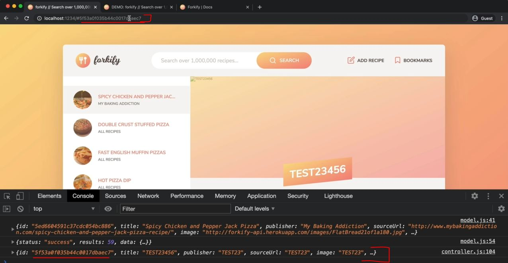
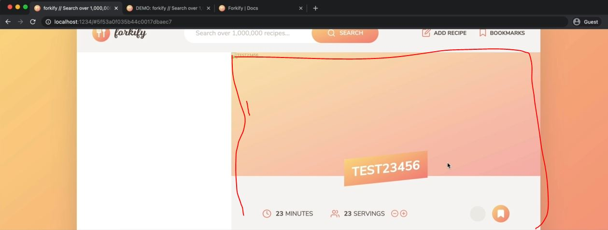
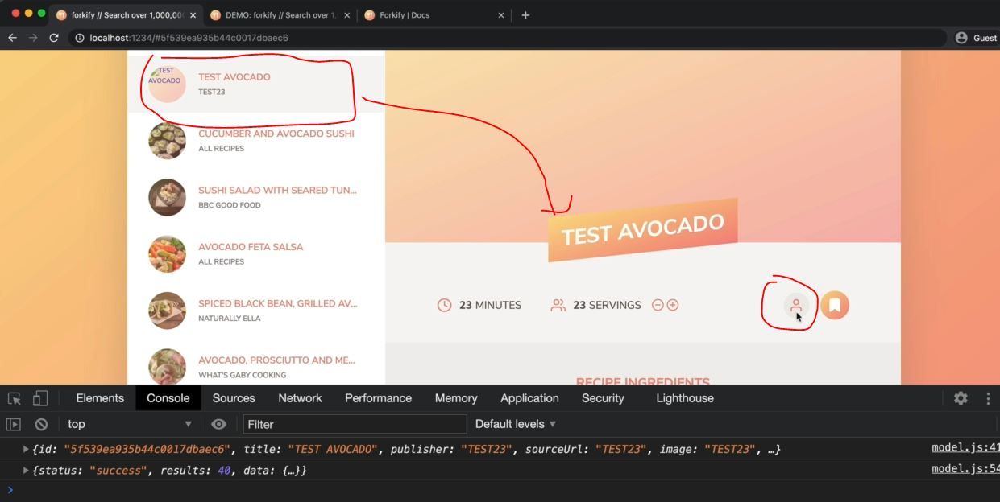
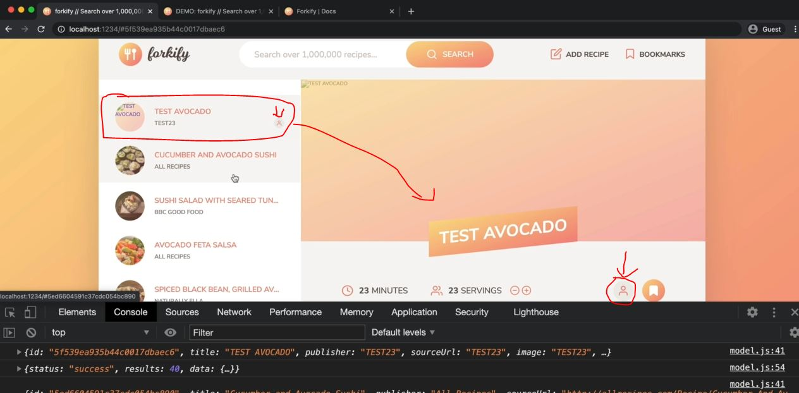
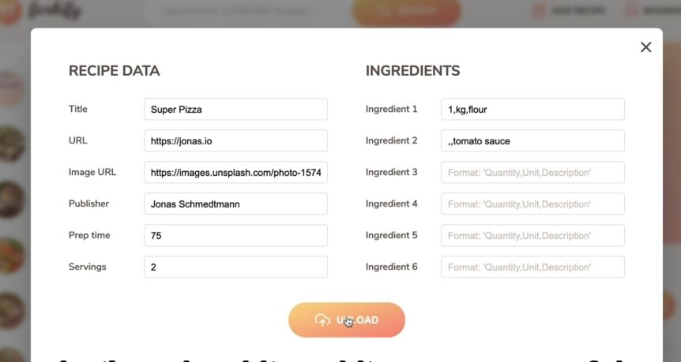
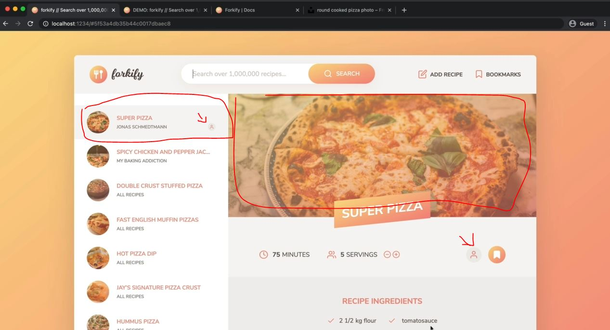

# Uploading a New Recipe - Part 3

- we'll implement the functionality of uploading or recipes
- `problem need to fix` : there're two things are missing from our controller 
    - click on `add recipe` button 
    - then on title input field , write `TEST AVOCADO`
    - now the movement we click on `upload` button then URL will not change based on that recipe id
    - & we need to remove success message popup
    - & inside bookmarks view panel , `TEST AVOCADO` recipe didn't added <br>
        but it's bookmark button , it's bookmarked but we didn't see inside bookmarks view panel
- so we need to fix 2 things
    - `1st problem` : we need to re-render the bookmarks view
    - `2nd problem` : we need to change the ID in the URL 
        - because even if we reload the page then still that URL with same ID will not change & on UI that old recipe will came back

## Steps - uploading a new recipe - Part 3

- `STEP 1` : inside controller.js file , uncomment the addRecipeView.toggleWindow() function
    - so that success popup will get removed after some minute
    ```js
    import * as model from './model.js' 
    import { MODAL_CLOSE_SEC } from './config.js'
    import recipeView from './views/recipeView.js'
    import searchView from './views/searchView.js'
    import resultsView from './views/resultsView.js'
    import paginationView from './views/paginationView.js'
    import bookmarksView from './views/bookmarksView.js'
    import addRecipeView from './views/addRecipeView.js'

    import 'core-js/stable' 
    import 'regenerator-runtime/runtime' 

    const timeout = function (s) => {
        return new Promise(function (_, reject) {
            setTimeout(function() {
                reject(new Error(`Request took too long! Timeout after ${s} second`))
            }, s * 1000)
        })
    }

    const controlRecipe = async function() {
        try {
            const id = window.location.hash.slice(1)

            if (!id) return 
            resultsView.renderSpinner()

            // 0) update results view to mark selected search result
            resultsView.render(model.getSearchResultsPage()) 

            // 1 - updating bookmarks view
            bookmarksView.update(model.state.bookmarks) 

            // 2 - Loading recipe
            await model.loadRecipe(id) 

            // 3 - Rendering recipe
            recipeView.render(model.state.recipe)
        } catch(err) {
            recipeView.renderError() 
        }
    }

    const controlSearchResults = async function() {
        try {
            resultsView.renderSpinner()

            // 1) Get search query
            const query = searchView.getQuery()
            if (!query) return

            // 2) load search results
            await model.loadSearchResults(query) 

            // 3) Render results
            resultsView.render(model.getSearchResultsPage()) 

            // 4) render initial pagination buttons
            paginationView.render(model.state.search) 

        } catch(err) {
            console.log(err)
        }
    }

    const controlPagination = function(goToPage) { 
        // 1) Render NEW results
        resultsView.render(model.getSearchResultsPage(goToPage)) 

        // 2) render NEW  pagination buttons
        paginationView.render(model.state.search) 
    }

    const controlAddBookmark = function() {
        // 1) Add/remove bookmark
        if (!model.state.recipe.bookmarked) {
            model.addBookmark(model.state.recipe)
        } else (model.state.recipe.bookmarked) {
            model.deleteBookmark(model.state.recipe.id)
        }

        // 2) Update recipe view
        recipeView.update(model.state.recipe)

        // 3) Render bookmarks
        bookmarksView.render(model.state.bookmarks)
    }

    const controlBookmarks = function() {
        bookmarksView.render(model.state.bookmarks)
    }
            
    const controlAddRecipe = async function(newRecipe) {
        try {
            // show loading spinner
            addRecipeView.renderSpinner()

            // Upload the new recipe data
            await model.uploadRecipe(newRecipe)
            console.log(model.state.recipe)

            // Render recipe
            recipeView.render(model.state.recipe)

            // Success message
            addRecipeView.renderMessage()

            // render bookmark view
            bookmarksView.render(model.state.bookmarks)
                // here we're not using update() function because we really want to insert a new element

            // close form window
            setTimeout(function() {
                addRecipeView.toggleWindow()
            }, MODAL_CLOSE_SEC * 1000) 

        } catch(err) {
            console.error(err)
            addRecipeView.renderError(err.message)
        }
    }

    const init = function() {
        bookmarksView.addHandlerRender(controlBookmarks)
        recipeView.addHandlerRender(controlRecipes)
        recipeView.addHandlerUpdateServings(controlServings)
        recipeView.addHandlerAddBookmark(controlAddBookmark)
        searchView.addHandlerSearch(controlSearchResults)
        paginationView.addHandlerClick(controlPagination)
        addRecipeView.addHandlerUpload(controlAddRecipe) 
    }
    init()
    ```
    - now we need to change the ID inside the URL , so for this , we'll use the history API means `window.history` 💡💡💡

- `STEP 2` : inside controller.js file , changing the hash id inside the URL
    ```js
    // put this code from STEP 1 before this 

    const controlAddRecipe = async function(newRecipe) {
        try {
            // show loading spinner
            addRecipeView.renderSpinner()

            // Upload the new recipe data
            await model.uploadRecipe(newRecipe)
            console.log(model.state.recipe)

            // Render recipe
            recipeView.render(model.state.recipe)

            // Success message
            addRecipeView.renderMessage()

            // render bookmark view
            bookmarksView.render(model.state.bookmarks)
                // here we're not using update() function because we really want to insert a new element

            // change ID in URL
            window.history.pushState(null, "" , `#${model.state.recipe.id}`)
                // pushState() method of history object , used to change the URL without reloading the page 💡💡💡
                    // it takes 3 arguments
                        // 1st argument - state
                            // if we don't want to specify -> state then set as null 
                        // 2nd argument - title
                            // if we don't want to specify -> title then set as "" empty string 
                        // 3rd argument - URL 💡💡💡             

                // we already did that we're going back & forward of browser button manually 
                    // but we can use -> window.history.back()

            // close form window
            setTimeout(function() {
                addRecipeView.toggleWindow()
            }, MODAL_CLOSE_SEC * 1000) 

        } catch(err) {
            console.error(err)
            addRecipeView.renderError(err.message)
        }
    }

    const init = function() {
        bookmarksView.addHandlerRender(controlBookmarks)
        recipeView.addHandlerRender(controlRecipes)
        recipeView.addHandlerUpdateServings(controlServings)
        recipeView.addHandlerAddBookmark(controlAddBookmark)
        searchView.addHandlerSearch(controlSearchResults)
        paginationView.addHandlerClick(controlPagination)
        addRecipeView.addHandlerUpload(controlAddRecipe) 
    }
    init()
    ```

- `STEP 3` : inside helpers.js file , refactoring the code of getJSON & setJSON functions 
    - because these both are almost same in terms of code , only fetch value is different 
    ```js
    import { async } from 'regenerator-runtime' 
    import { TIMEOUT_SEC } from './config.js'

    const timeout = function (s) => {
        return new Promise(function (_, reject) {
            setTimeout(function() {
                reject(new Error(`Request took too long! Timeout after ${s} second`))
            }, s * 1000)
        })
    }

    export const AJAX = async function(url, uploadData = undefined) {
        // here by-default we set value of uploadData as undefined
            // because when we call with only the URL then there's no upload data 💡💡💡
            // so we have to call fetchPro conditionally
        try {
            const fetchPro = uploadData ? fetch(url, {
                method: "POST" , 
                headers: { "Content-Type": 'application/json' }, 
                body: JSON.stringify(uploadData)
            }) : fetch(url)
                // here we didn't use if else statement because here we're using const -> keyword 
                    // & based on condition , value of fetchPro will be stored 
                
            const res = await Promise.race([fetchPro , timeout(TIMEOUT_SEC)])
            const data = await res.json()

            if (!res.ok) throw new Error(`${data.message} (${res.status})`)

            return data 
        } catch(err) {
            throw err
        }
    }
    ```
    - `STEP 3.1` : inside model.js file , importing AJAX async function of helpers.js file & calling it 
        ```js
        import { async } from 'regenerator-runtime' ;
        import { API_URL , RES_PER_PAGE } from '.config.js'
        // import { getJSON , sendJSON } from './helpers.js'
        import { AJAX } from './helpers.js'
                
        export const state = {
            recipe: {} , 
            search: {
                query: "" ,
                result: [] , 
                page: 1 , 
                resultsPerPage: RES_PER_PAGE, 
            } ,
            bookmarks: [] 
        }

        const createRecipeObject = function(data) {
            const { recipe } = data.data 
            return { 
                id:  recipe.id , 
                title: recipe.title, 
                publisher: recipe.publisher,
                sourceUrl: recipe.source_url ,
                image: recipe.image_url, 
                servings: recipe.servings, 
                cookingTime: recipe.cooking_time ,
                ingredients: recipe.ingredients,
                ...(recipe.key && { key : recipe.key })
            }
        }

        export const loadRecipe = async function(id) {  
            try {
                const data = await AJAX(`${API_URL}${id}`)

                state.recipe = createRecipeObject(data)

                if (state.bookmarks.some(bookmark => bookmark.id === id)) {
                    state.recipe.bookmarked = true
                } else {
                    state.recipe.bookmarked = false
                }
                
                console.log(state.recipe) 
            } catch(err) {
                console.log(`${err} 💥💥💥`)
                throw err 
            }
        }

        export const loadSearchResults = async function() {
            try {
                state.search.query = query                
                const data = await AJAX(`${API_URL}?search=${query}`)

                state.search.results = data.data.recipes.map(rec => {
                    return {
                        id:  rec.id , 
                        title: rec.title, 
                        publisher: rec.publisher,
                        image: rec.image_url, 
                    }
                })

                state.search.page = 1 
            } catch(err) {
                console.log(`${err} 💥💥💥`)
                throw err 
            }
        }

        export const getSearchResultsPage = function(page = state.search.page) { 
            state.search.page = page

            const start = (page - 1) * state.search.resultsPerPage 
            const end = page * state.search.resultsPerPage
            return state.search.results.slice(start, end)
        }   

        const persistBookmarks = function() {
            localStorage.setItem("bookmarks", JSON.stringify(state.bookmarks))
        }

        export const addBookmark = function(recipe) {
            // add bookmark
            state.bookmarks.push(recipe)

            // Mark Current recipe as bookmarked
            if (recipe.id === state.recipe.id) {
                state.recipe.bookmarked = true
            }

            persistBookmarks()
        }

        export const deleteBookmark = function(id) {
            // Delete bookmark
            const index = state.bookmarks.findIndex(el => el.id === id)
            state.bookmarks.splice(index, 1)

            // Mark Current recipe as NOT bookmarked
            if (id === state.recipe.id) {
                state.recipe.bookmarked = false
            }

            persistBookmarks()
        }

        const init = function() {
            const storage = localStorage.getItem("bookmarks")
            if (storage) state.bookmarks = JSON.parse(storage)
        }
        init()

        const clearBookmarks = function() {
            localStorage.clear('bookmarks')
        }

        export const uploadRecipe = async function(newRecipe) {
            try {
                const ingredients = Object.entries(newRecipe).filter(entry => {
                    return entry[0].startsWith(ingredient) && entry[1] !== ""
                }).map(ing => {
                    const ingArr = ing[1].replaceAll(" ", "").split(",")
                    if (ingArr.length !== 3) {
                        throw new Error('Wrong ingredient format! Please use the correct format :)')
                    }

                    const [quantity, unit, description] = ingArr

                    return {quantity : quantity ? +quantity : null , unit, description}
                })

                const recipe = {
                    title: newRecipe.title ,
                    source_url: newRecipe.sourceUrl,
                    image_url: newRecipe.image ,
                    publisher: newRecipe.publisher,
                    cooking_time: +newRecipe.cookingTime,
                    servings: +newRecipe.servings,
                    ingredients,
                }

                const data = await AJAX(`${API_URL}?key=${KEY}`, recipe)
                state.recipe = createRecipeObject(data)
                addBookmark(state.recipe)
            } catch(err) {
                throw err
            }
        }
        ```
        - output : search pizza then click on `add recipe` button 
            - now inside title input field , write `TEST23456` , now just focus on hash ID of URL , so click on `upload` button 
            - so now Hash id of URL gets changed based on that newly created recipe like this
                
                - so hash id of URL is same as the id we got in console 
            - now that recipe also added inside bookmarks view panel & also that recipe is added on right side of the UI 
            - now when we reload the page then we'll get that newly created recipe on right side of the UI like this
                
    - now let's use the API key in order to mark this recipe as our own recipe by displaying a small person icon <br>
        so for this we need to attach our API key with all the API queries 💡💡💡 <br>
        so check this API website for how to apply API key because it's depends on API author

- `STEP 4` : inside model.js file , marking our own recipe by displaying a small person icon
    - while loading search results
    ```js
    import { async } from 'regenerator-runtime' ;
    import { API_URL , RES_PER_PAGE } from '.config.js'
    import { AJAX } from './helpers.js'
            
    export const state = {
        recipe: {} , 
        search: {
            query: "" ,
            result: [] , 
            page: 1 , 
            resultsPerPage: RES_PER_PAGE, 
        } ,
        bookmarks: [] 
    }

    const createRecipeObject = function(data) {
        const { recipe } = data.data 
        return { 
            id:  recipe.id , 
            title: recipe.title, 
            publisher: recipe.publisher,
            sourceUrl: recipe.source_url ,
            image: recipe.image_url, 
            servings: recipe.servings, 
            cookingTime: recipe.cooking_time ,
            ingredients: recipe.ingredients,
            ...(recipe.key && { key : recipe.key })
        }
    }

    export const loadRecipe = async function(id) {  
        try {
            const data = await AJAX(`${API_URL}${id}&key=${KEY}`)

            state.recipe = createRecipeObject(data)

            if (state.bookmarks.some(bookmark => bookmark.id === id)) {
                state.recipe.bookmarked = true
            } else {
                state.recipe.bookmarked = false
            }
            
            console.log(state.recipe) 
        } catch(err) {
            console.log(`${err} 💥💥💥`)
            throw err 
        }
    }

    export const loadSearchResults = async function() {
        try {
            state.search.query = query                
            // const data = await AJAX(`${API_URL}?search=${query}?key=${KEY}`)
                // but here we can't put again ? -> question mark sign because we already have the parameter 
                    // so we need to put & -> ampersand sign
            const data = await AJAX(`${API_URL}?search=${query}&key=${KEY}`)
                // now adding this API key for search results , then it should load all the recipes
                    // including that recipe which contain our own Key
                // means if we search avocado which exist in the bookmarks view panel 
                    // so if we search it , then it should show the avocado 
                        // on the top which we created by the user 💡💡💡
                // so we need to mark our own recipe on left side UI & on right side UI also 
                    // & that recipe will be shown which is created by you based on your own API key
                    // because your recipe is linked with your API key 💡💡💡

            state.search.results = data.data.recipes.map(rec => {
                return {
                    id:  rec.id , 
                    title: rec.title, 
                    publisher: rec.publisher,
                    image: rec.image_url, 
                }
            })

            state.search.page = 1 
        } catch(err) {
            console.log(`${err} 💥💥💥`)
            throw err 
        }
    }

    export const getSearchResultsPage = function(page = state.search.page) { 
        state.search.page = page

        const start = (page - 1) * state.search.resultsPerPage 
        const end = page * state.search.resultsPerPage
        return state.search.results.slice(start, end)
    }   

    const persistBookmarks = function() {
        localStorage.setItem("bookmarks", JSON.stringify(state.bookmarks))
    }

    export const addBookmark = function(recipe) {
        // add bookmark
        state.bookmarks.push(recipe)

        // Mark Current recipe as bookmarked
        if (recipe.id === state.recipe.id) {
            state.recipe.bookmarked = true
        }

        persistBookmarks()
    }

    export const deleteBookmark = function(id) {
        // Delete bookmark
        const index = state.bookmarks.findIndex(el => el.id === id)
        state.bookmarks.splice(index, 1)

        // Mark Current recipe as NOT bookmarked
        if (id === state.recipe.id) {
            state.recipe.bookmarked = false
        }

        persistBookmarks()
    }

    const init = function() {
        const storage = localStorage.getItem("bookmarks")
        if (storage) state.bookmarks = JSON.parse(storage)
    }
    init()

    const clearBookmarks = function() {
        localStorage.clear('bookmarks')
    }

    export const uploadRecipe = async function(newRecipe) {
        try {
            const ingredients = Object.entries(newRecipe).filter(entry => {
                return entry[0].startsWith(ingredient) && entry[1] !== ""
            }).map(ing => {
                const ingArr = ing[1].replaceAll(" ", "").split(",")
                if (ingArr.length !== 3) {
                    throw new Error('Wrong ingredient format! Please use the correct format :)')
                }

                const [quantity, unit, description] = ingArr

                return {quantity : quantity ? +quantity : null , unit, description}
            })

            const recipe = {
                title: newRecipe.title ,
                source_url: newRecipe.sourceUrl,
                image_url: newRecipe.image ,
                publisher: newRecipe.publisher,
                cooking_time: +newRecipe.cookingTime,
                servings: +newRecipe.servings,
                ingredients,
            }

            const data = await AJAX(`${API_URL}?key=${KEY}`, recipe)
            state.recipe = createRecipeObject(data)
            addBookmark(state.recipe)
        } catch(err) {
            throw err
        }
    }
    ```

- `STEP 5` : inside recipeView.js file , marking our own recipe icon 
    ```js
    import View from './View.js'

    import icons from 'url:../../img/icons.svg' 
    import { Fraction }  from 'fractional' 

    class RecipeView extends View {
        _parentElement = document.querySelector('.btn') ;
        _errorMessage = "we could not find that recipe. Please try another one!" ;
        _message = "";

        addHandlerRender(handler) {
            ['hashchange', 'load'].forEach((e) => window.addEventListener(e , handler))
        }

        addHandlerUpdateServings(handler) {
            this._parentElement.addEventListener('click' , function(e) {
                const btn = e.target.closest('.btn--update-servings')
                if (!btn) return 
                const { updateTo } = btn.dataset
                if (+updateTo > 0) handler(+updateTo) 
            })
        }

        addHandlerAddBookmark(handler) {
            this._parentElement.addEventListener('click' , function(e) {
                const btn = e.target.closest('.btn--update-servings')
                if (!btn) return 
                handler()
            })
        }

        _generateMarkup() {
            return `
                <figure class="recipe__fig">
                    
                    <h1 class="recipe__title">
                      <span>${this._data.title}</span>
                    </h1>
                </figure>

                <div class="recipe__details">
                    <div class="recipe__info">
                        <svg class="recipe__info-icon"><use href="${icons}#icon-clock"></use></svg>
                        <span class="recipe__info-data recipe__info-data--minutes">${this._data.cookingTime}</span>
                        <span class="recipe__info-text">minutes</span>
                    </div>
                    <div class="recipe__info">
                        <svg class="recipe__info-icon"><use href="${icons}#icon"></use></svg>
                        <span class="recipe__info-data recipe__info-data--people">${this._data.servings}</span>
                        <span class="recipe__info-text">servings</span>

                        <div class="recipe__info-buttons">
                            <button class="btn--tiny btn--update-servings" data-update-to="${this._data.servings - 1}">
                              <svg><use href="${icons}#icon-minus-circle"></use></svg>
                            </button>
                            <button class="btn--tiny btn--update-servings" data-update-to="${this._data.servings + 1}">
                              <svg><use href="${icons}#icon-plus-circle"></use></svg>
                            </button>
                        </div>
                    </div>

                    <div class="recipe__user-generated ${this._data.key ? "" : "hidden"}">
                        <svg><use href="${icons}#icon-user"></use></svg>
                    </div>
                    <button class="btn--round btn-bookmark">
                        <svg class=""><use href="${icons}#icon-bookmark${this._data.bookmarked ? '-fill' : ""}"></use></svg>
                    </button>
                </div>

                <div class="recipe__ingredients">
                    <h2 class="heading--2">Recipe ingredients</h2>
                    <ul class="recipe__ingredient-list">
                        ${this._data.ingredients.map(this._generateMarkupIngredient).join('')}
                    </ul>
                </div>

                <div class="recipe__directions">
                    <h2 class="heading--2">How to cook it</h2>
                    <p class="recipe__directions-text">
                        This recipe was carefully designed and tested by
                        <span class="recipe__publisher">${this._data.publisher}</span>. Please check out
                        directions at their website.
                    </p>
                    <a class="btn--small recipe__btn" href="${this._data.sourceUrl}"target="_blank">
                    <span>Directions</span>
                    <svg class="search__icon"><use href="${icons}#icon-arrow-right"></use></svg>
                  </a>
                </div>
            ` ;
        }

        _generateMarkupIngredient(ing) {
            return `
                <li class="recipe__ingredient">
                    <svg class="recipe__icon"><use href="${icons}#icon-check"></use></svg>
                    <div class="recipe__quantity">${ing.quantity ? Fraction(ing.quantity).toString() : ""}</div>
                    <div class="recipe__description">
                        <span class="recipe__unit">${ing.unit}</span>
                        ${ing.description}
                    </div>
                </li>
            `
        }
    }
    ```
    - `<div class="recipe__user-generated ${this._data.key ? "" : "hidden"}"><svg><use href="${icons}#icon-user"></use></svg></div>`
        - means if there's a key then we want to add no class at all but there's is a key then add the hidden class
    - let's do same thing in previewView.js file 
    - `STEP 5.1` : inside previewView.js file , adding hidden class if there's a key
        - & refactoring code for adding hidden class
        ```js
        import View from './View.js'
        import icons from 'url:../../img/icons.svg' 

        class PreviewView extends View {
            _parentElement = "" // we don't need parent element 

            _generateMarkup(result) {
                const id = window.location.hash.slice(1) // getting first element

                return ` 
                    <li class="preview">
                        <a class="preview__link ${this._data.id === id ? 'preview__link--active' : ''}" href="#${this._data.id}">
                            <figure class="preview__fig">
                                
                            </figure>
                            <div class="preview__data">
                                <h4 class="preview__title">${this._data.title}</h4>
                                <p class="preview__publisher">${this._data.publisher}</p>
                                <div class="preview__user-generated ${this._data.key ? "" : "hidden"}">
                                    <svg><use href="${icons}#icon-user"></use></svg>
                                </div>
                            </div>
                        </a>
                    </li>
                `
            }
        }

        export default new PreviewView() 
        ```
        - output : now search `avocado` again
            - then we'll get that newly created recipe on left side of UI & on right side section with person icon also like this
                
            - but if we click on a other recipe then it doesn't contain that person icon
        - right now , on left side , that newly recipe doesn't have that person icon <br>
            because we never added the key of that item inside the search data 
    - `STEP 5.2` : inside model.js file , return the key from state.search.results of loadSearchResults() async function
        ```js
        import { async } from 'regenerator-runtime' ;
        import { API_URL , RES_PER_PAGE } from '.config.js'
        import { AJAX } from './helpers.js'
                
        export const state = {
            recipe: {} , 
            search: {
                query: "" ,
                result: [] , 
                page: 1 , 
                resultsPerPage: RES_PER_PAGE, 
            } ,
            bookmarks: [] 
        }

        const createRecipeObject = function(data) {
            const { recipe } = data.data 
            return { 
                id:  recipe.id , 
                title: recipe.title, 
                publisher: recipe.publisher,
                sourceUrl: recipe.source_url ,
                image: recipe.image_url, 
                servings: recipe.servings, 
                cookingTime: recipe.cooking_time ,
                ingredients: recipe.ingredients,
                ...(recipe.key && { key : recipe.key })
            }
        }

        export const loadRecipe = async function(id) {  
            try {
                const data = await AJAX(`${API_URL}${id}&key=${KEY}`)

                state.recipe = createRecipeObject(data)

                if (state.bookmarks.some(bookmark => bookmark.id === id)) {
                    state.recipe.bookmarked = true
                } else {
                    state.recipe.bookmarked = false
                }
                
                console.log(state.recipe) 
            } catch(err) {
                console.log(`${err} 💥💥💥`)
                throw err 
            }
        }

        export const loadSearchResults = async function() {
            try {
                state.search.query = query                
                const data = await AJAX(`${API_URL}?search=${query}&key=${KEY}`)

                state.search.results = data.data.recipes.map(rec => {
                    return {
                        id:  rec.id , 
                        title: rec.title, 
                        publisher: rec.publisher,
                        image: rec.image_url,
                        ...(rec.key && { key : rec.key }) 
                    }
                })

                state.search.page = 1 
            } catch(err) {
                console.log(`${err} 💥💥💥`)
                throw err 
            }
        }

        export const getSearchResultsPage = function(page = state.search.page) { 
            state.search.page = page

            const start = (page - 1) * state.search.resultsPerPage 
            const end = page * state.search.resultsPerPage
            return state.search.results.slice(start, end)
        }   

        const persistBookmarks = function() {
            localStorage.setItem("bookmarks", JSON.stringify(state.bookmarks))
        }

        export const addBookmark = function(recipe) {
            // add bookmark
            state.bookmarks.push(recipe)

            // Mark Current recipe as bookmarked
            if (recipe.id === state.recipe.id) {
                state.recipe.bookmarked = true
            }

            persistBookmarks()
        }

        export const deleteBookmark = function(id) {
            // Delete bookmark
            const index = state.bookmarks.findIndex(el => el.id === id)
            state.bookmarks.splice(index, 1)

            // Mark Current recipe as NOT bookmarked
            if (id === state.recipe.id) {
                state.recipe.bookmarked = false
            }

            persistBookmarks()
        }

        const init = function() {
            const storage = localStorage.getItem("bookmarks")
            if (storage) state.bookmarks = JSON.parse(storage)
        }
        init()

        const clearBookmarks = function() {
            localStorage.clear('bookmarks')
        }

        export const uploadRecipe = async function(newRecipe) {
            try {
                const ingredients = Object.entries(newRecipe).filter(entry => {
                    return entry[0].startsWith(ingredient) && entry[1] !== ""
                }).map(ing => {
                    const ingArr = ing[1].replaceAll(" ", "").split(",")
                    if (ingArr.length !== 3) {
                        throw new Error('Wrong ingredient format! Please use the correct format :)')
                    }

                    const [quantity, unit, description] = ingArr

                    return {quantity : quantity ? +quantity : null , unit, description}
                })

                const recipe = {
                    title: newRecipe.title ,
                    source_url: newRecipe.sourceUrl,
                    image_url: newRecipe.image ,
                    publisher: newRecipe.publisher,
                    cooking_time: +newRecipe.cookingTime,
                    servings: +newRecipe.servings,
                    ingredients,
                }

                const data = await AJAX(`${API_URL}?key=${KEY}`, recipe)
                state.recipe = createRecipeObject(data)
                addBookmark(state.recipe)
            } catch(err) {
                throw err
            }
        }
        ```
        - output : search `avocado` & hit Enter key 
            - then we'll get the person icon on that newly created recipe on left side as well as on right side UI
            
        - output : after filling this model form popup with this detail like this
            
            - now we'll get the image also because we specified the image url also ✔️
            - so click on `upload` button then we'll get the loading spinner for sometime <br>
                & then we'll get success popup message
            - so ultimately the output look like this , so search for super pizza then hit Enter key
                
        - but here in this output , we have small bug i.e `tomatosauce` , here we don't have a space
    - `STEP 5.3` : inside model.js file , put the space b/w tomatosauce recipe ingredient of super pizza recipe
        - & for other recipe also 
        ```js
        // put code from STEP 5.2 before this 

        export const uploadRecipe = async function(newRecipe) {
            try {
                const ingredients = Object.entries(newRecipe).filter(entry => {
                    return entry[0].startsWith(ingredient) && entry[1] !== ""
                }).map(ing => {
                    // const ingArr = ing[1].replaceAll(" ", "").split(",")
                        // here we don't want to remove space b/w two words or letters 
                            // so we'll use trim() string method
                    const ingArr = ing[1].split(",").map(el  => el.trim())

                    if (ingArr.length !== 3) {
                        throw new Error('Wrong ingredient format! Please use the correct format :)')
                    }

                    const [quantity, unit, description] = ingArr

                    return {quantity : quantity ? +quantity : null , unit, description}
                })

                const recipe = {
                    title: newRecipe.title ,
                    source_url: newRecipe.sourceUrl,
                    image_url: newRecipe.image ,
                    publisher: newRecipe.publisher,
                    cooking_time: +newRecipe.cookingTime,
                    servings: +newRecipe.servings,
                    ingredients,
                }

                const data = await AJAX(`${API_URL}?key=${KEY}`, recipe)
                state.recipe = createRecipeObject(data)
                addBookmark(state.recipe)
            } catch(err) {
                throw err
            }
        }
        ```
