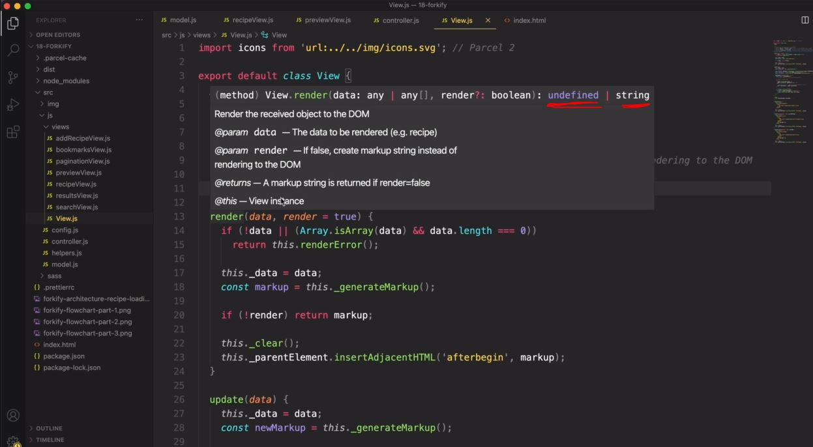
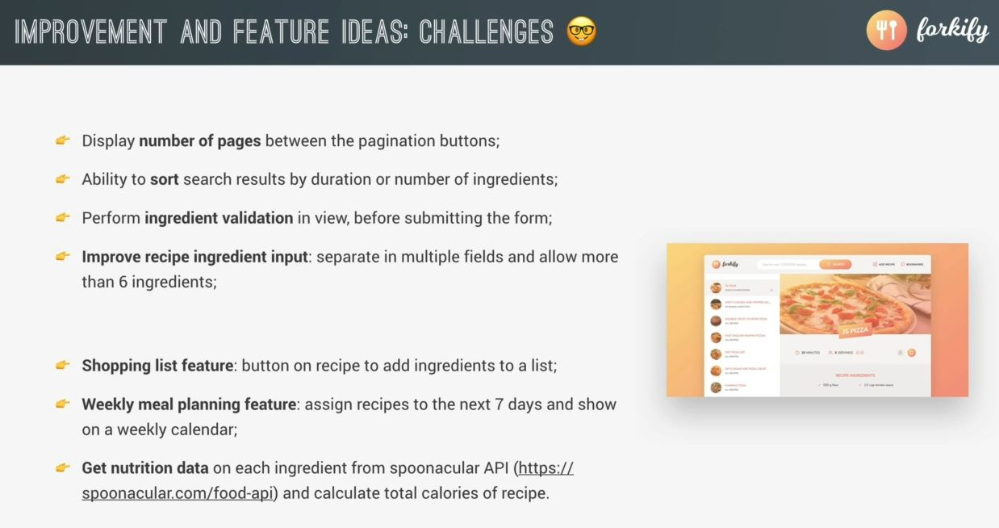

# Wrapping Up - Final Considerations

- we'll see how we can write documentation for functions in order to make understandable for other people 💡💡💡
- and talk about features , improvements for this application if you want to practice

## Steps - writing documentation for the Javascript apps

- there's a standard way of writing documentation for only javascript functions i.e JSDocs . for check this https://jsdoc.app/ 

- `STEP 1` : let's choose View.js file & now inside of it , inside `View` class
- `STEP 2` : inside `View` class , 
    - for multiline comment do this `/*` then again put second star like this `/**` then we'll get JSDoc comment , press tab
    ```js
    import icons from 'url:../../img/icons.svg' 

    export default class View {
        _data ; 

        /**
         * 
         * @param {*} data
         * @return {*} render
         */
        render(data, render = true) {
            this._data = data
            const markup = this._generateMarkup()
            if (!render) return markup
            this._clear()
            this._parentElement.insertAdjacentHTML('afterbegin', markup)
        }

        update(data) {
            if (!data || (Array.isArray(data) && data.length === 0)) return this.renderError()
            this._data = data
            const newMarkup = this._generateMarkup()
            const newDOM = document.createRange().createContextualFragment(newMarkup)
            const newElements = Array.from(newDOM.querySelectorAll("*")) 
            const curElements = Array.from(this._parentElement.querySelectorAll("*"))

            newElements.forEach((newEl, i) => {
                const curEl = curElements[i]
                console.log(curEl , newEl.isEqualNode(curEl))

                // Updates changed TEXT
                if (!newEl.isEqualNode(curEl) && newEl.firstChild?.nodeValue.trim() !== "") {
                    curEl.innerText = newEl.innerText
                }

                // Updates changed ATTRIBUTES
                if (!newEl.isEqualNode(curEl)) {
                    Array.from(newEl.attributes).forEach(attr => {
                        curEl.setAttribute(att.name, attr.value)
                    })
                }
            })
        }

        _clear() {
            this._parentElement.innerHTML = '' 
        }

        renderSpinner() { 
            const markup = `<div class="spinner"><svg><use href="${icons}_icon-loader"></use></svg></div>`
            this._clear()
            this._parentElement.insertAdjacentHTML('afterbegin', markup)
        }

        renderError(message = this._errorMessage) {
            const markup = `
                <div class="error">
                    <div><svg><use href="${icons}_icon-alert-triangle"></use></svg></div>
                    <p>${message}</p>
                </div> 
            `

            this._clear()
            this._parentElement.insertAdjacentHTML('afterbegin', markup)
        }

        renderMessage(message = this._message) {
            const markup = `
                <div class="message">
                    <div><svg><use href="${icons}_icon-smile"></use></svg></div>
                    <p>${message}</p>
                </div> 
            `

            this._clear()
            this._parentElement.insertAdjacentHTML('afterbegin', markup)
        }
    }
    ```
- `STEP 3` : let's write more inside that js docs comment
    ```js
    import icons from 'url:../../img/icons.svg' 

    export default class View {
        _data ; 

        /**
         * Render the received object to the DOM
         * @param {Object | Object[]} data The data to be rendered (e.g. recipe)
         * @param {boolean} [render=true] If false , create markup string instead of rendering to the DOM
         */

        // now inside curl braces , we describe the data
            // here , for first param
                // Object | Object[] --> means we need object & then we use OR symbol as per JSDocs said 
                    // & then we specify an array of objects
                // & after that , data -> is a name of the parameter
                    // & if you want to write short description of that parameter 
                    // then we can write after that parameter name 💡💡💡
            // for second param
                // we define type of that render parameter as boolean
                // render -> parameter is optional , that's why we putted inside an square bracket like this [render]
                    // or we can specify default value like this [render=true] 💡💡💡

        render(data, render = true) {
            this._data = data
            const markup = this._generateMarkup()
            if (!render) return markup
            this._clear()
            this._parentElement.insertAdjacentHTML('afterbegin', markup)
        }

        // put other code after this above render() function
    }
    ```
    - advantages of using JS Docs for documentation
        - `1` : if you're working with someone else with your project 
            - then we can easily understand about that function & what it's doing 
        - `2` : after writing JS Docs for that function then if we hover on that function 
            - like here if hover on render() function then we'll get this overview like this 
            
- `STEP 4` : let's add more param instead of just description of these parameters
    - so we can write what that function returns
    ```js
    import icons from 'url:../../img/icons.svg' 

    export default class View {
        _data ; 

        /**
         * Render the received object to the DOM
         * @param {Object | Object[]} data The data to be rendered (e.g. recipe)
         * @param {boolean} [render=true] If false , create markup string instead of rendering to the DOM
         * @returns {undefined | string} A markup string is returned if render=false
         * @this View object
         */
            // so we define @returns -> means what render() function return
                // so right now it doesn't return anything but in future might be it return string 
                // & then we wrote this description 💡💡💡
            // we define @this -> means here we define this -> keyword
                // & this -> keyword point to View -> object 
                // & then we wrote description i.e object

        render(data, render = true) {
            this._data = data
            const markup = this._generateMarkup()
            if (!render) return markup
            this._clear()
            this._parentElement.insertAdjacentHTML('afterbegin', markup)
        }

        // put other code after this above render() function
    }
    ```
    - now when we hover on render() function then we'll get object -> as description which we don't want <br>
        so let's define the datatype like this
        ```js
        import icons from 'url:../../img/icons.svg' 

        export default class View {
            _data ; 

            /**
             * Render the received object to the DOM
             * @param {Object | Object[]} data The data to be rendered (e.g. recipe)
             * @param {boolean} [render=true] If false , create markup string instead of rendering to the DOM
             * @returns {undefined | string} A markup string is returned if render=false
             * @this {object} View instance
             */

            render(data, render = true) {
                this._data = data
                const markup = this._generateMarkup()
                if (!render) return markup
                this._clear()
                this._parentElement.insertAdjacentHTML('afterbegin', markup)
            }

            // put other code after this above render() function
        }
        ```
        - now when we hover on render() function then we'll get this
            
            - so we can see this function is going to return either undefined or a string

- `STEP 5` : using `@author`
    ```js
    import icons from 'url:../../img/icons.svg' 

    export default class View {
        _data ; 

        /**
         * Render the received object to the DOM
         * @param {Object | Object[]} data The data to be rendered (e.g. recipe)
         * @param {boolean} [render=true] If false , create markup string instead of rendering to the DOM
         * @returns {undefined | string} A markup string is returned if render=false
         * @this {object} View instance
         * @author Jonas
         */
            // here we define Jonas as author name

        render(data, render = true) {
            this._data = data
            const markup = this._generateMarkup()
            if (!render) return markup
            this._clear()
            this._parentElement.insertAdjacentHTML('afterbegin', markup)
        }

        // put other code after this above render() function
    }
    ```

- `STEP 6` : using @todo
    ```js
    import icons from 'url:../../img/icons.svg' 

    export default class View {
        _data ; 

        /**
         * Render the received object to the DOM
         * @param {Object | Object[]} data The data to be rendered (e.g. recipe)
         * @param {boolean} [render=true] If false , create markup string instead of rendering to the DOM
         * @returns {undefined | string} A markup string is returned if render=false
         * @this {object} View instance
         * @author Jonas
         * @todo finish implementation
         */

            // & to end the JSDocs , we use @todo

        render(data, render = true) {
            this._data = data
            const markup = this._generateMarkup()
            if (!render) return markup
            this._clear()
            this._parentElement.insertAdjacentHTML('afterbegin', markup)
        }

        // put other code after this above render() function
    }
    ```
    - so you can add these params on a function , so that when you come back after 1 or 5 years then you can understand it 
    - & these are major ones to define a function 

## ideas for features & improvements of this app (practice it)

- so we'll go from easy features to complex one


- Easy features 
    - `1` : display number of pages b/w the pagination buttons
        - so that user would immediately know how many pages there are for user friendly
    - `2` : ability to sort search results by duration or number of ingredients
        - add the ability for the user to sort the search results by the duration or by the number of ingredients of the found recipes
        - However , the data is not available on the search results unless i do some changes to the API <br>
            so implement this otherwise you have to get this information for all of the recipes in the search results <br>
            but that would require quite a lot of work & also a lot of API calls
    - `3` : Perform ingredient validation in view , before submitting the form
        - Eg : while the user is inputting the ingredients , you could warn the ahead of time <br>
            like the format is wrong which will make user friendly
    - `4` : improve recipe ingredient input : separate in multiple fields & allow more than 6 ingredients 
        - so maybe you could actually improve the input of the ingredients
        - so instead of having the quantity unit & description all in one field , <br>
            you could add a different field for these three data points & then read all that data into your application
        - & besides that , you could also allow for more than six ingredients . like there's a lot of improvements <br>
            like @recipe functionality

- complex feature
    - `1` : shopping list feature : button on recipe to add ingredients to a list
        - on left side of UI , on each recipe , you could have a button <br>
            which can be used to add all the ingredients of that recipe just kind-of list <br>
            & so , you could then display that list like on the UI , in another hidden panel in the menu bar the bookmarks
        - so that list would contain all the ingredients that you might add from different recipes
    - `2` : weekly meal planning feature
        - for this one you could add like a drop down menu to each of the recipes 
        - & from there , choose which of the next 7 days , you want to assign that recipe to
        - & then , in the menu bar , you could again have like a panel which shows the next 7 days & then which of the recipes was assigned to each day
    - `3` : get nutrition data
        - get each ingredient from spoonacular API
        - & for each of the ingredients , get the calories & then you could calculate the total calories of one recipe <br>
            & maybe also per serving
