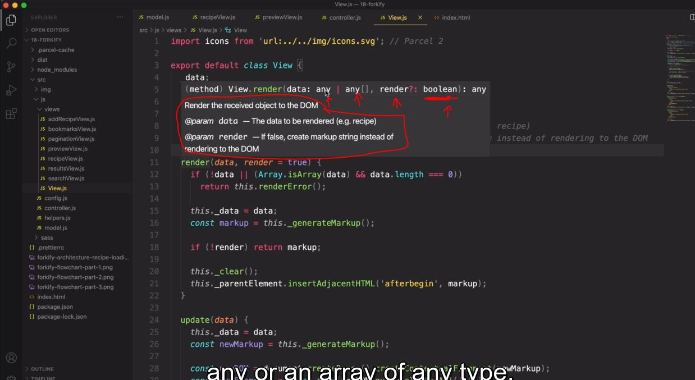

# Wrapping Up - Final Considerations

- we'll see how we can write documentation for functions in order to make understandable for other people 💡💡💡
- and talk about features , improvements for this application if you want to practice

## Steps - writing documentation for the Javascript apps

- there's a standard way of writing documentation for only javascript functions i.e JSDocs . for check this https://jsdoc.app/ 

- `STEP 1` : let's choose View.js file & now inside of it , inside `View` class
- `STEP 2` : inside `View` class , 
    - for multiline comment do this `/*` then again put second star like this `/**` then we'll get JSDoc comment , press tab
    ```js
    import icons from 'url:../../img/icons.svg' 

    export default class View {
        _data ; 

        /**
         * 
         * @param {*} data
         * @return {*} render
         */
        render(data, render = true) {
            this._data = data
            const markup = this._generateMarkup()
            if (!render) return markup
            this._clear()
            this._parentElement.insertAdjacentHTML('afterbegin', markup)
        }

        update(data) {
            if (!data || (Array.isArray(data) && data.length === 0)) return this.renderError()
            this._data = data
            const newMarkup = this._generateMarkup()
            const newDOM = document.createRange().createContextualFragment(newMarkup)
            const newElements = Array.from(newDOM.querySelectorAll("*")) 
            const curElements = Array.from(this._parentElement.querySelectorAll("*"))

            newElements.forEach((newEl, i) => {
                const curEl = curElements[i]
                console.log(curEl , newEl.isEqualNode(curEl))

                // Updates changed TEXT
                if (!newEl.isEqualNode(curEl) && newEl.firstChild?.nodeValue.trim() !== "") {
                    curEl.innerText = newEl.innerText
                }

                // Updates changed ATTRIBUTES
                if (!newEl.isEqualNode(curEl)) {
                    Array.from(newEl.attributes).forEach(attr => {
                        curEl.setAttribute(att.name, attr.value)
                    })
                }
            })
        }

        _clear() {
            this._parentElement.innerHTML = '' 
        }

        renderSpinner() { 
            const markup = `<div class="spinner"><svg><use href="${icons}_icon-loader"></use></svg></div>`
            this._clear()
            this._parentElement.insertAdjacentHTML('afterbegin', markup)
        }

        renderError(message = this._errorMessage) {
            const markup = `
                <div class="error">
                    <div><svg><use href="${icons}_icon-alert-triangle"></use></svg></div>
                    <p>${message}</p>
                </div> 
            `

            this._clear()
            this._parentElement.insertAdjacentHTML('afterbegin', markup)
        }

        renderMessage(message = this._message) {
            const markup = `
                <div class="message">
                    <div><svg><use href="${icons}_icon-smile"></use></svg></div>
                    <p>${message}</p>
                </div> 
            `

            this._clear()
            this._parentElement.insertAdjacentHTML('afterbegin', markup)
        }
    }
    ```
- `STEP 3` : let's write more inside that js docs comment
    ```js
    import icons from 'url:../../img/icons.svg' 

    export default class View {
        _data ; 

        /**
         * Render the received object to the DOM
         * @param {Object | Object[]} data The data to be rendered (e.g. recipe)
         * @param {boolean} [render=true] If false , create markup string instead of rendering to the DOM
         */

        // now inside curl braces , we describe the data
            // here , for first param
                // Object | Object[] --> means we need object & then we use OR symbol as per JSDocs said 
                    // & then we specify an array of objects
                // & after that , data -> is a name of the parameter
                    // & if you want to write short description of that parameter 
                    // then we can write after that parameter name 💡💡💡
            // for second param
                // we define type of that render parameter as boolean
                // render -> parameter is optional , that's why we putted inside an square bracket like this [render]
                    // or we can specify default value like this [render=true] 💡💡💡

        render(data, render = true) {
            this._data = data
            const markup = this._generateMarkup()
            if (!render) return markup
            this._clear()
            this._parentElement.insertAdjacentHTML('afterbegin', markup)
        }

        // put other code after this above render() function
    }
    ```
    - advantages of using JS Docs for documentation
        - `1` : if you're working with someone else with your project 
            - then we can easily understand about that function & what it's doing 
        - `2` : after writing JS Docs for that function then if we hover on that function 
            - like here if hover on render() function then we'll get this overview like this 
            
- `STEP 4` : let's add more param instead of just description of these parameters
    ```js
    
    ```

