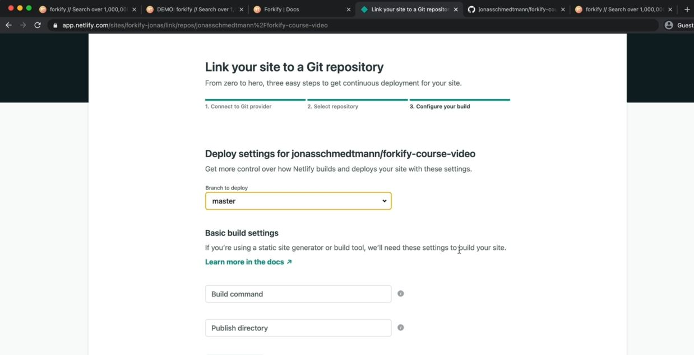

# Setting Up Continuous Integration With Netlify

- `STEP 1` : inside Netlify , open the project which is hosted
- `STEP 2` : & go to settings of that hosted project
- `STEP 3` : go to `build & deploy` section
    - `STEP 3.1` : click on `link site to git` button 
        - but if the site is not hosted then `sites` section & there's is `new site from git` button
        - but we already have site hosted . so , we'll not use this `new site from git` button

- `continuous integration/deployment` means to connect a site to a git repository 
    - & then whenever we change the code in our repository then that will automatically trigger  
        a new deployment of our site & then everything happens really automatically
    - means build our code locally , committed to our git repository then push that git repository  
        to our remote repository on github & then the site will automatically be built & deployed 💡💡💡

- `STEP 4` : so click on `link site to git` button 
    - `STEP 4.1` : click on `github` button
    - `STEP 4.2` : now we need to authenticate ourself again & we can see all the repo which we have in our github account
    - `STEP 4.3` : now if we have multiple branches then always choose the main or master branch to deploy 💡💡💡 
        - & we can deploy the private repo also 💡💡💡
    - `STEP 4.4` : now here comes this question like this 
        
        - which means which code we actually want to deploy i.e inside the `dist` folder
        - but this `dist` folder in not in our repository 
        - so we need to tell the netlify the build command whenever there is a change in the  
            repository which is really powerful 💡💡💡
    - `STEP 4.5` : go to package.json file & copy the build command i.e `parcel build index.html --dist-dir ./dist`
        - because netlify will install all those dependencies & also the devDependencies & then run the build command 💡💡💡
        - so now paste that build command 
        - & inside `publish directory` input i.e `dist` folder 💡💡💡
    - `STEP 4.6` : then click on `deploy` button

- now click on `Production deploys` section of that site , we can see that Netlify is installing stuff & we'll get the message 
    
    - then at the end we'll get the message of `site is live`

- `STEP 5` : now if we change the code locally & commit it on github
    - then Netlify also commit that message inside that deploy site with that commit message like this
    
    - then after few seconds our latest will be published
