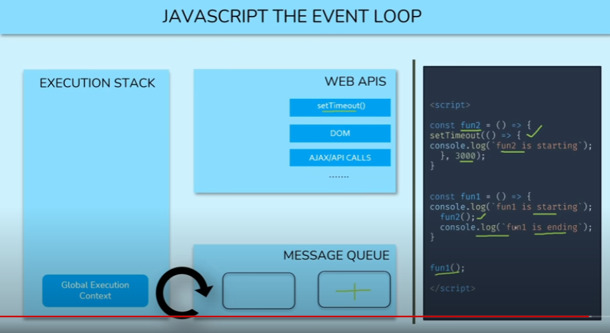

# Asynchronous JavaScript

    - very very important 🔥

## topics 

    - hoisting
    - scope chain
    - lexical scoping
    - use strict mode
    - this -> keyword
    - closures
    - differnce b/w Asynchronous & Synchronous programming
    - what is event loop 

# hoisting 

    - in this we have a creation phase and execution phase
    - hoisting is a mechanism where functions declarations / function body
        are moved to the top by JS before calling a function /the code execute 
    - it only works with normal function or function definition
        and it doesn't work with varibles , function expression and arrow function

    eg : calling a normal function before creating
        sum()

        function sum() {
            console.log(2 + 2)
        }

        // output : 4

## scope chain and lexical scoping

    -> scope chain ✅

        - it is used to resolve the value of variable names 
            means it helps to tell us that what will be the value of that variable name
        - it is lexically defined means that we can tell 
            what will be the scope chain by just looking at the code

        eg : of lexical scoping

            const PI = 3.14 ;

            - so here we can tell value of a variable by just looking on code
                i.e lexical scoping 
            - but this example is not exact one to explain about lexical scoping    

        - at the top , we have the global scope i.e window object in the browser

    -> lexical scoping ✅

        - means the inner function can get access variables , parameter , etc 
            of their parent functions variables But the vice-versa is not true
        // OR 
        - means inner child functions can access of their parent functions
            but parent functions can't access variables , parameter , etc 
            of their inner child function because of lexical scoping 
        - very important 🔥

        eg : 
            let a = "Hello guys. "; // global scope

            const parentFunc = () => {
                let b = "i am a parent function"
            
                const childFunc = () => {
                  let c = " i am a child function";
                  console.log(a+b+c);
                }

                childFunc();
                console.log(a+b+c); 
            }

            parentFunc()

            // output : message will be printed of childFunc() and 
                        then error will come that c variable is not defined

## this -> keyword

    -> using this -> keyword inside callback function argument of addEventListener ✅

        eg : if callback function is anonymous function 

            button.addEventListener('click' , function() {
                console.log(this)
            })

            NOTE :
                - if we use anonymous function as a second argument of
                    addEventListener() method
                - then current context of this -> keyword would be 
                    button element or a thing
        
        eg : if callback fucntion is arrow function

            button.addEventListener('click' , () => {
                console.log(this)
            })

            - here current context of this -> keyword would be 
                window object
                

## Closures

    - a closure is the combination of a function bundled together 
        (enclosed) with references to its surrounding state (the lexical environment)
    // OR 
    - closure and lexical scoping both concept are same
        means inner/child function can access variables , parameter , etc of their outer/parent functions
        but outer/parent function can't access variables , parameter , etc of their inner/child functions
    
    - closures are created every time a function is created at a function creation time

    - in closure concept , we return inner function

    eg : of closure but not exactly ✅

        function outerFunc(a) {
            let b = 10 

            function innerFunc() {
                let sum = a + b
                console.log(`sum is ${sum}`)
            }

            innerFunc()
        }

        outerFunc(20)

        - this is a exact example of lexical scope not closure
    
    eg : of closure ✅

        function outerFunc(a) {
            let b = 10 

            function innerFunc() {
                let sum = a + b
                console.log(`sum is ${sum}`)
            }

            return innerFunc
        }
        // OR 
        function outerFunc(a) {
            let b = 10 

            return function innerFunc() {
                let sum = a + b
                console.log(`sum is ${sum}`)
            } 
        }

        const total = outerFunc(20)

        total()

        // output : sum is 30

        - this exact example of closure because 
            we're returning a inner function 
        - and total is acting like a function expression 
            so inside total has a definition/body of innerFunc()

        NOTE : 📝
            - here while returning a inner function
                don't call that inner function  

            - now you'll think that how we got an output
                because so whenever you call functions
                then execution context will be created for each functions
                that we'll learn in event loop topic
            - so here after creating execution context
                then value of a and b will be assigned inside 
                execution context of that function
            - and when it saw return innerFunc then
                innerFunc will be returned and 
                that outerFunc() removed from it's own execution context
            - and it means outerFunc() is out of the program
            - then we're calling total()

            - the thing to note here that after returning a innerFunc()
                then program will stop and even if we're calling that innerFunc()
                then how it's possible that still innerFunc()
                able to access the variable and parameter of outerFunc()

    eg : of console.dir() method ✅

        - used to know more about your data

        function outerFunc(a) {
            let b = 10 

            return function innerFunc() {
                let sum = a + b
                console.log(`sum is ${sum}`)
            } 
        }

        const total = outerFunc(20)

        console.dir(total)

        // output : ƒ innerFunc() 

        - so here you got innerFunc()
            and when you open this output
            then you'll see scopes key
        - and again open scopes key then you'll
            see closure (outerFunc)

        NOTE : 📝
            - so you'll see that value of a and b of outerFunc()
                stored in closure 
            - means somewhere variables and parameter values of outerFunc() 
                stored in the memory
            // OR 
            - means closure/innerFunc() stored 
                variables and parameter values of outerFunc() inside itself
                that's why we got values of variables and parameter values 
                of outerFunc()

## differnce b/w Asynchronous & Synchronous programming

    -> Synchronous programming ✅

        - means if we're doing more than one work simultaneously
            then untill and unless if first work doesn't complete 100%
            then next work will not be start
        - even if next work takes less time than first work
            because first work comes first in the queue compare to other work
        - and after AJAX Synchronous programming converted into Asynchronous

        - this way is old one now a days 
            people use Asynchronous programming

        - synchronous means doing work at a time 

        eg : 

            const fun2 = () => {
                console.log(`Function 2️⃣ is called`);
            }

            const fun1 = () => {
               console.log(`Function 1 is called`);
               fun2();
               console.log(`Function 1 is called Again ✌`);
            }

            fun1()

            // output :
                Function 1 is called
                Function 2️⃣ is called
                Function 1 is called Again ✌

            - here we got output step by step

    -> Asynchronous programming ✅

        - means do all the work parallely
        // OR 
        - menas if we have two work and
            first work is taking time 10min and 
            second work is taking time 5second then
        - second work will also be executed
            and first work will be run parallely
        - so due to this we don't need to stop 

        - Asynchronous means doing mutiple works at a time 

        - event listener , setTimeout() , promises , async await , fetch api , etc 
            these are Asynchronous

        eg : of Asynchronous
            - in instagram , when you scroll
                then while scrolling down you're getting data
                on the spot

            - so same with others like 
                you go to posts , comment down and you click to like , etc
                all these are happen Asynchronously

        eg : of Asynchronous
            - open any insta post and 
                then play any reel 
            - after that do comment also and like the comment

            - so here video is playing + you're commenting + likes also
                means simultaneously you're doing mutiple things
                
        eg : 

            const fun2 = () => {
                setTimeout(() => {
                    console.log(`Function 2️⃣ is called`);
                } , 1000)
            }

            const fun1 = () => {
               console.log(`Function 1 is called`);
               fun2();
               console.log(`Function 1 is called Again ✌`);
            }

            fun1()

            // output : 
                    Function 1 is called
                    Function 1 is called Again ✌
                    Function 2️⃣ is called

            - here fun2() will be executed after 1second
                so due to this , message will be printed 
                `Function 1 is called Again ✌`
                and then
            - message of fun2() will be printed

## what is event loop 

    - very important topic 🔥
    - here like whenever we create a function
        then it's execution context is created
    - here we'll talk about how Asynchronous working

    - console.log() --> is not Web APIS
    - because WEB APIS deals with Asynchronous

    - event loop deals with 3 things 
      - execution stack
        - global execution context
      - web APIS
        - setTimeout()
        - DOM
        - AJAX/API calls , etc ...
      - message queue

    ->  diagram + explanation
        
        - after understanding this event loop then
            see closure topic 
            - if we're getting data from setTimeout after 2seconds
                then how we're getting that , where our data gone 
                for 2seconds so let's see
            
        eg : 
            function fun2() {
                setTimeout(() => {
                    console.log("fun2 is starting")
                } , 3000)
            }

            function fun1() {
                console.log("fun1 is starting")
                fun2()
                console.log("fun1 is ending")
            }

            fun1()

    - here execution stack and execution context are different than each other 
        - execution stack -> is like a bucket 💡
        - and inside that execution stack , execution context comes of function , etc 💡

    STEP-1 : 
        - so whenever we call a function even in closure then
            that function got execution context inside execution stack 
        - means that function got it's own world/environment
            where that function will work and after completing work 
            they'll removed from execution stack   
        - so here fun1() got it's execution context 

    STEP-2 : 
        - when fun1() got it's execution context
            then fun1() will see inside itself that 
            first line is console.log("fun1 is starting")
        - so log() is again a form of function
        - so console.log() also got it's own execution context

    
    STEP-3 : 
        - so in first line of fun1() is console.log()
            so it got it's execution context
        - so console.log() will execute it's own part
            i.e printing a string 
        - and we'll got output -> fun1 is starting
        - so the movement if first line of code of fun1()
            is completed 100%
        - then execution context of console.log() of first line
            will be removed from execution stack

    STEP-4 : 
        - now control will come at second line of fun1()
        - so on second line -> fun2() is also a function
        - so when we talk about function then
            func2() will get it's own execution context inside execution stack

    STEP-5 : 
        - now fun2() got it's own execution context
        - so now control came inside at fun2()
        - now inside fun2() we have
            setTimeout()
        - so again we consider setTimeout() as a function
            but setTimout() is not a part of JS 
            it's a part and come inside of WEB APIs

    STEP-6 : 
        - so where data goes which is inside setTimeout() for 3seconds
        - so setTimout , DOM related stuff , AJAX/API calls , etc
            all the these comes inside WEB APIs
        - that's why if any data related to WEB APIs
            stay in execution context or if data comes
            related to WEB APIs inside execution context 
        - then that data goes inside WEB APIs
        - but before data goes inside WEB APIs
            here setTimeout() is timer base event
        - so here 3seconds will be set by setTimout()

    STEP-7 : 
        - and inside of setTimeout() we have a callback function
            so here after 3seconds that callback function 
            will be executed
        - so in b/w 3seconds what will happen
            - so in 3seconds , timer of setTimeout()
                will go inside WEB APIs
        - so the movement that timer goes inside WEB APIs
            then execution context of setTimout() will be removed 
            from execution stack
 
 

    STEP-8 : 
        - so the movement the execution context of setTimeout()
            removed from execution stack
        - then fun2() will see that is there something inside 
            me to execute 
        - so there is nothing inside fun2()
            then execution context of fun2() also be removed 

    STEP-9 : 
        - now execution context of fun2() is removed
            but still execution context of fun1() is inside
            execution stack
        - execution context of fun1() will not be removed/over
            untill and unless fun1() doesn't complete work 100% 
        - so fun1() will see that 
            till second line fun1() completed the work
        - now fun1() see that if there any work left after fun2()
            or not
        - so fun1() will see only console.log() is left  
        - so that console.log() also got it's own execution context
            inside execution stack

    STEP-10 :
        - so the movement we got data/output of console.log()
        - now there is no line of code left inside fun1()
            so execution context of fun1() will be removed

    STEP-11 : 
        - now we didn't got output of that callback function
            in 3seconds
        - and event execution context fun1() is removed
        - but now for 3seconds , WEB APIs hold that setTimeout()
        - and the movement 3seconds over , 
            WEB APIs will release that setTimeout()
        - after this whatever is inside WEB APIs
            will move inside message queue
            here queue means first come first server
        - now that 3seconds timer of callback function
            wil see that global execution context is empty or not
        - so the movement 3seconds timer of callback function
            see that that is empty 
        - then our event loop i.e circle arrow rotate

    STEP-12 : 
        - and this called event loop
            means whatever stuff are inside WEB APIs
            which are left to give output/data 
            will come inside message queue
        - so now work of event loop is take those things
            which are inside message queue and move each of them 
            inside execution stack and provide 
            execution stack for each of them
        - so the movement that callback function got it's own
            execution context and when work of that callback function 
            is done 100% 
        - then execution context of that callback function will be 
            removed from execution stack

    - so this is the way that event loop works
    - so in closure after returning inner function
        still we're getting data of it's parent function 