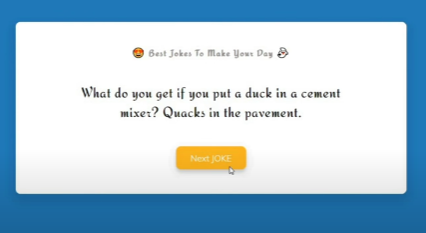

# Project-2 jokes

    eg : using with fetch Api + normal promises chaining ✅

        html
        ----
            
 
              

                <h3 class="title">joke</h3>
                
Awesome joke is loading...

                <button id="jokeBtn" class="btn">Next joke</button>
              

            

        js 
        --
        
          const jokeBox = document.querySelector("#joke") 
          const jokeBtn = document.querySelector("#jokeBtn") 

        STEP-1 : 

            function getJokes() {
                fetch("https://icanhazdadjoke.com").then((response) => {
                    return response.json()
                }).then((data) => {
                  console.log(data)
                }).catch((error) => {
                    console.error(error)
                })
            }

            jokeBtn.addEventListener('click' , getJokes) 

          - now go to network tab of chromdev tool
            then we'll see that fetch of https://icanhazdadjoke.com/  
          - so click on it and we'll get all information about this api

          - here why we're gettting error or not getting data
              because to check 
            - go to postman and select GET request method and paste
                this URl https://icanhazdadjoke.com/ then we'll see that
                we're getting data i.e html code inside body key
          - so we don't want html content we just need jokes
              so to get these jokes
            - go to postman and in Headers tab
              put 'Accept' key and it's value is 'application/json'
              here A letter should be capital of 'Accept' key
            - now when we send the request then we'll get our jokes

          - but now we need to set the header but before this 
            go to network tab and then click on this URL https://icanhazdadjoke.com/
            that we fetched and then another tab will open
            and then see the 'Content-Type' will be 'text/html or 'application/json'
          - this means we need to tell that this content or data
            that we want from the server , in the json content or data

          - so let's set the header to get our data
            because as we know that we set that 'Accept' key and it's value
            'application/json' in headers tab in postman tool then we got our jokes
            that's why we need to put the headers

        STEP-2 : 

            function getJokes() {
                const setHeader = {
                  headers : {
                    Accept : "application/json"
                  } 
                }

                fetch("https://icanhazdadjoke.com" , setHeader).then((response) => {
                  return response.json()
                }).then((data) => {
                  jokeBox.innerText = data.joke
                }).catch((error) => {
                  console.error(error)
                })
            }

            jokeBtn.addEventListener('click' , getJokes) 

          NOTE : important 🔥
              - put s letter with headers word while setting the header
                because this is necessary otherwise that headers key won't work
                that we're giving object as a value inside headers key

              - here inside the setHeader object we didn't define the GET method
                  because fetch() function itself means we're getting data 
                  from that URL API 💡💡 that's why 
                  we didn't give method : "GET" like this 
                  const setHeader = {
                    method : "GET" , 
                    headers : {
                      Accept : "application/json"
                    } 
                  }
              - but if want to insert or delete data in that API
                - then we have to specify PUT or DELETE method 💡

    eg : using with fetch Api + async await promises ✅

      JS
      ---
        const getJokes = async () => {
            
            const setHeader = {
              method : "GET" , 
              headers : {
                  Accept : "application/json"
              } 
            }

          const response = await fetch("https://icanhazdadjoke.com" , setHeader)
          const jokesData = await response.json()
          console.log(jokesData.joke)
        }

        jokeBtn.addEventListener('click' , getJokes) 

        - but here we can't handle/trace/show the error if we got
            so that's why we use error handling concept with async await promises

    eg : using fetch Api + async await promises with error handling ✅

      js
      --
        const getJokes = async () => {

            try {
                const setHeader = {
                    method : "GET" , 
                    headers : {
                        Accept : "application/json"
                    } 
                }
            
              const response = await fetch("https://icanhazdadjoke.com" , setHeader)
              const jokesData = await response.json()
              console.log(jokesData.joke)
            } catch(error) {
                console.error(error)
            }
        }

        jokeBtn.addEventListener('click' , getJokes)

      - in html code that text we wrote i.e Awesome joke is loading...
          will come when we have low internet connection

