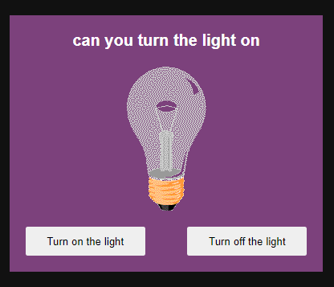
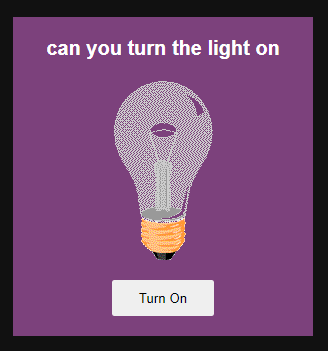

# Project-3 Light Bulb ON OFF

## 1st way

    html
    ----
        

            

                <h1 class="title">can you turn the light on</h1>
                

                    
                

                

                    <button class="btn" id="turnOnBtn">Turn on the light</button>
                    <button class="btn" id="turnOffBtn">Turn off the light</button>
                

            

        

    
    js
    --
        const turnOnBtn = document.querySelector("#turnOnBtn")
        const turnOffBtn = document.querySelector("#turnOffBtn")
        const imgBulb = document.querySelector("#bulb")

        turnOnBtn.addEventListener('click' , () => {
            imgBulb.src = "bulb-on.gif"
            turnOffBtn.style.backgroundColor = "gray"

            if (turnOffBtn.style.backgroundColor === "gray") {
                turnOnBtn.style.backgroundColor = "white"
            }
        })

        turnOffBtn.addEventListener('click' , () => {
            imgBulb.src = "bulb-off.gif"
            turnOnBtn.style.backgroundColor = "gray"
            
            if (turnOnBtn.style.backgroundColor === "gray") {
                turnOffBtn.style.backgroundColor = "white"
            }
        })

        - we have src attribtue of img that we can use
            to change the source of img into another
        

## 2nd way

    html
    ----
        

            

                <h1 class="title">can you turn the light on</h1>
                

                    
                

                <button class="btn" id="turnOnBtn">Turn On</button>
            

        

    js
    ---
        const btn = document.querySelector(".btn")
        const imgBulb = document.querySelector("#bulb")

        btn.addEventListener('click' , () => {
            if (imgBulb.src.match("off")) {
                imgBulb.src = "bulb-on.gif"
                btn.innerHTML = "Turn OFF"
            } else {
                imgBulb.src = "bulb-off.gif"
                btn.innerHTML = "Turn ON"
            }
        })

        - here we're using match() method
            on img src to check whether that "off" word
            is there in src of img or not

        - difference b/w match() and matches() method

            -> match() method ✅

                - used search a string
                - returns null if no match is found

            -> matches() method ✅  

                - used to check that an element matches a CSS selector
                - takes css selector inside double/single quotes
                - and return boolean value whether that css selector
                    exists or not
