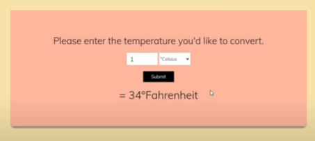

# Project 5 Temperature Converter

    - we'll use form element in html

    html
    ----
        

            

                <h1 class="title">Temperature Converter</h1>
                

                    <form action="#" id="formBox">
                        

                            <input type="number" placeholder="number" id="numberBox">

                            <select id="temperature">
                                <option value="Celsius">Celsius</option>
                                <option value="Fahrenheit">Fahrenheit</option>
                            </select>
                        

                        <button class="submit" id="btn">Submit</button>
                    </form>
                

                

            

        

    js
    --- 
        const formBox = document.querySelector("#formBox")
        const inputNumber = document.querySelector("#numberBox")
        const inputTemp = document.querySelector("#temperature")
        const submitBtn = document.querySelector("#btn")
        const result = document.querySelector("#tempResult")

        formBox.addEventListener('submit' , (e) => {
            e.preventDefault()

            const num = parseInt(inputNumber.value)
            const tempType = inputTemp.value

            if (tempType === "Celsius" || tempType === "celsius") {
                // if Celsius selected then we'll convert into Fahrenheit
                result.innerHTML = ctof(num)
            } else if (tempType === "Fahrenheit" || tempType === "fahrenheit") {
                // if Fahrenheit selected then we'll convert into Celsius
                result.innerHTML = ftoc(num)
            } else {
                result.innerHTML = "Please choose the valid temperature"
            }
            
        })

        function ctof(num) {
            let fahrenheitResult = Math.round(((9/5) * num) + 32)
            return `${fahrenheitResult}° Fahrenheit`
        }

        function ftoc(num) {
            let celsiusResult = Math.round((5/9) * (num - 32))
            return `${celsiusResult}° Celsius`
        }

    -> onsubmit or submit event ✅
        - this event used 99% times 
            if we're working with form element

    NOTE :
        - e.preventDefault() method or use return false
            both used to stop the form element from default action
            means stop from refreshing the page

    -> selectedIndex property ✅

        - this property returns the index of the selected option in a drop-down list.
        - the index starts from 0 
        - if no option is selected in select element
            then selectedIndex property return -1 

        eg :
            <select id="mySelect">
                <option>Apple</option> -> 0 index 
                <option>Orange</option> -> 1 index 
                <option>Pineapple</option> -> 2 index 
                <option>Banana</option> -> 3 index and so on..
            </select>