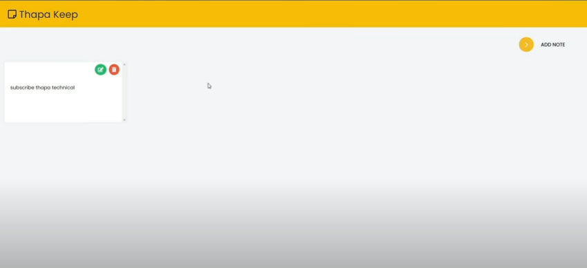

# Project 7 Google Keep Clone

    - we will
        - use CRUD operation
        - use local browser storage
            means even if you close the tab/browser
            then still data will be there 

    - we will make two different div element
        first div - is for when we editing the text
        second div - is for when we're not doing editing
    - and these two div will change when we want to edit
        and not means we're toggling
    
    - if we add too many empty todo div and then 
        when we refresh the page then 
        all those empty todo div will be removed

    - if we delete the todo and then when we refresh
        the page then that todo will not come in UI
        because we deleted that todo from local storage 

    - here we'll use concept like 
        array , object , browser storage , DOM .
        - only basic concept will be used in this project

## code

    HTML
    ----
        <nav class="navigation">
            

                <h1 class="logo">Google Keep</h1>
            

            

                <button class="btn" id="add-note-btn" aria-hidden="true">
                    Add Note
                </button>
            

        </nav>
    
        <section class="container-note">
            

                
            

        </section>

    CSS
    ---
        * {
            margin : 0 ;
            padding: 0;
            box-sizing: border-box;
        }

        :root {
            --white-color : white ;
            --bg-edit-color : #b1f560 ; 
            --bg-delete-color : #ff4f52 ; 
            --nav-color : hsl(45, 94%, 50%) ;
            --button-color : rgb(255, 245, 219) ;
            --outline-clr : rgb(253, 152, 0) ;
            --container-clr : hsl(0, 0%, 10%) ;
            --todo-box-clr : rgb(183 183 183) ;
        }

        html {
            font-size : 62.5% ;
        }

        body {
            font-family : sans-serif ;
        }   

        button {
            cursor : pointer ;
        }

        .navigation {
            width: 100%;
            padding : 2em ;
            background-color: var(--nav-color) ;

            display: flex;
            justify-content: space-between;
            align-items : center ;
        }

        .logo-box h1 {
            font-size : 2rem ;
        }

        .add-todo .btn {
            background-color: var(--button-color);
            padding : 1rem ;
            border-radius : .25rem ;
            border : 0 ;
            outline : none ;
            outline : .2rem solid var(--outline-clr) ;
        }

        .add-todo .btn .fa {
            margin-right : .8rem ;
        }

        .container-note {
            width: 100%;
            min-height : 100vh ;
            background-color: var(--container-clr);
            padding-block : 4em ;
        }

        .todo-lists {
            width: 92%;
            margin-inline : auto ;
            
            display: grid ;
            gap : 2em ;
            justify-content: center;
            grid-template-columns : repeat(auto-fit , minmax(280px , .3fr))
        }

        .todo-box {
            padding : .8rem ;
            padding-bottom : 2em ;
            background-color: var(--todo-box-clr);

            display: flex ;
            flex-direction : column ;
        }

        .todo-note {
            flex-grow : 1 ;
            font-size : 1.4rem ;
            margin-top : 1.4rem ;
        }

        textarea {
            min-height : 100px ;
            outline : none ;
            border : 0 ;
            resize : none ;
            margin-top : 1.4rem ;
        }

        .icon-box {
            width: 100%;
            text-align : right ;
        }

        .icon-box button {
            padding : .7rem ;
            border-radius : 50px ;
            border : 0 ;
        }

        .icon-box button:first-child {
            background-color : var(--bg-edit-color) ;
            border : .2em solid transparent ;
            margin-right : .4rem ;
        }

        .icon-box button:last-child {
            border : .2em solid transparent ;
            background-color : var(--bg-delete-color) ;
        }

        .icon-box button:first-child:focus , 
        .icon-box button:last-child:focus {
            border-color : var(--white-color) ;
        } 

        .hidden {
            display: none ;
        }

        @media (max-width : 48em) {

            .todo-lists {
                grid-template-columns : repeat(auto-fit , minmax(280px , 1fr))
            }
        }

    JS
    --
        const addNoteBtn = document.querySelector("#add-note-btn")
        const todoLists = document.querySelector(".todo-lists")

        // updating the localstorage
        const updateLSData = () => {
            const textAreaData = document.querySelectorAll("textarea")
            const notes = []

            textAreaData.forEach(curEle => {
                return notes.push(curEle.value)
            })

            localStorage.setItem("todos" , JSON.stringify(notes))
        }

        const addNewNote = (text = "") => {
            // adding todo note
            const todoBox = document.createElement("div")
            todoBox.classList.add("todo-box")
            
            const htmlData = `
                

                    <button aria-label="edit-btn" class="edit-btn"> </button>
                    <button aria-label="delete-btn" class="delete-btn"></button>
                

                

                <textarea class="${text ? 'hidden' : ''}"></textarea>`

            todoBox.insertAdjacentHTML("afterbegin" , htmlData) 
            todoLists.append(todoBox)
            
            // deleting the todo note
            const deleteBtn = todoBox.querySelector(".delete-btn")
            
            deleteBtn.addEventListener('click' , () => {
                todoBox.remove()
                updateLSData()
            })
            
            // edit the todo note
            const editBtn = todoBox.querySelector(".edit-btn")
            const para = todoBox.querySelector(".todo-note")
            const textArea = todoBox.querySelector("textarea")
            textArea.innerHTML = text
            para.innerHTML = text
            
            // toggle b/w p tag for not editing and textarea for editing
            editBtn.addEventListener('click' , () => {
                para.classList.toggle("hidden")
                textArea.classList.toggle("hidden")
            })

            textArea.addEventListener('change' , (event) => {
                const todoText = event.target.value 
                para.innerHTML = todoText  

                updateLSData()
            })
        }

        // getting data back from local storage
        const notes = JSON.parse(localStorage.getItem("todos"))

        if (notes.length > 0) {
            notes.forEach(note => {
                addNewNote(note)
            })
        } 

        addNoteBtn.addEventListener('click' , () => {
            addNewNote()
        })

## Steps of JS code
    
    STEP 1 :
        const addNoteBtn = document.querySelector("#add-note-btn")

        const addNewNote = (text = "") => {
           
        }

        addNoteBtn.addEventListener('click' , () => {
            addNewNote()
        })

        📝1 - whenever we click on "add note" button then we need
            to show the empty todo to write 
        📝2 - now we need to show the empty todo
            - but first we gave text -> parameter with default value
                because we want to make condition for toggling 
                b/w textarea and paragraph tag   

            - if textarea is ON then means we want to edit or want to write something
                and if paragraph tag is ON then means we don't want to edit
            - so this we'll do a bit later

    STEP 2 :
        const addNoteBtn = document.querySelector("#add-note-btn")

        const addNewNote = (text = "") => {
            // adding todo note
            const todoBox = document.createElement("div")
            todoBox.classList.add("todo-box")

            const htmlData = `
                

                    <button aria-label="edit-btn" class="edit-btn"> </button>
                    <button aria-label="delete-btn" class="delete-btn"></button>
                

                

                <textarea class="${text ? 'hidden' : ''}"></textarea>`

                todoBox.insertAdjacentHTML("afterbegin" , htmlData) 
                todoLists.append(todoBox)
        }

        addNoteBtn.addEventListener('click' , () => {
            addNewNote()
        })

        📝1 - now we want to create a new element dynamically i.e div element
              so we used createElement() method of document object
        📝2 - then we added "todo-box" class to that div element
              by using classList object and then we used add() method of classList object

            - inside classList object we have methods like
                - add() 
                    - used to add one more classes to the element 
                    - use comma to separate the each classes while adding
                - remove() 
                    - used to removes one or more class names from an element.
                    - use comma to separate the each classes while removing
                - toggle() - used to switch/toggle or ON/OFF based on that class name of that element
                - contains() - Returns a Boolean value based on whether an element has that specified class name or not

                NOTE : give argument in double quotes inside these methods 

        📝3 - then we used template string to add the html data/code inside our document

        📝4 - now we need to add that htmlData inside that div which we created
                so there are many ways to do add like innerHTML property
                but the best and new way is insertAdjacentHTML("position" , element)
                    - insertAdjacentHTML("position" , element) ✅
                        - is a method
                        - used to add html code inside the html document
                    - insertAdjacentElement("position" , element) ✅
                        - is a method
                        - used to add an element only inside another element or html document not for html code 

                - these two methods are super faster than innerHTML , innerText , textContent properties

        📝5 - after adding that htmlcode inside that div
                then we need to add that div inside our html document or that div which has a class="todo-lists"
                so we use append() or appendChild() methods
                    - append() method ✅
                    - appendChild() method ✅
                        - used to add/append node as the last child inside of that parent element

                    - to see difference b/w append() and appendChild()
                        https://dev.to/ibn_abubakre/append-vs-appendchild-a4m

            - append -> means append/add a node/element/something 

    STEP 3 : deleting the todo
        const addNoteBtn = document.querySelector("#add-note-btn")

        const addNewNote = (text = "") => {
            // adding todo note
            const todoBox = document.createElement("div")
            todoBox.classList.add("todo-box")

            const htmlData = `
                

                    <button aria-label="edit-btn" class="edit-btn"> </button>
                    <button aria-label="delete-btn" class="delete-btn"></button>
                

                

                <textarea class=""></textarea>`

                todoBox.insertAdjacentHTML("afterbegin" , htmlData) 
                todoLists.append(todoBox)

                // edit the todo note
                const editBtn = todoBox.querySelector(".edit-btn")
                const para = todoBox.querySelector(".todo-note")
                const textArea = todoBox.querySelector("textarea")

                // delete the todo note
                const deleteBtn = todoBox.querySelector(".delete-btn")
                
                deleteBtn.addEventListener('click' , () => {
                    todoBox.remove()
                })
        }

        addNoteBtn.addEventListener('click' , () => {
            addNewNote()
        })

        📝1 - now we want to delete or edit the particular todo
            if we want to delete when we click on delete button  
            and if we click on edit then we want to toggle to edit or not to edit 

            - so we need reference of those element
                so here we used querySelector on todoBox 
                because todoBox contain that delete and edit button , paragraph and textarea too 
          
        📝2 - after taking the reference of those element then 
                let's work on delete button
            - so we call the click event listener on delete button
                then we used remove() method on todoBox

                - remove() method ✅ - used to remove the element from the html document

    STEP 4 : toggling the edit button b/w paragraph element and textarea element

        const addNoteBtn = document.querySelector("#add-note-btn")

        const addNewNote = (text = "") => {
            // adding todo note
            const todoBox = document.createElement("div")
            todoBox.classList.add("todo-box")

            const htmlData = `
                

                    <button aria-label="edit-btn" class="edit-btn"> </button>
                    <button aria-label="delete-btn" class="delete-btn"></button>
                

                

                <textarea class="${text ? 'hidden' : ''}"></textarea>`

                todoBox.insertAdjacentHTML("afterbegin" , htmlData) 
                todoLists.append(todoBox)

                // edit the todo note
                const editBtn = todoBox.querySelector(".edit-btn")
                const para = todoBox.querySelector(".todo-note")
                const textArea = todoBox.querySelector("textarea")

                textArea.innerHTML = text
                para.innerHTML = text

                // delete the todo note
                const deleteBtn = todoBox.querySelector(".delete-btn")
                
                deleteBtn.addEventListener('click' , () => {
                    todoBox.remove()
                })

                // toggle b/w p tag for not editing and textarea for editing
                editBtn.addEventListener('click' , () => {
                    para.classList.toggle("hidden")
                    textArea.classList.toggle("hidden")
                })

                textArea.addEventListener('change' , (event) => {
                    const todoText = event.target.value 
                    para.innerHTML = todoText  
                })
        }

        addNoteBtn.addEventListener('click' , () => {
            addNewNote()
        })

        📝1 - at starting when we click to "add Note" button 
                then we want to write something means we need to show the textarea element and hide the p element
                and when we click on edit button then we want to show the p element 
                    with that text which inside p element that we wrote inside textarea
                    and hide the textarea element
                    
            - so we'll use ternary operator to hide on the element out of two
                and right now we have "hidden" class inside css code

        📝2 -   
            

            <textarea class="${text ? 'hidden' : ''}"></textarea>
            
            - so we can see that we used ternary operator to toggle b/w p tag and textarea tag 
            - means if the text parameter has a empty string 
                then textarea will not be hidden and p tag will be hidden
            - but if text parameter has the value then 
                textarea will be hidden and p tag will not be hidden

            - so if there is no text inside p tag then means 
                we need to show the textarea and hide the p tag
                means we want to edit or write
            - but if there is a text inside p tag then means 
                we need to hide the textarea and show the p tag only
                means we don't want to edit 

            - so we did this
                // toggle b/w p tag for not editing and textarea for editing
                editBtn.addEventListener('click' , () => {
                    para.classList.toggle("hidden")
                    textArea.classList.toggle("hidden")
                })

        📝3 - now here is the problem that 
                when we click to "add note" button
                and when write something on that todo note
                and then when we click to edit button then 
            - that text/content doesn't come inside paragraph tag
            - but when toggle and when we come to textarea element
                then we can see that text/content

            - so now we need to add the content/text inside paragraph tag
                that we wrote inside textarea element
            - so we did this that whatever the 
                textArea.innerHTML = text
                para.innerHTML = text

                - this code is used to show the text inside p tag
                    whatever we have inside textarea element
                - if we remove this code then when we wrote something
                    on textarea then click to edit button
                - then text/content will come inside p tag 
                    but when refresh the page then the text/content
                    will be removed from both the elements
                - which we don't want that's why this code is necessary

                and 

                textArea.addEventListener('change' , (event) => {
                    const todoText = event.target.value 
                    para.innerHTML = todoText  
                })
            
            - here event or e is a object/parent of all the events
            - and target property of event object 
                will give that element on which whatever event listener we called
            - means target property will be give that element whatever event listener we called on that element
            - and then we used value property to get the value

                NOTE : 
                    - here "change" or onchange event is better than "input" event 
                        because the movement when we click to other element out of the textarea element
                        then we'll get that text/content

                    - and we use "input" event like this 
                        textArea.addEventListener('change' , (event) => {
                            const todoText = event.target.value 
                            console.log(todoText)
                            para.innerHTML = todoText  
                        })

                    - then output we'll get that whenever we write something 
                        on textarea element then those content/text will be console.log() again an again 
                        while writing

                    - "change" event is very useful event listener ✅

            - now the problem is that whenever wrote something on textarea element
                and then click to edit button to save the text then content/text is coming 
                inside p tag 
            - but then we refresh the page then that todo will be removed 
            - so now we'll use localStorage of browser

    STEP 5 : using localStorage to save the todo as a backend

        const addNoteBtn = document.querySelector("#add-note-btn")
        const todoLists = document.querySelector(".todo-lists")

        // updating the localstorage
        const updateLSData = () => {
            const textAreaData = document.querySelectorAll("textarea")
            const notes = []

            textAreaData.forEach(curEle => {
                return notes.push(curEle.value)
            })

            localStorage.setItem("todos" , JSON.stringify(notes))
        }

        const addNewNote = (text = "") => {
            // adding todo note
            const todoBox = document.createElement("div")
            todoBox.classList.add("todo-box")
            
            const htmlData = `
                

                    <button aria-label="edit-btn" class="edit-btn"> </button>
                    <button aria-label="delete-btn" class="delete-btn"></button>
                

                

                <textarea class="${text ? 'hidden' : ''}"></textarea>`

            todoBox.insertAdjacentHTML("afterbegin" , htmlData) 
            todoLists.append(todoBox)
            
            // deleting the todo note
            const deleteBtn = todoBox.querySelector(".delete-btn")
            
            deleteBtn.addEventListener('click' , () => {
                todoBox.remove()
            })
            
            // edit the todo note
            const editBtn = todoBox.querySelector(".edit-btn")
            const para = todoBox.querySelector(".todo-note")
            const textArea = todoBox.querySelector("textarea")
            // textArea.innerHTML = text
            // para.innerHTML = text
            
            // toggle b/w p tag for not editing and textarea for editing
            editBtn.addEventListener('click' , () => {
                para.classList.toggle("hidden")
                textArea.classList.toggle("hidden")
            })

            textArea.addEventListener('change' , (event) => {
                const todoText = event.target.value 
                console.log(todoText);
                para.innerHTML = todoText  

                updateLSData()
            })
        }

        addNoteBtn.addEventListener('click' , () => {
            addNewNote()
        })

        -> about localStorage object of window object ✅
          - is used to save the data locally in your browser
                and it's important to know because in interviewer ask a lot
          - if we close the tab or browser or refresh the page or restart the pc 
                then data will be stored/saved in your browser locally
                and again we can get those data and show in frontend
          - localStorage and sessionStorage object save data
                in key and value pairs in a web browser
          - localStorage stores data with no expiration date 
          - means if data stored inside localStorage then
                data will not be deleted when the browser is closed 
                and data will be available for the next data , week or year also
                until and unless we don't delete manually

        📝1 - so we go inside textarea event and whenever data will change 
                then we want to call the function i.e updateLSData()

        📝2 - then 
                // updating the localstorage
                const updateLSData = () => {
                    const textAreaData = document.querySelectorAll("textarea")
                    const notes = []

                    textAreaData.forEach(curEle => {
                        return notes.push(curEle.value)
                    })

                    localStorage.setItem("todos" , JSON.stringify(notes))
                }

            - here as we can see that we used querySelectorAll() instead of querySelector()
                because like if we click to "add note" then we'll get the one todo
                but as soon as we click to "add note" then we'll get mulitple todos
                and these multiple todos will be stored in the form of array
                that's why we use querySelectorAll()
            - and we called querySelectorAll() based on document because we want all the todos
                whatever we have inside our html document object

            - then we made an empty array to push our data inside 
            - then we use forEach() method to loop through the multiple todos which are textarea if we created multiple todos
            - we use push() method to add all the elements one by one inside notes variable
        
        📝3 - localStorage object methods

            - methods of localStorage are 
                - setItem("keyname" , JSON.stringify(data)) method ✅
                      - used to set the data in localStorage of the browser 
                - getItem("keyname") method ✅
                      - used to get the data from localStorage of the browser
                          that we stored

            - only these two methods used 99% 

            -> setItem() method of localStorage object ✅

                - takes two argument
                    first - key name that we want to give inside double quotes
                    second - data that we want to store

                - for second argument of setItem() method
                    we have to convert that data from array or object into string type
                    then we can store otherwise we can't 

            - so here we did this 
                localStorage.setItem("todos" , JSON.stringify(notes))

    STEP 6 : getting data back from localStorage
        
        const addNoteBtn = document.querySelector("#add-note-btn")
        const todoLists = document.querySelector(".todo-lists")

        // updating the localstorage
        const updateLSData = () => {
            const textAreaData = document.querySelectorAll("textarea")
            const notes = []

            textAreaData.forEach(curEle => {
                return notes.push(curEle.value)
            })

            localStorage.setItem("todos" , JSON.stringify(notes))
        }

        const addNewNote = (text = "") => {
            // adding todo note
            const todoBox = document.createElement("div")
            todoBox.classList.add("todo-box")
            
            const htmlData = `
                

                    <button aria-label="edit-btn" class="edit-btn"> </button>
                    <button aria-label="delete-btn" class="delete-btn"></button>
                

                

                <textarea class="${text ? 'hidden' : ''}"></textarea>`

            todoBox.insertAdjacentHTML("afterbegin" , htmlData) 
            todoLists.append(todoBox)
            
            // deleting the todo note
            const deleteBtn = todoBox.querySelector(".delete-btn")
            
            deleteBtn.addEventListener('click' , () => {
                todoBox.remove()
            })
            
            // edit the todo note
            const editBtn = todoBox.querySelector(".edit-btn")
            const para = todoBox.querySelector(".todo-note")
            const textArea = todoBox.querySelector("textarea")
            // textArea.innerHTML = text
            // para.innerHTML = text
            
            // toggle b/w p tag for not editing and textarea for editing
            editBtn.addEventListener('click' , () => {
                para.classList.toggle("hidden")
                textArea.classList.toggle("hidden")
            })

            textArea.addEventListener('change' , (event) => {
                const todoText = event.target.value 
                console.log(todoText);
                para.innerHTML = todoText  

                updateLSData()
            })
        }

        // getting data back from local storage
        const notes = JSON.parse(localStorage.getItem("todos"))

        if (notes.length > 0) {
            notes.forEach(note => {
                addNewNote()
            })
        }

        addNoteBtn.addEventListener('click' , () => {
            addNewNote()
        })

        -> getItem() method of localStorage object ✅

            - takes only one argument i.e key inside double quotes 
                which we gave

        📝1 - here we're getting data back from localStorage of the browser

        📝2 - here whatever data we're getting from localStorage 
                that data we need to parse from string into array or object
                so we use parse() method of JSON object like this
                
                const notes = JSON.parse(localStorage.getItem("todos"))

            - and then if notes variable have the data then 
                if (notes.length > 0) {
                    notes.forEach(note => {
                        addNewNote()
                    })
                }

            - output : so when we add the empty todo but we have data inside localStorage
                        and then refresh the page then still we'll get empty todo
                        but we're not getting data

            - so to bring that text/content inside p tag from localStorage then 
                we need to add note as a argument inside addNewNote() function like this 
                if (notes.length > 0) {
                    notes.forEach(note => {
                        addNewNote(note)
                    })
                }

        NOTE : 
            - but still there is a problem that
                when we delete any one the todo 
            - then when we refresh the page then again that todo is coming 
                because we need to delete that data from localStorage also 
                then that data will be deleted from UI 

    STEP 7 : deleting that from localStorage when we click on delete button

            const addNoteBtn = document.querySelector("#add-note-btn")
            const todoLists = document.querySelector(".todo-lists")

            // updating the localstorage
            const updateLSData = () => {
                const textAreaData = document.querySelectorAll("textarea")
                const notes = []

                textAreaData.forEach(curEle => {
                    return notes.push(curEle.value)
                })

                localStorage.setItem("todos" , JSON.stringify(notes))
            }

            const addNewNote = (text = "") => {
                // adding todo note
                const todoBox = document.createElement("div")
                todoBox.classList.add("todo-box")
                
                const htmlData = `
                    

                        <button aria-label="edit-btn" class="edit-btn"> </button>
                        <button aria-label="delete-btn" class="delete-btn"></button>
                    

                    

                    <textarea class="${text ? 'hidden' : ''}"></textarea>`

                todoBox.insertAdjacentHTML("afterbegin" , htmlData) 
                todoLists.append(todoBox)
                
                // deleting the todo note
                const deleteBtn = todoBox.querySelector(".delete-btn")
                
                deleteBtn.addEventListener('click' , () => {
                    todoBox.remove()
                    updateLSData()
                })
                
                // edit the todo note
                const editBtn = todoBox.querySelector(".edit-btn")
                const para = todoBox.querySelector(".todo-note")
                const textArea = todoBox.querySelector("textarea")
                // textArea.innerHTML = text
                // para.innerHTML = text
                
                // toggle b/w p tag for not editing and textarea for editing
                editBtn.addEventListener('click' , () => {
                    para.classList.toggle("hidden")
                    textArea.classList.toggle("hidden")
                })

                textArea.addEventListener('change' , (event) => {
                    const todoText = event.target.value 
                    console.log(todoText);
                    para.innerHTML = todoText  

                    updateLSData()
                })
            }

            // getting data back from local storage
            const notes = JSON.parse(localStorage.getItem("todos"))

            if (notes.length > 0) {
                notes.forEach(note => {
                    addNewNote(note)
                })
            } 

            addNoteBtn.addEventListener('click' , () => {
                addNewNote()
            })

        - so we'll call the updateLSData() function inside delete click event listener
            like this 

                deleteBtn.addEventListener('click' , () => {
                    todoBox.remove()
                    updateLSData()
                })

        - so this code means after deleting the data then whatever data is left in UI
            we are saving again inside localStorage
        - and then show the data based on this
        - so the movement when we delete a todo from UI then 
            from localStorage that todo/data will also be deleted simultaneously

## NOTE for localStorage object

    - in localStorage , 
        whenever we set the item inside the localStorage then we convert that data
        from object or array into string type by using JSON.stringify() method
    - but when we get the data from the localStorage then we need to convert that data 
        from string into array or object by using JSON.parse() method

